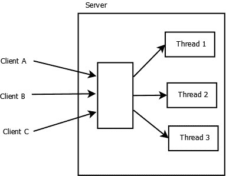
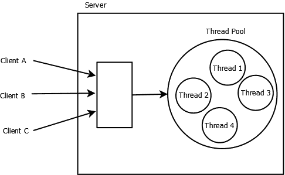

# 第七章 网络可扩展性

网络可扩展性涉及以一种方式构建应用程序，以便在应用程序上施加更多需求时，它可以调整以处理压力。需求可以以更多用户、增加的请求数量、更复杂的请求和网络特性的变化形式出现。

以下列出了几个关注的领域：

+   服务器容量

+   多线程

+   网络带宽和延迟

+   执行环境

通过增加更多的服务器、使用适当数量的线程、改进执行环境的性能以及增加网络带宽来消除瓶颈，可以实现可扩展性。

增加更多的服务器将有助于实现服务器之间的负载平衡。但是，如果网络带宽或延迟是问题，那么这将帮助不大。网络管道只能推送有限的数据。

线程经常用于提高系统的性能。为系统使用适当数量的线程允许一些线程执行，而其他线程被阻塞。被阻塞的线程可能正在等待 IO 发生或用户响应。在一些线程被阻塞时允许其他线程执行可以增加应用程序的吞吐量。

执行环境包括底层硬件、操作系统、JVM 和应用程序本身。这些领域中的每一个都有改进的可能性。我们不会涉及硬件环境，因为那超出了我们的控制范围。操作系统也是如此。虽然可以实现一些性能改进，但我们不会涉及这些领域。将识别可能影响网络性能的 JVM 参数。

我们将研究代码改进的机会。我们的大部分讨论涉及线程的使用，因为我们对这个架构特性有更多的控制。我们将在本章中说明几种改进应用程序可扩展性的方法。这些包括以下内容：

+   多线程服务器

+   线程池

+   Futures 和 callables

+   选择器（TCP/UDP）

我们将探讨使用简单线程/池的细节，因为您可能会在工作中遇到它们，并且由于平台限制可能无法使用一些新技术。线程池在许多情况下具有重复使用线程的优势。Futures 和 callables 是一种线程变体，其中可以传递和返回数据。选择器允许单个线程处理多个通道。

# 多线程服务器概述

多线程服务器的主要优势是长时间运行的客户端请求不会阻塞服务器接受其他客户端请求。如果不创建新线程，那么当前请求将被处理。只有在请求被处理后才能接受新请求。为请求使用单独的线程意味着连接及其相关的请求可以同时处理。

在使用多线程服务器时，有几种配置线程的方式如下：

+   每个请求一个线程

+   每个连接一个线程

+   每个对象一个线程

在每个请求一个线程的模型中，到达服务器的每个请求都被分配一个新线程。虽然这是一种简单的方法，但可能会导致大量线程的创建。此外，每个请求通常意味着将创建一个新连接。

这种模型在以前的客户端请求不需要保留的环境中运行得很好。例如，如果服务器的唯一目的是响应特定股票报价的请求，那么线程不需要知道任何以前的请求。

这种方法如下图所示。发送到服务器的每个客户端请求都分配给一个新线程。



在每个连接一个线程的模型中，客户端连接在会话期间保持。一个会话包括一系列的请求和响应。会话要么通过特定命令终止，要么在经过一段超时时间后终止。这种方法允许在请求之间维护状态信息。

这种方法在下图中有所说明。虚线表示同一客户端的多个请求由同一个线程处理。


每个对象一个线程的方法将相关请求与可以处理请求的特定对象排队。对象及其方法被放置在一个处理请求的线程中。请求与线程排队。虽然我们在这里不会演示这种方法，但它经常与线程池一起使用。

创建和删除连接的过程可能是昂贵的。如果客户端提交了多个请求，那么打开和关闭连接变得昂贵，应该避免。

为了解决线程过多的问题，经常使用线程池。当需要处理请求时，请求被分配给一个现有的未使用的线程来处理请求。一旦响应被发送，那么线程就可以用于其他请求。这假设不需要维护状态信息。

# 采用每个请求一个线程的方法

在第一章中，*开始网络编程*，我们演示了一个简单的多线程回显服务器。这种方法在这里重新介绍，为本章剩余部分中线程的使用提供了基础。

## 每个请求一个线程的服务器

在这个例子中，服务器将接受给定零件名称的价格请求。实现将使用支持对零件名称和价格进行并发访问的`ConcurrentHashMap`类。在多线程环境中，并发数据结构，如`ConcurrentHashMap`类，处理操作而不会出现数据损坏的可能性。此外，这个映射是缓存的一个例子，可以用来提高应用程序的性能。

我们从服务器的声明开始如下。地图被声明为静态，因为服务器只需要一个实例。静态初始化块初始化地图。`main`方法将使用`ServerSocket`类来接受来自客户端的请求。它们将在`run`方法中处理。`clientSocket`变量将保存对客户端套接字的引用：

```java
public class SimpleMultiTheadedServer implements Runnable {
    private static ConcurrentHashMap<String, Float> map;
    private Socket clientSocket;

    static {
        map = new ConcurrentHashMap<>();
        map.put("Axle", 238.50f);
        map.put("Gear", 45.55f);
        map.put("Wheel", 86.30f);
        map.put("Rotor", 8.50f);
    }

    SimpleMultiTheadedServer(Socket socket) {
        this.clientSocket = socket;
    }

    public static void main(String args[]) {
        ...
    }

    public void run() {
        ...
    }
}
```

`main`方法如下，服务器套接字等待客户端请求，然后创建一个新线程，将客户端套接字传递给线程来处理它。显示消息，显示连接被接受：

```java
    public static void main(String args[]) {
        System.out.println("Multi-Threaded Server Started");
        try {
            ServerSocket serverSocket = new ServerSocket(5000);
            while (true) {
                System.out.println(
                    "Listening for a client connection");
                Socket socket = serverSocket.accept();
                System.out.println("Connected to a Client");
                new Thread(new 
                    SimpleMultiTheadedServer(socket)).start();
            }
        } catch (IOException ex) {
            ex.printStackTrace();
        }
        System.out.println("Multi-Threaded Server Terminated");
    }
```

如下所示，`run`方法处理请求。从客户端套接字获取输入流，并读取零件名称。地图的`get`方法使用这个名称来检索价格。输入流将价格发送回客户端，并显示操作的进度：

```java
    public void run() {
        System.out.println("Client Thread Started");
        try (BufferedReader bis = new BufferedReader(
                new InputStreamReader(
                    clientSocket.getInputStream()));
             PrintStream out = new PrintStream(
                clientSocket.getOutputStream())) {

            String partName = bis.readLine();
            float price = map.get(partName);
            out.println(price);
            NumberFormat nf = NumberFormat.getCurrencyInstance();
            System.out.println("Request for " + partName
                    + " and returned a price of "
                    + nf.format(price));

            clientSocket.close();
            System.out.println("Client Connection Terminated");
        } catch (IOException ex) {
            ex.printStackTrace();
        }
        System.out.println("Client Thread Terminated");
    }
```

现在，让我们为服务器开发一个客户端。

## 每个请求一个线程的客户端

如下所示，客户端应用程序将连接到服务器，发送请求，等待响应，然后显示价格。对于这个例子，客户端和服务器都驻留在同一台机器上：

```java
public class SimpleClient {

    public static void main(String args[]) {
        System.out.println("Client Started");
        try {
            Socket socket = new Socket("127.0.0.1", 5000);
            System.out.println("Connected to a Server");
            PrintStream out = 
                new PrintStream(socket.getOutputStream());
            InputStreamReader isr = 
                new InputStreamReader(socket.getInputStream());
            BufferedReader br = new BufferedReader(isr);

            String partName = "Axle";
            out.println(partName);
            System.out.println(partName + " request sent");
            System.out.println("Response: " + br.readLine());
                        socket.close();
        } catch (IOException ex) {
            ex.printStackTrace();
        }
        System.out.println("Client Terminated");
    }
}
```

现在，让我们看看客户端和服务器是如何交互的。

## 每个请求一个线程的应用程序在运行

首先启动服务器，将显示以下输出：

**多线程服务器已启动**

**正在监听客户端连接**

接下来，启动客户端应用程序。将显示以下输出：

**客户端已启动**

**连接到服务器**

**轴请求已发送**

**响应：238.5**

**客户端已终止**

服务器将显示以下输出。您会注意到**客户端线程已启动**输出跟在**正在监听客户端连接**输出之后。这是因为线程启动前有轻微延迟：

**已连接到客户端**

**正在监听客户端连接**

**客户端线程已启动**

**请求轴并返回价格为$238.50**

**客户端连接已终止**

**客户端线程已终止**

客户端线程已启动，处理了请求，然后终止。

在关闭操作之前，将以下代码添加到客户端应用程序以发送第二个价格请求到服务器：

```java
            partName = "Wheel";
            out.println(partName);
            System.out.println(partName + " request sent");
            System.out.println("Response: " + br.readLine());
```

当客户端执行时，将得到以下输出。第二个字符串的响应为 null。这是因为在第一个请求得到答复后，服务器的响应线程已终止：

**客户端已启动**

**已连接到服务器**

**请求轴已发送**

**响应：238.5**

**发送轮子请求**

**响应：null**

**客户端已终止**

使用这种方法处理多个请求，需要重新打开连接并发送单独的请求。以下代码说明了这种方法。删除发送第二个请求的代码段。在套接字关闭后，将以下代码添加到客户端。在这个顺序中，重新打开套接字，重新创建 IO 流，并重新发送消息：

```java
            socket = new Socket("127.0.0.1", 5000);
            System.out.println("Connected to a Server");
            out = new PrintStream(socket.getOutputStream());
            isr = new InputStreamReader(socket.getInputStream());
            br = new BufferedReader(isr);

            partName = "Wheel";
            out.println(partName);
            System.out.println(partName + " request sent");
            System.out.println("Response: " + br.readLine());
            socket.close();
```

当客户端执行时，将产生以下输出，反映了两个请求及其响应：

**客户端已启动**

**已连接到服务器**

**请求轴已发送**

**响应：238.5**

**已连接到服务器**

**发送轮子请求**

**响应：86.3**

**客户端已终止**

在服务器端，我们将得到以下输出。已创建两个线程来处理请求：

**多线程服务器已启动**

**正在监听客户端连接**

**已连接到客户端**

**正在监听客户端连接**

**客户端线程已启动**

**已连接到客户端**

**正在监听客户端连接**

**客户端线程已启动**

**请求轴并返回价格为$238.50**

**客户端连接已终止**

**客户端线程已终止**

**请求轮子并返回价格为$86.30**

**客户端连接已终止**

**客户端线程已终止**

连接的打开和关闭可能很昂贵。在下一节中，我们将解决这种类型的问题。但是，如果只有单个请求，那么每个请求一个线程的方法将起作用。

# 每个连接一个线程的方法

在这种方法中，使用单个线程来处理客户端的所有请求。这种方法将需要客户端发送某种通知，表明它没有更多的请求。如果没有明确的通知，可能需要设置超时来在足够长的时间后自动断开客户端连接。

## 每个连接一个线程的服务器

通过注释掉 try 块中处理请求和向客户端发送响应的大部分代码段，修改服务器的`run`方法。用以下代码替换。在无限循环中，读取命令请求。如果请求是`quit`，则退出循环。否则，处理请求的方式与以前相同：

```java
            while(true) {
                String partName = bis.readLine();
                if("quit".equalsIgnoreCase(partName)) {
                    break;
                }
                float price = map.get(partName);
                out.println(price);
                NumberFormat nf = 
                    NumberFormat.getCurrencyInstance();
                System.out.println("Request for " + partName
                        + " and returned a price of "
                        + nf.format(price));
            } 
```

这是服务器需要修改的全部内容。

## 每个连接一个线程的客户端

在客户端中，在创建缓冲读取器后，用以下代码替换原代码。这将向服务器发送三个请求：

```java
            String partName = "Axle";
            out.println(partName);
            System.out.println(partName + " request sent");
            System.out.println("Response: " + br.readLine());

            partName = "Wheel";
            out.println(partName);
            System.out.println(partName + " request sent");
            System.out.println("Response: " + br.readLine());

            partName = "Quit";
            out.println(partName);
            socket.close();
```

只有一个连接被打开来处理所有三个请求。

## 连接的每个请求一个线程的应用程序

当客户端执行时，将得到以下输出：

**客户端已启动**

**已连接到服务器**

**请求轴已发送**

**响应：238.5**

**发送轮子请求**

**响应：86.3**

**客户端已终止**

在服务器端，将生成以下输出。您会注意到只创建了一个线程来处理多个请求：

**多线程服务器已启动**

**正在监听客户端连接**

**已连接到客户端**

**正在监听客户端连接**

**客户端线程已启动**

**请求轮轴并返回价格为$238.50**

**请求轮毂并返回价格为$86.30**

**客户端连接已终止**

**客户端线程已终止**

这是一个更有效的架构，当客户端发出多个请求时。

# 线程池

当需要限制创建的线程数量时，线程池非常有用。使用线程池不仅可以控制创建多少线程，还可以消除重复创建和销毁线程的需要，这通常是一项昂贵的操作。

以下图表描述了一个线程池。请求被分配给池中的线程。如果没有未使用的线程可用，一些线程池将创建新线程。其他线程池将限制可用线程的数量。这可能导致一些请求被阻塞。



我们将使用`ThreadPoolExecutor`类演示线程池。该类还提供了提供有关线程执行状态信息的方法。

虽然`ThreadPoolExecutor`类具有多个构造函数，但`Executors`类提供了一种创建`ThreadPoolExecutor`类实例的简单方法。我们将演示其中两种方法。首先，我们将使用`newCachedThreadPool`方法。此方法创建的线程池将重用线程。需要时会创建新线程。但是，这可能导致创建太多线程。第二种方法`newFixedThreadPool`创建了一个固定大小的线程池。

## ThreadPoolExecutor 类的特性

创建此类的实例后，它将接受新任务，这些任务将传递给线程池。但是，池不会自动关闭。如果空闲，它将等待提交新任务。要终止池，需要调用`shutdown`或`shutdownNow`方法。后者立即关闭池，并且不会处理待处理的任务。

`ThreadPoolExecutor`类有许多方法提供额外的信息。例如，`getPoolSize`方法返回池中当前的线程数。`getActiveCount`方法返回活动线程的数量。`getLargestPoolSize`方法返回池中曾经的最大线程数。还有其他几种可用的方法。

## 简单线程池服务器

我们将使用的服务器来演示线程池，当给出零件名称时，将返回零件的价格。每个线程将访问一个包含零件信息的`ConcurrentHashMap`实例。我们使用哈希映射的并发版本，因为它可能会被多个线程访问。

接下来声明了`ThreadPool`类。`main`方法使用`WorkerThread`类执行实际工作。在`main`方法中，调用`newCachedThreadPool`方法创建线程池：

```java
public class ThreadPool {

    public static void main(String[] args) {
        System.out.println("Thread Pool Server Started");
        ThreadPoolExecutor executor = (ThreadPoolExecutor) 
            Executors.newCachedThreadPool();
        ...
        executor.shutdown();
        System.out.println("Thread Pool Server Terminated");
    }
}
```

接下来，使用 try 块来捕获和处理可能发生的任何异常。在 try 块内，创建了一个服务器套接字，其`accept`方法会阻塞，直到有客户端连接请求。建立连接后，使用客户端套接字创建了一个`WorkerThread`实例，如下面的代码所示：

```java
        try {
            ServerSocket serverSocket = new ServerSocket(5000);
            while (true) {
                System.out.println(
                    "Listening for a client connection");
                Socket socket = serverSocket.accept();
                System.out.println("Connected to a Client");
                WorkerThread task = new WorkerThread(socket);
                System.out.println("Task created: " + task);
                executor.execute(task);
            }
        } catch (IOException ex) {
            ex.printStackTrace();
        }
```

现在，让我们来看一下接下来显示的`WorkerThread`类。在这里声明了`ConcurrentHashMap`实例，其中使用字符串作为键，存储的对象是浮点数。哈希映射在静态初始化块中进行了初始化：

```java
public class WorkerThread implements Runnable {
    private static final ConcurrentHashMap<String, Float> map;
    private final Socket clientSocket;

    static {
        map = new ConcurrentHashMap<>();
        map.put("Axle", 238.50f);
        map.put("Gear", 45.55f);
        map.put("Wheel", 86.30f);
        map.put("Rotor", 8.50f);
    }
    ...
}
```

类的构造函数将客户端套接字分配给`clientSocket`实例变量以供以后使用，如下所示：

```java
    public WorkerThread(Socket clientSocket) {
        this.clientSocket = clientSocket;
    }
```

`run`方法处理请求。从客户端套接字获取输入流，并用于获取零件名称。将此名称用作哈希映射的`get`方法的参数，以获取相应的价格。将此价格发送回客户端，并显示一个显示响应的消息：

```java
    @Override
    public void run() {
        System.out.println("Worker Thread Started");
        try (BufferedReader bis = new BufferedReader(
                new InputStreamReader(
                    clientSocket.getInputStream()));
                PrintStream out = new PrintStream(
                        clientSocket.getOutputStream())) {

            String partName = bis.readLine();
            float price = map.get(partName);
            out.println(price);
            NumberFormat nf = NumberFormat.getCurrencyInstance();
            System.out.println("Request for " + partName
                    + " and returned a price of "
                    + nf.format(price));
            clientSocket.close();
            System.out.println("Client Connection Terminated");
        } catch (IOException ex) {
            ex.printStackTrace();
        }
        System.out.println("Worker Thread Terminated");
    }
```

现在我们准备讨论客户端应用程序。

## 简单线程池客户端

此应用程序使用`Socket`类建立与服务器的连接。输入和输出流用于发送和接收响应。这种方法在第一章中讨论过，*网络编程入门*。以下是客户端应用程序。与服务器建立连接，并向服务器发送部件价格的请求。获取并显示响应。

```java
public class SimpleClient {

    public static void main(String args[]) {
        System.out.println("Client Started");
        try (Socket socket = new Socket("127.0.0.1", 5000)) {
            System.out.println("Connected to a Server");
            PrintStream out = 
                new PrintStream(socket.getOutputStream());
            InputStreamReader isr = 
                new InputStreamReader(socket.getInputStream());
            BufferedReader br = new BufferedReader(isr);

            String partName = "Axle";
            out.println(partName);
            System.out.println(partName + " request sent");
            System.out.println("Response: " + br.readLine());
            socket.close();

        } catch (IOException ex) {
            ex.printStackTrace();
        }
        System.out.println("Client Terminated");
    }
}
```

现在我们准备看它们如何一起工作。

## 线程池客户端/服务器正在运行

首先启动服务器应用程序。您将看到以下输出：

线程池服务器已启动

正在监听客户端连接

接下来，启动客户端。它将产生以下输出，发送轴价格请求，然后接收到`238.5`的响应：

客户端已启动

已连接到服务器

轴请求已发送

响应：238.5

客户端已终止

在服务器端，您将看到类似以下输出。线程已创建，并显示请求和响应数据。然后线程终止。您会注意到线程的名称前面有字符串“packt”。这是应用程序的包名称：

已连接到客户端

任务已创建：packt.WorkerThread@33909752

正在监听客户端连接

工作线程已启动

请求轴并返回价格为 238.50 美元

客户端连接已终止

工作线程已终止

如果启动第二个客户端，服务器将产生类似以下输出。您会注意到为每个请求创建了一个新线程：

线程池服务器已启动

正在监听客户端连接

已连接到客户端

任务已创建：packt.WorkerThread@33909752

正在监听客户端连接

工作线程已启动

请求轴并返回价格为 238.50 美元

客户端连接已终止

工作线程已终止

已连接到客户端

任务已创建：packt.WorkerThread@3d4eac69

正在监听客户端连接

工作线程已启动

请求轴并返回价格为 238.50 美元

客户端连接已终止

工作线程已终止

## 使用 Callable 的线程池

使用`Callable`和`Future`接口提供了另一种支持多线程的方法。`Callable`接口支持需要返回结果的线程。`Runnable`接口的`run`方法不返回值。对于某些线程，这可能是一个问题。`Callable`接口具有一个`call`方法，返回一个值，可以代替`Runnable`接口。

`Future`接口与`Callable`对象结合使用。其思想是调用`call`方法，当前线程继续执行其他任务。当`Callable`对象完成后，使用`get`方法来检索结果。必要时，此方法将阻塞。

### 使用 Callable

我们将使用`Callable`接口来补充我们之前创建的`WorkerThread`类。我们将部件名称哈希映射移到一个名为`WorkerCallable`的类中，我们将重写`call`方法以返回价格。这实际上是对此应用程序的额外工作，但它说明了使用`Callable`接口的一种方式。它演示了如何从`Callable`对象返回一个值。

下面声明的`WorkerCallable`类使用相同的代码来创建和初始化哈希映射：

```java
public class WorkerCallable implements Callable<Float> {

    private static final ConcurrentHashMap<String, Float> map;
    private String partName;

    static {
        map = new ConcurrentHashMap<>();
        map.put("Axle", 238.50f);
        map.put("Gear", 45.55f);
        map.put("Wheel", 86.30f);
        map.put("Rotor", 8.50f);
    }
    ...
}
```

构造函数将初始化部件名称，如下所示：

```java
    public WorkerCallable(String partName) {
        this.partName = partName;
    }
```

接下来显示了`call`方法。地图获取价格，我们显示然后返回：

```java
    @Override
    public Float call() throws Exception {
        float price = map.get(this.partName);
        System.out.println("WorkerCallable returned " + price);
        return price;
    }
```

接下来，通过删除以下语句修改`WorkerThread`类：

```java
        float price = map.get(partName);
```

用以下代码替换它。使用客户端请求的零件名称创建一个新的`WorkerCallable`实例。立即调用`call`方法，并返回相应零件的价格：

```java
        float price = 0.0f;
        try {
            price = new WorkerCallable(partName).call();
        } catch (Exception ex) {
            ex.printStackTrace();
        }
```

应用程序将产生与以前相同的输出，只是您将看到消息指示`WorkerCallable`类的`call`方法已执行。虽然创建了另一个线程，但我们将阻塞，直到`call`方法返回。

这个例子并没有完全展示这种方法的威力。`Future`接口将改进这种技术。

### 使用 Future

`Future`接口表示已完成的`call`方法的结果。使用此接口，我们可以调用`Callable`对象，而不必等待其返回。假设计算零件价格的过程比仅在表中查找要复杂。可以想象需要多个步骤来计算价格，每个步骤可能都很复杂，可能需要一些时间来完成。还假设这些单独的步骤可以并发执行。

用以下代码替换上一个示例。我们创建一个新的`ThreadPoolExecutor`实例，将两个代表两步价格确定过程的`Callable`对象分配给它。这是使用`submit`方法完成的，该方法返回一个`Future`实例。`call`方法的实现分别返回`1.0`和`2.0`，以保持示例简单：

```java
        float price = 0.0f;
        ThreadPoolExecutor executor = (ThreadPoolExecutor) 
            Executors.newCachedThreadPool();
        Future<Float> future1 = 
                executor.submit(new Callable<Float>() {
            @Override
            public Float call() {
                // Compute first part
                return 1.0f;
            }
        });
        Future<Float> future2 = 
                executor.submit(new Callable<Float>() {
            @Override
            public Float call() {
                // Compute second part
                return 2.0f;
            }
        });
```

接下来，添加以下 try 块，使用`get`方法获取价格的两个部分。这些用于确定零件的价格。如果相应的`Callable`对象尚未完成，则`get`方法将阻塞：

```java
            try {
                Float firstPart = future1.get();
                Float secondPart = future2.get();
                price = firstPart + secondPart;
            } catch (InterruptedException|ExecutionException ex) {
                ex.printStackTrace();
            }
```

执行此代码时，您将获得零件的价格为 3.0。 `Callable`和`Future`接口的组合提供了一种处理返回值的线程的简单技术。

# 使用 HttpServer 执行程序

我们在第四章中介绍了`HTTPServer`类。当 HTTP 服务器接收到请求时，默认情况下会使用在调用`start`方法时创建的线程。但是，也可以使用不同的线程。`setExecutor`方法指定了如何将这些请求分配给线程。

此方法的参数是一个`Executor`对象。我们可以为此参数使用几种实现中的任何一种。在以下顺序中，使用了一个缓存的线程池：

```java
        server.setExecutor(Executors.newCachedThreadPool());
```

为了控制服务器使用的线程数量，我们可以使用大小为`5`的固定线程池，如下所示：

```java
        server.setExecutor(Executors.newFixedThreadPool(5));
```

在调用`HTTPServer`的`start`方法之前必须调用此方法。然后所有请求都将提交给执行程序。以下是在第四章中开发的`HTTPServer`类中复制的，并向您展示了`setExecutor`方法的用法：

```java
public class MyHTTPServer {

    public static void main(String[] args) throws Exception {
        System.out.println("MyHTTPServer Started");
        HttpServer server = HttpServer.create(
            new InetSocketAddress(80), 0);
        server.createContext("/index", new OtherHandler());
        server.setExecutor(Executors.newCachedThreadPool());
        server.start();
    }
    ...
}
```

服务器将以与以前相同的方式执行，但将使用缓存的线程池。

# 使用选择器

选择器用于 NIO 应用程序，允许一个线程处理多个通道。选择器协调多个通道及其事件。它标识了准备处理的通道。如果我们每个通道使用一个线程，那么我们会经常在线程之间切换。这种切换过程可能很昂贵。使用单个线程处理多个通道可以避免部分开销。

以下图示了这种架构。一个线程被注册到一个选择器中。选择器将识别准备处理的通道和事件。


选择器由两个主要类支持：

+   `Selector`：提供主要功能

+   `SelectionKey`：这标识了准备处理的事件类型

要使用选择器，请执行以下操作：

+   创建选择器

+   使用选择器注册通道

+   选择一个通道以在可用时使用

让我们更详细地检查每个步骤。

## 创建选择器

没有公共的 `Selector` 构造函数。要创建 `Selector` 对象，请使用静态的 `open` 方法，如下所示：

```java
    Selector selector = Selector.open();
```

还有一个 `isOpen` 方法来确定选择器是否打开，以及一个 `close` 方法在不再需要时关闭它。

## 注册通道

`register` 方法使用选择器注册通道。任何注册到选择器的通道必须处于非阻塞模式。例如，`FileChannel` 对象不能注册，因为它不能放置在非阻塞模式。使用 `configureBlocking` 方法并将 `false` 作为其参数来将通道置于非阻塞模式，如下所示：

```java
    socketChannel.configureBlocking(false);
```

`register` 方法如下。这是 `ServerSocketChannel` 和 `SocketChannel` 类的方法。在下面的示例中，它与 `SocketChannel` `实例` 一起使用：

```java
    socketChannel.register(selector, SelectionKey.OP_WRITE, null);
```

`Channel` 类的 `register` 方法具有三个参数：

+   用于注册的选择器

+   感兴趣的事件类型

+   要与通道关联的数据

事件类型指定应用程序感兴趣处理的通道事件类型。例如，如果通道有准备好读取的数据，我们可能只想被通知事件。

有四种可用的事件类型，如下表所列：

| 类型 | 事件类型常量 | 意义 |
| --- | --- | --- |
| 连接 | `SelectionKey.OP_CONNECT` | 这表示通道已成功连接到服务器 |
| 接受 | `SelectionKey.OP_ACCEPT` | 这表示服务器套接字通道已准备好接受来自客户端的连接请求 |
| 读取 | `SelectionKey.OP_READ` | 这表示通道有准备好读取的数据 |
| 写入 | `SelectionKey.OP_WRITE` | 这表示通道已准备好进行写操作 |

这些类型被称为兴趣集。在下面的语句中，通道与读取兴趣类型相关联。该方法返回一个 `SelectionKey` 实例，其中包含许多有用的属性：

```java
    SelectionKey key = channel.register(selector, 
        SelectionKey.OP_READ);
```

如果有多个感兴趣的事件，我们可以使用 OR 运算符创建这些事件的组合，如下所示：

```java
    int interestSet = SelectionKey.OP_READ | 
        SelectionKey.OP_WRITE;
    SelectionKey key = channel.register(selector, interestSet);
```

`SelectionKey` 类具有几个属性，将有助于处理通道。其中包括以下内容：

+   兴趣集：这包含了感兴趣的事件。

+   就绪集：这是通道准备处理的操作集。

+   通道：`channel` 方法返回与选择键相关联的通道。

+   选择器：`selector` 方法返回与选择键相关联的选择器。

+   附加对象：可以使用 `attach` 方法附加更多信息。稍后使用 `attachment` 方法访问此对象。

`interestOps` 方法返回一个整数，表示感兴趣的事件，如下所示：

```java
    int interestSet = selectionKey.interestOps();
```

我们将使用这个来处理事件。

要确定哪些事件已准备就绪，我们可以使用以下任何方法之一：

+   `readOps`：这返回一个包含准备好的事件的整数

+   `isAcceptable`：这表示接受事件已准备就绪

+   `isConnectable`：这表示连接事件已准备就绪

+   `isReadable`：这表示读事件已准备就绪

+   `isWritable`：这表示写事件已准备就绪

现在，让我们看看这些方法如何运作。

## 使用选择器支持时间客户端/服务器

我们将开发一个时间服务器来说明 `Selector` 类和相关类的使用。该服务器和时间客户端是从 第三章 中的时间服务器和客户端应用程序改编而来，*NIO 支持网络*。这里的重点将放在选择器的使用上。通道和缓冲区操作将不在这里讨论，因为它们已经在之前讨论过。

### 通道时间服务器

时间服务器将接受客户端应用程序的连接，并每秒向客户端发送当前日期和时间。当我们讨论客户端时，客户端可能无法接收所有这些消息。

时间服务器使用内部静态类`SelectorHandler`来处理选择器并发送消息。这个类实现了`Runnable`接口，并将成为选择器的线程。

在`main`方法中，服务器套接字接受新的通道连接并将它们注册到选择器中。`Selector`对象被声明为静态实例变量，如下所示。这允许它从`SelectorHandler`线程和主应用程序线程中访问。共享此对象将导致潜在的同步问题，我们将解决这些问题：

```java
public class ServerSocketChannelTimeServer {
    private static Selector selector;

    static class SelectorHandler implements Runnable {
        ...
    }

    public static void main(String[] args) {
        ...
    }
}
```

让我们从`main`方法开始。创建一个使用端口`5000`的服务器套接字通道。异常在 try 块中捕获，如下所示：

```java
    public static void main(String[] args) {
        System.out.println("Time Server started");
        try {
            ServerSocketChannel serverSocketChannel = 
                ServerSocketChannel.open();
            serverSocketChannel.socket().bind(
                new InetSocketAddress(5000));
            ...
            }
        } catch (ClosedChannelException ex) {
            ex.printStackTrace();
        } catch (IOException ex) {
            ex.printStackTrace();
        }
    }
```

选择器被创建，并启动了一个`SelectorHandler`实例的线程：

```java
            selector = Selector.open();
            new Thread(new SelectorHandler()).start();
```

无限循环将接受新的连接。显示一条消息，指示已建立连接：

```java
            while (true) {
                SocketChannel socketChannel
                        = serverSocketChannel.accept();
                System.out.println("Socket channel accepted - " 
                    + socketChannel);
                ...
            }
```

有了一个良好的通道，将调用`configureBlocking`方法，唤醒选择器，并将通道注册到选择器。线程可能会被`select`方法阻塞。使用`wakeup`方法将导致`select`方法立即返回，从而允许`register`方法解除阻塞：

```java
                if (socketChannel != null) {
                    socketChannel.configureBlocking(false);
                    selector.wakeup();
                    socketChannel.register(selector, 
                        SelectionKey.OP_WRITE, null);
                }
```

一旦通道已经注册到选择器，我们就可以开始处理与该通道关联的事件。

`SelectorHandler`类将使用选择器对象标识事件的发生，并将它们与特定通道关联起来。它的`run`方法完成所有工作。如下所示，一个无限循环使用`select`方法标识事件的发生。`select`方法使用`500`作为参数，指定 500 毫秒的超时。它返回一个整数，指定有多少个密钥准备好被处理：

```java
    static class SelectorHandler implements Runnable {

        @Override
        public void run() {
            while (true) {
                try {
                    System.out.println("About to select ...");
                    int readyChannels = selector.select(500);
                    ...
                } catch (IOException | InterruptedException ex) {
                    ex.printStackTrace();
                }
            }
        }
    }
```

如果`select`方法超时，它将返回值`0`。当这种情况发生时，我们会显示相应的消息，如下所示：

```java
        if (readyChannels == 0) {
            System.out.println("No tasks available");
        } else {
            ...
        }
```

如果有准备好的密钥，那么`selectedKeys`方法将返回这个集合。然后使用迭代器逐个处理每个密钥：

```java
        Set<SelectionKey> keys = selector.selectedKeys();
        Iterator<SelectionKey> keyIterator = keys.iterator();
        while (keyIterator.hasNext()) {
            ...
        }
```

检查每个`SelectionKey`实例，以查看发生了哪种事件类型。在以下实现中，只处理可写事件。处理完后，线程休眠一秒。这将延迟至少一秒发送日期和时间消息。需要`remove`方法来从迭代器列表中删除事件：

```java
            SelectionKey key = keyIterator.next();
            if (key.isAcceptable()) {
                // Connection accepted
            } else if (key.isConnectable()) {
                // Connection established
            } else if (key.isReadable()) {
                // Channel ready to read
            } else if (key.isWritable()) {
                ...
            }
            Thread.sleep(1000);
            keyIterator.remove();
```

如果是可写事件，则发送日期和时间，如下所示。`channel`方法返回事件的通道，并将消息发送给该客户端。显示消息，显示消息已发送：

```java
            String message = "Date: "
                + new Date(System.currentTimeMillis());

            ByteBuffer buffer = ByteBuffer.allocate(64);
            buffer.put(message.getBytes());
            buffer.flip();
            SocketChannel socketChannel = null;
            while (buffer.hasRemaining()) {
                socketChannel = (SocketChannel) key.channel();
                socketChannel.write(buffer);
            }
            System.out.println("Sent: " + message + " to: " 
                + socketChannel);
```

服务器准备就绪后，我们将开发我们的客户端应用程序。

### 日期和时间客户端应用程序

客户端应用程序几乎与第三章中开发的应用程序相同，*NIO 支持网络*。主要区别在于它将在随机间隔请求日期和时间。当我们使用多个客户端与我们的服务器时，将看到这种效果。应用程序的实现如下：

```java
public class SocketChannelTimeClient {

    public static void main(String[] args) {
        Random random = new Random();
        SocketAddress address = 
            new InetSocketAddress("127.0.0.1", 5000);
        try (SocketChannel socketChannel = 
                SocketChannel.open(address)) {
            while (true) {
                ByteBuffer byteBuffer = ByteBuffer.allocate(64);
                int bytesRead = socketChannel.read(byteBuffer);
                while (bytesRead > 0) {
                    byteBuffer.flip();
                    while (byteBuffer.hasRemaining()) {
                        System.out.print((char) byteBuffer.get());
                    }
                    System.out.println();
                    bytesRead = socketChannel.read(byteBuffer);
                }
                Thread.sleep(random.nextInt(1000) + 1000);
            }
        } catch (ClosedChannelException ex) {
            // Handle exceptions
        }catch (IOException | InterruptedException ex) {
            // Handle exceptions
        } 
    }
}
```

我们现在准备好看看服务器和客户端如何一起工作。

### 正在运行的日期和时间服务器/客户端

首先，启动服务器。它将产生以下输出：

**时间服务器已启动**

**即将选择...**

**没有可用的任务**

**即将选择...**

**没有可用的任务**

**即将选择...**

**没有可用的任务**

**...**

这个序列将重复，直到客户端连接到服务器。

接下来，启动客户端。在客户端上，您将获得类似以下输出：

**日期：2015 年 10 月 07 日星期三 17:55:43 CDT**

**日期：2015 年 10 月 07 日星期三 17:55:45 CDT**

**日期：2015 年 10 月 07 日星期三 17:55:47 CDT**

**日期：2015 年 10 月 07 日星期三 17:55:49 CDT**

在服务器端，您将看到反映连接和请求的输出，如下所示。您会注意到端口号`58907`标识了这个客户端：

**...**

**已发送：日期：2015 年 10 月 07 日星期三 17:55:43 CDT 至：java.nio.channels.SocketChannel[connected local=/127.0.0.1:5000 remote=/127.0.0.1:58907]**

**...**

**已发送：日期：2015 年 10 月 07 日星期三 17:55:45 CDT 至：java.nio.channels.SocketChannel[connected local=/127.0.0.1:5000 remote=/127.0.0.1:58907]**

启动第二个客户端。您将看到类似的连接消息，但端口号不同。一个可能的连接消息是显示一个端口号为`58908`的客户端：

**已接受套接字通道 - java.nio.channels.SocketChannel[connected local=/127.0.0.1:5000 remote=/127.0.0.1:58908]**

然后，您将看到日期和时间消息被发送到两个客户端。

# 处理网络超时

当应用程序部署在现实世界中时，可能会出现在局域网开发时不存在的新网络问题。问题，比如网络拥塞、慢速连接和网络链路丢失可能导致消息的延迟或丢失。检测和处理网络超时是很重要的。 

有几个套接字选项可以对套接字通信进行一些控制。`SO_TIMEOUT`选项用于设置读操作的超时时间。如果指定的时间过去，那么将抛出`SocketTimeoutException`异常。

在下面的语句中，套接字将在三秒后过期：

```java
    Socket socket = new ...
    socket.setSoTimeout(3000);
```

选项必须在阻塞读操作发生之前设置。超时时间为零将永远不会超时。处理超时是一个重要的设计考虑。

# 总结

在本章中，我们研究了几种应对应用程序可扩展性的方法。可扩展性是指应用程序在承受增加负载的能力。虽然我们的例子侧重于将这些技术应用于服务器，但它们同样适用于客户端。

我们介绍了三种线程架构，并重点介绍了其中的两种：每个请求一个线程和每个连接一个线程。每个请求一个线程的模型为到达服务器的每个请求创建一个新线程。这适用于客户端一次或可能一次性发出几个请求的情况。

每个连接一个线程的模型将创建一个线程来处理来自客户端的多个请求。这样可以避免多次重新连接客户端，避免产生多个线程的成本。这种方法适用于需要维护会话和可能状态信息的客户端。

线程池支持一种避免创建和销毁线程的方法。线程池管理一组线程。未被使用的线程可以被重新用于不同的请求。线程池的大小可以受到控制，因此可以根据应用程序和环境的要求进行限制。`Executor`类被用来创建和管理线程池。

NIO 的`Selector`类被说明了。这个类使得更容易处理线程和 NIO 通道。通道和与通道相关的事件被注册到选择器中。当事件发生时，比如通道可用于读操作时，选择器提供对通道和事件的访问。这允许一个单独的线程管理多个通道。

我们简要地重新审视了在第四章中介绍的`HttpServer`类，*客户端/服务器开发*。我们演示了如何轻松地添加线程池以提高服务器的性能。我们还研究了网络超时的性质以及如何处理它们。当网络无法及时支持应用程序之间的通信时，这些问题可能会发生。

在下一章中，我们将探讨网络安全威胁以及我们如何解决这些问题。
