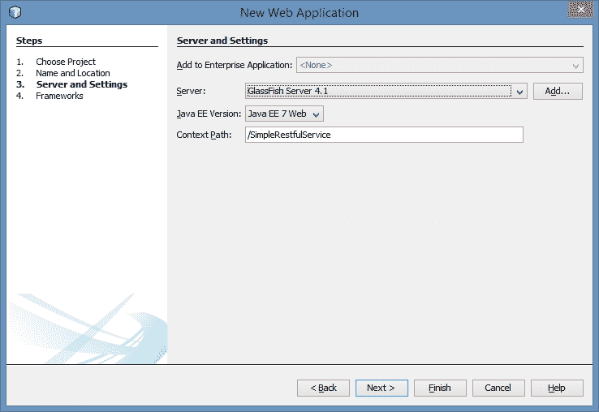
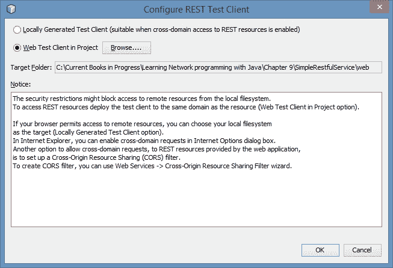
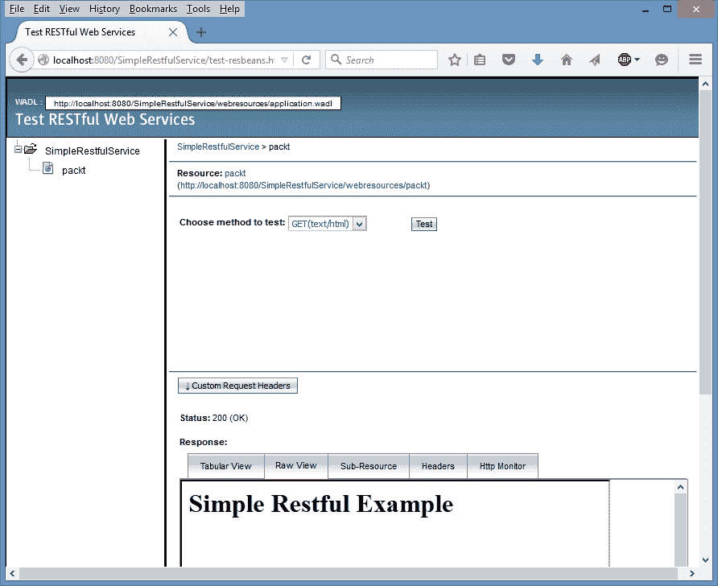

# 第九章 网络互操作性

网络互操作性指的是不同实现技术的系统可靠准确地交换信息的能力。这意味着底层硬件、操作系统和实现语言等因素可能在平台之间有所不同，但它们不会对这些系统进行通信的能力产生不利影响。

有几个因素可能会影响互操作性。这些因素从低级问题，如原始数据类型使用的字节顺序，到更高级的技术，如大部分隐藏其实现细节的 Web 服务。在本章中，我们将探讨许多这些因素。

我们首先讨论支持原始数据类型的字节顺序。这对于数据传输是至关重要的。不同的字节顺序会导致信息解释方式的显著差异。

接下来，我们将讨论 Java 应用程序如何与用不同语言编写的应用程序进行交互。这些可能是基于 JVM 的语言或与 Java 截然不同的语言。

基本的网络通信构造是套接字。这个实体通常在 TCP/IP 环境中运行。我们将演示 Java 套接字如何与用不同语言（特别是 C#）编写的套接字进行交互。

最重要的互操作性支持存在于以 Web 服务为代表的通信标准形式中。这些应用程序支持使用标准化中间件在不同系统之间进行通信。这些中间件实现大部分通信细节。

我们将调查以下互操作性主题：

+   Java 如何处理字节顺序

+   与其他语言进行接口

+   通过套接字通信

+   使用中间件实现互操作性

因此，让我们从讨论字节顺序及其对互操作性的影响开始。

# Java 中的字节顺序

有两种字节顺序：**大端序**和**小端序**。这些术语指的是多字节数量在内存中存储的顺序。为了说明这一点，考虑整数在内存中的存储方式。由于整数由 4 个字节组成，这些字节被分配给内存的 4 字节区域。然而，这些字节可以以不同的方式存储。大端序将最重要的字节放在最前面，而小端序将最不重要的字节放在最前面。

考虑以下整数的声明和初始化：

```java
        int number = 0x01234567;
```

在下面的示例中，假设整数已分配到地址`1000`，使用大端序显示内存的四个字节：

| 地址 | 字节 |
| --- | --- |
| 1000 | 01 |
| 1001 | 23 |
| 1002 | 45 |
| 1003 | 67 |

下表显示了使用小端序存储整数的方式：

| 地址 | 字节 |
| --- | --- |
| 1000 | 67 |
| 1001 | 45 |
| 1002 | 23 |
| 1003 | 01 |

机器的字节顺序有以下几种方式：

+   基于 Intel 的处理器使用小端序

+   ARM 处理器可能使用小端序或大端序

+   Motorola 68K 处理器使用大端序

+   Motorola PowerPC 使用大端序

+   Sun SPARK 处理器使用大端序

发送数据，如 ASCII 字符串，不是问题，因为这些字节是按顺序存储的。对于其他数据类型，如浮点数和长整型，可能会有问题。

如果我们需要知道当前机器支持哪种表示形式，`java.nio`包中的`ByteOder`类可以确定当前的字节顺序。以下语句将显示当前平台的字节序：

```java
        System.out.println(ByteOrder.nativeOrder());
```

对于 Windows 平台，它将显示如下内容：

**LITTLE_ENDIAN**

`DataOutputStream`类的方法自动使用大端序。`ByteBuffer`类也默认使用大端序。然而，如下所示，顺序可以被指定：

```java
        ByteBuffer buffer = ByteBuffer.allocate(4096);
        System.out.println(buffer.order());
        buffer.order(ByteOrder.LITTLE_ENDIAN);
        System.out.println(buffer.order());
```

这将显示如下内容：

**BIG_ENDIAN**

**LITTLE_ENDIAN**

一旦建立，其他方法，比如`slice`方法，不会改变使用的字节顺序，如下所示：

```java
        buffer.order(ByteOrder.LITTLE_ENDIAN);
        ByteBuffer slice = buffer.slice();
        System.out.println(buffer.order());
```

输出将如下所示：

**LITTLE_ENDIAN**

字节序通常会在机器上自动处理。然而，当我们在使用不同字节序的机器之间传输数据时，可能会出现问题。传输的字节可能会在目的地以错误的顺序。

网络通常使用大端序，也称为**网络字节顺序**。通过套接字发送的任何数据都应该使用大端序。在 Java 应用程序之间发送信息时，字节序通常不是一个问题。然而，当与非 Java 技术交互时，字节序更为重要。

# 与其他语言进行接口

有时，有必要访问用不同语言编写的库。虽然这不是一个纯粹的网络问题，但 Java 以多种方式提供支持。直接与其他语言进行接口不是通过网络进行的，而是在同一台机器上进行的。我们将简要地检查一些这些接口问题。

如果我们使用另一个 Java 库，那么我们只需要加载类。如果我们需要与非 Java 语言进行接口，那么我们可以使用**Java 本地接口**（**JNI**）API 或其他库。然而，如果这种语言是基于 JVM 的语言，那么这个过程会更容易。

## 与基于 JVM 的语言进行接口

**Java 虚拟机**（**JVM**）执行 Java 字节码。然而，不仅有 Java 使用 JVM。其他语言包括以下几种：

+   **Nashorn**：这使用 JavaScript

+   **Clojure**：这是一种 Lisp 方言

+   **Groovy**：这是一种脚本语言

+   **Scala**：这结合了面向对象和函数式编程方法

+   **JRuby**：这是 Ruby 的 Java 实现

+   **Jthon**：这是 Python 的 Java 实现

+   **Jacl**：这是 Tcl 的 Java 实现

+   **TuProlog**：这是 Prolog 的基于 Java 的实现

更完整的基于 JVM 的语言列表可以在[`en.wikipedia.org/wiki/List_of_JVM_languages`](https://en.wikipedia.org/wiki/List_of_JVM_languages)找到。使用相同的 JVM 基础将有助于共享代码和库。通常，不仅可以使用在不同基于 JVM 的语言中开发的库，还可以从不同语言中开发的类中派生。

许多语言已经移植到 JVM，因为使用 JVM 比为不同平台创建多个编译器或解释器更容易。例如，Ruby 和 Python 有 JVM 实现的原因。这些语言可以利用 JVM 的可移植性和其**即时编译**（**JIT**）过程。除此之外，JVM 还有一个大型的经过充分测试的代码库可供利用。

Nashorn 是构建在 JVM 之上并在 Java 8 中添加的 JavaScript 引擎。这允许 JavaScript 代码被轻松地集成到 Java 应用程序中。以下代码序列说明了这个过程。首先获得 JavaScript 引擎的一个实例，然后执行 JavaScript 代码：

```java
    try {
        ScriptEngine engine = 
            new ScriptEngineManager().getEngineByName("nashorn");
        engine.eval("print('Executing JavaScript code');");
    } catch (ScriptException ex) {
        // Handle exceptions
    }
```

这个序列的输出如下：

**执行 JavaScript 代码**

更复杂的 JavaScript 处理是可能的。关于这项技术的更多细节可以在[`docs.oracle.com/javase/8/docs/technotes/guides/scripting/nashorn/`](https://docs.oracle.com/javase/8/docs/technotes/guides/scripting/nashorn/)找到。

## 与非 JVM 语言进行接口

访问不同语言中的代码的常见技术是通过 JNI API。这个 API 提供了访问 C/C++代码的方法。这种方法有很好的文档，这里不会进行演示。然而，可以在[`www.ibm.com/developerworks/java/tutorials/j-jni/j-jni.html`](http://www.ibm.com/developerworks/java/tutorials/j-jni/j-jni.html)找到这个 API 的很好介绍。

可以从 Java 访问.NET 代码。一种技术使用 JNI 访问 C#。如何访问 C++、托管 C++和 C#代码的示例可在[`www.codeproject.com/Articles/13093/C-method-calls-within-a-Java-program`](http://www.codeproject.com/Articles/13093/C-method-calls-within-a-Java-program)找到。

# 通过简单的套接字进行通信

使用套接字可以在不同语言编写的应用程序之间传输信息。套接字概念并不是 Java 独有的，已经在许多语言中实现。由于套接字在 TCP/IP 级别工作，它们可以在不费吹灰之力的情况下进行通信。

主要的互操作性考虑涉及传输的数据。当数据的内部表示在两种不同的语言之间有显着差异时，可能会发生不兼容性。这可能是由于数据类型在内部的表示中使用大端或小端，以及特定数据类型是否存在于另一种语言中。例如，在 C 中没有明确的布尔数据类型。它是用整数表示的。

在本节中，我们将在 Java 中开发一个服务器，在 C#中开发一个客户端。为了演示使用套接字，在这两个应用程序之间传输一个字符串。我们将发现，即使是传输简单的数据类型，比如字符串，也可能比看起来更困难。

## Java 服务器

服务器在`JavaSocket`类中声明，如下所示。它看起来与本书中开发的以前版本的回显服务器非常相似。创建服务器套接字，然后阻塞，直到`accept`方法返回与客户端连接的套接字：

```java
public class JavaSocket {

    public static void main(String[] args) {
        System.out.println("Server Started");
        try (ServerSocket serverSocket = new ServerSocket(5000)) {
            Socket socket = serverSocket.accept();
            System.out.println("Client connection completed");
            ...
            socket.close();
        } catch (IOException ex) {
            // Handle exceptions
        }
        System.out.println("Server Terminated");
    }
}
```

`Scanner`类用于读取从客户端发送的消息。`PrintWriter`实例用于回复客户端：

```java
            Scanner scanner = 
                new Scanner(socket.getInputStream());
            PrintWriter pw = new PrintWriter(
                socket.getOutputStream(), true);
```

`nextLine`方法检索消息，显示并发送回客户端：

```java
            String message = scanner.nextLine();
            System.out.println("Server received: " + message);
            pw.println(message);
            System.out.println("Server sent: " + message);
```

服务器将终止。

现在，让我们来看看 C#应用程序。

## C#客户端

`CSharpClient`类，如下所示，实现了客户端。C#在形式和语法上类似于 Java，尽管类库通常不同。我们不会提供代码的详细解释，但我们将介绍应用程序的重要特性。

`using`语句对应于 Java 中的导入语句。与 Java 类似，要执行的第一个方法是`Main`方法。C#通常使用不同的缩进样式和命名约定：

```java
using System;
using System.Net;
using System.Net.Sockets;

namespace CSharpSocket
{
    class CSharpClient
    {
        public static void Main(string[] args)
        {
            Console.WriteLine("Client Started");
            ...
        }
    }
}
```

`IPEndPoint`变量表示 Internet 地址，`Socket`类，正如你可能期望的那样，表示套接字。`Connect`方法连接到服务器：

```java
            IPEndPoint serverAddress = 
               new IPEndPoint(IPAddress.Parse("127.0.0.1"), 5000);
            Socket clientSocket = 
                new Socket(AddressFamily.InterNetwork, 
                    SocketType.Stream, ProtocolType.Tcp);
            clientSocket.Connect(serverAddress);
```

`Console`类的`Write`方法在命令窗口中显示信息。在这里，用户被提示输入要发送到服务器的消息。`ReadLine`方法读取用户输入：

```java
            Console.Write("Enter message: ");
            String message = Console.ReadLine();
```

`Send`方法将数据传输到服务器。但是，它需要将数据放入字节缓冲区，如下所示。消息和附加的回车/换行字符被编码并插入到缓冲区中。需要附加字符以便服务器可以正确读取字符串并知道字符串何时终止：

```java
            byte[] messageBuffer;
            messageBuffer = System.Text.Encoding.ASCII.GetBytes(
               message + "\n");
            clientSocket.Send(messageBuffer);
```

`Receive`方法读取服务器的响应。与`Send`方法类似，它需要一个字节缓冲区。这个缓冲区的大小为 32 字节。这限制了消息的大小，但我们将讨论如何克服这个限制：

```java
            byte[] receiveBuffer = new byte[32];
            clientSocket.Receive(receiveBuffer);
```

接收缓冲区被转换为字符串并显示。开始和结束括号用于清楚地界定缓冲区：

```java
            String recievedMessage = 
               System.Text.Encoding.ASCII.GetString(
                   receiveBuffer);
            Console.WriteLine("Client received: [" + 
               recievedMessage + "]");
```

套接字关闭，应用程序终止：

```java
            clientSocket.Close();
            Console.WriteLine("Client Terminated");
```

## 客户端/服务器操作

启动服务器，然后启动客户端。客户端用户将被提示输入消息。输入消息。消息将被发送，并在客户端窗口中显示响应。

服务器输出显示在这里：

**服务器已启动**

**客户端连接完成**

**服务器收到：消息**

**服务器发送：消息**

**服务器终止**

客户端界面如下：

**客户端已启动**

**输入消息：The message**

**客户端收到：[The message**

**]**

**客户端终止**

**按任意键继续. . .**

您会注意到收到的消息比预期的要大。这是因为客户端的接收字节缓冲区长度为 32 字节。这个实现使用了固定大小的缓冲区。由于来自服务器的响应大小可能并不总是已知的，因此缓冲区需要足够大以容纳响应。32 的大小用于限制服务器的输出。

可以通过多种方式克服这个限制。一种方法是在字符串末尾附加一个特殊字符，然后使用此标记构造响应。另一种方法是首先发送响应的长度，然后是响应。接收缓冲区可以根据响应的长度进行分配。

发送字符串对于传输格式化信息很有用。例如，发送的消息可以是 XML 或 JSON 文档。这将有助于传输更复杂的内容。

# 通过中间件实现互操作性

在过去的 20 年里，网络技术已经有了很大的发展。低级套接字支持为大多数这些技术提供了基础。然而，它们通过多层软件隐藏在用户之下。这些层被称为**中间件**。

通过中间件（如 JMI、SOAP 和 JAX-WS 等）实现了互操作性。Java EE 版主要旨在支持这些中间件类型的技术。Java EE 从**servlets**开始，这是一个用于支持网页的 Java 应用程序。它已经发展到包括**Java 服务器页面**（**JSP**），最终到**Faclets**，这两者都隐藏了底层的 Servlets。

这些技术涉及为用户提供服务，无论是在浏览器上的人还是其他应用程序。用户不一定知道服务是如何实现的。通信是通过多种不同的标准实现的，并且数据经常封装在语言中立的 XML 文档中。因此，服务器和客户端可以用不同的语言编写，并在不同的执行环境中运行，促进了互操作性。

虽然有许多可用的技术，但通常使用两种常见的方法：RESTful Web 服务和基于 SOAP 的 Web 服务。**表述状态转移 Web 服务**（**RESTful Web 服务**）使用 HTTP 和标准命令（`PUT`、`POST`、`GET`、`DELETE`）来支持 Web 页面和其他资源的分发。其目的是简化这些类型的服务的创建方式。客户端和服务器之间的交互是无状态的。也就是说，先前处理的内容不会影响当前请求的处理方式。

**基于 SOAP 的 Web 服务**使用**简单对象访问协议**（**SOAP**）来交换结构化信息。它使用应用层协议，如 HTTP 和 SMTP，并使用 XML 进行通信。我们将专注于 JAX-RS。

**用于 RESTful Web 服务的 Java API**（**JAX-RS**）是支持 RESTful 服务开发的 API。它使用一系列注解将资源映射到 Java 实现。为了演示这项技术的工作原理，我们将使用 NetBeans 创建一个简单的 RESTful 应用程序。

## 创建 RESTful 服务

我们将首先创建服务器，然后创建一个简单的基于控制台的应用程序来访问服务器。我们将使用 NetBeans IDE 8.0.2 来开发此服务。NetBeans 可以从[`netbeans.org/downloads/`](https://netbeans.org/downloads/)下载。选择 Java EE 版本。

安装 NetBeans 后，启动它，然后从**文件** | **新建项目...**菜单项创建一个新项目。这将弹出**新建项目**对话框，如下所示。选择**Java Web**类别和**Web 应用程序**项目。然后，选择**下一步**：


给项目命名。在下图中，我们使用了`SimpleRestfulService`作为其名称。选择一个适当的位置保存项目，然后选择**下一步**：


在**服务器和设置**步骤中，选择 GlassFish 服务器和 Java EE7 Web。GlassFish 是我们将用于托管服务的 Web 服务器。**上下文路径**字段将成为传递给服务器的 URL 的一部分。再次点击**下一步**：



我们可以从三种设计模式中选择一种来创建我们的 RESTful 服务。在本例中，选择第一种**简单根资源**，然后点击**下一步**：


在**指定资源类**步骤中，填写对话框，如下所示。资源包是 Java 类将放置的位置。路径用于向用户标识资源。类名字段将是支持资源的 Java 类的名称。完成后，点击**完成**：


然后 IDE 将生成文件，包括`ApplicationConfig.java`和`SimpleRestfulService.java`文件。`ApplicationConfig.java`文件用于配置服务。我们主要关注的是`SimpleRestfulService.java`文件。

在`SimpleRestfulService`类中有`getHtml`方法，如下所示。它的目的是生成对`GET`命令的响应。第一个注释指定了当使用`HTTP GET`命令时要调用的方法。第二个注释指定了该方法的预期输出是 HTML 文本。IDE 生成的返回语句已被简单的 HTML 响应替换：

```java
    @GET
    @Produces("text/html")
    public String getHtml() {
        return 
            "<html><body><h1>Hello, World!!</body></h1></html>";
    }
```

当使用`GET`命令请求服务时，将返回 HTML 文本。所有中间步骤，包括套接字的使用，都被隐藏，简化了开发过程。

## 测试 RESTful 服务

我们将开发一个客户端应用程序来访问此资源。但是，我们可以使用内置设施测试资源。要测试服务，请在**项目资源管理器**窗口中右键单击项目名称，然后选择**测试 RESTful Web 服务**菜单项。这将弹出以下窗口。点击**确定**：



在 Windows 上可能会收到安全警报。如果发生这种情况，请选择**允许访问**按钮：


默认浏览器将显示测试页面，如下所示。选择**packt**节点：


然后资源将显示在右侧，如下所示。这使我们可以选择测试方法。由于默认选择了`GET`命令，因此点击**测试**按钮：


然后将`GET`命令发送到服务器，并显示响应，如下所示。



可以使用 JAX_RS 执行更复杂的处理。但是，这说明了基本方法。

## 创建 RESTful 客户端

RESTful 服务可以被写成各种语言的任意数量的应用程序调用。在这里，我们将创建一个简单的 Java 客户端来访问此服务。

创建一个新项目，并从**Web 服务**类别中选择**RESTful Java 客户端**选项，如下所示。然后点击**下一步**：


**名称和位置**步骤对话框将显示如下截图所示。我们需要选择 RESTful 资源。我们可以通过单击**浏览...**按钮来执行此操作：


**可用的 REST 资源**对话框将显示如下。展开我们的 RESTful 项目并选择资源，如下截图所示，然后单击**确定**：


完成的对话框应如下所示。单击**完成**：


然后生成`RestfulClient`类。我们对`getHtml`方法感兴趣，如下所示。这将从服务返回 HTML 文本：

```java
    public String getHtml() throws ClientErrorException {
        WebTarget resource = webTarget;
        return resource.
            request(javax.ws.rs.core.MediaType.TEXT_HTML).
            get(String.class);
    }
```

要测试应用程序，请添加以下`main`方法，调用`getHtml`方法：

```java
    public static void main(String[] args) {
        RestfulClient restfulClient = new RestfulClient();
        System.out.println(restfulClient.getHtml());
    }
```

确保 GlassFish 服务器正在运行，并执行程序。输出将如下所示：

**<html><body><h1>简单的 Restful 示例</body></h1></html>**

虽然我们通常不会在控制台中显示 HTML 文本，但这说明了我们从 RESTful 服务获取信息的过程。

# 摘要

在本章中，我们探讨了许多影响网络互操作性的因素。在低级别上，字节顺序变得重要。我们了解到系统使用大端或小端字节顺序。顺序可以由 Java 应用程序确定和控制。网络通信在传输数据时通常使用大端。

如果我们需要与其他语言通信，我们发现基于 JVM 的语言更容易使用，因为它们共享相同的字节码基础。如果我们需要与其他语言一起工作，那么通常使用 JNI。

套接字不是 Java 独有的概念。它通常用于 TCP/IP 环境，这意味着用一种语言编写的套接字可以轻松地与用另一种语言编写的套接字进行通信。我们使用 Java 服务器和 C#客户端演示了这种能力。

我们还探讨了中间件如何通过抽象化大部分低级通信细节来支持互操作性。使用诸如 Web 服务之类的概念，我们了解到低级套接字交互的细节被隐藏起来。我们使用 JAX-RS 进行了演示，它支持 RESTful 方法，其中 HTTP 命令（如 GET 和 POST）被映射到特定的 Java 功能。

网络互操作性是企业级应用程序中的重要考虑因素，企业的功能是通过各种技术进行分布的。通过使用标准中间件协议和产品，可以实现这种互操作性。
