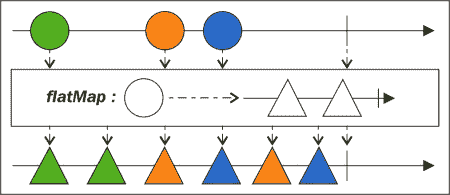
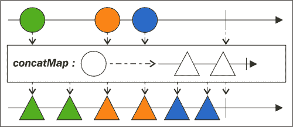

# 第四章：转换、过滤和累积您的数据

现在我们有了从各种来源数据创建`Observable`实例的手段，是时候围绕这些实例构建编程逻辑了。我们将介绍基本的响应式操作符，用于逐步计算（处理数据的响应式方式）。

我们将从转换开始，使用著名的`flatMap()`和`map()`操作符，以及一些不太常见的转换操作符。之后，我们将学习如何使用`filter()`操作符过滤我们的数据，跳过元素，仅在给定时间位置接收元素。本章还将涵盖使用`scan`操作符累积数据。大多数这些操作符将使用*大理石图示*进行演示。

本章涵盖以下主题：

+   大理石图示和映射转换的介绍

+   过滤您的数据

+   使用`scan`操作符累积值

# Observable 转换

我们在一些先前的示例中使用了`map()`操作符。将传入的值转换为其他内容的**高阶函数**称为**转换**。可以在`Observable`实例上调用的高阶函数，从中产生新的`Observable`实例的操作符称为操作符。**转换操作符**以某种方式转换从源`Observable`实例发出的元素。

为了理解不同的操作符是如何工作的，我们将使用称为**大理石图示**的图片。例如，这个描述了`map`操作符：


图示中心的矩形代表操作符（函数）。它将其输入（圆圈）转换为其他东西（三角形）。矩形上方的箭头代表源`Observable`实例，上面的彩色圆圈代表时间发出的`OnNext` *通知*，末端的垂直线是`OnCompleted` *通知*。矩形下方的箭头是具有其转换元素的`Observable`实例的输出。

因此，`map()`操作符确切地做到了这一点：它将源的每个'*next*'值转换为通过传递给它的函数定义的其他内容。这里有一个小例子：

```java
Observable<String> mapped = Observable
  .just(2, 3, 5, 8)
  .map(v -> v * 3)
  .map(v -> (v % 2 == 0) ? "even" : "odd");
subscribePrint(mapped, "map");
```

第一个`map()`操作符将源发出的每个数字转换为它本身乘以三。第二个`map()`操作符将每个乘数转换为一个字符串。如果数字是偶数，则字符串是'`even`'，否则是'`odd`'。

使用`map()`操作符，我们可以将每个发出的值转换为一个新值。还有更强大的转换操作符，看起来类似于`map()`操作符，但具有自己的用途和目的。让我们来看看它们。

## 使用各种 flatMap 操作符进行转换

`flatMap`操作符就像`map()`操作符，但有两个不同之处：

+   `flatMap`操作符的参数不是接收将值转换为任意类型值的函数，而是始终将值或值序列转换为`Observable`实例的形式。

+   它合并了由这些结果`Observable`实例发出的值。这意味着它不是将`Observable`实例作为值发出，而是发出它们的通知。

这是它的大理石图示：



正如我们所看到的，源`Observable`实例的每个值都被转换为一个`Observable`实例，最终，所有这些*派生 Observable*的值都由结果`Observable`实例发出。请注意，结果`Observable`实例可能以交错的方式甚至无序地发出派生`Observable`实例的值。

`flatMap`运算符对于分叉逻辑非常有用。例如，如果一个`Observable`实例表示文件系统文件夹并从中发出文件，我们可以使用`flatMap`运算符将每个文件对象转换为一个`Observable`实例，并对这些*文件 observables*应用一些操作。结果将是这些操作的摘要。以下是一个从文件夹中读取一些文件并将它们转储到标准输出的示例：

```java
Observable<Path> listFolder(Path dir, String glob) { // (1)
  return Observable.<Path>create(subscriber -> {
    try {
      DirectoryStream<Path> stream = Files.newDirectoryStream(dir, glob);
      subscriber.add(Subscriptions.create(() -> {
        try {
          stream.close();
        }
        catch (IOException e) {
          e.printStackTrace();
        }
      }));
      Observable.<Path>from(stream).subscribe(subscriber);
    }
    catch (DirectoryIteratorException ex) {
      subscriber.onError(ex);
    }
    catch (IOException ioe) {
      subscriber.onError(ioe);
    }
  });
}
Observable<String> from(final Path path) { // (2)
  return Observable.<String>create(subscriber -> {
    try {
      BufferedReader reader = Files.newBufferedReader(path);
      subscriber.add(Subscriptions.create(() -> {
        try {
          reader.close();
        }
        catch (IOException e) {
          e.printStackTrace();
        }
      }));
      String line = null;
      while ((line = reader.readLine()) != null && !subscriber.isUnsubscribed()) {
        subscriber.onNext(line);
      }
      if (!subscriber.isUnsubscribed()) {
        subscriber.onCompleted();
      }
    }
    catch (IOException ioe) {
      if (!subscriber.isUnsubscribed()) {
        subscriber.onError(ioe);
      }
    }
  });
}
Observable<String> fsObs = listFolder(
  Paths.get("src", "main", "resources"), "{lorem.txt,letters.txt}"
).flatMap(path -> from(path)); // (3)
subscribePrint(fsObs, "FS"); // (4)
```

这段代码介绍了处理文件夹和文件的两种方法。我们将简要介绍它们以及在这个`flatMap`示例中如何使用它们：

1.  第一个方法`listFolder()`接受一个`Path`变量形式的文件夹和一个`glob`表达式。它返回一个代表这个文件夹的`Observable`实例。这个`Observable`实例发出符合`glob`表达式的所有文件作为`Path`对象。

该方法使用了`Observable.create()`和`Observable.from()`运算符。这个实现的主要思想是，如果发生异常，它应该被处理并由生成的`Observable`实例发出。

注意使用`Subscriber.add()`运算符将一个新的`Subscription`实例添加到订阅者，使用`Subscriptions.create()`运算符创建。这个方法使用一个动作创建一个`Subscription`实例。当`Subscription`实例被*取消订阅*时，这个动作将被执行，这意味着在这种情况下`Subscriber`实例被*取消订阅*。因此，这类似于将`stream`的关闭放在最终块中。

1.  这个示例介绍的另一种方法是`Observable<String> from(Path)`。

它逐行读取位于`path`实例中的文件并将行作为`OnNext()` *通知*发出。该方法在`Subscription`实例上使用`Subscriber.add()`运算符来关闭到文件的`stream`。

1.  使用`flatMap`的示例从文件夹创建了一个`Observable`实例，使用`listFolder()`运算符，它发出两个`Path`参数到文件。对于每个文件使用`flatMap()`运算符，我们创建了一个`Observable`实例，使用`from(Path)`运算符，它将文件内容作为行发出。

1.  前述链的结果将是两个文件内容，打印在标准输出上。如果我们对每个*文件路径 Observable*使用`Scheduler`实例（参见第六章, *使用调度程序进行并发和并行处理*），内容将会*混乱*，因为`flatMap`运算符会交错合并`Observable`实例的通知。

### 注意

介绍`Observable<String> from(final Path path)`方法的源代码可以在[`github.com/meddle0x53/learning-rxjava/blob/724eadf5b0db988b185f8d86006d772286037625/src/main/java/com/packtpub/reactive/common/CreateObservable.java#L61`](https://github.com/meddle0x53/learning-rxjava/blob/724eadf5b0db988b185f8d86006d772286037625/src/main/java/com/packtpub/reactive/common/CreateObservable.java#L61)找到。

包含`Observable<Path> listFolder(Path dir, String glob)`方法的源代码可以在[`github.com/meddle0x53/learning-rxjava/blob/724eadf5b0db988b185f8d86006d772286037625/src/main/java/com/packtpub/reactive/common/CreateObservable.java#L128`](https://github.com/meddle0x53/learning-rxjava/blob/724eadf5b0db988b185f8d86006d772286037625/src/main/java/com/packtpub/reactive/common/CreateObservable.java#L128)上查看/下载。

使用`flatMap`运算符的示例可以在[`github.com/meddle0x53/learning-rxjava/blob/master/src/main/java/com/packtpub/reactive/chapter04/FlatMapAndFiles.java`](https://github.com/meddle0x53/learning-rxjava/blob/master/src/main/java/com/packtpub/reactive/chapter04/FlatMapAndFiles.java)上查看/下载。

`flatMap`操作符有多个重载。例如，有一个接受三个函数的重载——一个用于`OnNext`，一个用于`OnError`，一个用于`OnComleted`。它还将*错误*或*完成*事件转换为`Observable`实例，如果有`OnError`或`OnCompleted`事件，则它们的`Observable`实例转换将合并到生成的`Observable`实例中，然后是一个`OnCompleted` *通知*。这是一个例子：

```java
Observable<Integer> flatMapped = Observable
  .just(-1, 0, 1)
  .map(v -> 2 / v)
  .flatMap(
 v -> Observable.just(v),
 e -> Observable.just(0),
 () -> Observable.just(42)
 );
subscribePrint(flatMapped, "flatMap");
```

这将输出`-2(2/-1)`和`0`（因为`2/0`引发了错误）。由于*错误*，`1`不会被发出，也不会到达`flatMap`操作符。

另一个有趣的重载是`Observable<R> flatMap(Func1<T, Observable<U>>, Func2<T, U, R>)`。这是它的弹珠图：


这个操作符将源`Observable`实例的项目与由这些源项目触发的`Observable`实例的项目组合，并调用用户提供的函数，该函数使用原始和派生项目的对。然后`Observable`实例将发出此函数的结果。这是一个例子：

```java
Observable<Integer> flatMapped = Observable
.just(5, 432)
.flatMap(
 v -> Observable.range(v, 2),
 (x, y) -> x + y);
subscribePrint(flatMapped, "flatMap");
```

输出是：

```java
flatMap : 10
flatMap : 11
flatMap : 864
flatMap : 865
flatMap ended!

```

这是因为源`Observable`实例发出的第一个元素是`5`，`flatMap`操作符使用`range()`操作符将其转换为`Observable`实例，该实例发出`5`和`6`。但是这个`flatMap`操作符并不止于此；对于这个范围`Observable`实例发出的每个项目，它都应用第二个函数，第一个参数是原始项目（`5`），第二个参数是范围发出的项目。所以我们有*5 + 5*，然后*5 + 6*。对于源`Observable`实例发出的第二个项目也是一样：`432`。它被转换为*432 + 432 = 864*和*432 + 433 = 865*。

当所有派生项都需要访问其源项时，这种重载是有用的，并且通常可以避免使用某种**元组**或**对**类，从而节省内存和库依赖。在前面的文件示例中，我们可以在每个输出行之前添加文件的名称：

```java
CreateObservable.listFolder(
  Paths.get("src", "main", "resources"),
  "{lorem.txt,letters.txt}"
).flatMap(
 path -> CreateObservable.from(path),
 (path, line) -> path.getFileName() + " : " + line
);
```

`flatMapIterable`操作符不以 lambda 作为参数，该 lambda 以任意值作为参数并返回`Observable`实例。相反，传递给它的 lambda 以任意值作为参数并返回`Iterable`实例。所有这些`Iterable`实例都被展平为由生成的`Observable`实例发出的值。让我们看一下以下代码片段：

```java
Observable<?> fIterableMapped = Observable
.just(
  Arrays.asList(2, 4),
  Arrays.asList("two", "four"),
)
.flatMapIterable(l -> l);
```

这个简单的例子合并了源`Observable`实例发出的两个列表，结果发出了四个项目。值得一提的是，调用`flatMapIterable(list -> list)`等同于调用`flatMap(l → Observable.from(l))`。

`flatMap`操作符的另一种形式是`concatMap`操作符。它的行为与原始的`flatMap`操作符相同，只是它连接而不是合并生成的`Observable`实例，以生成自己的序列。以下弹珠图显示了它的工作原理：



来自不同*派生 Observable*的项目不会交错，就像`flatMap`操作符一样。`flatMap`和`concatMap`操作符之间的一个重要区别是，`flatMap`操作符并行使用内部`Observable`实例，而`concatMap`操作符一次只订阅一个`Observable`实例。

类似于`flatMap`的最后一个操作符是`switchMap`。它的弹珠图看起来像这样：


它的操作方式类似于`flatMap`操作符，不同之处在于每当源`Observable`实例发出新项时，它就会停止镜像先前发出的项生成的`Observable`实例，并且只开始镜像当前的`Observable`实例。换句话说，当下一个`Observable`实例开始发出其项时，它会在内部取消订阅当前的*派生*`Observable`实例。这是一个例子：

```java
Observable<Object> obs = Observable
.interval(40L, TimeUnit.MILLISECONDS)
.switchMap(v ->
 Observable
 .timer(0L, 10L, TimeUnit.MILLISECONDS)
 .map(u -> "Observable <" + (v + 1) + "> : " + (v + u)))
);
subscribePrint(obs, "switchMap");
```

源`Observable`实例使用`Observable.interval()`操作符每 40 毫秒发出一个连续的数字（从零开始）。使用`switchMap`操作符，为每个数字创建一个发出另一个数字序列的新`Observable`实例。这个次要数字序列从传递给`switchMap`操作符的源数字开始（通过使用`map()`操作符将源数字与每个发出的数字相加来实现）。因此，每 40 毫秒，都会发出一个新的数字序列（每个数字间隔 10 毫秒）。

结果输出如下：

```java
switchMap : Observable <1> : 0
switchMap : Observable <1> : 1
switchMap : Observable <1> : 2
switchMap : Observable <1> : 3
switchMap : Observable <2> : 1
switchMap : Observable <2> : 2
switchMap : Observable <2> : 3
switchMap : Observable <2> : 4
switchMap : Observable <3> : 2
switchMap : Observable <3> : 3
switchMap : Observable <3> : 4
switchMap : Observable <3> : 5
switchMap : Observable <3> : 6
switchMap : Observable <4> : 3
.................

```

### 注意

所有映射示例的源代码可以在[`github.com/meddle0x53/learning-rxjava/blob/master/src/main/java/com/packtpub/reactive/chapter04/MappingExamples.java`](https://github.com/meddle0x53/learning-rxjava/blob/master/src/main/java/com/packtpub/reactive/chapter04/MappingExamples.java)下载/查看。

## 分组项目

可以按特定属性或键对项目进行分组。

首先，我们来看一下`groupBy()`操作符，这是一个将源`Observable`实例分成多个`Observable`实例的方法。这些`Observable`实例根据分组函数发出源的一些项。

`groupBy()`操作符返回一个发出`Observable`实例的`Observable`实例。这些`Observable`实例很特殊；它们是`GroupedObservable`类型的，您可以使用`getKey()`方法检索它们的分组键。一旦使用`groupBy()`操作符，不同的组可以以不同或相同的方式处理。

请注意，当`groupBy()`操作符创建发出`GroupedObservables`实例的可观察对象时，每个实例都会缓冲其项。因此，如果我们忽略其中任何一个，这个缓冲区将会造成潜在的内存泄漏。

`groupBy()`操作符的弹珠图如下：


这里，项目的形式被用作分组的共同特征。为了更好地理解这个方法的思想，我们可以看看这个例子：

```java
List<String> albums = Arrays.asList(
  "The Piper at the Gates of Dawn",
  "A Saucerful of Secrets",
  "More", "Ummagumma",	"Atom Heart Mother",
  "Meddle", "Obscured by Clouds",
  "The Dark Side of the Moon",
  "Wish You Were Here", "Animals", "The Wall"
);
Observable
  .from(albums)
  .groupBy(album -> album.split(" ").length)
  .subscribe(obs ->
    subscribePrint(obs, obs.getKey() + " word(s)")
  );
```

该示例发出了一些 Pink Floyd 的专辑标题，并根据其中包含的单词数进行分组。例如，`Meddle`和`More`在键为`1`的同一组中，`A Saucerful of Secrets`和`Wish You Were Here`都在键为`4`的组中。所有这些组都由`GroupedObservable`实例表示，因此我们可以在源`Observable`实例的`subscribe()`调用中订阅它们。不同的组根据它们的键打印不同的标签。这个小程序的输出如下：

```java
7 word(s) : The Piper at the Gates of Dawn
4 word(s) : A Saucerful of Secrets
1 word(s) : More
1 word(s) : Ummagumma
3 word(s) : Atom Heart Mother
1 word(s) : Meddle
3 word(s) : Obscured by Clouds
6 word(s) : The Dark Side of the Moon
4 word(s) : Wish You Were Here
1 word(s) : Animals
2 word(s) : The Wall

```

发出的项目的顺序是相同的，但它们是由不同的`GroupedObservable`实例发出的。此外，所有`GroupedObservable`实例在源完成后都会完成。

`groupBy()`操作符还有另一个重载，它接受第二个转换函数，以某种方式转换组中的每个项目。这是一个例子：

```java
Observable
.from(albums)
.groupBy(
 album -> album.replaceAll("[^mM]", "").length(),
 album -> album.replaceAll("[mM]", "*")
)
.subscribe(
  obs -> subscribePrint(obs, obs.getKey()+" occurences of 'm'")
);
```

专辑标题按其中字母`m`的出现次数进行分组。文本被转换成所有字母出现的地方都被替换为`*`。输出如下：

```java
0 occurences of 'm' : The Piper at the Gates of Dawn
0 occurences of 'm' : A Saucerful of Secrets
1 occurences of 'm' : *ore
4 occurences of 'm' : U**agu**a
2 occurences of 'm' : Ato* Heart *other
1 occurences of 'm' : *eddle
0 occurences of 'm' : Obscured by Clouds
1 occurences of 'm' : The Dark Side of the *oon
0 occurences of 'm' : Wish You Were Here
1 occurences of 'm' : Ani*als
0 occurences of 'm' : The Wall

```

### 注意

使用`Observable.groupBy()`操作符的源代码可以在[`github.com/meddle0x53/learning-rxjava/blob/master/src/main/java/com/packtpub/reactive/chapter04/UsingGroupBy.java`](https://github.com/meddle0x53/learning-rxjava/blob/master/src/main/java/com/packtpub/reactive/chapter04/UsingGroupBy.java)找到。

## 其他有用的转换操作符

还有一些其他值得一提的*转换*。例如，有`cast()`操作符，它是`map(v -> someClass.cast(v))`的快捷方式。

```java
List<Number> list = Arrays.asList(1, 2, 3);
Observable<Integer> iObs = Observable
  .from(list)
  .cast(Integer.class);
```

这里的初始`Observable`实例发出`Number`类型的值，但它们实际上是`Integer`实例，所以我们可以使用`cast()`操作符将它们表示为`Integer`实例。

另一个有用的操作符是`timestamp()`操作符。它通过将每个发出的值转换为`Timestamped<T>`类的实例来为其添加*时间戳*。例如，如果我们想要记录`Observable`的输出，这将非常有用。

```java
List<Number> list = Arrays.asList(3, 2);
Observable<Timestamped<Number>> timestamp = Observable
  .from(list)
  .timestamp();
subscribePrint(timestamp, "Timestamps");
```

在这个例子中，每个数字都被时间戳标记。同样，可以使用`map()`操作符很容易地实现。前面例子的输出如下：

```java
Timestamps : Timestamped(timestampMillis = 1431184924388, value = 1)
Timestamps : Timestamped(timestampMillis = 1431184924394, value = 2)
Timestamps : Timestamped(timestampMillis = 1431184924394, value = 3)

```

另一个类似的操作符是`timeInterval`操作符，但它将一个值转换为`TimeInterval<T>`实例。`TimeInterval<T>`实例表示`Observable`发出的项目以及自上一个项目发出以来经过的时间量，或者（如果没有上一个项目）自订阅以来经过的时间量。这可以用于生成统计信息，例如：

```java
Observable<TimeInterval<Long>> timeInterval = Observable
  .timer(0L, 150L, TimeUnit.MILLISECONDS)
  .timeInterval();
subscribePrint(timeInterval, "Time intervals");
```

这将输出类似于这样的内容：

```java
Time intervals : TimeInterval [intervalInMilliseconds=13, value=0]
Time intervals : TimeInterval [intervalInMilliseconds=142, value=1]
Time intervals : TimeInterval [intervalInMilliseconds=149, value=2]
...................................................................

```

我们可以看到不同的值大约在 150 毫秒左右发出，这是应该的。

`timeInterval`和`timestamp`操作符都在*immediate*调度程序上工作（参见第六章，“使用调度程序进行并发和并行处理”），它们都以毫秒为单位保留其时间信息。

### 注意

前面示例的源代码可以在[`github.com/meddle0x53/learning-rxjava/blob/master/src/main/java/com/packtpub/reactive/chapter04/VariousTransformationsDemonstration.java`](https://github.com/meddle0x53/learning-rxjava/blob/master/src/main/java/com/packtpub/reactive/chapter04/VariousTransformationsDemonstration.java)找到。

# 过滤数据

在第一章的响应式求和示例中，我们根据特殊模式过滤用户输入。例如，模式是* a：<number>*。通常只从数据流中过滤出有趣的数据。例如，仅从所有按键按下事件中过滤出*<enter>*按键按下事件，或者仅从文件中包含给定表达式的行中过滤出行。这就是为什么不仅能够转换我们的数据，还能够学会如何过滤它是很重要的。

RxJava 中有许多过滤操作符。其中最重要的是`filter()`。它的弹珠图非常简单，如下所示：


它显示`filter()`操作符通过某些属性过滤数据。在图中，它是元素的形式：它只过滤圆圈。像所有其他操作符一样，`filter()`从源创建一个新的`Observable`实例。这个`Observable`实例只发出符合`filter()`操作符定义的条件的项目。以下代码片段说明了这一点：

```java
Observable<Integer> numbers = Observable
  .just(1, 13, 32, 45, 21, 8, 98, 103, 55);
Observable<Integer> filter = numbers
  .filter(n -> n % 2 == 0);
subscribePrint(filter, "Filter");
```

这将仅输出*偶数*（`32`，`8`和`98`），因为满足过滤条件。

`filter()`操作符根据用户定义的函数过滤元素。还有一些其他过滤操作符。为了理解它们，让我们看一些简单的例子：

```java
Observable<Integer> numbers = Observable
  .just(1, 13, 32, 45, 21, 8, 98, 103, 55);
Observable<String> words = Observable
  .just(
    "One", "of", "the", "few", "of",
    "the", "crew", "crew"
  );
Observable<?> various = Observable
  .from(Arrays.asList("1", 2, 3.0, 4, 5L));
```

我们定义了三个`Observable`实例来用于我们的示例。第一个发出九个数字。第二个逐个发出句子中的所有单词。第三个发出不同类型的元素——字符串、整数、双精度和长整型。

```java
subscribePrint(numbers.takeLast(4), "Last 4");
```

`takeLast()`操作符返回一个新的`Observable`实例，只从源`Observable`实例中发出最后的*N*个项目，只有当它完成时。这个方法有一些重载。例如，有一个可以在指定的时间窗口内发出源的最后*N*个或更少的项目。另一个可以接收一个`Scheduler`实例，以便在另一个线程上执行。

在这个例子中，只有`Observable`实例的最后四个项目将被过滤和输出：

```java
Last 4 : 8
Last 4 : 98
Last 4 : 103
Last 4 : 55
Last 4 ended!

```

让我们来看下面的代码片段：

```java
subscribePrint(numbers.last(), "Last");
```

由`last()`操作符创建的`Observable`实例，在源`Observable`实例完成时只输出*最后一个项目*。如果源没有发出项目，将会发出`NoSuchElementException`异常作为`OnError()` *通知*。它有一个重载，接收一个类型为`T->Boolean`的谓词参数。因此，它只发出源发出的最后一个符合谓词定义的条件的项目。在这个例子中，输出将如下所示：

```java
Last : 55
Last ended!

```

`takeLastBuffer()`方法的行为与`takeLast()`方法类似，但它创建的`Observable`实例只发出一个包含源的最后*N*个项目的`List`实例：

```java
subscribePrint(
  numbers.takeLastBuffer(4), "Last buffer"
);
```

它有类似的重载。这里的输出如下：

```java
Last buffer : [8, 98, 103, 55]
Last buffer ended!

```

`lastOrDefault()`操作符的行为与`last()`操作符相似，并且具有谓词的相同重载：

```java
subscribePrint(
  numbers.lastOrDefault(200), "Last or default"
);
subscribePrint(
  Observable.empty().lastOrDefault(200), "Last or default"
);
```

然而，如果源没有发出任何东西，`lastOrDefault()`操作符会发出默认值而不是`OnError` *通知*。这个例子的输出如下：

```java
Last or default : 55
Last or default ended!
Last or default : 200
Last or default ended!

```

`skipLast()`操作符是`takeLast()`方法的完全相反；它在完成时发出除了源的最后*N*个项目之外的所有内容：

```java
subscribePrint(numbers.skipLast(4), "Skip last 4");
```

它有类似的重载。这个例子的输出如下：

```java
Skip last 4 : 1
Skip last 4 : 13

```

`skip()`方法与`skipLast()`方法相同，但是跳过前*N*个项目而不是最后一个：

```java
subscribePrint(numbers.skip(4), "Skip 4");
```

这意味着示例的输出如下：

```java
Skip 4 : 21
Skip 4 : 8
Skip 4 : 98
Skip 4 : 103
Skip 4 : 55
Skip 4 ended!

```

`take()`操作符类似于`takeLast()`操作符，但是它发出源的前*N*个项目，而不是最后的*N*个项目。

```java
subscribePrint(numbers.take(4), "First 4");
```

这是一个常用的操作符，比`takeLast()`操作符更便宜，因为`takeLast()`操作符会缓冲其项目并等待源完成。这个操作符不会缓冲其项目，而是在接收到它们时发出它们。它非常适用于限制无限的`Observable`实例。前面例子的输出如下：

```java
First 4 : 1
First 4 : 13
First 4 : 32
First 4 : 45
First 4 ended!

```

让我们来看下面的代码片段：

```java
subscribePrint(numbers.first(), "First");
```

`first()`操作符类似于`last()`操作符，但只发出源发出的第一个项目。如果没有第一个项目，它会发出相同的`OnError` *通知*。它的谓词形式有一个别名——`takeFirst()`操作符。还有一个`firstOrDefault()`操作符形式。这个例子的输出很清楚：

```java
First : 1
First ended!

```

让我们来看下面的代码片段：

```java
subscribePrint(numbers.elementAt(5), "At 5");
```

`elementAt()`操作符类似于`first()`和`last()`操作符，但没有谓词形式。不过有一个`elementAtOrDefault()`形式。它只发出源`Observable`实例发出的项目序列中指定索引处的元素。这个例子输出如下：

```java
At 5 : 8
At 5 ended!

```

让我们来看下面的代码片段：

```java
subscribePrint(words.distinct(), "Distinct");
```

由`distinct()`操作符产生的`Observable`实例发出源的项目，排除重复的项目。有一个重载可以接收一个函数，返回一个用于决定一个项目是否与另一个项目不同的键或哈希码值：

```java
Distinct : One
Distinct : of
Distinct : the
Distinct : few
Distinct : crew
Distinct ended!

```

```java
subscribePrint(
  words.distinctUntilChanged(), "Distinct until changed"
);
```

`distinctUntilChanged()`操作符类似于`distinct()`方法，但它返回的`Observable`实例会发出源`Observable`实例发出的所有与它们的直接前导不同的项目。因此，在这个例子中，它将发出除了最后一个`crew`之外的每个单词。

```java
subscribePrint( // (13)
  various.ofType(Integer.class), "Only integers"
);
```

`ofType()`操作符创建一个只发出给定类型源发出的项目的`Observable`实例。它基本上是这个调用的快捷方式：`filter(v -> Class.isInstance(v))`。在这个例子中，输出将如下所示：

```java
Only integers : 2
Only integers : 4
Only integers ended!

```

### 注意

所有这些示例的源代码可以在[`github.com/meddle0x53/learning-rxjava/blob/master/src/main/java/com/packtpub/reactive/chapter04/FilteringExamples.java`](https://github.com/meddle0x53/learning-rxjava/blob/master/src/main/java/com/packtpub/reactive/chapter04/FilteringExamples.java)上查看/下载。

这些是 RxJava 提供的最常用的*过滤*操作符。我们将在以后的示例中经常使用其中的一些。

在本章中，我们将要看的`last`操作符是一个转换操作符，但有点特殊。它可以使用先前累积的状态！让我们了解更多。

# 累积数据

`scan(Func2)`操作符接受一个带有两个参数的函数作为参数。它的结果是一个`Observable`实例。通过`scan()`方法的结果发出的第一个项目是源`Observable`实例的第一个项目。发出的第二个项目是通过将传递给`scan()`方法的函数应用于结果`Observable`实例之前发出的项目和源`Observable`实例发出的第二个项目来创建的。通过`scan()`方法结果发出的第三个项目是通过将传递给`scan()`方法的函数应用于之前发出的项目和源`Observable`实例发出的第三个项目来创建的。这种模式继续下去，以创建`scan()`方法创建的`Observable`实例发出的序列的其余部分。传递给`scan()`方法的函数称为**累加器**。

让我们来看一下`scan(Func2)`方法的弹珠图：


`scan()`方法发出的项目可以使用累积状态生成。在图中，圆圈在三角形中累积，然后这个三角形圆圈在正方形中累积。

这意味着我们可以发出一系列整数的总和，例如：

```java
Observable<Integer> scan = Observable
  .range(1, 10)
  .scan((p, v) -> p + v);
subscribePrint(scan, "Sum");
subscribePrint(scan.last(), "Final sum");
```

第一个*订阅*将输出所有的发射：*1, 3 (1+2), 6 (3 + 3), 10 (6 + 4) .. 55*。但在大多数情况下，我们只对最后发出的项目感兴趣——最终总和。我们可以使用一个只发出最后一个元素的`Observable`实例，使用`last()`过滤操作符。值得一提的是，还有一个`reduce(Func2)`操作符，是`scan(Func2).last()`的别名。

`scan()`操作符有一个重载，可以与*seed/initial*参数一起使用。在这种情况下，传递给`scan(T, Func2)`操作符的函数被应用于源发出的第一个项目和这个*seed*参数。

```java
Observable<String> file = CreateObservable.from(
  Paths.get("src", "main", "resources", "letters.txt")
);
scan = file.scan(0, (p, v) -> p + 1);
subscribePrint(scan.last(), "wc -l");
```

这个示例计算文件中的行数。文件`Observable`实例逐行发出指定路径文件的行。我们使用`scan(T, Func2)`操作符，初始值为`0`，通过在每行上累加计数来计算行数。

我们将用一个示例来结束本章，其中使用了本章介绍的许多操作符。让我们来看一下：

```java
Observable<String> file = CreateObservable.from(
  Paths.get("src", "main", "resources", "operators.txt")
);
Observable<String> multy = file
  .flatMap(line -> Observable.from(line.split("\\."))) // (1)
  .map(String::trim) // (2)
  .map(sentence -> sentence.split(" ")) // (3)
  .filter(array -> array.length > 0) // (4)
  .map(array -> array[0]) // (5)
  .distinct() // (6)
  .groupBy(word -> word.contains("'")) //(7)
  .flatMap(observable -> observable.getKey() ? observable : // (8)
    observable.map(Introspector::decapitalize))
  .map(String::trim) // (9)
  .filter(word -> !word.isEmpty()) // (10)
  .scan((current, word) -> current + " " + word) // (11)
  .last() // (12)
  .map(sentence -> sentence + "."); // (13)
subscribePrint(multy, "Multiple operators"); // (14)
```

这段代码使用了许多操作符来过滤并组装隐藏在文件中的句子。文件由一个`Observable`实例表示，它逐行发出其中包含的所有行。

1.  我们不只想对不同的行进行操作；我们想发出文件中包含的所有句子。因此，我们使用`flatMap`操作符创建一个逐句发出文件句子的`Observable`实例（由`dot`确定）。

1.  我们使用`map()`操作符修剪这些句子。它可能包含一些前导或尾随空格。

1.  我们希望对句子中包含的不同单词进行操作，因此我们使用`map()`操作符和`String::split`参数将它们转换为单词数组。

1.  我们不关心空句子（如果有的话），所以我们使用`filter()`操作符将它们过滤掉。

1.  我们只需要句子中的第一个单词，所以我们使用`map()`操作符来获取它们。生成的`Observable`实例会发出文件中每个句子的第一个单词。

1.  我们不需要重复的单词，所以我们使用`distinct()`操作符来摆脱它们。

1.  现在我们想以某种方式分支我们的逻辑，使一些单词被不同对待。所以我们使用`groupBy()`操作符和一个`Boolean`键将我们的单词分成两个`Observable`实例。选择的单词的键是`True`，其他的是`False`。

1.  使用`flatMap`操作符，我们连接我们分开的单词，但只有选择的单词（带有`True`键）保持不变。其余的被*小写*。

1.  我们使用`map()`操作符去除所有不同单词的前导/尾随空格。

1.  我们使用`filter()`操作符来过滤掉空的句子。

1.  使用`scan()`操作符，我们用空格作为分隔符连接单词。

1.  使用`last()`操作符，我们的结果`Observable`实例将只发出最后的连接，包含所有单词。

1.  最后一次调用`map()`操作符，通过添加句点从我们连接的单词中创建一个句子。

1.  如果我们输出这个`Observable`实例发出的单个项目，我们将得到一个由初始文件中所有句子的第一个单词组成的句子（跳过重复的单词）！

输出如下：

```java
Multiple operators : I'm the one who will become RX.
Multiple operators ended!

```

### 注意

上述示例可以在[`github.com/meddle0x53/learning-rxjava/blob/master/src/main/java/com/packtpub/reactive/chapter04/VariousTransformationsDemonstration.java`](https://github.com/meddle0x53/learning-rxjava/blob/master/src/main/java/com/packtpub/reactive/chapter04/VariousTransformationsDemonstration.java)找到。

# 总结

本章结尾的示例演示了我们迄今为止学到的内容。我们可以通过链接`Observable`实例并使用各种操作符来编写复杂的逻辑。我们可以使用`map()`或`flatMap()`操作符来转换传入的数据，并可以使用`groupBy()`或`filter()`操作符或不同的`flatMap()`操作符来分支逻辑。我们可以再次使用`flatMap()`操作符将这些分支连接起来。我们可以借助不同的过滤器选择数据的部分，并使用`scan()`操作符累积数据。使用所有这些操作符，我们可以以可读且简单的方式编写相当不错的程序。程序的复杂性不会影响代码的复杂性。

下一步是学习如何以更直接的方式组合我们逻辑的分支。我们还将学习如何组合来自不同来源的数据。所以让我们继续下一章吧！
