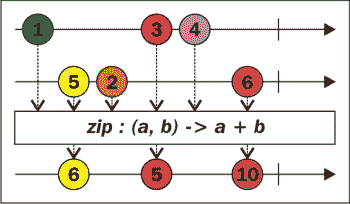
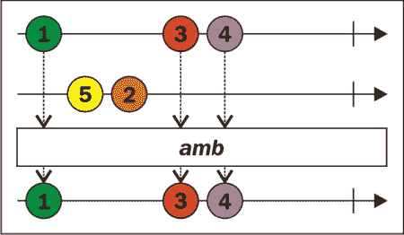

# 第五章：组合器，条件和错误处理

我们编写的大多数程序都处理来自不同来源的数据。这些来源既可以是外部的（文件、数据库、服务器等）也可以是内部的（不同的集合或相同外部来源的分支）。有许多情况下，我们希望这些来源以某种方式相互依赖。定义这些依赖关系是构建我们的程序的必要步骤。本章的目的是介绍能够实现这一点的`Observable`操作符。

我们在第一章和第二章中看到了组合的`Observable`实例的例子。我们的“响应式求和”程序有一个外部数据源——用户输入，但它根据自定义格式分成了两个内部数据源。我们看到了如何使用`filter()`操作符而不是过程式的`if-else`构造。后来，我们借助组合器将这些数据流合并成一个。

我们将学习如何在`Observable`实例链中对错误做出反应。记住，能够对失败做出反应使我们的程序具有弹性。

在本章中，我们将涵盖：

+   使用操作符（如`combineLatest()`、`merge()`、`concat()`和`zip()`）组合`Observable`实例

+   使用条件操作符（如`takeUntil()`、`skipUntil()`和`amb()`）在`Observable`实例之间创建依赖关系

+   使用`retry()`、`onErrorResumeNext()`和`onErrorReturn()`等操作符进行错误处理

# 组合 Observable 实例

我们首先来看一下`zip(Observable, Observable, <Observable>..., Func)`操作符，它可以使用*组合*函数*组合*两个或多个`Observable`实例。

## zip 操作符

传递给`zip`操作符的函数的参数数量与传递给`zip()`方法的`Observable`实例的数量一样多。当所有这些`Observable`实例至少发出一项时，将使用每个`Observable`实例首次发出的参数值调用该函数。其结果将是通过`zip()`方法创建的`Observable`实例的第一项。由这个`Observable`实例发出的第二项将是源`Observable`实例的第二项的组合（使用`zip()`方法的函数参数计算）。即使其中一个源`Observable`实例已经发出了三项或更多项，它的第二项也会被使用。结果的`Observable`实例总是发出与源`Observable`实例相同数量的项，它发出最少的项然后完成。

这种行为在下面的弹珠图中可以更清楚地看到：



这是一个非常简单的使用`zip()`方法的例子：

```java
Observable<Integer> zip = Observable
.zip(
 Observable.just(1, 3, 4),
 Observable.just(5, 2, 6),
 (a, b) -> a + b
);
subscribePrint(zip, "Simple zip");
```

这个例子类似于弹珠图，并输出相同的结果。由`zip()`方法创建的`Observable`实例发出的第一项是在所有源至少发出一项之后发出的。这意味着即使其中一个源发出了所有的项，结果也只会在所有其他源发出项时才会被发出。

现在，如果你还记得来自第三章的`interval()`操作符，它能够创建一个`Observable`实例，每`<n>`毫秒发出一个顺序数字。如果你想要发出一系列任意对象，可以通过使用`zip()`方法结合`interval()`和`from()`或`just()`方法来实现。让我们看一个例子：

```java
Observable<String> timedZip = Observable
.zip(
 Observable.from(Arrays.asList("Z", "I", "P", "P")),
 Observable.interval(300L, TimeUnit.MILLISECONDS),
 (value, i) -> value
);
subscribePrint(timedZip, "Timed zip");
```

这将在 300 毫秒后输出`Z`，在另外 300 毫秒后输出`I`，在相同的间隔后输出`P`，并在另外 300 毫秒后输出另一个`P`。之后，`timedZip` `Observable`实例将完成。这是因为通过`interval()`方法创建的源`Observable`实例每 300 毫秒发出一个元素，并确定了`timedZip`参数发射的速度。

`zip()`方法也有一个实例方法版本。该操作符称为`zipWith()`。以下是一个类似的示例，但使用了`zipWith()`操作符：

```java
Observable<String> timedZip = Observable
.from(Arrays.asList("Z", "I", "P", "P"))
.zipWith(
 Observable.interval(300L, TimeUnit.MILLISECONDS),
 (value, skip) -> value
);
subscribePrint(timedZip, "Timed zip");
```

接下来，我们将了解在实现“反应式求和”时在第一章中首次看到的*组合器*，*反应式编程简介*。

## combineLatest 操作符

`combineLatest()`操作符具有与`zip()`操作符相同的参数和重载，但行为有些不同。它创建的`Observable`实例在每个源至少有一个时立即发出第一个项目，取每个源的最后一个。之后，它创建的`Observable`实例在任何源`Observable`实例发出项目时发出项目。`combineLatest()`操作符发出的项目数量完全取决于发出的项目顺序，因为在每个源至少有一个之前，单个源可能会发出多个项目。它的弹珠图看起来像这样：


在上图中，由组合的`Observable`实例发出的项目的颜色与触发它们发出的项目的颜色相同。

在接下来的几个示例中，将使用由`interval()`和`zipWith()`方法创建的三个源`Observable`实例：

```java
Observable<String> greetings = Observable
.just("Hello", "Hi", "Howdy", "Zdravei", "Yo", "Good to see ya")
.zipWith(
  Observable.interval(1L, TimeUnit.SECONDS),
  this::onlyFirstArg
);
Observable<String> names = Observable
.just("Meddle", "Tanya", "Dali", "Joshua")
.zipWith(
  Observable.interval(1500L, TimeUnit.MILLISECONDS),
  this::onlyFirstArg
);
Observable<String> punctuation = Observable
.just(".", "?", "!", "!!!", "...")
.zipWith(
  Observable.interval(1100L, TimeUnit.MILLISECONDS),
  this::onlyFirstArg
);
```

这是用于压缩的函数：

```java
public <T, R> T onlyFirstArg(T arg1, R arg2) {
  return arg1;
}
```

这是在关于`zip()`方法的部分中看到的在发射之间插入延迟的相同方法。这三个`Observable`实例可以用来比较不同的组合方法。包含问候的`Observable`实例每秒发出一次，包含名称的实例每 1.5 秒发出一次，包含标点符号的实例每 1.1 秒发出一次。

使用`combineLatest()`操作符，我们可以这样组合它们：

```java
Observable<String> combined = Observable
.combineLatest(
 greetings, names, punctuation,
 (greeting, name, puntuation) ->
 greeting + " " + name + puntuation)
;
subscribePrint(combined, "Sentences");
```

这将组合不同源的项目成句。第一句将在一秒半后发出，因为所有源都必须发出某些内容，以便组合的`Observable`实例开始发出。这句话将是`'Hello Meddle.'`。下一句将在任何源发出内容时立即发出。这将在订阅后两秒后发生，因为问候`Observable`实例每秒发出一次；它将发出`'Hi'`，这将使组合的`Observable`实例发出`'Hi Meddle.'`。当经过 2.2 秒时，标点`Observable`实例将发出`'?'`，所以我们将有另一句话——`'Hi Meddle?'`。这将持续到所有源完成为止。

当我们需要计算或通知依赖的任何数据源发生更改时，`combineLatest()`操作符非常有用。下一个方法更简单；它只是合并其源的发射，*交错*它们的过程。

## 合并操作符

当我们想要从多个源获取数据作为一个流时，我们可以使用`merge()`操作符。例如，我们可以有许多`Observable`实例从不同的`log`文件中发出数据。我们不关心当前发射的数据来自哪个`log`文件，我们只想看到所有的日志。

`merge()`操作符的图表非常简单：


每个项目都在其原始发射时间发出，源无关紧要。使用前一节介绍的三个`Observable`实例的示例如下：

```java
Observable<String> merged = Observable
  .merge(greetings, names, punctuation);
subscribePrint(merged, "Words");
```

它只会发出不同的单词/标点符号。第一个发出的单词将来自问候`Observable`实例，在订阅后一秒钟发出（因为问候每秒发出一次）`'Hello'`；然后在 100 毫秒后发出`'.'`，因为标点`Observable`实例每 1.1 秒发出一次。在订阅后 400 毫秒，也就是一秒半后，将发出`'Meddle'`。接下来是问候`'Hi'`。发射将继续进行，直到最耗时的源`Observable`实例完成。

值得一提的是，如果任何源发出`OnError`通知，`merge Observable`实例也会发出*error*并随之完成。有一种`merge()`操作符的形式，延迟发出错误，直到所有无错误的源`Observable`实例都完成。它被称为`mergeDelayError()`。

如果我们想以这样的方式组合我们的源，使它们的项目不会在时间上交错，并且第一个传递的源的发射优先于下一个源，我们将使用本章介绍的最后一个组合器——`concat()`操作符。

## 连接运算符

这本书的所有章节都在不同的文件中。我们想要将所有这些文件的内容连接成一个大文件，代表整本书。我们可以为每个章节文件创建一个`Observable`实例，使用我们之前创建的`from(Path)`方法，然后我们可以使用这些`Observable`实例作为源，使用`concat()`操作符将它们按正确的顺序连接成一个`Observable`实例。如果我们订阅这个`Observable`实例，并使用一个将所有内容写入文件的方法，最终我们将得到我们的书文件。

请注意，`conact()`操作符不适用于无限的`Observable`实例。它将发出第一个的通知，但会阻塞其他的。`merge()`和`concat()`操作符之间的主要区别在于，`merge()`同时订阅所有源`Observable`实例，而`concat()`在任何时候只有一个订阅。

`concat()`操作符的弹珠图如下：


以下是连接前面示例中的三个`Observable`实例的示例：

```java
Observable<String> concat = Observable
  .concat(greetings, names, punctuation);
subscribePrint(concat, "Concat");
```

这将每秒一个地输出所有的问候，然后每秒半输出名字，最后每 1.1 秒输出标点符号。在问候和名字之间将有 1.5 秒的间隔。

有一个操作符，类似于`concat()`操作符，称为`startWith()`。它将项目前置到`Observable`实例，并具有重载，可以接受一个、两个、三个等等，最多九个值，以及`Iterable`实例或另一个`Observable`实例。使用接受另一个`Observable`实例作为参数的重载，我们可以模拟`concat()`操作符。以下是前面示例在以下代码中的实现：

```java
Observable<String> concat = punctuation
  .startWith(names)
 .startWith(greetings);
subscribePrint(concat, "Concatenated");
```

问候`Observable`实例被前置到名字之前，这个结果被前置到标点的`Observable`实例，创建了与前面示例中相同的连接源的`Observable`实例。

### 注意

本章中前面和所有之前示例的源代码可以在[`github.com/meddle0x53/learning-rxjava/blob/master/src/main/java/com/packtpub/reactive/chapter05/CombiningObservables.java`](https://github.com/meddle0x53/learning-rxjava/blob/master/src/main/java/com/packtpub/reactive/chapter05/CombiningObservables.java)找到。

`startWith()`操作符的良好使用是与`combineLatest()`操作符一起使用。如果你记得我们*'Reactive Sum'*示例的初始实现，你必须输入`a`和`b`的值才能计算初始和。但是假设我们修改和的构造方式如下：

```java
Observable.combineLatest(
  a.startWith(0.0),
  b.startWith(0.0),
  (x, y) -> x + y
);
```

即使用户还没有输入任何内容，我们将有一个初始总和为`0.0`的情况，以及用户第一次输入`a`但尚未给`b`赋值的情况，这种情况下我们不会看到总和发生。

与`merge()`操作符一样，`concat()`操作符也有一个实例形式——`concatWith()`操作符。

在本章的这一部分，我们看到了如何组合不同的`Observable`实例。但是组合并不是`Observable`实例之间唯一的交互。它们可以相互依赖或管理彼此。有一种方法可以让一个或多个`Observable`实例创建条件，改变其他`Observable`实例的行为。这是通过条件操作符来实现的。

# 条件操作符

可以使一个`Observable`实例在另一个发出之前不开始发出，或者只在另一个不发出任何内容时才发出。这些`Observable`实例能够在给定条件下发出项目，并且这些条件是使用*条件*操作符应用到它们上的。在本节中，我们将看一些 RxJava 提供的*条件*操作符。

## amb 操作符

`amb()`操作符有多个重载，可以接受从两个到九个源`Observable`实例，或者是一个包含`Observable`实例的`Iterable`实例。它会发出首先开始发出的源`Observable`实例的项目。无论是`OnError`、`OnCompleted`通知还是数据，都不重要。它的图表看起来像这样：



这个操作符也有一个实例形式。它被称为`ambWith()`，可以在一个`Observable`实例上调用，作为参数传入另一个`Observable`实例。

这个*条件*操作符适用于从多个类似数据源中读取数据。订阅者不需要关心数据的来源。它可以用于实现简单的缓存，例如。这里有一个小例子，展示了它的使用方法：

```java
Observable<String> words = Observable.just("Some", "Other");
Observable<Long> interval = Observable
  .interval(500L, TimeUnit.MILLISECONDS)
  .take(2);
subscribePrint(Observable.amb(words, interval), "Amb 1");
Random r = new Random();
Observable<String> source1 = Observable
  .just("data from source 1")
  .delay(r.nextInt(1000), TimeUnit.MILLISECONDS);
Observable<String> source2 = Observable
  .just("data from source 2")
  .delay(r.nextInt(1000), TimeUnit.MILLISECONDS);
subscribePrint(Observable.amb(source1, source2), "Amb 2");
```

第一个`amb()`操作符将发出*words* `Observable`实例的项目，因为*interval* `Observable`实例需要等待半秒钟才能发出，而*words*会立即开始发出。

第二个`amb Observable`实例的发射将是随机决定的。如果第一个源`Observable`实例在第二个之前发出数据，那么`amb Observable`实例将会发出相同的数据，但如果第二个源先发出，那么`amb Observable`实例将发出它的数据。

## takeUntil()、takeWhile()、skipUntil()和 skipWhile()条件操作符

我们在上一章中看到了类似的操作符。`take(int)`操作符仅过滤了前*n*个项目。这些操作符也过滤项目，但是*基于条件*。`takeUntil()`操作符接受另一个`Observable`实例，直到这个其他`Observable`实例发出，源的项目才会被发出；之后，由`takeUntil()`操作符创建的`Observable`实例将完成。让我们看一个使用这些操作符的例子：

```java
Observable<String> words = Observable // (1)
  .just("one", "way", "or", "another", "I'll", "learn", "RxJava")
  .zipWith(
    Observable.interval(200L, TimeUnit.MILLISECONDS),
    (x, y) -> x
  );
Observable<Long> interval = Observable
  .interval(500L, TimeUnit.MILLISECONDS);
subscribePrint(words.takeUntil(interval), "takeUntil"); // (2)
subscribePrint( // (3)
  words.takeWhile(word -> word.length() > 2), "takeWhile"
);
subscribePrint(words.skipUntil(interval), "skipUntil"); // (4)
```

让我们看一下以下解释：

1.  在这些例子中，我们将使用*words*和*interval* `Observable`实例。*words* `Observable`实例每 200 毫秒发出一个单词，而*interval* `Observable`每半秒发出一次。

1.  如前所述，`takeUntil()`操作符的这种重载将在`interval Observable`发出之前发出单词。因此，`one`和`way`将被发出，因为下一个单词`or`应该在订阅后的 600 毫秒后发出，而`interval Observable`在第 500 毫秒时发出。

1.  在这里，`takeWhile()`运算符对`words Observable`设置了条件。它只会在有包含两个以上字母的单词时发出。因为`'or'`有两个字母，所以它不会被发出，之后的所有单词也会被跳过。`takeUntil()`运算符有一个类似的重载，但它只会发出包含少于三个字母的单词。没有`takeWhile(Observable)`运算符重载，因为它本质上是`zip()`运算符：只有在另一个发出时才发出。

1.  `skip*`运算符类似于`take*`运算符。不同之处在于它们在满足条件之前/之后不会发出。在这个例子中，单词`one`和`way`被跳过，因为它们在订阅的 500 毫秒之前被发出，而`interval Observable`在 500 毫秒时开始发出。单词`'or'`和之后的所有单词都被发出。

这些*条件*运算符可以用于在 GUI 应用程序中显示加载动画。代码可能是这样的：

```java
loadingAnimationObservable.takeUntil(requestObservable);
```

在每次发出`loadingAnimationObservable`变量时，都会向用户显示一些短暂的动画。当请求返回时，动画将不再显示。这是程序逻辑的另一种分支方式。

## `defaultIfEmpty()`运算符

`defaultIfEmpty()`运算符的想法是，如果未知的源为空，就返回一些有用的东西。例如，如果远程源没有新内容，我们将使用本地存储的信息。

这是一个简单的例子：

```java
Observable<Object> test = Observable
  .empty()
  .defaultIfEmpty(5);
subscribePrint(test, "defaultIfEmpty");
```

当然，这将输出`5`并完成。

### 注意

`amb()`，`take*`，`skip*`和`defaultIfEmpty()`运算符示例的源代码可以在[`github.com/meddle0x53/learning-rxjava/blob/master/src/main/java/com/packtpub/reactive/chapter05/Conditionals.java`](https://github.com/meddle0x53/learning-rxjava/blob/master/src/main/java/com/packtpub/reactive/chapter05/Conditionals.java)找到。

到目前为止，我们已经转换、过滤和组合了数据。但是*错误*呢？我们的应用程序随时可能进入错误状态。是的，我们可以订阅`Observable`实例发出的*错误*，但这将终止我们的逻辑。在`subscribe`方法中，我们已经超出了操作链。如果我们想要在`Observable`实例链内部对*错误*做出反应，并尝试阻止终止怎么办？有一些运算符可以帮助我们做到这一点，我们将在下一节中对它们进行检查。

# 处理错误

在处理 RxJava 中的*错误*时，您应该意识到它们会终止`Observable`的操作链。就像处理常规的过程代码一样，一旦进入 catch 块，就无法返回到抛出异常的代码。但是您可以执行一些备用逻辑，并在程序失败时使用它。`return*`，`retry*`和`resume*`运算符做了类似的事情。

## 返回和恢复运算符

`onErrorReturn`运算符可用于防止调用`Subscriber`实例的`onError`。相反，它将发出最后一个项目并完成。这是一个例子：

```java
Observable<String> numbers = Observable
  .just("1", "2", "three", "4", "5")
  .map(Integer::parseInt)
  .onErrorReturn(e -> -1);
  subscribePrint(numbers, "Error returned");
```

`Integer::parseInt`方法将成功地将字符串`1`和`2`转换为`Integer`值，但在`three`上会失败，并引发`NumberFormatException`异常。此异常将传递给`onErrorReturn()`方法，它将返回数字-`1`。`numbers Observable`实例将发出数字-`1`并完成。因此输出将是`1`，`2`，`-1`，`OnCompleted`通知。

这很好，但有时我们会希望在发生异常时切换到另一个 Observable 操作链。为此，我们可以使用`onExceptionResumeNext()`运算符，它在发生`Exception`时返回一个备用的`Observable`实例，用于替换源实例。以下是修改后使用它的代码：

```java
Observable<Integer> defaultOnError =
  Observable.just(5, 4, 3, 2, 1);
Observable<String> numbers = Observable
  .just("1", "2", "three", "4", "5")
  .map(Integer::parseInt)
  .onExceptionResumeNext(defaultOnError);
  subscribePrint(numbers, "Exception resumed");
```

现在这将输出`1`、`2`、`5`、`4`、`3`、`2`、`1`、`OnCompleted`通知，因为在`'three'`引发异常后，传递给`onExceptionResumeNext()`方法的`defaultOnError Observable`实例将开始发出，替换所有`Subscriber`方法的源`Observable`实例。

还有一个非常类似于`onExceptionResumeNext()`的`resuming()`操作符。它被称为`onErrorResumeNext()`。它可以替换前面示例中的`onExceptionResumeNext()`操作符，结果将是相同的。不过这两个操作符之间有两个区别。

首先，`onErrorResumeNext()`操作符有一个额外的重载，它接受一个 lambda 表达式，返回`Observable`实例（类似于`onErrorReturn()`方法）。其次，它将对每种错误做出反应。`onExceptionResumeNext()`方法只对`Exception`类及其子类的实例做出反应。

```java
Observable<String> numbers = Observable
  .just("1", "2", "three", "4", "5")
  .doOnNext(number -> {
    assert !number.equals("three");
  }
  .map(Integer::parseInt)
  .onErrorResumeNext(defaultOnError);
  subscribePrint(numbers, "Error resumed");
```

在这个示例中，结果将与前一个示例相同`(1, 2, 5, 4, 3, 2, 1, OnCompleted notification b)`；*断言错误*并不重要。但是如果我们使用了`onExceptionResumeNext()`操作符，错误将作为`OnError` *notification*到达`subscribePrint`方法。

在这个示例中使用的`doOnNext()`操作符是一个*副作用生成器*。它不会改变被调用的`Observable`实例发出的项目。它可以用于日志记录、缓存、断言或添加额外的逻辑。还有`doOnError()`和`doOnCompleted()`操作符。此外，还有一个`finallyDo()`操作符，当出现错误或`Observable`实例完成时，它会执行传递给它的函数。

## 重试技术

重试是一种重要的技术。当一个`Observable`实例从不确定的来源（例如远程服务器）发出数据时，一个网络问题可能会终止整个应用程序。在*错误*上重试可以在这种情况下拯救我们。

将`retry()`操作符插入`Observable`操作链中意味着如果发生*错误*，订阅者将重新订阅源`Observable`实例，并从链的开头尝试一切。如果再次出现*错误*，一切将再次重新开始。没有参数的`retry()`操作符会无限重试。还有一个重载的`retry(int)`方法，它接受最大允许的重试尝试次数。

为了演示`retry()`方法，我们将使用以下特殊行为：

```java
class FooException extends RuntimeException {
  public FooException() {
    super("Foo!");
  }
}

class BooException extends RuntimeException {
  public BooException() {
    super("Boo!");
  }
}
class ErrorEmitter implements OnSubscribe<Integer> {
  private int throwAnErrorCounter = 5;
  @Override
  public void call(Subscriber<? super Integer> subscriber) {
    subscriber.onNext(1);
    subscriber.onNext(2);
    if (throwAnErrorCounter > 4) {
      throwAnErrorCounter--;
      subscriber.onError(new FooException());
      return;
    }
    if (throwAnErrorCounter > 0) {
      throwAnErrorCounter--;
      subscriber.onError(new BooException());
      return;
    }
    subscriber.onNext(3);
    subscriber.onNext(4);
    subscriber.onCompleted();
    }
  }
}
```

可以将一个`ErrorEmitter`实例传递给`Observable.create()`方法。如果`throwAnErrorCounter`字段的值大于四，就会发送一个`FooException`异常；如果大于零，就会发送一个`BooException`异常；如果小于或等于零，就会发送一些事件并正常完成。

现在让我们来看一下使用`retry()`操作符的示例：

```java
subscribePrint(Observable.create(new ErrorEmitter()).retry(), "Retry");
```

因为`throwAnErrorCounter`字段的初始值是五，它将重试`五`次，当计数器变为零时，`Observable`实例将*完成*。结果将是`1`、`2`、`1`、`2`、`1`、`2`、`1`、`2`、`1`、`2`、`1`、`2`、`3`、`4`、`OnCompleted`通知。

`retry()`操作符可用于重试一组次数（或无限次）。它甚至有一个重载，接受一个带有两个参数的函数——目前的重试次数和`Throwable`实例的原因。如果这个函数返回`True`，`Observable`实例将重新订阅。这是一种编写自定义重试逻辑的方法。但是延迟重试呢？例如，每秒重试一次？有一个特殊的操作符能够处理非常复杂的*重试逻辑*，那就是`retryWhen()`操作符。让我们来看一个使用它以及之前提到的`retry(predicate)`操作符的示例：

```java
Observable<Integer> when = Observable.create(new ErrorEmitter())
  .retryWhen(attempts -> {
 return attempts.flatMap(error -> {
 if (error instanceof FooException) {
 System.err.println("Delaying...");
 return Observable.timer(1L, TimeUnit.SECONDS);
 }
 return Observable.error(error);
 });
 })
  .retry((attempts, error) -> {
 return (error instanceof BooException) && attempts < 3;
 });
subscribePrint(when, "retryWhen");
```

当`retryWhen()`操作符返回一个发出`OnError()`或`OnCompleted()`通知的`Observable`实例时，通知被传播，如果没有其他*retry/resume*，则调用订阅者的`onError()`或`onCompleted()`方法。否则，订阅者将重新订阅源 observable。

在这个例子中，如果`Exception`是`FooException`，`retryWhen()`操作符返回一个在一秒后发出的`Observable`实例。这就是我们如何实现带有延迟的重试。如果`Exception`不是`FooException`，它将传播到下一个`retry(predicate)`操作符。它可以检查*error*的类型和尝试次数，并决定是否应该传播错误或重试源。

在这个例子中，我们将获得一个延迟的重试，从`retry(predicate)`方法获得三次重试，第五次尝试时，订阅者将收到一个`OnError`通知，带有一个`BooException`异常。

### 注意

`retry`/`resume`/`return`示例的源代码可以在[`github.com/meddle0x53/learning-rxjava/blob/master/src/main/java/com/packtpub/reactive/chapter05/HandlingErrors.java`](https://github.com/meddle0x53/learning-rxjava/blob/master/src/main/java/com/packtpub/reactive/chapter05/HandlingErrors.java)找到。

本章的最后一节留给了一个更复杂的例子。我们将利用我们迄今为止的知识创建一个对远程 HTTP API 的请求，并处理结果，将其输出给用户。

# 一个 HTTP 客户端示例

让我们使用 RxJava 通过*username*检索有关 GitHub 用户存储库的信息。我们将使用先前用于将信息输出到系统输出的`subscribePrint()`函数。程序的想法是显示用户的所有公共存储库，这些存储库不是分叉。程序的主要部分如下所示：

```java
String username = "meddle0x53";
Observable<Map> resp = githubUserInfoRequest(client, username);
subscribePrint(
  resp
  .map(json ->
    json.get("name") + "(" + json.get("language") + ")"),
  "Json"
);
```

这个程序使用了我的用户名（可以很容易地改为使用作为参数传递的*username*）来检索其公共存储库的信息。它打印出每个存储库的名称以及其中使用的主要编程语言。存储库由从传入的 JSON 文件生成的`Map`实例表示，因此我们可以从中读取存储库属性。

这些 JSON `Map`实例是由`githubUserInfoRequest(client, username)`方法创建的`Observable`实例发出的。client 参数是 Apache 的`HttpAsyncClient`类的一个实例。客户端能够执行异步 HTTP 请求，并且还有一个名为`RxApacheHttp`的额外的 RxJava 模块，它为我们提供了 RxJava 和 Apache HTTP 之间的绑定。我们将在我们的 HTTP 请求实现中使用它；你可以在[`github.com/ReactiveX/RxApacheHttp`](https://github.com/ReactiveX/RxApacheHttp)找到它。

### 提示

还有许多其他的 RxJava 项目，放在[`github.com/ReactiveX`](https://github.com/ReactiveX)。其中一些非常有用。例如，我们在本书中实现的大多数`from(Stream/Reader/File)`方法在`RxJavaString`模块中有更好的实现。

下一步是实现`githubUserInfoRequest(HttpAsyncClient, String)`方法：

```java
Observable<Map> githubUserInfoRequest(HttpAsyncClient client, String githubUser) {
  if (githubUser == null) { // (1)
    return Observable.<Map>error(
      new NullPointerException("Github user must not be null!")
    );
  }
  String url = "https://api.github.com/users/" + githubUser + "/repos";
  return requestJson(client, url) // (2)
  .filter(json -> json.containsKey("git_url")) // (3)
  .filter(json -> json.get("fork").equals(false));
}
```

这个方法也相当简单。

1.  首先，我们需要有一个 GitHub 的*username*来执行我们的请求，所以我们对它进行一些检查。它不应该是`null`。如果是`null`，我们将返回一个发出*error*的`Observable`实例，发出带有`NullPointerException`异常的`OnError`通知。我们的打印订阅函数将把它显示给用户。

1.  为了实际进行 HTTP 请求，我们将使用另一个具有签名`requestJson(HttpAsyncClient, String)`的方法。它返回发出 JSON 的`Map`实例的`Observable`实例。

1.  如果用户不是真正的 GitHub 用户，或者我们已经超过了 GitHub API 的限制，GitHub 会向我们发送一个 JSON 消息。这就是为什么我们需要检查我们得到的 JSON 是否包含存储库数据或其他内容。表示存储库的 JSON 具有`git_url`键。我们使用这个键来过滤只表示 GitHub 存储库的 JSON。

1.  我们只需要非分叉存储库；这就是为什么我们要对它们进行过滤。

这再次非常容易理解。到目前为止，我们的逻辑中只使用了`map()`和`filter()`运算符，没有什么特别的。让我们看一下实际的 HTTP 请求实现：

```java
Observable<Map> requestJson(HttpAsyncClient client, String url) {
  Observable<String> rawResponse = ObservableHttp
 .createGet(url, client)
 .toObservable() // (1)
  .flatMap(resp -> resp.getContent() // (2)
    .map(bytes -> new String(
      bytes,  java.nio.charset.StandardCharsets.UTF_8
    ))
  )
  .retry(5) // (3)
  .cast(String.class) // (4)
  .map(String::trim)
  .doOnNext(resp -> getCache(url).clear()); // (5)
```

1.  `ObservableHttp`类来自`RxApacheHttp`模块。它为我们执行异步 HTTP 请求，使用 Apache 的`HttpClient`实例。`createGet(url, client)`方法返回一个实例，可以使用`toObservable()`方法转换为实际的`Observable`实例。我们在这里就是这样做的。

1.  当这个`Observable`实例接收到 HTTP 响应时，它将作为`ObservableHttpResponse`实例发出。这个实例有一个`getContent()`方法，它返回一个`Observable<byte[]>`对象，表示响应为*字节序列*。我们使用简单的`map()`运算符将这些*字节数组*转换为`String`对象。现在我们有一个由`String`对象表示的 JSON 响应。

1.  如果连接到 GitHub 出现问题，我们将*重试*五次。

1.  由于 Java 的类型系统，将其转换为`String`是必要的。此外，我们使用`trim()`方法从响应中删除任何尾随/前导空格。

1.  我们清除了此 URL 的缓存信息。我们使用一个简单的内存中的 Map 实例从 URL 到 JSON 数据缓存实现，以便不重复多次发出相同的请求。我们如何填充这个缓存？我们很快就会在下面的代码中看到。让我们来看一下：

```java
  // (6)
  Observable<String> objects = rawResponse
    .filter(data -> data.startsWith("{"))
    .map(data -> "[" + data + "]");
  Observable<String> arrays = rawResponse
    .filter(data -> data.startsWith("["));
  Observable<Map> response = arrays
 .ambWith(objects) // (7)
    .map(data -> { // (8)
      return new Gson().fromJson(data, List.class);
    })
    .flatMapIterable(list -> list) // (9)
    .cast(Map.class)
    .doOnNext(json -> getCache(url).add(json)); // (10)
  return Observable.amb(fromCache(url), response); // (11)
}
```

1.  响应可以是 JSON 数组或 JSON 对象；我们在这里使用`filter()`运算符来分支我们的逻辑。将 JSON 对象转换为 JSON 数组，以便稍后使用通用逻辑。

1.  使用`ambWith()`运算符，我们将使用从两个`Observable`实例中发出数据的那个，并将结果视为 JSON 数组。我们将有数组或对象 JSON，最终结果只是一个作为`String`对象发出 JSON 数组的`Observable`实例。

1.  我们使用 Google 的 JSON 库将这个`String`对象转换为实际的 Map 实例列表。

1.  `flatMapIterable()`运算符将发出`List`实例的`Observable`实例扁平化为发出其内容的实例，即表示 JSON 的多个 Map 实例。

1.  所有这些 Map 实例都被添加到内存中的缓存中。

1.  使用`amb()`运算符，我们实现了回退到缓存的机制。如果缓存包含数据，它将首先发出，这些数据将被使用。

我们有一个使用`Observable`实例实现的 HTTP 数据检索的真实示例！这个请求的输出看起来像这样：

```java
Json : of-presentation-14(JavaScript)
Json : portable-vim(null)
Json : pro.js(JavaScript)
Json : tmangr(Ruby)
Json : todomvc-proact(JavaScript)
Json : vimconfig(VimL)
Json : vimify(Ruby)
Json ended!

```

### 注意

上述示例的源代码可以在[`github.com/meddle0x53/learning-rxjava/blob/master/src/main/java/com/packtpub/reactive/chapter05/HttpRequestsExample.java`](https://github.com/meddle0x53/learning-rxjava/blob/master/src/main/java/com/packtpub/reactive/chapter05/HttpRequestsExample.java)找到。

# 摘要

在本章中，我们学习了如何组合`Observable`实例，如何在它们之间创建依赖关系，以及如何对错误做出反应。正如我们在最后的例子中看到的，我们现在能够使用只有`Observable`实例和它们的运算符来创建相当复杂的逻辑。再加上互联网上可用的 RxJava 模块，我们几乎可以将每个数据源转换为`Observable`实例。

下一步是掌握调度器。它们将为我们提供处理多线程的能力，同时在编码时使用这种响应式编程风格。Java 以其并发性而闻名；现在是时候将语言的这些能力添加到我们的`Observable`链中，以并行方式执行多个 HTTP 请求（例如）。我们将学习的另一件新事情是如何对我们的数据进行**缓冲**、**节流**和**去抖动**，这些技术与实时数据流息息相关。
