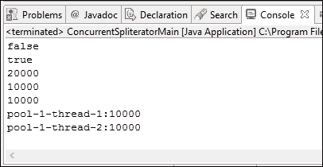
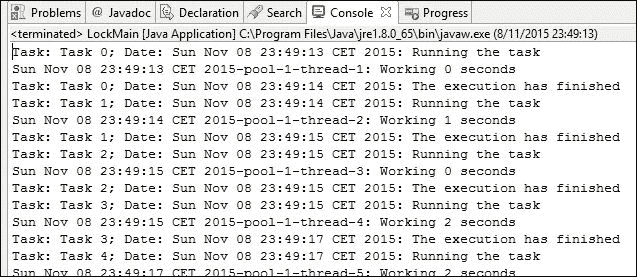
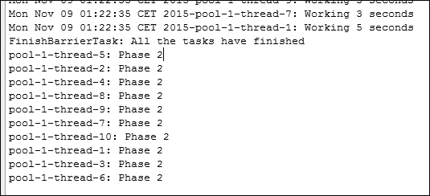
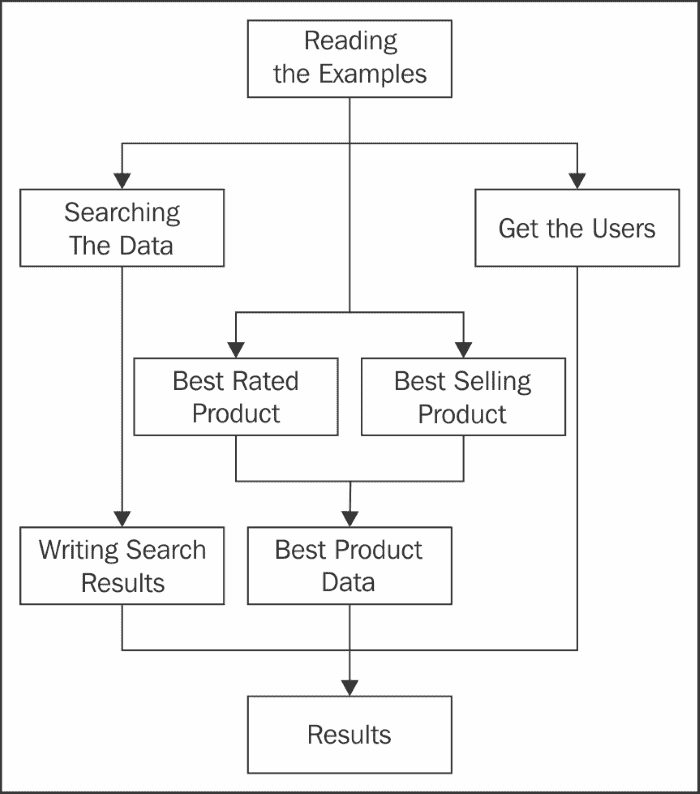

# 第九章：深入研究并发数据结构和同步实用程序

在每个计算机程序中最重要的元素之一是**数据结构**。数据结构允许我们根据需要以不同的方式存储我们的应用程序读取、转换和写入的数据。选择适当的数据结构是获得良好性能的关键点。糟糕的选择可能会显着降低算法的性能。Java 并发 API 包括一些设计用于在并发应用程序中使用的数据结构，而不会引起数据不一致或信息丢失。

并发应用程序中另一个关键点是**同步机制**。您可以使用它们通过创建临界区来实现互斥，也就是说，只能由一个线程执行的代码段。但您还可以使用同步机制来实现线程之间的依赖关系，例如，并发任务必须等待另一个任务的完成。Java 并发 API 包括基本的同步机制，如`synchronized`关键字和非常高级的实用程序，例如`CyclicBarrier`类或您在第五章中使用的`Phaser`类，*分阶段运行任务 - Phaser 类*。

在本章中，我们将涵盖以下主题：

+   并发数据结构

+   同步机制

# 并发数据结构

每个计算机程序都使用数据。它们从数据库、文件或其他来源获取数据，转换数据，然后将转换后的数据写入数据库、文件或其他目的地。程序使用存储在内存中的数据，并使用数据结构将数据存储在内存中。

当您实现并发应用程序时，您必须非常小心地使用数据结构。如果不同的线程可以修改唯一数据结构中存储的数据，您必须使用同步机制来保护该数据结构上的修改。如果不这样做，可能会出现数据竞争条件。您的应用程序有时可能会正常工作，但下一次可能会因为随机异常而崩溃，在无限循环中卡住，或者悄悄地产生不正确的结果。结果将取决于执行的顺序。

为了避免数据竞争条件，您可以：

+   使用非同步数据结构，并自行添加同步机制

+   使用 Java 并发 API 提供的数据结构，它在内部实现了同步机制，并经过优化，可用于并发应用程序

第二个选项是最推荐的。在本节的页面中，您将回顾最重要的并发数据结构，特别关注 Java 8 的新功能。

## 阻塞和非阻塞数据结构

Java 并发 API 提供了两种类型的并发数据结构：

+   **阻塞数据结构**：这种数据结构提供了在其中插入和删除数据的方法，当操作无法立即完成时（例如，如果您想取出一个元素而数据结构为空），发出调用的线程将被阻塞，直到操作可以完成

+   **非阻塞数据结构**：这种数据结构提供了在其中插入和删除数据的方法，当操作无法立即完成时，返回一个特殊值或抛出异常

有时，我们对阻塞数据结构有非阻塞等价物。例如，`ConcurrentLinkedDeque`类是一个非阻塞数据结构，而`LinkedBlockingDeque`是阻塞等价物。阻塞数据结构具有类似非阻塞数据结构的方法。例如，`Deque`接口定义了`pollFirst()`方法，如果双端队列为空，则不会阻塞并返回`null`。每个阻塞队列实现也实现了这个方法。

**Java 集合框架**（**JCF**）提供了一组可以在顺序编程中使用的不同数据结构。Java 并发 API 扩展了这些结构，提供了可以在并发应用程序中使用的其他结构。这包括：

+   **接口**：这扩展了 JCF 提供的接口，添加了一些可以在并发应用程序中使用的方法

+   **类**：这些类实现了前面的接口，提供了可以在应用程序中使用的实现

在以下部分，我们介绍了并发应用程序中可以使用的接口和类。

### 接口

首先，让我们描述并发数据结构实现的最重要的接口。

#### BlockingQueue

**队列**是一种线性数据结构，允许您在队列末尾插入元素并从开头获取元素。它是一种**先进先出**（**FIFO**）的数据结构，队列中引入的第一个元素是被处理的第一个元素。

JCF 定义了`Queue`接口，该接口定义了队列中要实现的基本操作。该接口提供了以下方法：

+   在队列末尾插入元素

+   从队列头部检索并删除元素

+   从队列头部检索但不删除元素

该接口定义了这些方法的两个版本，当方法可以完成时具有不同的行为（例如，如果要从空队列中检索元素）：

+   抛出异常的方法

+   返回特殊值的方法，例如`false`或`null`

下表包括了每个操作的方法名称：

| 操作 | 异常 | 特殊值 |
| --- | --- | --- |
| 插入 | `add()` | `offer()` |
| 检索和删除 | `remove()` | `poll()` |
| 检索但不删除 | `element()` | `peek()` |

`BlockingDeque`接口扩展了`Queue`接口，添加了在操作可以完成时阻塞调用线程的方法。这些方法包括：

| 操作 | 阻塞 |
| --- | --- |
| 插入 | `put()` |
| 检索和删除 | `take()` |
| 检索但不删除 | N/A |

#### BlockingDeque

**双端队列**是一种线性数据结构，类似于队列，但允许您从数据结构的两侧插入和删除元素。JCF 定义了扩展`Queue`接口的`Deque`接口。除了`Queue`接口提供的方法之外，它还提供了在两端插入、检索和删除以及在两端检索但不删除的方法：

| 操作 | 异常 | 特殊值 |
| --- | --- | --- |
| 插入 | `addFirst()`，`addLast()` | `offerFirst()`，`offerLast()` |
| 检索和删除 | `removeFirst()`，`removeLast()` | `pollFirst()`，`pollLast()` |
| 检索但不删除 | `getFirst()`，`getLast()` | `peekFirst()`，`peekLast()` |

`BlockingDeque`接口扩展了`Deque`接口，添加了在操作无法完成时阻塞调用线程的方法：

| 操作 | 阻塞 |
| --- | --- |
| 插入 | `putFirst()`，`putLast()` |
| 检索和删除 | `takeFirst()`，`takeLast()` |
| 检索但不删除 | N/A |

#### ConcurrentMap

**映射**（有时也称为**关联数组**）是一种数据结构，允许您存储（键，值）对。JCF 提供了`Map`接口，该接口定义了与映射一起使用的基本操作。这包括插入、检索和删除以及检索但不删除的方法：

+   `put()`: 将（键，值）对插入到映射中

+   `get()`: 返回与键关联的值

+   `remove()`: 移除与指定键关联的（键，值）对

+   `containsKey()`和`containsValue()`: 如果映射包含指定的键或值，则返回 true

这个接口在 Java 8 中已经修改，包括以下新方法。您将在本章后面学习如何使用这些方法：

+   `forEach()`: 这个方法对映射的所有元素执行给定的函数。

+   `compute()`, `computeIfAbsent()`和`computeIfPresent()`: 这些方法允许您指定计算与键关联的新值的函数。

+   `merge()`: 这个方法允许你指定将（键，值）对合并到现有的映射中。如果键不在映射中，它会直接插入。如果不是，执行指定的函数。

`ConcurrentMap`扩展了`Map`接口，为并发应用程序提供相同的方法。请注意，在 Java 8 中（不像 Java 7），`ConcurrentMap`接口没有向`Map`接口添加新方法。

#### TransferQueue

这个接口扩展了`BlockingQueue`接口，并添加了从生产者传输元素到消费者的方法，其中生产者可以等待直到消费者取走它的元素。这个接口添加的新方法是：

+   `transfer()`: 将一个元素传输给消费者，并等待（阻塞调用线程），直到元素被消费。

+   `tryTransfer()`: 如果有消费者在等待，就传输一个元素。如果没有，这个方法返回`false`值，并且不会将元素插入队列。

### Classes

Java 并发 API 提供了之前描述的接口的不同实现。其中一些不添加任何新特性，但其他一些添加了新的有趣功能。

#### LinkedBlockingQueue

这个类实现了`BlockingQueue`接口，提供了一个具有阻塞方法的队列，可以选择具有有限数量的元素。它还实现了`Queue`、`Collection`和`Iterable`接口。

#### ConcurrentLinkedQueue

这个类实现了`Queue`接口，提供了一个线程安全的无限队列。在内部，它使用非阻塞算法来保证在您的应用程序中不会出现数据竞争。

#### LinkedBlockingDeque

这个类实现了`BlockingDeque`接口，提供了一个具有阻塞方法的双端队列，可以选择具有有限数量的元素。它比`LinkedBlockingQueue`具有更多的功能，但可能有更多的开销，因此当不需要双端队列功能时应该使用`LinkedBlockingQueue`。

#### ConcurrentLinkedDeque

这个类实现了`Deque`接口，提供了一个线程安全的无限双端队列，允许您在队列的两端添加和删除元素。它比`ConcurrentLinkedQueue`具有更多的功能，但可能有更多的开销，就像`LinkedBlockingDeque`一样。

#### ArrayBlockingQueue

这个类实现了`BlockingQueue`接口，提供了一个基于数组的有限元素数量的阻塞队列实现。它还实现了`Queue`、`Collection`和`Iterable`接口。与非并发的基于数组的数据结构（`ArrayList`和`ArrayDeque`）不同，`ArrayBlockingQueue`在构造函数中分配一个固定大小的数组，并且不会调整大小。

#### DelayQueue

这个类实现了`BlockingDeque`接口，提供了一个具有阻塞方法和无限元素数量的队列实现。这个队列的元素必须实现`Delayed`接口，因此它们必须实现`getDelay()`方法。如果该方法返回负值或零值，延迟已经过期，元素可以从队列中取出。队列的头部是延迟值最负的元素。

#### LinkedTransferQueue

这个类提供了`TransferQueue`接口的实现。它提供了一个具有无限元素数量的阻塞队列，并且可以将它们用作生产者和消费者之间的通信通道，其中生产者可以等待消费者处理他们的元素。

#### PriorityBlockingQueue

这个类提供了`BlockingQueue`接口的实现，其中元素可以根据它们的自然顺序或在类的构造函数中指定的比较器进行轮询。这个队列的头部由元素的排序顺序确定。

#### ConcurrentHashMap

这个类提供了`ConcurrentMap`接口的实现。它提供了一个线程安全的哈希表。除了 Java 8 版本中添加到`Map`接口的方法之外，这个类还添加了其他方法：

+   `search()`, `searchEntries()`, `searchKeys()`, and `searchValues()`: 这些方法允许您在（键，值）对、键或值上应用搜索函数。搜索函数可以是 lambda 表达式，当搜索函数返回非空值时，方法结束。这就是方法执行的结果。

+   `reduce()`, `reduceEntries()`, `reduceKeys()`, 和 `reduceValues()`: 这些方法允许您应用`reduce()`操作来转换（键，值）对、键或条目，就像流中发生的那样（参见第八章，“使用并行流处理大型数据集 - Map 和 Collect 模型”了解有关`reduce()`方法的更多细节）。

已添加更多方法（`forEachValue`，`forEachKey`等），但这里不涉及它们。

## 使用新特性

在本节中，您将学习如何使用 Java 8 中引入的并发数据结构的新特性。

### ConcurrentHashMap 的第一个示例

在第八章中，您实现了一个应用程序，从 20,000 个亚马逊产品的数据集中进行搜索。我们从亚马逊产品共购买网络元数据中获取了这些信息，其中包括 548,552 个产品的标题、销售排名和类似产品的信息。您可以从[`snap.stanford.edu/data/amazon-meta.html`](https://snap.stanford.edu/data/amazon-meta.html)下载这个数据集。在那个示例中，您使用了一个名为`productsByBuyer`的`ConcurrentHashMap<String, List<ExtendedProduct>>`来存储用户购买的产品的信息。这个映射的键是用户的标识符，值是用户购买的产品的列表。您将使用该映射来学习如何使用`ConcurrentHashMap`类的新方法。

#### forEach()方法

这个方法允许您指定一个函数，该函数将在每个`ConcurrentHashMap`的（键，值）对上执行。这个方法有很多版本，但最基本的版本只有一个`BiConsumer`函数，可以表示为 lambda 表达式。例如，您可以使用这个方法来打印每个用户购买了多少产品的代码：

```java
    productsByBuyer.forEach( (id, list) -> System.out.println(id+": "+list.size()));
```

这个基本版本是通常的`Map`接口的一部分，并且总是按顺序执行。在这段代码中，我们使用了 lambda 表达式，其中`id`是元素的键，`list`是元素的值。

在另一个示例中，我们使用了`forEach()`方法来计算每个用户给出的平均评分。

```java
    productsByBuyer.forEach( (id, list) -> {
        double average=list.stream().mapToDouble(item -> item.getValue()).average().getAsDouble();
        System.out.println(id+": "+average);
    });
```

在这段代码中，我们还使用了 lambda 表达式，其中`id`是元素的键，`list`是其值。我们使用了应用于产品列表的流来计算平均评分。

此方法的其他版本如下：

+   `forEach(parallelismThreshold, action)`: 这是您在并发应用程序中必须使用的方法的版本。如果地图的元素多于第一个参数中指定的数量，则此方法将并行执行。

+   `forEachEntry(parallelismThreshold, action)`: 与之前相同，但在这种情况下，操作是`Consumer`接口的实现，它接收一个带有元素的键和值的`Map.Entry`对象。在这种情况下，您也可以使用 lambda 表达式。

+   `forEachKey(parallelismThreshold, action)`: 与之前相同，但在这种情况下，操作仅应用于`ConcurrentHashMap`的键。

+   `forEachValue(parallelismThreshold, action)`: 与之前相同，但在这种情况下，操作仅应用于`ConcurrentHashMap`的值。

当前实现使用通用的`ForkJoinPool`实例来执行并行任务。

#### search()方法

此方法将搜索函数应用于`ConcurrentHashMap`的所有元素。此搜索函数可以返回空值或非空值。`search()`方法将返回搜索函数返回的第一个非空值。此方法接收两个参数：

+   `parallelismThreshold`: 如果地图的元素多于此参数指定的数量，则此方法将并行执行。

+   `searchFunction`: 这是`BiFunction`接口的实现，可以表示为 lambda 表达式。此函数接收每个元素的键和值作为参数，并且如前所述，如果找到您要搜索的内容，则必须返回非空值，如果找不到，则必须返回空值。

例如，您可以使用此函数找到包含某个单词的第一本书：

```java
    ExtendedProduct firstProduct=productsByBuyer.search(100,
        (id, products) -> {
            for (ExtendedProduct product: products) {
                if (product.getTitle() .toLowerCase().contains("java")) {
                    return product;
                }
            }
        return null;
    });
    if (firstProduct!=null) {
        System.out.println(firstProduct.getBuyer()+":"+ firstProduct.getTitle());
    }
```

在这种情况下，我们使用 100 作为`parallelismThreshold`，并使用 lambda 表达式来实现搜索函数。在此函数中，对于每个元素，我们处理列表的所有产品。如果我们找到包含单词`java`的产品，我们返回该产品。这是`search()`方法返回的值。最后，我们在控制台中写入产品的买家和标题。

此方法还有其他版本：

+   `searchEntries(parallelismThreshold, searchFunction)`: 在这种情况下，搜索函数是`Function`接口的实现，它接收一个`Map.Entry`对象作为参数

+   `searchKeys(parallelismThreshold, searchFunction)`: 在这种情况下，搜索函数仅应用于`ConcurrentHashMap`的键

+   `searchValues(parallelismThreshold, searchFunction)`: 在这种情况下，搜索函数仅应用于`ConcurrentHashMap`的值

#### reduce()方法

此方法类似于`Stream`框架提供的`reduce()`方法，但在这种情况下，您直接使用`ConcurrentHashMap`的元素。此方法接收三个参数：

+   `parallelismThreshold`: 如果`ConcurrentHashMap`的元素多于此参数中指定的数量，则此方法将并行执行。

+   `transformer`: 此参数是`BiFunction`接口的实现，可以表示为 lambda 函数。它接收一个键和一个值作为参数，并返回这些元素的转换。

+   `reducer`: 此参数是`BiFunction`接口的实现，也可以表示为 lambda 函数。它接收 transformer 函数返回的两个对象作为参数。此函数的目标是将这两个对象分组为一个对象。

作为这种方法的一个例子，我们将获得一个产品列表，其中包含值为`1`的评论（最差的值）。我们使用了两个辅助变量。第一个是`transformer`。它是一个`BiFunction`接口，我们将用作`reduce()`方法的`transformer`元素：

```java
BiFunction<String, List<ExtendedProduct>, List<ExtendedProduct>> transformer = (key, value) -> value.stream().filter(product -> product.getValue() == 1).collect(Collectors.toList());
```

此函数将接收键，即用户的`id`，以及用户购买的产品的`ExtendedProduct`对象列表。我们处理列表中的所有产品，并返回评分为一的产品。

第二个变量是 reducer `BinaryOperator`。我们将其用作`reduce()`方法的 reducer 函数：

```java
BinaryOperator<List<ExtendedProduct>> reducer = (list1, list2) ->{
        list1.addAll(list2);
        return list1;
};
```

reduce 接收两个`ExtendedProduct`列表，并使用`addAll()`方法将它们连接成一个单一的列表。

现在，我们只需实现对`reduce()`方法的调用：

```java
    List<ExtendedProduct> badReviews=productsByBuyer.reduce(10, transformer, reducer);
    badReviews.forEach(product -> {
        System.out.println(product.getTitle()+":"+ product.getBuyer()+":"+product.getValue());
    });
```

`reduce()`方法还有其他版本：

+   `reduceEntries()`，`reduceEntriesToDouble()`，`reduceEntriesToInt()`和`reduceEntriesToLong()`：在这种情况下，转换器和 reducer 函数作用于`Map.Entry`对象。最后三个版本分别返回`double`，`int`和`long`值。

+   `reduceKeys()`，`reduceKeysToDouble()`和`reduceKeysToInt()`，`reduceKeysToLong()`：在这种情况下，转换器和 reducer 函数作用于映射的键。最后三个版本分别返回`double`，`int`和`long`值。

+   `reduceToInt()`，`reduceToDouble()`和`reduceToLong()`：在这种情况下，转换器函数作用于键和值，reducer 方法分别作用于`int`，`double`或`long`数。这些方法返回`int`，`double`和`long`值。

+   `reduceValues()`，`reduceValuesToDouble()`，`reduceValuesToInt()`和`reduceValuesToLong()`：在这种情况下，转换器和 reducer 函数作用于映射的值。最后三个版本分别返回`double`，`int`和`long`值。

#### compute()方法

此方法（在`Map`接口中定义）接收元素的键和可以表示为 lambda 表达式的`BiFunction`接口的实现作为参数。如果键存在于`ConcurrentHashMap`中，则此函数将接收元素的键和值，否则为`null`。该方法将用函数返回的值替换与键关联的值，如果不存在，则将它们插入`ConcurrentHashMap`，或者如果对于先前存在的项目返回`null`，则删除该项目。请注意，在`BiFunction`执行期间，一个或多个映射条目可能会被锁定。因此，您的`BiFunction`不应该工作太长时间，也不应该尝试更新同一映射中的任何其他条目。否则可能会发生死锁。

例如，我们可以使用此方法与 Java 8 中引入的新原子变量`LongAdder`一起计算与每个产品关联的不良评论数量。我们创建一个名为 counter 的新`ConcurrentHashMap`。键将是产品的标题，值将是`LongAdder`类的对象，用于计算每个产品有多少不良评论。

```java
    ConcurrentHashMap<String, LongAdder> counter=new ConcurrentHashMap<>();
```

我们处理在上一节中计算的`badReviews` `ConcurrentLinkedDeque`的所有元素，并使用`compute()`方法创建和更新与每个产品关联的`LongAdder`。

```java
    badReviews.forEach(product -> {
        counter.computeIfAbsent(product.getTitle(), title -> new LongAdder()).increment();
    });
    counter.forEach((title, count) -> {
        System.out.println(title+":"+count);
    });
```

最后，我们将结果写入控制台。

### 另一个使用 ConcurrentHashMap 的例子

`ConcurrentHashMap`类中添加的另一种方法并在 Map 接口中定义。这是`merge()`方法，允许您将（键，值）对合并到映射中。如果键不存在于`ConcurrentHashMap`中，则直接插入。如果键存在，则必须定义从旧值和新值中关联的键的新值。此方法接收三个参数：

+   我们要合并的键。

+   我们要合并的值。

+   可以表示为 lambda 表达式的`BiFunction`的实现。此函数接收旧值和与键关联的新值作为参数。该方法将用此函数返回的值与键关联。`BiFunction`在映射的部分锁定下执行，因此可以保证它不会同时为相同的键并发执行。

例如，我们已经将上一节中使用的亚马逊的 20,000 个产品按评论年份分成文件。对于每一年，我们加载`ConcurrentHashMap`，其中产品是键，评论列表是值。因此，我们可以使用以下代码加载 1995 年和 1996 年的评论：

```java
        Path path=Paths.get("data\\amazon\\1995.txt");
        ConcurrentHashMap<BasicProduct, ConcurrentLinkedDeque<BasicReview>> products1995=BasicProductLoader.load(path);
        showData(products1995);

        path=Paths.get("data\\amazon\\1996.txt");
        ConcurrentHashMap<BasicProduct, ConcurrentLinkedDeque<BasicReview>> products1996=BasicProductLoader.load(path);
        System.out.println(products1996.size());
        showData(products1996);
```

如果我们想将`ConcurrentHashMap`的两个版本合并成一个，可以使用以下代码：

```java
        products1996.forEach(10,(product, reviews) -> {
            products1995.merge(product, reviews, (reviews1, reviews2) -> {
                System.out.println("Merge for: "+product.getAsin());
                reviews1.addAll(reviews2);
                return reviews1;
            });
        });
```

我们处理了 1996 年的`ConcurrentHashMap`的所有元素，并且对于每个（键，值）对，我们在 1995 年的`ConcurrentHashMap`上调用`merge()`方法。`merge`函数将接收两个评论列表，因此我们只需将它们连接成一个。

### 使用 ConcurrentLinkedDeque 类的示例

`Collection`接口在 Java 8 中还包括了新的方法。大多数并发数据结构都实现了这个接口，因此我们可以在它们中使用这些新特性。其中两个是第七章和第八章中使用的`stream()`和`parallelStream()`方法。让我们看看如何使用`ConcurrentLinkedDeque`和我们在前面章节中使用的 20,000 个产品。

#### removeIf() 方法

此方法在`Collection`接口中有一个默认实现，不是并发的，并且没有被`ConcurrentLinkedDeque`类覆盖。此方法接收`Predicate`接口的实现作为参数，该接口将接收`Collection`的元素作为参数，并应返回`true`或`false`值。该方法将处理`Collection`的所有元素，并将删除那些使用谓词获得`true`值的元素。

例如，如果您想删除所有销售排名高于 1,000 的产品，可以使用以下代码：

```java
    System.out.println("Products: "+productList.size());
    productList.removeIf(product -> product.getSalesrank() > 1000);
    System.out.println("Products; "+productList.size());
    productList.forEach(product -> {
        System.out.println(product.getTitle()+": "+product.getSalesrank());
    });
```

#### spliterator() 方法

此方法返回`Spliterator`接口的实现。**spliterator**定义了`Stream` API 可以使用的数据源。您很少需要直接使用 spliterator，但有时您可能希望创建自己的 spliterator 来为流生成自定义源（例如，如果您实现自己的数据结构）。如果您有自己的 spliterator 实现，可以使用`StreamSupport.stream(mySpliterator, isParallel)`在其上创建流。这里，`isParallel`是一个布尔值，确定创建的流是否是并行的。分割器类似于迭代器，您可以使用它来遍历集合中的所有元素，但可以将它们分割以以并发方式进行遍历。

分割器有八种不同的特征来定义其行为：

+   `CONCURRENT`: 分割器源可以安全并发修改

+   `DISTINCT`: 分割器返回的所有元素都是不同的

+   `IMMUTABLE`: 分割器源不可修改

+   `NONNULL`: 分割器永远不会返回`null`值

+   `ORDERED`: 分割器返回的元素是有序的（这意味着它们的顺序很重要）

+   `SIZED`: 分割器能够使用`estimateSize()`方法返回确切数量的元素

+   `SORTED`: 分割器源已排序

+   `SUBSIZED`: 如果使用`trySplit()`方法来分割这个分割器，生成的分割器将是`SIZED`和`SUBSIZED`

此接口最有用的方法是：

+   `estimatedSize()`: 此方法将为您提供分割器中元素数量的估计。

+   `forEachRemaining()`: 这个方法允许您对尚未被处理的 spliterator 的元素应用`Consumer`接口的实现，可以用 lambda 函数表示。

+   `tryAdvance()`: 这个方法允许您对 spliterator 要处理的下一个元素应用`Consumer`接口的实现，可以用 lambda 函数表示，如果有的话。

+   `trySplit()`: 这个方法尝试将 spliterator 分成两部分。调用者 spliterator 将处理一些元素，返回的 spliterator 将处理其他元素。如果 spliterator 是`ORDERED`，返回的 spliterator 必须处理元素的严格前缀，调用必须处理严格后缀。

+   `hasCharacteristics()`: 这个方法允许您检查 spliterator 的属性。

让我们看一个使用`ArrayList`数据结构的例子，有 20,000 个产品。

首先，我们需要一个辅助任务，它将处理一组产品，将它们的标题转换为小写。这个任务将有一个`Spliterator`作为属性：

```java
public class SpliteratorTask implements Runnable {

    private Spliterator<Product> spliterator;

    public SpliteratorTask (Spliterator<Product> spliterator) {
        this.spliterator=spliterator;
    }

    @Override
    public void run() {
        int counter=0;
        while (spliterator.tryAdvance(product -> {
            product.setTitle(product.getTitle().toLowerCase());
        })) {
            counter++;
        };
        System.out.println(Thread.currentThread().getName() +":"+counter);
    }

}
```

正如您所看到的，这个任务在执行完毕时会写入处理的产品数量。

在主方法中，一旦我们用 20,000 个产品加载了`ConcurrentLinkedQueue`，我们就可以获得 spliterator，检查它的一些属性，并查看它的估计大小。

```java
    Spliterator<Product> split1=productList.spliterator();
    System.out.println(split1.hasCharacteristics (Spliterator.CONCURRENT));
    System.out.println(split1.hasCharacteristics (Spliterator.SUBSIZED));
    System.out.println(split1.estimateSize());
```

然后，我们可以使用`trySplit()`方法分割 spliterator，并查看两个 spliterator 的大小：

```java
    Spliterator<Product> split2=split1.trySplit();
    System.out.println(split1.estimateSize());
    System.out.println(split2.estimateSize());
```

最后，我们可以在执行器中执行两个任务，一个用于 spliterator，以查看每个 spliterator 是否真的处理了预期数量的元素。

```java
    ThreadPoolExecutor executor=(ThreadPoolExecutor) Executors.newCachedThreadPool();
    executor.execute(new SpliteratorTask(split1));
    executor.execute(new SpliteratorTask(split2));
```

在下面的截图中，您可以看到这个例子的执行结果：



您可以看到，在分割 spliterator 之前，`estimatedSize()`方法返回 20,000 个元素。在`trySplit()`方法执行后，两个 spliterator 都有 10,000 个元素。这些是每个任务处理的元素。

## 原子变量

Java 1.5 引入了原子变量，以提供对`integer`、`long`、`boolean`、`reference`和`Array`对象的原子操作。它们提供了一些方法来增加、减少、建立值、返回值，或者在当前值等于预定义值时建立值。

在 Java 8 中，新增了四个新类。它们是`DoubleAccumulator`、`DoubleAdder`、`LongAccumulator`和`LongAdder`。在前面的部分，我们使用了`LongAdder`类来计算产品的差评数量。这个类提供了类似于`AtomicLong`的功能，但是当您频繁地从不同线程更新累积和并且只在操作结束时请求结果时，它的性能更好。`DoubleAdder`函数与之相等，但是使用双精度值。这两个类的主要目标是拥有一个可以由不同线程一致更新的计数器。这些类的最重要的方法是：

+   `add()`: 用指定的值增加计数器的值

+   `increment()`: 等同于`add(1)`

+   `decrement()`: 等同于`add(-1)`

+   `sum()`: 这个方法返回计数器的当前值

请注意，`DoubleAdder`类没有`increment()`和`decrement()`方法。

`LongAccumulator`和`DoubleAccumulator`类是类似的，但它们有一个非常重要的区别。它们有一个构造函数，您可以在其中指定两个参数：

+   内部计数器的身份值

+   一个将新值累积到累加器中的函数

请注意，函数不应依赖于累积的顺序。在这种情况下，最重要的方法是：

+   `accumulate()`: 这个方法接收一个`long`值作为参数。它将函数应用于当前值和参数来增加或减少计数器的值。

+   `get()`: 返回计数器的当前值。

例如，以下代码将在所有执行中在控制台中写入 362,880：

```java
            LongAccumulator accumulator=new LongAccumulator((x,y) -> x*y, 1);

        IntStream.range(1, 10).parallel().forEach(x -> accumulator.accumulate(x));

        System.out.println(accumulator.get());
```

我们在累加器内部使用可交换操作，因此无论输入顺序如何，结果都是相同的。

# 同步机制

任务的同步是协调这些任务以获得期望的结果。在并发应用程序中，我们可以有两种同步方式：

+   **进程同步**：当我们想要控制任务的执行顺序时，我们使用这种同步。例如，一个任务必须在开始执行之前等待其他任务的完成。

+   **数据同步**：当两个或多个任务访问相同的内存对象时，我们使用这种同步。在这种情况下，您必须保护对该对象的写操作的访问。如果不这样做，您可能会遇到数据竞争条件，程序的最终结果会因每次执行而异。

Java 并发 API 提供了允许您实现这两种类型同步的机制。Java 语言提供的最基本的同步机制是`synchronized`关键字。这个关键字可以应用于一个方法或一段代码。在第一种情况下，只有一个线程可以同时执行该方法。在第二种情况下，您必须指定一个对象的引用。在这种情况下，只有一个由对象保护的代码块可以同时执行。

Java 还提供其他同步机制：

+   `Lock` 接口及其实现类：这种机制允许您实现一个临界区，以确保只有一个线程将执行该代码块。

+   `Semaphore` 类实现了由*Edsger Dijkstra*引入的著名的**信号量**同步机制。

+   `CountDownLatch` 允许您实现一个情况，其中一个或多个线程等待其他线程的完成。

+   `CyclicBarrier` 允许您在一个公共点同步不同的任务。

+   `Phaser` 允许您实现分阶段的并发任务。我们在第五章中对这种机制进行了详细描述，*分阶段运行任务 - Phaser 类*。

+   `Exchanger` 允许您在两个任务之间实现数据交换点。

+   `CompletableFuture`，Java 8 的一个新特性，扩展了执行器任务的`Future`机制，以异步方式生成任务的结果。您可以指定在生成结果后要执行的任务，因此可以控制任务的执行顺序。

在接下来的部分中，我们将向您展示如何使用这些机制，特别关注 Java 8 版本中引入的`CompletableFuture`机制。

## CommonTask 类

我们实现了一个名为`CommonTask`类的类。这个类将使调用线程在`0`和`10`秒之间的随机时间内休眠。这是它的源代码：

```java
public class CommonTask {

    public static void doTask() {
        long duration = ThreadLocalRandom.current().nextLong(10);
        System.out.printf("%s-%s: Working %d seconds\n",new Date(),Thread.currentThread().getName(),duration);
        try {
            TimeUnit.SECONDS.sleep(duration);
        } catch (InterruptedException e) {
            e.printStackTrace();
        }
    }

}
```

在接下来的部分中，我们将使用这个类来模拟其执行时间。

## Lock 接口

最基本的同步机制之一是`Lock`接口及其实现类。基本实现类是`ReentrantLock`类。您可以使用这个类来轻松实现临界区。例如，以下任务在其代码的第一行使用`lock()`方法获取锁，并在最后一行使用`unlock()`方法释放锁。在同一时间只有一个任务可以执行这两个语句之间的代码。

```java
public class LockTask implements Runnable {

    private static ReentrantLock lock = new ReentrantLock();
    private String name;

    public LockTask(String name) {
        this.name=name;
    }

    @Override
    public void run() {
        try {
            lock.lock();
            System.out.println("Task: " + name + "; Date: " + new Date() + ": Running the task");
            CommonTask.doTask();
            System.out.println("Task: " + name + "; Date: " + new Date() + ": The execution has finished");
        } finally {
            lock.unlock();
        }

    }
}
```

例如，您可以通过以下代码在执行器中执行十个任务来检查这一点：

```java
public class LockMain {

    public static void main(String[] args) {
        ThreadPoolExecutor executor=(ThreadPoolExecutor) Executors.newCachedThreadPool();
        for (int i=0; i<10; i++) {
            executor.execute(new LockTask("Task "+i));
        }
        executor.shutdown();
        try {
            executor.awaitTermination(1, TimeUnit.DAYS);
        } catch (InterruptedException e) {
            e.printStackTrace();
        }
    }
}
```

在下面的图片中，您可以看到这个示例的执行结果。您可以看到每次只有一个任务被执行。



## Semaphore 类

信号量机制是由 Edsger Dijkstra 于 1962 年引入的，用于控制对一个或多个共享资源的访问。这个机制基于一个内部计数器和两个名为`wait()`和`signal()`的方法。当一个线程调用`wait()`方法时，如果内部计数器的值大于 0，那么信号量会减少内部计数器，并且线程获得对共享资源的访问。如果内部计数器的值为 0，线程将被阻塞，直到某个线程调用`signal()`方法。当一个线程调用`signal()`方法时，信号量会查看是否有一些线程处于`waiting`状态（它们已经调用了`wait()`方法）。如果没有线程在等待，它会增加内部计数器。如果有线程在等待信号量，它会选择其中一个线程，该线程将返回到`wait()`方法并访问共享资源。其他等待的线程将继续等待它们的轮到。

在 Java 中，信号量是在`Semaphore`类中实现的。`wait()`方法被称为`acquire()`，`signal()`方法被称为`release()`。例如，在这个例子中，我们使用了一个`Semaphore`类来保护它的代码：

```java
public class SemaphoreTask implements Runnable{
    private Semaphore semaphore;
    public SemaphoreTask(Semaphore semaphore) {
        this.semaphore=semaphore;
    }
    @Override
    public void run() {
        try {
            semaphore.acquire();
            CommonTask.doTask();
        } catch (InterruptedException e) {
            e.printStackTrace();
        } finally {
            semaphore.release();
        }
    }
}
```

在主程序中，我们执行了共享一个`Semaphore`类的十个任务，该类初始化了两个共享资源，因此我们将同时运行两个任务。

```java
    public static void main(String[] args) {

        Semaphore semaphore=new Semaphore(2);
        ThreadPoolExecutor executor=(ThreadPoolExecutor) Executors.newCachedThreadPool();

        for (int i=0; i<10; i++) {
            executor.execute(new SemaphoreTask(semaphore));
        }

        executor.shutdown();
        try {
            executor.awaitTermination(1, TimeUnit.DAYS);
        } catch (InterruptedException e) {
            e.printStackTrace();
        }
    }
```

以下截图显示了这个例子执行的结果。你可以看到两个任务同时在运行：


## CountDownLatch 类

这个类提供了一种等待一个或多个并发任务完成的机制。它有一个内部计数器，必须初始化为我们要等待的任务数量。然后，`await()`方法使调用线程休眠，直到内部计数器到达零，`countDown()`方法减少内部计数器。

例如，在这个任务中，我们使用`countDown()`方法来减少`CountDownLatch`对象的内部计数器，它在构造函数中接收一个参数。

```java
public class CountDownTask implements Runnable {

    private CountDownLatch countDownLatch;

    public CountDownTask(CountDownLatch countDownLatch) {
        this.countDownLatch=countDownLatch;
    }

    @Override
    public void run() {
        CommonTask.doTask();
        countDownLatch.countDown();

    }
}
```

然后，在`main()`方法中，我们在执行器中执行任务，并使用`CountDownLatch`的`await()`方法等待它们的完成。该对象被初始化为我们要等待的任务数量。

```java
    public static void main(String[] args) {

        CountDownLatch countDownLatch=new CountDownLatch(10);

        ThreadPoolExecutor executor=(ThreadPoolExecutor) Executors.newCachedThreadPool();

        System.out.println("Main: Launching tasks");
        for (int i=0; i<10; i++) {
            executor.execute(new CountDownTask(countDownLatch));
        }

        try {
            countDownLatch.await();
        } catch (InterruptedException e) {
            e.printStackTrace();
        }
        System.out.

        executor.shutdown();
    }
```

以下截图显示了这个例子执行的结果：


## CyclicBarrier 类

这个类允许你在一个共同点同步一些任务。所有任务都将在那个点等待，直到所有任务都到达。在内部，它还管理一个内部计数器，记录还没有到达那个点的任务。当一个任务到达确定的点时，它必须执行`await()`方法等待其余的任务。当所有任务都到达时，`CyclicBarrier`对象唤醒它们，使它们继续执行。

这个类允许你在所有参与方到达时执行另一个任务。要配置这个，你必须在对象的构造函数中指定一个可运行的对象。

例如，我们实现了以下的 Runnable，它使用了一个`CyclicBarrier`对象来等待其他任务：

```java
public class BarrierTask implements Runnable {

    private CyclicBarrier barrier;

    public BarrierTask(CyclicBarrier barrier) {
        this.barrier=barrier;
    }

    @Override
    public void run() {
        System.out.println(Thread.currentThread().getName()+": Phase 1");
        CommonTask.doTask();
        try {
            barrier.await();
        } catch (InterruptedException e) {
            e.printStackTrace();
        } catch (BrokenBarrierException e) {
            e.printStackTrace();
        }
        System.out.println(Thread.currentThread().getName()+": Phase 2");

    }
}
```

我们还实现了另一个`Runnable`对象，当所有任务都执行了`await()`方法时，它将被`CyclicBarrier`执行。

```java
public class FinishBarrierTask implements Runnable {

    @Override
    public void run() {
        System.out.println("FinishBarrierTask: All the tasks have finished");
    }
}
```

最后，在`main()`方法中，我们在执行器中执行了十个任务。你可以看到`CyclicBarrier`是如何初始化的，它与我们想要同步的任务数量以及`FinishBarrierTask`对象一起：

```java
    public static void main(String[] args) {
        CyclicBarrier barrier=new CyclicBarrier(10,new FinishBarrierTask());

        ThreadPoolExecutor executor=(ThreadPoolExecutor) Executors.newCachedThreadPool();

        for (int i=0; i<10; i++) {
            executor.execute(new BarrierTask(barrier));
        }

        executor.shutdown();

        try {
            executor.awaitTermination(1, TimeUnit.DAYS);
        } catch (InterruptedException e) {
             e.printStackTrace();
        }
    }
```

以下截图显示了这个例子执行的结果：



你可以看到当所有任务都到达调用`await()`方法的点时，`FinishBarrierTask`被执行，然后所有任务继续执行。

## CompletableFuture 类

这是 Java 8 并发 API 中引入的一种新的同步机制。它扩展了`Future`机制，赋予它更多的功能和灵活性。它允许您实现一个事件驱动模型，链接任务，只有在其他任务完成时才会执行。与`Future`接口一样，`CompletableFuture`必须使用操作返回的结果类型进行参数化。与`Future`对象一样，`CompletableFuture`类表示异步计算的结果，但`CompletableFuture`的结果可以由任何线程建立。它具有`complete()`方法，在计算正常结束时建立结果，以及`completeExceptionally()`方法，在计算异常结束时建立结果。如果两个或更多线程在同一个`CompletableFuture`上调用`complete()`或`completeExceptionally()`方法，只有第一次调用会生效。

首先，您可以使用其构造函数创建`CompletableFuture`。在这种情况下，您必须使用`complete()`方法来建立任务的结果，就像我们之前解释的那样。但您也可以使用`runAsync()`或`supplyAsync()`方法来创建一个。`runAsync()`方法执行一个`Runnable`对象并返回`CompletableFuture<Void>`，因此计算不会返回任何结果。`supplyAsync()`方法执行一个`Supplier`接口的实现，该接口参数化了此计算将返回的类型。`Supplier`接口提供`get()`方法。在该方法中，我们必须包含任务的代码并返回其生成的结果。在这种情况下，`CompletableFuture`的结果将是`Supplier`接口的结果。

这个类提供了许多方法，允许您组织任务的执行顺序，实现一个事件驱动模型，其中一个任务直到前一个任务完成后才开始执行。以下是其中一些方法：

+   `thenApplyAsync()`: 这个方法接收`Function`接口的实现作为参数，可以表示为 lambda 表达式。当调用的`CompletableFuture`完成时，将执行此函数。此方法将返回`CompletableFuture`以获取`Function`的结果。

+   `thenComposeAsync()`: 这个方法类似于`thenApplyAsync`，但在提供的函数也返回`CompletableFuture`时很有用。

+   `thenAcceptAsync()`: 这个方法类似于前一个方法，但参数是`Consumer`接口的实现，也可以指定为 lambda 表达式；在这种情况下，计算不会返回结果。

+   `thenRunAsync()`: 这个方法与前一个方法相同，但在这种情况下，它接收一个`Runnable`对象作为参数。

+   `thenCombineAsync()`: 这个方法接收两个参数。第一个是另一个`CompletableFuture`实例。另一个是`BiFunction`接口的实现，可以指定为 lambda 函数。当两个`CompletableFuture`（调用方和参数）都完成时，将执行此`BiFunction`。此方法将返回`CompletableFuture`以获取`BiFunction`的结果。

+   `runAfterBothAsync()`: 这个方法接收两个参数。第一个是另一个`CompletableFuture`。另一个是`Runnable`接口的实现，当两个`CompletableFuture`（调用方和参数）都完成时将执行。

+   `runAfterEitherAsync()`: 这个方法等同于前一个方法，但当`CompletableFuture`对象之一完成时，将执行`Runnable`任务。

+   `allOf()`: 这个方法接收一个`CompletableFuture`对象的可变列表作为参数。它将返回一个`CompletableFuture<Void>`对象，当所有`CompletableFuture`对象都完成时，它将返回其结果。

+   `anyOf()`: 这个方法等同于前一个方法，但是返回的`CompletableFuture`在其中一个`CompletableFuture`完成时返回其结果。

最后，如果你想要获取`CompletableFuture`返回的结果，你可以使用`get()`或`join()`方法。这两种方法都会阻塞调用线程，直到`CompletableFuture`完成并返回其结果。这两种方法之间的主要区别在于，`get()`会抛出`ExecutionException`，这是一个受检异常，而`join()`会抛出`RuntimeException`（这是一个未检查的异常）。因此，在不抛出异常的 lambda 表达式（如`Supplier`、`Consumer`或`Runnable`）中使用`join()`更容易。

前面解释的大部分方法都有`Async`后缀。这意味着这些方法将使用`ForkJoinPool.commonPool`实例以并发方式执行。那些没有`Async`后缀版本的方法将以串行方式执行（也就是说，在执行`CompletableFuture`的同一个线程中），而带有`Async`后缀和一个执行器实例作为额外参数。在这种情况下，`CompletableFuture`将在传递的执行器中异步执行。

### 使用 CompletableFuture 类

在这个例子中，您将学习如何使用`CompletableFuture`类以并发方式实现一些异步任务的执行。我们将使用亚马逊的 2 万个产品集合来实现以下任务树：



首先，我们将使用这些例子。然后，我们将执行四个并发任务。第一个任务将搜索产品。当搜索完成时，我们将把结果写入文件。第二个任务将获取评分最高的产品。第三个任务将获取销量最高的产品。当这两个任务都完成时，我们将使用另一个任务来连接它们的信息。最后，第四个任务将获取购买了产品的用户列表。`main()`程序将等待所有任务的完成，然后写入结果。

让我们看看实现的细节。

#### 辅助任务

在这个例子中，我们将使用一些辅助任务。第一个是`LoadTask`，它将从磁盘加载产品信息，并返回一个`Product`对象的列表。

```java
public class LoadTask implements Supplier<List<Product>> {

    private Path path;

    public LoadTask (Path path) {
        this.path=path;
    }
    @Override
    public List<Product> get() {
        List<Product> productList=null;
        try {
            productList = Files.walk(path, FileVisitOption.FOLLOW_LINKS).parallel()
                    .filter(f -> f.toString().endsWith(".txt")) .map(ProductLoader::load).collect (Collectors.toList());
        } catch (IOException e) {
            e.printStackTrace();
        }

        return productList;
    }
}
```

它实现了`Supplier`接口以作为`CompletableFuture`执行。在内部，它使用流来处理和解析所有文件，获取产品列表。

第二个任务是`SearchTask`，它将在`Product`对象列表中实现搜索，查找标题中包含某个词的产品。这个任务是`Function`接口的实现。

```java
public class SearchTask implements Function<List<Product>, List<Product>> {

    private String query;

    public SearchTask(String query) {
        this.query=query;
    }

    @Override
    public List<Product> apply(List<Product> products) {
        System.out.println(new Date()+": CompletableTask: start");
        List<Product> ret = products.stream()
                .filter(product -> product.getTitle() .toLowerCase().contains(query))
                .collect(Collectors.toList());
        System.out.println(new Date()+": CompletableTask: end: "+ret.size());
        return ret;
    }

}
```

它接收包含所有产品信息的`List<Product>`，并返回符合条件的产品的`List<Product>`。在内部，它在输入列表上创建流，对其进行过滤，并将结果收集到另一个列表中。

最后，`WriteTask`将把搜索任务中获取的产品写入一个`File`。在我们的例子中，我们生成了一个 HTML 文件，但是可以随意选择其他格式来写入这些信息。这个任务实现了`Consumer`接口，所以它的代码应该类似于下面这样：

```java
public class WriteTask implements Consumer<List<Product>> {

    @Override
    public void accept(List<Product> products) {
        // implementation is omitted
    }
}
```

#### main()方法

我们在`main()`方法中组织了任务的执行。首先，我们使用`CompletableFuture`类的`supplyAsync()`方法执行`LoadTask`。

```java
public class CompletableMain {

    public static void main(String[] args) {
        Path file = Paths.get("data","category");

        System.out.println(new Date() + ": Main: Loading products");
        LoadTask loadTask = new LoadTask(file);
        CompletableFuture<List<Product>> loadFuture = CompletableFuture
                .supplyAsync(loadTask);
```

然后，使用结果的`CompletableFuture`，我们使用`thenApplyAsync()`在加载任务完成后执行搜索任务。

```java
        System.out.println(new Date() + ": Main: Then apply for search");

        CompletableFuture<List<Product>> completableSearch = loadFuture
                .thenApplyAsync(new SearchTask("love"));
```

一旦搜索任务完成，我们希望将执行结果写入文件。由于这个任务不会返回结果，我们使用了`thenAcceptAsync()`方法：

```java
        CompletableFuture<Void> completableWrite = completableSearch
                .thenAcceptAsync(new WriteTask());

        completableWrite.exceptionally(ex -> {
            System.out.println(new Date() + ": Main: Exception "
                    + ex.getMessage());
            return null;
        });
```

我们使用了 exceptionally()方法来指定当写入任务抛出异常时我们想要做什么。

然后，我们在`completableFuture`对象上使用`thenApplyAsync()`方法执行任务，以获取购买产品的用户列表。我们将此任务指定为 lambda 表达式。请注意，此任务将与搜索任务并行执行。

```java
        System.out.println(new Date() + ": Main: Then apply for users");

        CompletableFuture<List<String>> completableUsers = loadFuture
                .thenApplyAsync(resultList -> {

                    System.out.println(new Date()
                            + ": Main: Completable users: start");
                                        List<String> users = resultList.stream()
                .flatMap(p -> p.getReviews().stream())
                .map(review -> review.getUser())
                .distinct()
                .collect(Collectors.toList());
                    System.out.println(new Date()
                            + ": Main: Completable users: end");

                    return users;
                });
```

与这些任务并行进行的是，我们还使用`thenApplyAsync()`方法执行任务，以找到最受欢迎的产品和最畅销的产品。我们也使用 lambda 表达式定义了这些任务。

```java
        System.out.println(new Date()
                + ": Main: Then apply for best rated product....");

        CompletableFuture<Product> completableProduct = loadFuture
                .thenApplyAsync(resultList -> {
                    Product maxProduct = null;
                    double maxScore = 0.0;

                    System.out.println(new Date()
                            + ": Main: Completable product: start");
                    for (Product product : resultList) {
                        if (!product.getReviews().isEmpty()) {
                            double score = product.getReviews().stream()
                                    .mapToDouble(review -> review.getValue())
                                    .average().getAsDouble();
                            if (score > maxScore) {
                                maxProduct = product;
                                maxScore = score;
                            }
                        }
                    }
                    System.out.println(new Date()
                            + ": Main: Completable product: end");
                    return maxProduct;
                });

        System.out.println(new Date()
                + ": Main: Then apply for best selling product....");
        CompletableFuture<Product> completableBestSellingProduct = loadFuture
                .thenApplyAsync(resultList -> {
                    System.out.println(new Date() + ": Main: Completable best selling: start");
                  Product bestProduct = resultList
                .stream()
                .min(Comparator.comparingLong (Product::getSalesrank))
                .orElse(null);
                    System.out.println(new Date()
                            + ": Main: Completable best selling: end");
                    return bestProduct;

                });
```

正如我们之前提到的，我们希望连接最后两个任务的结果。我们可以使用`thenCombineAsync()`方法来指定一个任务，在两个任务都完成后执行。

```java
        CompletableFuture<String> completableProductResult = completableBestSellingProduct
        .thenCombineAsync(
             completableProduct, (bestSellingProduct, bestRatedProduct) -> {
        System.out.println(new Date() + ": Main: Completable product result: start");
        String ret = "The best selling product is " + bestSellingProduct.getTitle() + "\n";
        ret += "The best rated product is "
            + bestRatedProduct.getTitle();
        System.out.println(new Date() + ": Main: Completable product result: end");
        return ret;
    });
```

最后，我们使用`allOf()`和`join()`方法等待最终任务的结束，并使用`get()`方法编写结果以获取它们。

```java
        System.out.println(new Date() + ": Main: Waiting for results");
        CompletableFuture<Void> finalCompletableFuture = CompletableFuture
                .allOf(completableProductResult, completableUsers,
                        completableWrite);
        finalCompletableFuture.join();

        try {
            System.out.println("Number of loaded products: "
                    + loadFuture.get().size());
            System.out.println("Number of found products: "
                    + completableSearch.get().size());
            System.out.println("Number of users: "
                    + completableUsers.get().size());
            System.out.println("Best rated product: "
                    + completableProduct.get().getTitle());
            System.out.println("Best selling product: "
                    + completableBestSellingProduct.get() .getTitle());
            System.out.println("Product result: "+completableProductResult.get());
        } catch (InterruptedException | ExecutionException e) {
            e.printStackTrace();
        }
```

在下面的截图中，您可以看到此示例的执行结果：


首先，`main()`方法执行所有配置并等待任务的完成。任务的执行遵循我们配置的顺序。

# 总结

在本章中，我们回顾了并发应用程序的两个组件。第一个是数据结构。每个程序都使用它们来存储需要处理的信息。我们已经快速介绍了并发数据结构，以便详细描述 Java 8 并发 API 中引入的新功能，这些功能影响了`ConcurrentHashMap`类和实现`Collection`接口的类。

第二个是同步机制，允许您在多个并发任务想要修改数据时保护数据，并在必要时控制任务的执行顺序。在这种情况下，我们也快速介绍了同步机制，并详细描述了`CompletableFuture`，这是 Java 8 并发 API 的一个新功能。

在下一章中，我们将向您展示如何实现完整的并发系统，集成也可以是并发的不同部分，并使用不同的类来实现其并发性。
