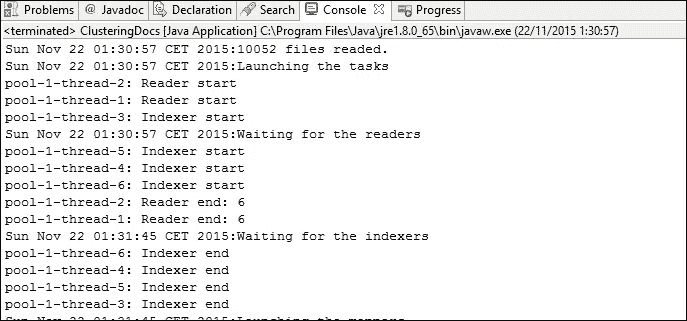

# 第十章。片段集成和替代方案的实现

从第二章到第八章，您使用了 Java 并发 API 的最重要部分来实现不同的示例。通常，这些示例是真实的，但大多数情况下，这些示例可以是更大系统的一部分。例如，在第四章中，*从任务中获取数据 - Callable 和 Future 接口*，您实现了一个应用程序来构建一个倒排索引，用于信息检索系统。在第六章中，*优化分治解决方案 - Fork/Join 框架*，您实现了 k 均值聚类算法来对一组文档进行聚类。然而，您可以实现一个完整的信息检索应用程序，该应用程序读取一组文档，使用向量空间模型表示它们，并使用 K-NN 算法对它们进行聚类。在这些情况下，您可能会使用不同的并发技术（执行器、流等）来实现不同的部分，但它们必须在它们之间同步和通信以获得所需的结果。

此外，本书中提出的所有示例都可以使用 Java 并发 API 的其他组件来实现。我们也将讨论其中一些替代方案。

在这一章中，我们将涵盖以下主题：

+   大块同步机制

+   文档聚类应用示例

+   实现替代方案

# 大块同步机制

大型计算机应用程序由不同的组件组成，这些组件共同工作以获得所需的功能。这些组件必须在它们之间进行同步和通信。在第九章中，*深入并发数据结构和同步实用程序*，您学到了可以使用不同的 Java 类来同步任务并在它们之间进行通信。但是当您要同步的组件也是可以使用不同机制来实现并发的并发系统时，这个任务组织就更加复杂了。例如，您的应用程序中有一个组件使用 Fork/Join 框架生成其结果，这些结果被使用`Phaser`类同步的其他任务使用。

在这些情况下，您可以使用以下两种机制来同步和通信这些组件：

+   **共享内存**：系统共享数据结构以在它们之间传递信息。

+   **消息传递**：系统之一向一个或多个系统发送消息。有不同的实现方式。在诸如 Java 之类的面向对象编程语言中，最基本的消息传递机制是一个对象调用另一个对象的方法。您还可以使用**Java 消息服务**（**JMS**）、缓冲区或其他数据结构。您可以有以下两种消息传递技术：

+   **同步**：在这种情况下，发送消息的类会等待接收者处理其消息

+   **异步**：在这种情况下，发送消息的类不等待处理其消息的接收者。

在这一部分，您将实现一个应用程序，用于对由四个子系统组成的文档进行聚类，这些子系统之间进行通信和同步以对文档进行聚类。

# 一个文档聚类应用的示例

该应用程序将读取一组文档，并使用 k-means 聚类算法对其进行组织。为了实现这一点，我们将使用四个组件：

+   **Reader 系统**：该系统将读取所有文档，并将每个文档转换为`String`对象列表。

+   **Indexer 系统**：该系统将处理文档并将其转换为单词列表。同时，它将生成包含所有出现在文档中的单词的全局词汇表。

+   **Mapper 系统**：该系统将把每个单词列表转换为数学表示，使用向量空间模型。每个项目的值将是**Tf-Idf**（术语频率-逆文档频率）度量。

+   **聚类系统**：该系统将使用 k-means 聚类算法对文档进行聚类。

所有这些系统都是并发的，并使用自己的任务来实现它们的功能。让我们看看如何实现这个例子。

## k-means 聚类的四个系统

让我们看看如何实现 Reader、Indexer、Mapper 和 Clustering 系统。

### Reader 系统

我们已经在`DocumentReader`类中实现了这个系统。这个类实现了`Runnable`接口，并且内部使用了三个属性：

+   一个`ConcurrentLinkedDeque`类的`String`对象，其中包含您需要处理的文件的所有名称

+   一个`ConcurrentLinkedQueue`类的`TextFile`对象，用于存储文档

+   一个`CountDownLatch`对象，用于控制任务执行的结束

类的构造函数初始化这些属性（三个属性由构造函数作为参数接收），这里给出的`run()`方法实现了所有功能：

```java
        String route;
        System.out.println(Thread.currentThread().getName()+": Reader start");

        while ((route = files.pollFirst()) != null) {
            Path file = Paths.get(route);

            TextFile textFile;
            try {
                textFile = new TextFile(file);
                buffer.offer(textFile);
            } catch (IOException e) {
                e.printStackTrace();
            }
        }
        System.out.println(Thread.currentThread().getName()+": Reader end: "+buffer.size());
        readersCounter.countDown();
    }
}
```

首先，我们读取所有文件的内容。对于每个文件，我们创建一个`TextFile`类的对象。这个类包含文本文件的名称和内容。它有一个构造函数，接收一个包含文件路径的`Path`对象。最后，我们在控制台中写入一条消息，并使用`CountDownLatch`对象的`countDown()`方法来指示该任务的完成。

这是`TextFile`类的代码。在内部，它有两个属性来存储文件名和其内容。它使用`Files`类的`readAllLines()`方法将文件内容转换为`List<String>`数据结构：

```java
public class TextFile {

    private String fileName;
    private List<String> content;

    public TextFile(String fileName, List<String> content) {
        this.fileName = fileName;
        this.content = content;
    }

    public TextFile(Path path) throws IOException {
        this(path.getFileName().toString(), Files.readAllLines(path));
    }

    public String getFileName() {
        return fileName;
    }

    public List<String> getContent() {
        return content;
    }
}
```

### Indexer 系统

这个系统是在`Indexer`类中实现的，该类还实现了`Runnable`接口。在这种情况下，我们使用五个内部属性，如下所示：

+   一个`ConcurrentLinkedQueue`，其中包含所有文档内容的`TextFile`

+   一个`ConcurrentLinkedDeque`，其中包含形成每个文档的单词列表的`Document`对象

+   一个`CountDownLatch`对象，用于控制`Reader`系统的完成

+   一个`CountDownLatch`对象，用于指示该系统任务的完成

+   一个`Vocabulary`对象，用于存储构成文档集合的所有单词

类的构造函数初始化了这些属性（接收所有这些属性作为参数）：

```java
public class Indexer implements Runnable {

    private ConcurrentLinkedQueue<TextFile> buffer;
    private ConcurrentLinkedDeque<Document> documents;
    private CountDownLatch readersCounter;
    private CountDownLatch indexersCounter;
    private Vocabulary voc;
```

`run()`方法实现了所有功能，如下所示：

```java
    @Override
    public void run() {
        System.out.println(Thread.currentThread().getName()+": Indexer start");
        do {
            TextFile textFile= buffer.poll();
            if (textFile!=null) {
                Document document= parseDoc(textFile);
```

首先，它从队列中获取`TextFile`，如果不是`null`，则使用`parseDoc()`方法将其转换为`Document`对象。然后，它处理文档的所有单词，将它们存储在全局词汇表对象中，并将文档存储在文档列表中，如下面的代码所示：

```java
                document.getVoc().values()
                    .forEach(voc::addWord);
                documents.offer(document);
            }
        } while ((readersCounter.getCount()>0) || (!buffer.isEmpty()));
```

```java
countDown() method of the CountDownLatch object to indicate that this task has finished its execution:
```

```java
        indexersCounter.countDown();
        System.out.println(Thread.currentThread().getName()+": Indexer end");
    }
```

`parseDoc()`方法接收包含文档内容的`List<String>`，并返回一个`Document`对象。它创建一个`Document`对象，使用`forEach()`方法处理所有行，如下所示：

```java
    private Document parseDoc(TextFile textFile) {
        Document doc=new Document();

        doc.setName(textFile.getFileName());
        textFile.getContent().forEach(line -> parseLine(line,doc));

        return doc;
    }
```

`parseLine()`方法将行分割成单词，并将它们存储在`doc`对象中，如下所示：

```java
    private static void parseLine(String inputLine, Document doc) {

        // Clean string
        String line=new String(inputLine);
        line = Normalizer.normalize(line, Normalizer.Form.NFKD);
        line = line.replaceAll("[^\\p{ASCII}]", "");
        line = line.toLowerCase();

        // Tokenizer
        StringTokenizer tokenizer = new StringTokenizer(line,
                " ,.;:-{}[]¿?¡!|\\=*+/()\"@\t~#<>", false);
        while (tokenizer.hasMoreTokens()) {
            doc.addWord(tokenizer.nextToken());
        }
    }
```

您可以在之前呈现的代码中包含一个优化，即预编译`replaceAll()`方法中使用的正则表达式：

```java
static final Pattern NON_ASCII = Pattern.compile("[^\\p{ASCII}]");
    line = NON_ASCII.matcher(line).replaceAll("");
    }
```

### 映射器系统

该系统是在`Mapper`类中实现的，该类还实现了`Runnable`接口。在内部，它使用以下两个属性：

+   一个包含所有文档信息的`ConcurrentLinkedDeque`对象

+   包含整个集合中所有单词的`Vocabulary`对象

其代码如下：

```java
public class Mapper implements Runnable {

    private ConcurrentLinkedDeque<Document> documents;
    private Vocabulary voc;
```

类的构造函数初始化了这些属性，`run()`方法实现了该系统的功能：

```java
    public void run() {
        Document doc;
        int counter=0;
        System.out.println(Thread.currentThread().getName()+": Mapper start");
        while ((doc=documents.pollFirst())!=null) {
            counter++;
```

首先，它从`Deque`对象中使用`pollFirst()`方法获取一个文档。然后，它处理文档中的所有单词，计算`tfxidf`度量，并创建一个新的`Attribute`对象来存储这些值。这些属性被存储在一个列表中。

```java
            List<Attribute> attributes=new ArrayList<>();
            doc.getVoc().forEach((key, item)-> {
                Word word=voc.getWord(key);
                item.setTfxidf(item.getTfxidf()/word.getDf());
                Attribute attribute=new Attribute();
                attribute.setIndex(word.getIndex());
                attribute.setValue(item.getTfxidf());
                attributes.add(attribute);
            });
```

最后，我们将列表转换为一个`Attribute`对象数组，并将该数组存储在`Document`对象中：

```java
            Collections.sort(attributes);
            doc.setExample(attributes);
        }
        System.out.println(Thread.currentThread().getName()+": Mapper end: "+counter);

    }
```

### 聚类系统

该系统实现了 k 均值聚类算法。您可以使用第五章中介绍的元素，*将任务分为阶段运行-Phaser 类*，来实现该系统。该实现具有以下元素：

+   **DistanceMeasurer 类**：这个类计算包含文档信息的`Attribute`对象数组与簇的质心之间的欧氏距离

+   **DocumentCluster 类**：这个类存储了关于一个簇的信息：质心和该簇的文档

+   **AssigmentTask 类**：这个类扩展了 Fork/Join 框架的`RecursiveAction`类，并执行算法的分配任务，其中我们计算每个文档与所有簇之间的距离，以决定每个文档的簇

+   **UpdateTask 类**：这个类扩展了 Fork/Join 框架的`RecursiveAction`类，并执行算法的更新任务，重新计算每个簇的质心，作为存储在其中的文档的平均值

+   **ConcurrentKMeans 类**：这个类有一个静态方法`calculate()`，执行聚类算法并返回一个包含所有生成的簇的`DocumentCluster`对象数组

我们只添加了一个新类，`ClusterTask`类，它实现了`Runnable`接口，并将调用`ConcurrentKMeans`类的`calculate()`方法。在内部，它使用两个属性如下：

+   一个包含所有文档信息的`Document`对象数组

+   包含集合中所有单词的`Vocabulary`对象

构造函数初始化了这些属性，`run()`方法实现了任务的逻辑。我们调用`ConcurrentKMeans`类的`calculate()`方法，传递五个参数如下：

+   包含所有文档信息的`Document`对象数组。

+   包含集合中所有单词的`Vocabulary`对象。

+   我们想要生成的簇的数量。在这种情况下，我们使用`10`作为簇的数量。

+   用于初始化簇质心的种子。在这种情况下，我们使用`991`作为种子。

+   在 Fork/Join 框架中用于将任务分割成子任务的参考大小。在这种情况下，我们使用`10`作为最小大小。

这是该类的代码：

```java
    @Override
    public void run() {
        System.out.println("Documents to cluster: "+documents.length);
        ConcurrentKMeans.calculate(documents, 10, voc.getVocabulary().size(), 991, 10);
    }
```

## 文档聚类应用程序的主类

一旦我们实现了应用程序中使用的所有元素，我们必须实现系统的`main()`方法。在这种情况下，这个方法非常关键，因为它负责启动系统并创建需要同步它们的元素。`Reader`和`Indexer`系统将同时执行。它们将使用一个缓冲区来共享信息。当读取器读取一个文档时，它将在缓冲区中写入`String`对象的列表，然后继续处理下一个文档。它不会等待处理该`List`的任务。这是**异步消息传递**的一个例子。`Indexer`系统将从缓冲区中取出文档，处理它们，并生成包含文档所有单词的`Vocabulary`对象。`Indexer`系统执行的所有任务共享`Vocabulary`类的同一个实例。这是**共享内存**的一个例子。

主类将使用`CountDownLatch`对象的`await()`方法以同步的方式等待`Reader`和`Indexer`系统的完成。该方法会阻塞调用线程的执行，直到其内部计数器达到 0。

一旦两个系统都完成了它们的执行，`Mapper`系统将使用`Vocabulary`对象和`Document`信息来获取每个文档的向量空间模型表示。当`Mapper`完成执行后，`Clustering`系统将对所有文档进行聚类。我们使用`CompletableFuture`类来同步`Mapper`系统的结束和`Clustering`系统的开始。这是两个系统之间异步通信的另一个例子。

我们已经在`ClusteringDocs`类中实现了主类。

首先，我们创建一个`ThreadPoolExecutor`对象，并使用`readFileNames()`方法获取包含文档的文件的`ConcurrentLinkedDeque`：

```java
public class ClusteringDocs {

    private static int NUM_READERS = 2;
    private static int NUM_WRITERS = 4;

    public static void main(String[] args) throws InterruptedException {

        ThreadPoolExecutor executor=(ThreadPoolExecutor) Executors.newCachedThreadPool();
        ConcurrentLinkedDeque<String> files=readFiles("data");
        System.out.println(new Date()+":"+files.size()+" files read.");
```

然后，我们创建文档的缓冲区`ConcurrentLinkedDeque`，用于存储`Document`对象、`Vocabulary`对象和两个`CountDownLatch`对象——一个用于控制`Reader`系统任务的结束，另一个用于控制`Indexer`系统任务的结束。我们有以下代码：

```java
        ConcurrentLinkedQueue<List<String>> buffer=new ConcurrentLinkedQueue<>();
        CountDownLatch readersCounter=new CountDownLatch(2);
        ConcurrentLinkedDeque<Document> documents=new ConcurrentLinkedDeque<>();
        CountDownLatch indexersCounter=new CountDownLatch(4);
        Vocabulary voc=new Vocabulary();
```

然后，我们启动两个任务来执行`DocumentReader`类的`Reader`系统，另外四个任务来执行`Indexer`类的`Indexer`系统。所有这些任务都在我们之前创建的`Executor`对象中执行：

```java
        System.out.println(new Date()+":"+"Launching the tasks");
        for (int i=0; i<NUM_READERS; i++) {
            DocumentReader reader=new DocumentReader(files,buffer,readersCounter);
            executor.execute(reader);

        }

        for (int i=0; i<NUM_WRITERS; i++) {
            Indexer indexer=new Indexer(documents, buffer, readersCounter, indexersCounter, voc);
            executor.execute(indexer);
        }
```

然后，`main()`方法等待这些任务的完成；首先是`DocumentReader`任务，然后是`Indexer`任务，如下所示：

```java
        System.out.println(new Date()+":"+"Waiting for the readers");
        readersCounter.await();

        System.out.println(new Date()+":"+"Waiting for the indexers");
        indexersCounter.await();
```

然后，我们将`ConcurrentLinkedDeque`类的`Document`对象转换为数组：

```java
        Document[] documentsArray=new Document[documents.size()];
        documentsArray=documents.toArray(documentsArray);
```

我们启动`Indexer`系统，使用`CompletableFuture`类的`runAsync()`方法执行`Mapper`类的四个任务，如下所示：

```java
        System.out.println(new Date()+":"+"Launching the mappers");
        CompletableFuture<Void>[] completables = Stream.generate(() -> new Mapper(documents, voc))
                .limit(4)
                .map(CompletableFuture::runAsync)
                .toArray(CompletableFuture[]::new);
```

然后，我们启动`Clustering`系统，启动`ClusterTask`类的一个任务（请记住，这些任务将启动其他任务来执行算法）。`main()`方法使用`CompletableFuture`类的`allOf()`方法等待`Mapper`任务的完成，然后使用`thenRunAsync()`方法在`Mapper`系统完成后启动聚类算法：

```java
        System.out.println(new Date()+":"+"Launching the cluster calculation");

        CompletableFuture<Void> completableMappers= CompletableFuture.allOf(completables);
        ClusterTask clusterTask=new ClusterTask(documentsArray, voc);
        CompletableFuture<Void> completableClustering= completableMappers.thenRunAsync(clusterTask);
```

最后，我们使用`get()`方法等待`Clustering`系统的完成，并按以下方式结束程序的执行：

```java
        System.out.println(new Date()+":"+"Wating for the cluster calculation");
        try {
            completableClustering.get();
        } catch (InterruptedException | ExecutionException e) {
            e.printStackTrace();
        }

        System.out.println(new Date()+":"+"Execution finished");
        executor.shutdown();
    }
```

`readFileNames()`方法接收一个字符串作为参数，该字符串必须是存储文档集合的目录的路径，并生成一个包含该目录中文件名称的`ConcurrentLinkedDeque`类的`String`对象。

## 测试我们的文档聚类应用程序

为了测试这个应用程序，我们使用了来自维基百科的有关电影的 100,673 个文档中的 10,052 个文档的子集作为文档集。在下图中，您可以看到执行的第一部分的结果-从执行开始到索引器执行结束为止：



以下图片显示了示例执行的其余部分：


您可以看到任务如何在本章前面同步。首先，`Reader`和`Indexer`任务以并发方式执行。当它们完成时，映射器对数据进行转换，最后，聚类算法组织示例。

# 使用并发编程实现替代方案

本书中大多数示例都可以使用 Java 并发 API 的其他组件来实现。在本节中，我们将描述如何实现其中一些替代方案。

## k 最近邻算法

您已经在第二章中使用执行器实现了 k 最近邻算法，*管理大量线程-执行器*，这是一种用于监督分类的简单机器学习算法。您有一组先前分类的示例的训练集。要获得新示例的类别，您需要计算此示例与示例的训练集之间的距离。最近示例中的大多数类别是为示例选择的类别。您还可以使用并发 API 的以下组件之一实现此算法：

+   **线程**：您可以使用`Thread`对象实现此示例。您必须使用普通线程执行执行器中执行的任务。每个线程将计算示例与训练集子集之间的距离，并将该距离保存在所有线程之间共享的数据结构中。当所有线程都完成时，您可以使用距离对数据结构进行排序并计算示例的类别。

+   **Fork/Join 框架**：与先前的解决方案一样，每个任务将计算示例与训练集子集之间的距离。在这种情况下，您定义了这些子集中示例的最大数量。如果一个任务需要处理更多的示例，您将该任务分成两个子任务。在加入了两个任务之后，您必须生成一个包含两个子任务结果的唯一数据结构。最后，您将获得一个包含所有距离的数据结构，可以对其进行排序以获得示例的类别。

+   **流**：您可以从训练数据创建一个流，并将每个训练示例映射到一个包含要分类的示例与该示例之间距离的结构中。然后，您对该结构进行排序，使用`limit()`获取最接近的示例，并计算最终的结果类别。

## 构建文档集的倒排索引

我们已经在第四章中使用执行器实现了此示例，*从任务中获取数据-Callable 和 Future 接口*。倒排索引是信息检索领域中用于加速信息搜索的数据结构。它存储了文档集中出现的单词，对于每个单词，存储了它们出现的文档。当您搜索信息时，您无需处理文档。您查看倒排索引以提取包含您插入的单词的文档，并构建结果列表。您还可以使用并发 API 的以下组件之一实现此算法：

+   **线程**：每个线程将处理一部分文档。这个过程包括获取文档的词汇并更新一个共同的数据结构与全局索引。当所有线程都完成执行后，可以按顺序创建文件。

+   **Fork/Join 框架**：您定义任务可以处理的文档的最大数量。如果一个任务必须处理更多的文档，您将该任务分成两个子任务。每个任务的结果将是一个包含由这些任务或其子任务处理的文档的倒排索引的数据结构。在合并两个子任务后，您将从其子任务的倒排索引构造一个唯一的倒排索引。

+   **流**：您创建一个流来处理所有文件。您将每个文件映射到其词汇对象，然后将减少该词汇流以获得倒排索引。

## 单词的最佳匹配算法

您已经在第四章中实现了这个例子，*从任务中获取数据 - Callable 和 Future 接口*。这个算法的主要目标是找到与作为参数传递的字符串最相似的单词。您还可以使用并发 API 的以下组件之一来实现此算法：

+   **线程**：每个线程将计算搜索词与整个词列表的子列表之间的距离。每个线程将生成一个部分结果，这些结果将合并到所有线程之间共享的最终结果中。

+   **Fork/Join 框架**：每个任务将计算搜索词与整个词列表的子列表之间的距离。如果列表太大，必须将任务分成两个子任务。每个任务将返回部分结果。在合并两个子任务后，任务将把两个子列表整合成一个。原始任务将返回最终结果。

+   **流**：您为整个单词列表创建一个流，将每个单词与包括搜索词与该单词之间距离的数据结构进行映射，对该列表进行排序，并获得结果。

## 遗传算法

您已经在第五章中实现了这个例子，*分阶段运行任务 - Phaser 类*。**遗传算法**是一种基于自然选择原则的自适应启发式搜索算法，用于生成**优化**和**搜索问题**的良好解决方案。有不同的方法可以使用多个线程来进行遗传算法。最经典的方法是创建*岛屿*。每个线程代表一个岛屿，其中一部分种群会进化。有时，岛屿之间会发生迁移，将一些个体从一个岛屿转移到另一个岛屿。算法完成后，选择跨所有岛屿的最佳物种。这种方法大大减少了争用，因为线程很少彼此交流。

还有其他方法在许多出版物和网站上有很好的描述。例如，这份讲义集在[`cw.fel.cvut.cz/wiki/_media/courses/a0m33eoa/prednasky/08pgas-handouts.pdf`](https://cw.fel.cvut.cz/wiki/_media/courses/a0m33eoa/prednasky/08pgas-handouts.pdf)上很好地总结了这些方法。

您还可以使用并发 API 的以下组件之一来实现此算法：

+   **线程**：所有个体的种群必须是一个共享的数据结构。您可以按以下方式实现三个阶段：选择阶段以顺序方式进行；交叉阶段使用线程，其中每个线程将生成预定义数量的个体；评估阶段也使用线程。每个线程将评估预定义数量的个体。

+   执行者：您可以实现类似于之前的内容，将任务在执行者中执行，而不是独立的线程。

+   **Fork/Join 框架**：主要思想是相同的，但在这种情况下，您的任务将被分割，直到它们处理了预定义数量的个体。在这种情况下，加入部分不起作用，因为任务的结果将存储在共同的数据结构中。

## 关键词提取算法

您已经在第五章中实现了这个例子，*分阶段运行任务-Phaser 类*。我们使用这种算法来提取描述文档的一小组词语。我们尝试使用 Tf-Idf 等度量标准找到最具信息量的词语。您还可以使用并发 API 的以下组件来实现此示例：

+   **线程**：您需要两种类型的线程。第一组线程将处理文档集以获得每个词的文档频率。您需要一个共享的数据结构来存储集合的词汇表。第二组线程将再次处理文档，以获得每个文档的关键词，并更新一个维护整个关键词列表的结构。

+   **Fork/Join 框架**：主要思想与以前的版本类似。您需要两种类型的任务。第一个任务是获得文档集的全局词汇表。每个任务将计算子集文档的词汇表。如果子集太大，任务将执行两个子任务。在加入子任务后，它将将获得的两个词汇表合并为一个。第二组任务将计算关键词列表。每个任务将计算子集文档的关键词列表。如果子集太大，它将执行两个子任务。当这些任务完成时，父任务将使用子任务返回的列表生成关键词列表。

+   **流**：您创建一个流来处理所有文档。您将每个文档与包含文档词汇表的对象进行映射，并将其减少以获得全局词汇表。您生成另一个流来再次处理所有文档，将每个文档与包含其关键词的对象进行映射，并将其减少以生成最终的关键词列表。

## 一个 k 均值聚类算法

您已经在第六章中实现了这个算法，*优化分治解决方案-Fork/Join 框架*。这个算法将一组元素分类到先前定义的一定数量的集群中。您对元素的类别没有任何信息，因此这是一种无监督学习算法，它试图找到相似的项目。您还可以使用并发 API 的以下组件来实现此示例：

+   **线程**：您将有两种类型的线程。第一种将为示例分配一个集群。每个线程将处理示例集的子集。第二种线程将更新集群的质心。集群和示例必须是所有线程共享的数据结构。

+   **执行者**：您可以实现之前提出的想法，但是在执行任务时使用执行者，而不是使用独立的线程。

## 一个过滤数据算法

您已经在第六章中实现了这个算法，*优化分治解决方案-Fork/Join 框架*。这个算法的主要目标是从一个非常大的对象集中选择满足某些条件的对象。您还可以使用并发 API 的以下组件来实现此示例：

+   **线程**：每个线程将处理对象的一个子集。如果您正在寻找一个结果，当找到一个线程时，它必须暂停其余的执行。如果您正在寻找一个元素列表，那个列表必须是一个共享的数据结构。

+   **执行器**：与之前相同，但在执行器中执行任务，而不是使用独立线程。

+   **流**：您可以使用`Stream`类的`filter()`方法来对对象进行搜索。然后，您可以将这些结果减少到您需要的格式。

## 搜索倒排索引

您已经在第七章中实现了这个算法，*使用并行流处理大型数据集-映射和减少模型*。在之前的例子中，我们讨论了如何实现创建倒排索引以加速信息搜索的算法。这是执行信息搜索的算法。您还可以使用并发 API 的以下组件来实现此示例：

+   **线程**：这是一个共同数据结构中的结果列表。每个线程处理倒排索引的一部分。每个结果都按顺序插入以生成一个排序的数据结构。如果您获得了足够好的结果列表，您可以返回该列表并取消任务的执行。

+   **执行器**：这与前一个类似，但在执行器中执行并发任务。

+   **Fork/Join framework**：这与前一个类似，但每个任务将倒排索引的部分划分为更小的块，直到它们足够小。

## 数字摘要算法

您已经在第七章中实现了这个例子，*使用并行流处理大型数据集-映射和减少模型*。这种类型的算法希望获得关于非常大的数据集的统计信息。您还可以使用并发 API 的以下组件来实现此示例：

+   **线程**：我们将有一个对象来存储线程生成的数据。每个线程将处理数据的一个子集，并将该数据的结果存储在共同的对象中。也许，我们将不得不对该对象进行后处理，以生成最终结果。

+   **执行器**：这与前一个类似，但在执行器中执行并发任务。

+   **Fork/Join framework**：这与前一个类似，但每个任务将倒排索引的部分划分为更小的块，直到它们足够小。

## 没有索引的搜索算法

您已经在第八章中实现了这个例子，*使用并行流处理大型数据集-映射和收集模型*。当您没有倒排索引来加速搜索时，该算法会获取满足某些条件的对象。在这些情况下，您必须在进行搜索时处理所有元素。您还可以使用并发 API 的以下组件来实现此示例：

+   **线程**：每个线程将处理一个对象（在我们的案例中是文件）的子集，以获得结果列表。结果列表将是一个共享的数据结构。

+   **执行器**：这与前一个类似，但并发任务将在执行器中执行。

+   **Fork/Join framework**：这与前一个类似，但任务将倒排索引的部分划分为更小的块，直到它们足够小。

## 使用映射和收集模型的推荐系统

您已经在第八章中实现了这个例子，*使用并行流处理大型数据集 - 映射和收集模型*。**推荐系统**根据客户购买/使用的产品/服务以及购买/使用与他购买/使用相同服务的用户购买/使用的产品/服务向客户推荐产品或服务。您还可以使用并发 API 的 Phaser 组件来实现这个例子。该算法有三个阶段：

+   **第一阶段**：我们需要将带有评论的产品列表转换为购买者与他们购买的产品的列表。每个任务将处理产品的一个子集，并且购买者列表将是一个共享的数据结构。

+   **第二阶段**：我们需要获得购买了与参考用户相同产品的用户列表。每个任务将处理用户购买的产品项目，并将购买了该产品的用户添加到一个共同的用户集合中。

+   **第三阶段**：我们获得了推荐的产品。每个任务将处理前一个列表中的用户，并将他购买的产品添加到一个共同的数据结构中，这将生成最终的推荐产品列表。

# 总结

在本书中，您实现了许多真实世界的例子。其中一些例子可以作为更大系统的一部分。这些更大的系统通常有不同的并发部分，它们必须共享信息并在它们之间进行同步。为了进行同步，我们可以使用三种机制：共享内存，当两个或更多任务共享一个对象或数据结构时；异步消息传递，当一个任务向另一个任务发送消息并且不等待其处理时；以及同步消息传递，当一个任务向另一个任务发送消息并等待其处理时。

在本章中，我们实现了一个用于聚类文档的应用程序，由四个子系统组成。我们使用了早期介绍的机制来在这四个子系统之间同步和共享信息。

我们还修改了书中提出的一些例子，讨论了它们的其他实现方法。

在下一章中，您将学习如何获取并发 API 组件的调试信息，以及如何监视和测试并发应用程序。
