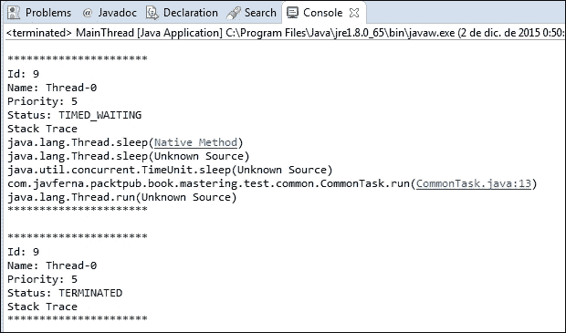
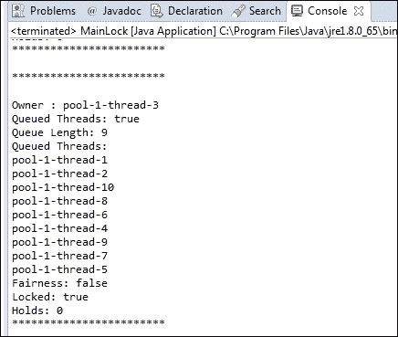
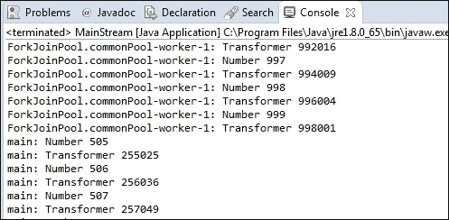
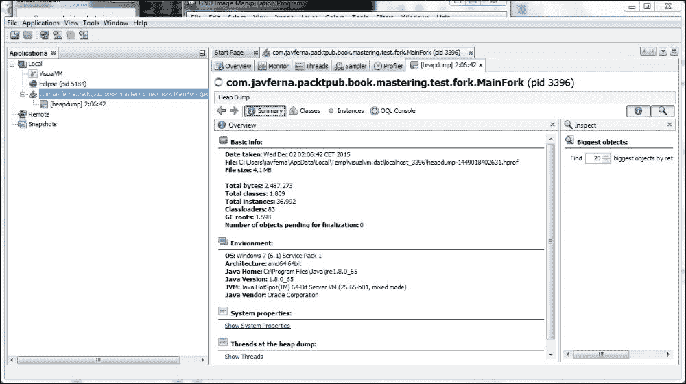
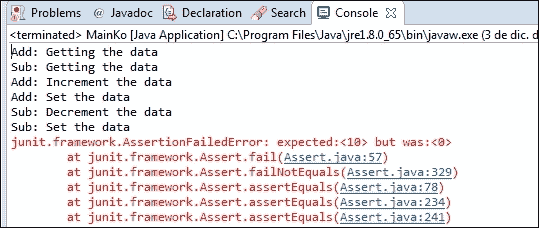
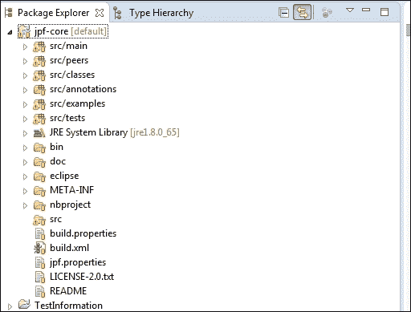

# 第十一章：测试和监控并发应用程序

**软件测试**是每个开发过程的关键任务。每个应用程序都必须满足最终用户的要求，测试阶段是证明这一点的地方。它必须在可接受的时间内以指定的格式生成有效的结果。测试阶段的主要目标是尽可能多地检测软件中的错误，以便纠正错误并提高产品的整体质量。

传统上，在瀑布模型中，测试阶段在开发阶段非常先进时开始，但如今越来越多的开发团队正在使用敏捷方法，其中测试阶段集成到开发阶段中。主要目标是尽快测试软件，以便在流程早期检测错误。

在 Java 中，有许多工具，如**JUnit**或**TestNG**，可以自动执行测试。其他工具，如**JMeter**，允许您测试有多少用户可以同时执行您的应用程序，还有其他工具，如**Selenium**，您可以用来在 Web 应用程序中进行集成测试。

测试阶段在并发应用程序中更为关键和更为困难。您可以同时运行两个或更多个线程，但无法控制它们的执行顺序。您可以对应用程序进行大量测试，但无法保证不存在执行不同线程的顺序引发竞争条件或死锁的情况。这种情况也导致了错误的再现困难。您可能会发现只在特定情况下发生的错误，因此很难找到其真正的原因。在本章中，我们将涵盖以下主题，以帮助您测试并发应用程序：

+   监控并发对象

+   监控并发应用程序

+   测试并发应用程序

# 监控并发对象

Java 并发 API 提供的大多数并发对象都包括了用于了解它们状态的方法。此状态可以包括正在执行的线程数、正在等待条件的线程数、已执行的任务数等。在本节中，您将学习可以使用的最重要的方法以及您可以从中获取的信息。这些信息对于检测错误的原因非常有用，特别是如果错误只在非常罕见的情况下发生。

## 监控线程

线程是 Java 并发 API 中最基本的元素。它允许您实现原始任务。您可以决定要执行的代码（扩展`Thread`类或实现`Runnable`接口）、何时开始执行以及如何与应用程序的其他任务同步。`Thread`类提供了一些方法来获取有关线程的信息。以下是最有用的方法：

+   `getId()`: 此方法返回线程的标识符。它是一个`long`正数，且是唯一的。

+   `getName()`: 此方法返回线程的名称。默认情况下，它的格式为`Thread-xxx`，但可以在构造函数中或使用`setName()`方法进行修改。

+   `getPriority()`: 此方法返回线程的优先级。默认情况下，所有线程的优先级都为五，但您可以使用`setPriority()`方法进行更改。具有较高优先级的线程可能优先于具有较低优先级的线程。

+   `getState()`: 此方法返回线程的状态。它返回一个`Enum` `Thread.State`的值，可以取值：`NEW`、`RUNNABLE`、`BLOCKED`、`WAITING`、`TIMED_WAITING`和`TERMINATED`。您可以查看 API 文档以了解每个状态的真正含义。

+   `getStackTrace()`: 此方法以`StackTraceElement`对象的数组形式返回此线程的调用堆栈。您可以打印此数组以了解线程所做的调用。

例如，您可以使用类似以下的代码片段来获取线程的所有相关信息：

```java
    System.out.println("**********************");
    System.out.println("Id: " + thread.getId());
    System.out.println("Name: " + thread.getName());
    System.out.println("Priority: " + thread.getPriority());
    System.out.println("Status: " + thread.getState());
    System.out.println("Stack Trace");
    for(StackTraceElement ste : thread.getStackTrace()) {
      System.out.println(ste);
    }

    System.out.println("**********************\n");
```

使用此代码块，您将获得以下输出：



## 监视锁

**锁**是 Java 并发 API 提供的基本同步元素之一。它在`Lock`接口和`ReentrantLock`类中定义。基本上，锁允许您在代码中定义临界区，但`Lock`机制比其他机制更灵活，如同步关键字（例如，您可以有不同的锁来进行读写操作或具有非线性的临界区）。`ReentrantLock`类具有一些方法，允许您了解`Lock`对象的状态：

+   `getOwner()`: 此方法返回一个`Thread`对象，其中包含当前拥有锁的线程，也就是执行临界区的线程。

+   `hasQueuedThreads()`: 此方法返回一个`boolean`值，指示是否有线程在等待获取此锁。

+   `getQueueLength()`: 此方法返回一个`int`值，其中包含等待获取此锁的线程数。

+   `getQueuedThreads()`: 此方法返回一个`Collection<Thread>`对象，其中包含等待获取此锁的`Thread`对象。

+   `isFair()`: 此方法返回一个`boolean`值，指示公平属性的状态。此属性的值用于确定下一个获取锁的线程。您可以查看 Java API 信息，以获取有关此功能的详细描述。

+   `isLocked()`: 此方法返回一个`boolean`值，指示此锁是否被线程拥有。

+   `getHoldCount()`: 此方法返回一个`int`值，其中包含此线程获取锁的次数。如果此线程未持有锁，则返回值为零。否则，它将返回当前线程中调用`lock()`方法的次数，而未调用匹配的`unlock()`方法。

`getOwner()`和`getQueuedThreads()`方法受到保护，因此您无法直接访问它们。为解决此问题，您可以实现自己的`Lock`类，并实现提供该信息的方法。

例如，您可以实现一个名为`MyLock`的类，如下所示：

```java
public class MyLock extends ReentrantLock {

    private static final long serialVersionUID = 8025713657321635686L;

    public String getOwnerName() {
        if (this.getOwner() == null) {
            return "None";
        }
        return this.getOwner().getName();
    }

    public Collection<Thread> getThreads() {
        return this.getQueuedThreads();
    }
}
```

因此，您可以使用类似以下的代码片段来获取有关锁的所有相关信息：

```java
    System.out.println("************************\n");
    System.out.println("Owner : " + lock.getOwnerName());
    System.out.println("Queued Threads: " + lock.hasQueuedThreads());
    if (lock.hasQueuedThreads()) {
        System.out.println("Queue Length: " + lock.getQueueLength());
        System.out.println("Queued Threads: ");
        Collection<Thread> lockedThreads = lock.getThreads();
        for (Thread lockedThread : lockedThreads) {
            System.out.println(lockedThread.getName());
        }
    }
    System.out.println("Fairness: " + lock.isFair());
    System.out.println("Locked: " + lock.isLocked());
    System.out.println("Holds: "+lock.getHoldCount());
    System.out.println("************************\n");
```

使用此代码块，您将获得类似以下的输出：



## 监视执行器

**执行器框架**是一种机制，允许您执行并发任务，而无需担心线程的创建和管理。您可以将任务发送到执行器。它具有一个内部线程池，用于执行任务。执行器还提供了一种机制来控制任务消耗的资源，以便您不会过载系统。执行器框架提供了`Executor`和`ExecutorService`接口以及一些实现这些接口的类。实现它们的最基本的类是`ThreadPoolExecutor`类。它提供了一些方法，允许您了解执行器的状态：

+   `getActiveCount()`: 此方法返回正在执行任务的执行器线程数。

+   `getCompletedTaskCount()`: 此方法返回已由执行器执行并已完成执行的任务数。

+   `getCorePoolSize()`: 此方法返回核心线程数。此数字确定池中的最小线程数。即使执行器中没有运行任务，池中的线程数也不会少于此方法返回的数字。

+   `getLargestPoolSize()`: 此方法返回执行器池中同时存在的最大线程数。

+   `getMaximumPoolSize()`: 此方法返回池中可以同时存在的最大线程数。

+   `getPoolSize()`: 此方法返回池中当前线程的数量。

+   `getTaskCount()`: 此方法返回已发送到执行程序的任务数量，包括等待、运行和已完成的任务。

+   `isTerminated()`: 如果已调用`shutdown()`或`shutdownNow()`方法并且`Executor`已完成所有待处理任务的执行，则此方法返回`true`。否则返回`false`。

+   `isTerminating()`: 如果已调用`shutdown()`或`shutdownNow()`方法但执行程序仍在执行任务，则此方法返回`true`。

您可以使用类似以下代码片段来获取`ThreadPoolExecutor`的相关信息：

```java
    System.out.println ("*******************************************");
    System.out.println("Active Count: "+executor.getActiveCount());
    System.out.println("Completed Task Count: "+executor.getCompletedTaskCount());
    System.out.println("Core Pool Size: "+executor.getCorePoolSize());
    System.out.println("Largest Pool Size: "+executor.getLargestPoolSize());
    System.out.println("Maximum Pool Size: "+executor.getMaximumPoolSize());
    System.out.println("Pool Size: "+executor.getPoolSize());
    System.out.println("Task Count: "+executor.getTaskCount());
    System.out.println("Terminated: "+executor.isTerminated());
    System.out.println("Is Terminating: "+executor.isTerminating());
    System.out.println ("*******************************************");
```

使用此代码块，您将获得类似于以下内容的输出：


## 监控 Fork/Join 框架

**Fork/Join 框架**提供了一种特殊的执行程序，用于可以使用分而治之技术实现的算法。它基于工作窃取算法。您创建一个必须处理整个问题的初始任务。此任务创建其他处理问题较小部分的子任务，并等待其完成。每个任务将要处理的子问题的大小与预定义大小进行比较。如果大小小于预定义大小，则直接解决问题。否则，将问题分割为其他子任务，并等待它们返回的结果。工作窃取算法利用正在执行等待其子任务结果的线程来执行其他任务。`ForkJoinPool`类提供了允许您获取其状态的方法：

+   `getParallelism()`: 此方法返回为池设定的期望并行级别。

+   `getPoolSize()`: 此方法返回池中线程的数量。

+   `getActiveThreadCount()`: 此方法返回当前正在执行任务的池中线程数量。

+   `getRunningThreadCount()`: 此方法返回不在等待其子任务完成的线程数量。

+   `getQueuedSubmissionCount()`: 此方法返回已提交到池中但尚未开始执行的任务数量。

+   `getQueuedTaskCount()`: 此方法返回此池的工作窃取队列中的任务数量。

+   `hasQueuedSubmissions()`: 如果已提交到池中但尚未开始执行的任务，则此方法返回`true`。否则返回`false`。

+   `getStealCount()`: 此方法返回 Fork/Join 池执行工作窃取算法的次数。

+   `isTerminated()`: 如果 Fork/Join 池已完成执行，则此方法返回`true`。否则返回`false`。

您可以使用类似以下代码片段来获取`ForkJoinPool`类的相关信息：

```java
    System.out.println("**********************");
    System.out.println("Parallelism: "+pool.getParallelism());
    System.out.println("Pool Size: "+pool.getPoolSize());
    System.out.println("Active Thread Count: "+pool.getActiveThreadCount());
    System.out.println("Running Thread Count: "+pool.getRunningThreadCount());
    System.out.println("Queued Submission: "+pool.getQueuedSubmissionCount());
    System.out.println("Queued Tasks: "+pool.getQueuedTaskCount());
    System.out.println("Queued Submissions: "+pool.hasQueuedSubmissions());
    System.out.println("Steal Count: "+pool.getStealCount());
    System.out.println("Terminated : "+pool.isTerminated());
    System.out.println("**********************");
```

其中`pool`是一个`ForkJoinPool`对象（例如`ForkJoinPool.commonPool()`）。使用此代码块，您将获得类似于以下内容的输出：


## 监控 Phaser

**Phaser**是一种同步机制，允许您执行可以分为阶段的任务。此类还包括一些方法来获取 Phaser 的状态：

+   `getArrivedParties()`: 此方法返回已完成当前阶段的注册方数量。

+   `getUnarrivedParties()`: 此方法返回尚未完成当前阶段的注册方数量。

+   `getPhase()`: 此方法返回当前阶段的编号。第一个阶段的编号为`0`。

+   `getRegisteredParties()`: 此方法返回 Phaser 中注册方的数量。

+   `isTerminated()`: 此方法返回一个`boolean`值，指示 Phaser 是否已完成执行。

您可以使用类似以下代码片段来获取 Phaser 的相关信息：

```java
    System.out.println ("*******************************************");
    System.out.println("Arrived Parties: "+phaser.getArrivedParties());
    System.out.println("Unarrived Parties: "+phaser.getUnarrivedParties());
    System.out.println("Phase: "+phaser.getPhase());
    System.out.println("Registered Parties: "+phaser.getRegisteredParties());
    System.out.println("Terminated: "+phaser.isTerminated());
    System.out.println ("*******************************************");
```

使用此代码块，您将获得类似于此的输出：


## 监视流

流机制是 Java 8 引入的最重要的新功能之一。它允许您以并发方式处理大量数据集，以简单的方式转换数据并实现映射和减少编程模型。这个类没有提供任何方法（除了返回流是否并行的`isParallel()`方法）来了解流的状态，但包括一个名为`peek()`的方法，您可以将其包含在方法管道中，以记录有关在流中执行的操作或转换的日志信息。

例如，此代码计算前 999 个数字的平方的平均值：

```java
double result=IntStream.range(0,1000)
    .parallel()
    .peek(n -> System.out.println (Thread.currentThread().getName()+": Number "+n))
    .map(n -> n*n)
    .peek(n -> System.out.println (Thread.currentThread().getName()+": Transformer "+n))
    .average()
    .getAsDouble();
```

第一个`peek()`方法写入流正在处理的数字，第二个写入这些数字的平方。如果您执行此代码，由于以并发方式执行流，您将获得类似于此的输出：



# 监视并发应用程序

当您实现 Java 应用程序时，通常会使用诸如 Eclipse 或 NetBeans 之类的 IDE 来创建项目并编写源代码。但是**JDK**（**Java 开发工具包**的缩写）包括可以用于编译、执行或生成 Javadoc 文档的工具。其中之一是**Java VisualVM**，这是一个图形工具，可以显示有关在 JVM 中执行的应用程序的信息。您可以在 JDK 安装的 bin 目录中找到它（`jvisualvm.exe`）。您还可以安装 Eclipse 的插件（Eclipse VisualVM 启动器）以集成其功能。

如果您执行它，您将看到一个类似于这样的窗口：


在屏幕的左侧，您可以看到**应用程序**选项卡，其中将显示当前用户在系统中正在运行的所有 Java 应用程序。如果您在其中一个应用程序上双击，您将看到五个选项卡：

+   **概述**：此选项卡显示有关应用程序的一般信息。

+   **监视器**：此选项卡显示有关应用程序使用的 CPU、内存、类和线程的图形信息。

+   **线程**：此选项卡显示应用程序线程随时间的演变。

+   **采样器**：此选项卡显示有关应用程序内存和 CPU 利用率的信息。它类似于**分析器**选项卡，但以不同的方式获取数据。

+   **分析器**：此选项卡显示有关应用程序内存和 CPU 利用率的信息。它类似于**采样器**选项卡，但以不同的方式获取数据。

在接下来的部分，您将了解每个选项卡中可以获得的信息。您可以在[`visualvm.java.net/docindex.html`](https://visualvm.java.net/docindex.html)上查阅有关此工具的完整文档。

## 概述选项卡

如前所述，此选项卡显示有关应用程序的一般信息。此信息包括：

+   **PID**：应用程序的进程 ID。

+   **主机**：执行应用程序的计算机名称。

+   **主类**：实现`main()`方法的类的完整名称。

+   **参数**：您传递给应用程序的参数列表。

+   **JVM**：执行应用程序的 JVM 版本。

+   **Java**：您正在运行的 Java 版本。

+   **Java 主目录**：系统中 JDK 的位置。

+   **JVM 标志**：与 JVM 一起使用的标志。

+   **JVM 参数**：此选项卡显示我们（或 IDE）传递给 JVM 以执行应用程序的参数。

+   **系统属性**：此选项卡显示系统属性和属性值。您可以使用`System.getProperties()`方法获取此信息。

这是访问应用程序数据时的默认选项卡，并且外观类似于以下截图：


## 监视器选项卡

正如我们之前提到的，此选项卡向您显示了有关应用程序使用的 CPU、内存、类和线程的图形信息。您可以看到这些指标随时间的演变。此选项卡的外观类似于这样：


在右上角，您有一些复选框可以选择要查看的信息。**CPU**图表显示了应用程序使用的 CPU 的百分比。**堆**图表显示了堆的总大小以及应用程序使用的堆的大小。在这部分，您可以看到有关**元空间**（JVM 用于存储类的内存区域）的相同信息。**类**图表显示了应用程序使用的类的数量，**线程**图表显示了应用程序内运行的线程数量。您还可以在此选项卡中使用两个按钮：

+   **执行 GC**：立即在应用程序中执行垃圾回收

+   **堆转储**：它允许您保存应用程序的当前状态以供以后检查

当您创建堆转储时，将会有一个新的选项卡显示其信息。它的外观类似于这样：



您有不同的子选项卡来查询您进行堆转储时应用程序的状态。

## 线程选项卡

正如我们之前提到的，在**线程**选项卡中，您可以看到应用程序线程随时间的演变。它向您展示了以下信息：

+   **活动线程**：应用程序中的线程数量。

+   **守护线程**：应用程序中标记为守护线程的线程数量。

+   **时间线**：线程随时间的演变，包括线程的状态（使用颜色代码），线程运行的时间以及线程存在的时间。在`总计`列的右侧，您可以看到一个箭头。如果单击它，您可以选择在此选项卡中看到的列。

其外观类似于这样：


此选项卡还有**线程转储**按钮。如果单击此按钮，您将看到一个新的选项卡，其中包含应用程序中每个正在运行的线程的堆栈跟踪。其外观类似于这样：


## 采样器选项卡

**采样器**选项卡向您展示了应用程序使用的 CPU 和内存的利用信息。为了获取这些信息，它获取了应用程序的所有线程的转储，并处理了该转储。该选项卡类似于**分析器**选项卡，但正如您将在下一节中看到的，它们之间的区别在于它们用于获取信息的方式。

此选项卡的外观类似于这样：


您有两个按钮：

+   **CPU**：此按钮用于获取有关 CPU 使用情况的信息。如果单击此按钮，您将看到两个子选项卡：

+   **CPU 样本**：在此选项卡中，您将看到应用程序类的 CPU 利用率

+   **线程 CPU 时间**：在此选项卡中，您将看到每个线程的 CPU 利用率

+   **内存**：此按钮用于获取有关内存使用情况的信息。如果单击此按钮，您将看到另外两个子选项卡：

+   **堆直方图**：在此选项卡中，您将看到按数据类型分配的字节数

+   **每个线程分配**：在此选项卡中，您可以看到每个线程使用的内存量

## 分析器选项卡

**分析器**选项卡向您展示了使用仪器 API 的应用程序的 CPU 和内存利用信息。基本上，当 JVM 加载方法时，此 API 会向方法添加一些字节码以获取这些信息。此信息会随时间更新。

此选项卡的外观类似于这样：


默认情况下，此选项卡不会获取任何信息。您必须启动分析会话。为此，您可以使用**CPU**按钮来获取有关 CPU 利用率的信息。这包括每个方法的执行时间和对这些方法的调用次数。您还可以使用**内存**按钮。在这种情况下，您可以看到每种数据类型的内存量和对象数量。

当您不需要获取更多信息时，可以使用**停止**按钮停止分析会话。

# 测试并发应用程序

测试并发应用程序是一项艰巨的任务。您的应用程序的线程在计算机上运行，没有任何保证它们的执行顺序（除了您包含的同步机制），因此很难（大多数情况下是不可能的）测试所有可能发生的情况。您可能会遇到无法重现的错误，因为它只在罕见或独特的情况下发生，或者因为 CPU 内核数量的不同而在一台机器上发生而在其他机器上不会发生。为了检测和重现这种情况，您可以使用不同的工具：

+   **调试**：您可以使用调试器来调试应用程序。如果应用程序中只有几个线程，您必须逐步进行每个线程的调试，这个过程将非常繁琐。您可以配置 Eclipse 或 NetBeans 来测试并发应用程序。

+   **MultithreadedTC**：这是一个**Google Code**的存档项目，可以用来强制并发应用程序的执行顺序。

+   **Java PathFinder**：这是 NASA 用于验证 Java 程序的执行环境。它包括验证并发应用程序的支持。

+   **单元测试**：您可以创建一堆单元测试（使用 JUnit 或 TestNG），并启动每个测试，例如，1,000 次。如果每个测试都成功，那么即使您的应用程序存在竞争，它们的机会也不是很高，可能对生产是可以接受的。您可以在代码中包含断言来验证它是否存在竞争条件。

在接下来的部分中，您将看到使用 MultithreadedTC 和 Java PathFinder 工具测试并发应用程序的基本示例。

## 使用 MultithreadedTC 测试并发应用程序

MultithreadedTC 是一个存档项目，您可以从[`code.google.com/p/multithreadedtc/`](http://code.google.com/p/multithreadedtc/)下载。它的最新版本是 2007 年的，但您仍然可以使用它来测试小型并发应用程序或大型应用程序的部分。您不能用它来测试真实的任务或线程，但您可以用它来测试不同的执行顺序，以检查它们是否引起竞争条件或死锁。

它基于一个内部时钟，使用允许您控制不同线程的执行顺序的滴答声。以测试该执行顺序是否会引起任何并发问题。

首先，您需要将两个库与您的项目关联起来：

+   **MultithreadedTC 库**：最新版本是 1.01 版本

+   **JUnit 库**：我们已经测试了这个例子，使用的是 4.12 版本

要使用 MultithreadedTC 库实现测试，您必须扩展`MultithreadedTestCase`类，该类扩展了 JUnit 库的`Assert`类。您可以实现以下方法：

+   `initialize()`: 这个方法将在测试执行开始时执行。如果需要执行初始化代码来创建数据对象、数据库连接等，您可以重写它。

+   `finish()`: 这个方法将在测试执行结束时执行。您可以重写它来实现测试的验证。

+   `threadXXX()`: 您必须为测试中的每个线程实现一个以`thread`关键字开头的方法。例如，如果您想要进行一个包含三个线程的测试，您的类将有三个方法。

`MultithreadedTestCase`提供了`waitForTick()`方法。此方法接收等待的时钟周期数作为参数。此方法使调用线程休眠，直到内部时钟到达该时钟周期。

第一个时钟周期是时钟周期编号`0`。MultithreadedTC 框架每隔一段时间检查测试线程的状态。如果所有运行的线程都在`waitForTick()`方法中等待，它会增加时钟周期编号并唤醒所有等待该时钟周期的线程。

让我们看一个使用它的例子。假设您想要测试具有内部`int`属性的`Data`对象。您希望一个线程增加值，另一个线程减少值。您可以创建一个名为`TestClassOk`的类，该类扩展了`MultithreadedTestCase`类。我们使用数据对象的三个属性：我们将用于增加和减少数据的数量以及数据的初始值：

```java
public class TestClassOk extends MultithreadedTestCase {

    private Data data;
    private int amount;
    private int initialData;

    public TestClassOk (Data data, int amount) {
        this.amount=amount;
        this.data=data;
        this.initialData=data.getData();
    }
```

我们实现了两种方法来模拟两个线程的执行。第一个线程在`threadAdd()`方法中实现：

```java
    public void threadAdd() {
        System.out.println("Add: Getting the data");
        int value=data.getData();
        System.out.println("Add: Increment the data");
        value+=amount;
        System.out.println("Add: Set the data");
        data.setData(value);
    }
```

它读取数据的值，增加其值，并再次写入数据的值。第二个线程在`threadSub()`方法中实现：

```java
    public void threadSub() {
        waitForTick(1);
        System.out.println("Sub: Getting the data");
        int value=data.getData();
        System.out.println("Sub: Decrement the data");
        value-=amount;
        System.out.println("Sub: Set the data");
        data.setData(value);
    }
}
```

首先，我们等待`1`时钟周期。然后，我们获取数据的值，减少其值，并重新写入数据的值。

要执行测试，我们可以使用`TestFramework`类的`runOnce()`方法：

```java
public class MainOk {

    public static void main(String[] args) {

        Data data=new Data();
        data.setData(10);
        TestClassOk ok=new TestClassOk(data,10);

        try {
            TestFramework.runOnce(ok);
        } catch (Throwable e) {
            e.printStackTrace();
        }

    }
}
```

当测试开始执行时，两个线程（`threadAdd()`和`threadSub()`）以并发方式启动。`threadAdd()`开始执行其代码，`threadSub()`在`waitForTick()`方法中等待。当`threadAdd()`完成其执行时，MultithreadedTC 的内部时钟检测到唯一运行的线程正在等待`waitForTick()`方法，因此它将时钟值增加到`1`并唤醒执行其代码的线程。

在下面的屏幕截图中，您可以看到此示例的执行输出。在这种情况下，一切都很顺利。


但是，您可以更改线程的执行顺序以引发错误。例如，您可以实现以下顺序，这将引发竞争条件：

```java
    public void threadAdd() {
        System.out.println("Add: Getting the data");
        int value=data.getData();
        waitForTick(2);
        System.out.println("Add: Increment the data");
        value+=amount;
        System.out.println("Add: Set the data");
        data.setData(value);
    }

    public void threadSub() {
        waitForTick(1);
        System.out.println("Sub: Getting the data");
        int value=data.getData();
        waitForTick(3);
        System.out.println("Sub: Decrement the data");
        value-=amount;
        System.out.println("Sub: Set the data");
        data.setData(value);
    }
```

在这种情况下，执行顺序确保两个线程首先读取数据的值，然后执行其操作，因此最终结果将不正确。

在下面的屏幕截图中，您可以看到此示例的执行结果：



在这种情况下，`assertEquals()`方法会抛出异常，因为期望值和实际值不相等。

该库的主要限制是，它仅适用于测试基本的并发代码，并且在实现测试时无法用于测试真正的`Thread`代码。

## 使用 Java Pathfinder 测试并发应用程序

**Java Pathfinder**或 JPF 是来自 NASA 的开源执行环境，可用于验证 Java 应用程序。它包括自己的虚拟机来执行 Java 字节码。在内部，它检测代码中可能存在多个执行路径的点，并执行所有可能性。在并发应用程序中，这意味着它将执行应用程序中运行的线程之间的所有可能的执行顺序。它还包括允许您检测竞争条件和死锁的工具。

该工具的主要优势是，它允许您完全测试并发应用程序，以确保它不会出现竞争条件和死锁。该工具的不便之处包括：

+   您必须从源代码安装它

+   如果您的应用程序很复杂，您将有成千上万种可能的执行路径，测试将非常漫长（如果应用程序很复杂，可能需要很多小时）

在接下来的几节中，我们将向您展示如何使用 Java Pathfinder 测试并发应用程序。

### 安装 Java Pathfinder

正如我们之前提到的，您必须从源代码安装 JPF。该代码位于 Mercurial 存储库中，因此第一步是安装 Mercurial，并且由于我们将使用 Eclipse IDE，因此还需要安装 Eclipse 的 Mercurial 插件。

您可以从[`www.mercurial-scm.org/wiki/Download`](https://www.mercurial-scm.org/wiki/Download)下载 Mercurial。您可以下载提供安装助手的安装程序，在计算机上安装 Mercurial 后可能需要重新启动系统。

您可以从 Eclipse 菜单中使用`Help > Install new software`下载 Eclipse 的 Mercurial 插件，并使用 URL [`mercurialeclipse.eclipselabs.org.codespot.com/hg.wiki/update_site/stable`](http://mercurialeclipse.eclipselabs.org.codespot.com/hg.wiki/update_site/stable) 作为查找软件的 URL。按照其他插件的步骤进行操作。

您还可以在 Eclipse 中安装 JPF 插件。您可以从[`babelfish.arc.nasa.gov/trac/jpf/wiki/install/eclipse-plugin`](http://babelfish.arc.nasa.gov/trac/jpf/wiki/install/eclipse-plugin)下载。

现在您可以访问 Mercurial 存储库资源管理器透视图，并添加 Java Pathfinder 的存储库。我们将仅使用存储在[`babelfish.arc.nasa.gov/hg/jpf/jpf-core`](http://babelfish.arc.nasa.gov/hg/jpf/jpf-core)中的核心模块。您无需用户名或密码即可访问存储库。创建存储库后，您可以右键单击存储库并选择**Clone repository**选项，以在计算机上下载源代码。该选项将打开一个窗口以选择一些选项，但您可以保留默认值并单击**Next**按钮。然后，您必须选择要加载的版本。保留默认值并单击**Next**按钮。最后，单击**Finish**按钮完成下载过程。Eclipse 将自动运行`ant`来编译项目。如果有任何编译问题，您必须解决它们并重新运行`ant`。

如果一切顺利，您的工作区将有一个名为`jpf-core`的项目，如下面的截图所示：



最后的配置步骤是创建一个名为`site.properties`的文件，其中包含 JPF 的配置。如果您访问**Window** | **Preferences**中的配置窗口，并选择**JPF Preferences**选项，您将看到 JPF 插件正在查找该文件的路径。如果需要，您可以更改该路径。


由于我们只使用核心模块，因此文件将只包含到`jpf-core`项目的路径：

```java
jpf-core = D:/dev/book/projectos/jpf-core
```

### 运行 Java Pathfinder

安装了 JPF 后，让我们看看如何使用它来测试并发应用程序。首先，我们必须实现一个并发应用程序。在我们的情况下，我们将使用一个带有内部`int`值的`Data`类。它将初始化为`0`，并且将具有一个`increment()`方法来增加该值。

然后，我们将有一个名为`NumberTask`的任务，它实现了`Runnable`接口，将增加一个`Data`对象的值 10 次。

```java
public class NumberTask implements Runnable {

    private Data data;

    public NumberTask (Data data) {
        this.data=data;
    }

    @Override
    public void run() {

        for (int i=0; i<10; i++) {
            data.increment(10);
        }
    }

}
```

最后，我们有一个实现了`main()`方法的`MainNumber`类。我们将启动两个将修改同一个`Data`对象的`NumberTasks`对象。最后，我们将获得`Data`对象的最终值。

```java
public class MainNumber {

    public static void main(String[] args) {
        int numTasks=2;
        Data data=new Data();

        Thread threads[]=new Thread[numTasks];
        for (int i=0; i<numTasks; i++) {
            threads[i]=new Thread(new NumberTask(data));
            threads[i].start();
        }

        for (int i=0; i<numTasks; i++) {
            try {
                threads[i].join();
            } catch (InterruptedException e) {
                e.printStackTrace();
            }
        }

        System.out.println(data.getValue());
    }

}
```

如果一切顺利，没有发生竞争条件，最终结果将是 200，但我们的代码没有使用任何同步机制，所以可能会发生这种情况。

如果我们想要使用 JPF 执行此应用程序，我们需要在项目内创建一个具有`.jpf`扩展名的配置文件。例如，我们已经创建了`NumberJPF.jpf`文件，其中包含我们可以使用的最基本的配置文件：

```java
+classpath=${config_path}/bin
target=com.javferna.packtpub.mastering.testing.main.MainNumber
```

我们修改了 JPF 的类路径，添加了我们项目的`bin`目录，并指定了我们应用程序的主类。现在，我们准备通过 JPF 执行应用程序。为此，我们右键单击`.jpf`文件，然后选择**验证**选项。我们将看到在控制台中可以看到大量输出消息。每个输出消息都来自应用程序的不同执行路径。


当 JPF 结束所有可能的执行路径的执行时，它会显示有关执行的统计信息：


JPF 执行显示未检测到错误，但我们可以看到大多数结果与 200 不同，因此我们的应用程序存在竞争条件，正如我们所预期的那样。

在本节的介绍中，我们说 JPF 提供了检测竞争条件和死锁的工具。JPF 将此实现为实现`Observer`模式以响应代码执行中发生的某些事件的`Listener`机制。例如，我们可以使用以下监听器：

+   精确竞争检测器：使用此监听器来检测竞争条件

+   死锁分析器：使用此监听器来检测死锁情况

+   覆盖分析器：使用此监听器在 JPF 执行结束时编写覆盖信息

您可以在`.jpf`文件中配置要在执行中使用的监听器。例如，我们通过添加`PreciseRaceDetector`和`CoverageAnalyzer`监听器扩展了先前的测试在`NumberListenerJPF.jpf`文件中：

```java
+classpath=${config_path}/bin
target=com.javferna.packtpub.mastering.testing.main.MainNumber
listener=gov.nasa.jpf.listener.PreciseRaceDetector,gov.nasa.jpf.li stener.CoverageAnalyzer
```

如果我们通过 JPF 使用**验证**选项执行此配置文件，您将看到应用程序在检测到第一个竞争条件时结束，并在控制台中显示有关此情况的信息：


您还将看到`CoverageAnalyzer`监听器也会写入信息：


JPF 是一个非常强大的应用程序，包括更多的监听器和更多的扩展机制。您可以在[`babelfish.arc.nasa.gov/trac/jpf/wiki`](http://babelfish.arc.nasa.gov/trac/jpf/wiki)找到其完整文档。

# 总结

测试并发应用程序是一项非常艰巨的任务。线程的执行顺序没有保证（除非在应用程序中引入了同步机制），因此您应该测试比串行应用程序更多的不同情况。有时，您的应用程序会出现错误，您可以重现这些错误，因为它们只会在非常罕见的情况下发生，有时，您的应用程序会出现错误，只会在特定的机器上发生，因为其硬件或软件配置。

在本章中，您已经学会了一些可以帮助您更轻松测试并发应用程序的机制。首先，您已经学会了如何获取有关 Java 并发 API 的最重要组件（如`Thread`、`Lock`、`Executor`或`Stream`）状态的信息。如果需要检测错误的原因，这些信息可能非常有用。然后，您学会了如何使用 Java VisualVM 来监视一般的 Java 应用程序和特定的并发应用程序。最后，您学会了使用两种不同的工具来测试并发应用程序。

通过本书的章节，您已经学会了如何使用 Java 并发 API 的最重要组件，如执行器框架、`Phaser`类、Fork/Join 框架以及 Java 8 中包含的新流 API，以支持对实现机器学习、数据挖掘或自然语言处理的元素流进行函数式操作的真实应用程序。您还学会了如何使用并发数据结构和同步机制，以及如何同步大型应用程序中的不同并发块。最后，您学会了并发应用程序的设计原则以及如何测试它们，这是确保成功使用这些应用程序的两个关键因素。

实现并发应用程序是一项艰巨的任务，但也是一项激动人心的挑战。我希望本书对您成功应对这一挑战有所帮助。
