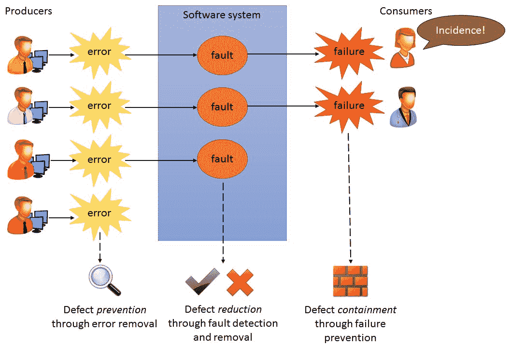
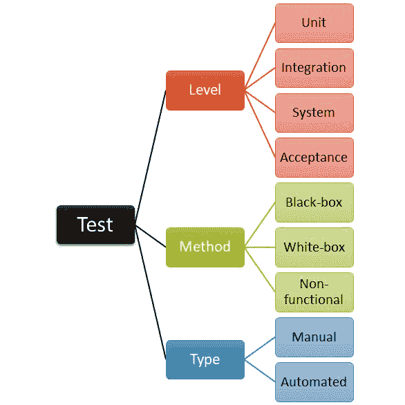
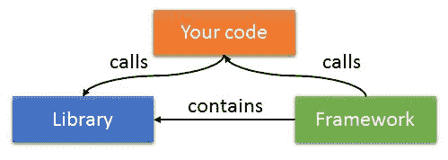
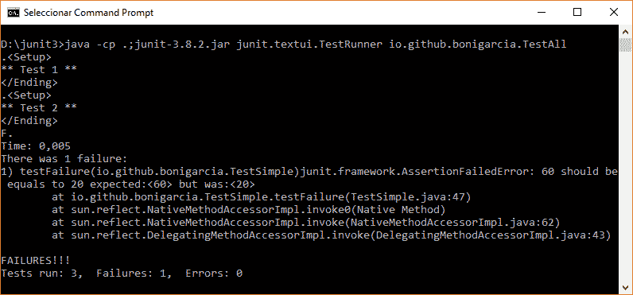

# 第一章：软件质量和 Java 测试的回顾

为了从头开始制作一个苹果派，你必须首先创造宇宙。 

*- 卡尔·萨根*

自 1995 年创立以来，著名的测试框架 JUnit 已经走过了很长的路。2017 年 9 月 10 日，项目生命周期中的一个重要里程碑发生了，即发布了 JUnit 5.0.0。在深入了解 JUnit 5 的细节之前，值得回顾一下软件测试的现状，以便了解我们来自何处，以及我们将要去往何处。为此，本章提供了对软件质量、软件测试和 Java 测试背景的高层次回顾。具体来说，本章由三个部分组成：

+   **软件质量**：第一部分回顾了质量工程的现状：质量保证、ISO/IEC-2500、验证和验证（V&V）以及软件缺陷（错误）。

+   **软件测试**：这是最常见的活动，用于保证软件质量并减少软件缺陷的数量。本部分提供了软件测试层次（单元、集成、系统和验收）、方法（黑盒、白盒和非功能性）、自动化和手动软件测试的理论背景。

+   **Java 虚拟机的测试框架**（JVM）：本部分概述了 JUnit 框架的旧版本（即版本 3 和 4）的主要特点。最后，简要描述了替代测试框架和对 JUnit 的增强。

# 软件质量

软件是为特定客户或一般市场开发的计算机程序、相关数据和相关文档的集合。它是现代世界的重要组成部分，在电信、公用事业、商业、文化、娱乐等领域普遍存在。问题*什么是软件质量？*可能会得到不同的答案，取决于涉及从业者在软件系统中的角色。在软件产品或服务中涉及两大主要群体：

+   **消费者**：是使用软件的人。在这个群体中，我们可以区分*客户*（即负责获取软件产品或服务的人）和*用户*（即为各种目的使用软件产品或服务的人）。然而，客户和用户的双重角色是非常普遍的。

+   **生产者**：参与软件产品的开发、管理、维护、营销和服务的人。

消费者的质量期望是软件系统按规定执行有用的功能。对于软件生产商来说，基本的质量问题是通过生产符合服务级别协议（SLA）的软件产品来履行他们的合同义务。著名软件工程师 Roger Pressman 对软件质量的定义包括两个观点：

有效的软件过程以创造有用的产品，并为生产者和使用者提供可衡量的价值。

# 质量工程

质量工程（也称为质量管理）是一个评估、评价和改进软件质量的过程。在质量工程过程中有三大主要活动组：

1.  **质量规划**：这个阶段通过管理项目成本和预算限制来建立整体质量目标。这个质量计划还包括策略，即选择要执行的活动和适当的质量测量以提供反馈和评估。

1.  **质量保证（QA）**：通过规划和执行一系列活动来保证项目生命周期中的软件产品和过程满足其指定的要求，从而提供足够的信心，质量被构建到软件中。主要的 QA 活动是验证和验证，但还有其他活动，如软件质量度量、使用质量标准、配置管理、文档管理或专家意见。

1.  **质量保证后**：这个阶段包括质量量化和改进测量、分析、反馈和后续活动。这些活动的目的是提供产品质量的定量评估和改进机会的识别。

这些阶段在下图中表示：


软件质量工程过程

# 需求和规范

需求是质量工程领域的关键主题。需求是确定产品或过程需求的能力、物理特征或质量因素的陈述。需求开发（也称为需求工程）是产生和分析客户、产品和产品组件需求的过程。支持需求开发的一系列程序，包括规划、可追溯性、影响分析、变更管理等，被称为需求管理。软件需求有两种类型：

+   **功能性需求**是产品必须执行的操作，以使其对用户有用。它们源自利益相关者需要做的工作。几乎任何动作，如检查、发布或大多数其他动词都可以是功能性需求。

+   **非功能性需求**是产品必须具有的属性或特性。例如，它们可以描述性能、可用性或安全性等属性。它们通常被称为*质量属性*。

另一个与需求密切相关的重要主题是规范，它是一份文件，以完整、精确、可验证的方式规定了系统的需求、设计、行为或其他特征，通常还包括确定这些规定是否得到满足的程序。

# 质量保证

**质量保证**（**QA**）主要关注定义或选择应用于软件开发过程或软件产品的标准。《软件质量保证》（2004）一书的作者丹尼尔·加林将 QA 定义为：

系统化、计划的一系列行动，以提供足够的信心，使软件系统产品的开发和维护过程符合已建立的规范以及保持进度和在预算范围内运作的管理要求。

质量保证（QA）过程选择 V&V 活动、工具和方法来支持所选的质量标准。V&V 是一组活动，其主要目标是如果产品不符合资格，则阻止产品发货。相比之下，QA 旨在通过在开发和维护过程中引入各种活动来最小化质量成本，以防止错误的原因，检测它们，并在开发的早期阶段纠正它们。因此，QA 大大降低了不合格产品的比率。总的来说，V&V 活动只是 QA 活动的一部分。

# ISO/IEC-25000

已经提出了各种质量标准以适应这些不同的质量视图和期望。标准**ISO/IEC-9126**是软件工程界中最有影响力的标准之一。然而，研究人员和实践者发现了该标准的一些问题和弱点。因此，ISO/IEC-9126 国际标准被**ISO/IEC-25000**系列国际标准**软件产品质量要求和评估**（**SQuaRE**）所取代。本节提供了该标准的高级概述。

ISO/IEC-2500 质量参考模型区分了软件质量的不同视图：

+   **内部质量**：这涉及可以在不执行系统的情况下进行测量的系统属性。

+   **外部质量**：这涉及可以在执行过程中观察到的系统属性。

+   **使用质量**：这涉及消费者在操作和维护系统过程中体验到的属性。

理想情况下，开发（*过程质量*）影响内部质量；然后，内部质量决定外部质量。最后，外部质量决定使用质量。这一链条在下图中描述：


ISO/IEC-2500 产品质量参考模型

ISO/IEC-25000 的质量模型将产品质量模型（即内部和外部属性）分为八个顶层质量特征：*功能适用性*、*性能效率*、*兼容性*、*可用性*、*可靠性*、*安全性*、*可维护性*和*可移植性*。以下定义直接从标准中提取：

+   **功能适用性**：这代表产品或系统在指定条件下使用时提供满足规定和隐含需求的功能程度。

+   **性能效率**：这代表在规定条件下使用的资源量相对于性能的表现。

+   **兼容性**：这是产品、系统或组件能够与其他产品、系统或组件交换信息，并/或执行其所需功能的程度，同时共享相同的硬件或软件环境。

+   **可用性**：这是产品或系统在指定使用环境中由指定用户使用以实现指定目标时的效果、效率和满意度程度。

+   **可靠性**：这是系统、产品或组件在指定条件下在指定时间内执行指定功能的程度。

+   **安全性**：这是产品或系统保护信息和数据的程度，使得人员或其他产品或系统能够获得适合其类型和授权级别的数据访问程度。

+   **可维护性**：这代表产品或系统可以被修改以改进、纠正或适应环境和需求变化的效果和效率程度。

+   **可移植性**：这是系统、产品或组件能够从一个硬件、软件或其他操作或使用环境转移到另一个环境的效果和效率程度。

另一方面，使用质量的属性可以归类为以下五个特征：

+   **有效性**：这是用户实现指定目标的准确性和完整性。

+   **效率**：这是用户实现目标所需的准确性和完整性所耗费的资源。

+   **满意度**：这是在指定使用环境中使用产品或系统时满足用户需求的程度。

+   **免于风险**：这是产品或系统减轻对经济状况、人类生命、健康或环境潜在风险的程度。

+   **上下文覆盖**：这是产品或系统在指定使用环境和初始明确定义的环境以外的环境中能够有效、高效、无风险和满意程度的程度。

# 验证和验证

验证和验证-也称为软件质量控制-涉及评估正在开发的软件是否满足其规范并提供消费者期望的功能。这些检查过程从需求可用开始，并贯穿开发过程的所有阶段。验证与验证不同，尽管它们经常被混淆。

计算机科学杰出教授 Barry Boehm 在 1979 年就表达了它们之间的区别：

+   验证：我们是否正在正确构建产品？验证的目的是检查软件是否满足其规定的功能和非功能要求（即规范）。

+   **验证**：我们是否在构建正确的产品？验证的目的是确保软件满足消费者的期望。由于规范并不总是反映消费者的真实愿望或需求，因此它比验证更为普遍。

V&V 活动包括各种 QA 活动。虽然软件测试在 V&V 中起着极其重要的作用，但其他活动也是必要的。在 V&V 过程中，可以使用两大类系统检查和分析技术：

+   **软件测试**：这是 QA 中最常见的活动。给定一段代码，软件测试（或简单地测试）包括观察一些执行（测试用例）并对其做出裁决。因此，测试是一种基于执行的 QA 活动，因此前提是已实施的软件单元、组件或系统需要进行测试。因此，有时它被称为动态分析。

+   **静态分析**：这是一种不需要执行软件的 V&V 形式。静态分析是针对软件的源表示进行的：规范、设计或程序的模型。也许最常用的是检查和审查，其中一组人员检查规范、设计或程序。还可以使用其他静态分析技术，例如自动化软件分析（检查程序的源代码是否存在已知潜在错误的模式）。

值得注意的是，关于哪些测试构成验证或验证存在着强烈的分歧意见。一些作者认为所有测试都是验证，而验证是在需求被审查和批准时进行的。其他作者认为单元测试和集成测试是验证，而更高级别的测试（例如系统或用户测试）是验证。为了解决这种分歧，V&V 可以被视为一个单一主题，而不是两个单独的主题。

# 软件缺陷

V&V 正确性方面的关键是软件缺陷的概念。术语**缺陷**（也称为*错误*）指的是一般的软件问题。IEEE 标准 610.12 提出了与软件缺陷相关的以下分类：

+   **错误**：产生不正确结果的人为行为。错误可以分为两类：

1.  语法错误（违反所写语言的一个或多个规则的程序语句）。

1.  逻辑错误（不正确的数据字段，超出范围的术语或无效的组合）。

+   **故障**：软件系统中错误的表现被称为故障。例如，不正确的步骤、过程或数据定义。

+   故障：软件系统无法执行其所需功能被称为（系统）故障。

术语“bug”最早是由软件先驱格雷斯·胡珀在 1946 年创造的，当时一只被困在电机计算机的继电器中的飞蛾导致系统故障。在这十年中，术语“debug”也被引入，作为在系统中检测和纠正缺陷的过程。

除了缺陷的这种细粒度之外，还有一个有趣的**事件**，即软件消费者感知到的与故障相关的症状。总的来说，错误、故障、故障和事件是软件缺陷的不同方面。这四个缺陷方面之间存在因果关系。错误可能导致故障注入软件中，故障可能在执行软件时导致故障。最后，当最终用户或客户经历故障时，就会发生事件。可以进行不同的质量保证活动来尽量减少软件系统中的缺陷数量。正如杰夫·田在他的书《软件质量工程》（2005）中所定义的那样，这些替代方案可以分为以下三个通用类别：

+   通过错误修复预防缺陷：例如，使用某些流程和产品标准可以帮助最小化将某些类型的故障注入软件中。

+   通过故障检测和修复减少缺陷：传统的测试和静态分析活动就是这一类别的例子。我们将在本章的内容中发现这些机制的具体类型。

+   缺陷控制通过预防故障：这些活动通常超出软件系统的范围。控制的目标是最小化软件系统故障造成的损害（例如，在反应堆故障时用墙壁来包含放射性材料）。



软件缺陷链和相关的质量保证活动

# 静态分析

对软件片段的静态分析是在不执行代码的情况下进行的。与测试相比，软件分析有几个优点：

1.  在测试过程中，错误可能会隐藏其他错误。这种情况在静态分析中不会发生，因为它不涉及错误之间的相互作用。

1.  不完整的系统版本可以在不增加额外成本的情况下进行静态分析。在测试中，如果程序不完整，就必须开发测试工具。

1.  静态分析可以考虑软件系统的更广泛的质量属性，例如符合标准、可移植性和可维护性。

有不同的方法可以被确定为静态分析：

+   **检查**（1976 年由迈克尔·法根首次提出）是人员检查软件工件，旨在发现和修复软件系统中的故障。所有类型的软件资产都可能被检查，例如规范、设计模型等。检查存在的主要原因不是等待可执行程序的可用性（例如在测试中）才开始进行检查。

+   **审查**是一个过程，其中一组人员检查软件及其相关文档，寻找潜在问题和与标准不符合，以及其他潜在问题或遗漏。如今，在将新代码合并到共享源代码存储库之前，通常会进行审查。通常，审查由团队内的不同人员（**同行审查**）进行。这个过程在时间和精力方面非常昂贵，但另一方面，当正确执行时，它有助于确保高内部代码质量，减少潜在风险。

**审查**是一种特殊形式的审查。根据 IEEE 软件审查标准，审查是一种软件同行审查形式，其中设计师或程序员带领开发团队成员和其他感兴趣的人员浏览软件产品，参与者提出问题并对可能的错误、违反开发标准和其他问题进行评论。

+   **自动化软件分析**使用已知潜在危险的模式来评估源代码。这种技术通常以商业或开源工具和服务的形式提供，通常被称为**lint**或**linter**。这些工具可以定位许多常见的编程错误，在代码被测试之前分析源代码，并识别潜在问题，以便在它们表现为故障之前重新编码。这种 linting 过程的目的是引起代码阅读者对程序中的错误的注意，比如：

1.  数据故障：这可能包括声明但从未使用的变量，两次赋值但在赋值之间从未使用的变量等。

1.  控制故障：这可能包括无法到达的代码或无条件进入循环。

1.  输入/输出故障：这可能包括变量在没有中间赋值的情况下输出两次。

1.  接口故障：这可能包括参数类型不匹配、参数不匹配、函数结果未使用、未调用的函数和过程等。

1.  存储管理故障：这可能包括未分配的指针、指针算术等。

在静态分析和动态测试之间，我们发现了一种特殊的软件评估方式，称为**形式验证**。这种评估提供了检查系统是否按照其正式规范运行的机制。为此，软件被视为一个可以使用逻辑操作证明其正确性的数学实体，结合不同类型的静态和动态评估。如今，由于可扩展性问题，形式方法并不被广泛采用。使用这些技术的项目大多相对较小，比如关键的内核系统。随着系统的增长，开发正式规范和验证所需的工作量也会过分增长。

# 软件测试

软件测试包括对程序在通常无限执行域中合适选择的有限测试用例的动态评估，以检查其行为是否符合预期。这个定义的关键概念如下所示：

+   **动态**：**被测试系统**（**SUT**）使用特定的输入值来查找其行为中的故障。因此，实际的 SUT 应该确保设计和代码是正确的，还有环境，比如库、操作系统和网络支持等等。

+   **有限的**：对于大多数真实程序来说，穷举测试是不可能或不切实际的。它们通常对每个操作有大量允许的输入，还有更多无效或意外的输入，操作序列通常也是无限的。测试人员必须选择一定数量的测试，以便在可用时间内运行这些测试。

+   **选定的**：由于可能的测试集合庞大甚至无限，我们只能运行其中的一小部分，测试的关键挑战在于如何选择最有可能暴露系统故障的测试。

+   **预期的**：在每次测试执行后，必须决定系统的观察行为是否是故障。

软件测试是一个广泛的术语，涵盖了许多不同的概念。在文献中，并没有所有不同测试形式的通用分类。为了清晰起见，在本书中，我们使用三个轴对不同的测试形式进行分类，即测试级别（单元、集成、系统和验收）、测试方法（黑盒、白盒和非功能测试）和测试类型（手动和自动化）。

接下来的章节将提供关于所有这些概念的更多细节，这些概念在以下图表中进行了总结：



软件测试的分类法分为三类：级别、方法和类型

例如，正如我们将会发现的，根据其功能行为执行类中的方法的 JUnit 测试可以被视为自动化的单元黑盒测试。当最终用户使用软件产品来验证其是否按预期工作时，根据之前的分类，我们可以将其视为手动黑盒验收测试。应该注意的是，并非所有这三个轴的可能组合总是有意义的。例如，非功能测试（例如性能）通常是在系统级别自动进行的（手动或在单元级别进行的可能性非常小）。

# 测试级别

根据 SUT 的大小和测试的场景，测试可以在不同的级别进行。在本书中，我们将不同的测试级别分类为四个阶段：

+   **单元测试**：在这里，测试单独的程序单元。单元测试应该专注于对象或方法的功能。

+   **集成测试**：在这里，单元被组合成复合组件。集成测试应该专注于测试组件和接口。

+   **系统测试**：在这里，所有组件都被集成，整个系统被测试。

+   **验收测试**：在这里，消费者决定系统是否准备部署到消费者环境中。它可以被视为由最终用户或客户在系统级进行的高级功能测试。

在许多不同形式的测试中，没有通用的分类。关于测试级别，在本书中，我们使用上述的四个级别分类。然而，文献中还存在其他级别或方法（例如*系统集成测试*或*回归测试*）。在本节的最后部分，我们可以找到对不同测试方法的审查。

前三个级别（单元、集成和系统）通常在软件生命周期的开发阶段进行。这些测试通常由软件工程师的不同角色执行（即程序员、测试人员、质量保证团队等）。这些测试的目标是对系统进行验证。另一方面，第四个级别（验收）是一种用户测试，其中通常涉及潜在或真实用户（验证）。以下图片提供了这些概念的图形描述：


测试级别及其与 V&V 的关系

# 单元测试

单元测试是一种通过测试单个源代码片段来验证该单元的设计和实现是否正确的方法。在单元测试用例中按顺序执行的四个阶段如下：

+   **设置**：测试用例初始化*测试装置*，即 SUT 展示预期行为所需的*之前*图片。

+   **执行**：测试用例与 SUT 进行交互，从中获得一些结果。SUT 通常查询另一个组件，称为**依赖组件**（**DOC**）。

+   **验证**：测试用例使用断言（也称为谓词）确定是否获得了预期的结果。

+   **拆卸**：测试用例拆除测试装置，将 SUT 恢复到初始状态。

这些阶段及其与 SUT 和 DOC 的关系如下所示：


单元测试通用结构

单元测试是在单元测试中进行的，即在不与其 DOCs 进行交互的情况下进行。为此，使用*测试替身*来替换 SUT 所依赖的任何组件。有几种类型的测试替身：

+   **虚拟**对象只是满足真实对象的 API，但实际上从未被使用。虚拟对象的典型用例是当它们作为参数传递以满足方法签名时，但然后虚拟对象实际上并未被使用。

+   **伪造**对象用更简单的实现替换真实对象，例如，内存数据库。

+   **存根**对象替换真实对象，提供硬编码的值作为响应。

+   **模拟**对象也替换真实对象，但这次是使用编程期望作为响应。

+   **间谍**对象是部分模拟对象，意味着它的一些方法是使用期望进行编程的，但其他方法使用真实对象的实现。

# 集成测试

集成测试应该暴露接口中的缺陷，以及集成组件或模块之间的交互。有不同的策略来执行集成测试。这些策略描述了要集成单元的顺序，假设这些单元已经分别进行了测试。常见的集成策略示例包括以下内容：

+   **自顶向下集成**：这种策略从主要单元（模块）开始，即程序树的根部。任何被主要单元调用的较低级别模块都应该被测试替身替换。一旦测试人员确信主要单元逻辑是正确的，存根将逐渐被实际代码替换。这个过程将重复进行，直到程序树中的其余较低单元。这种方法的主要优点是缺陷更容易被发现。

+   **自底向上集成**：这种策略从最基本的单元开始测试。较大的子系统是由经过测试的组件组装而成。这种类型的主要优点是不需要测试替身。

+   **临时集成**：组件按照完成的自然顺序进行集成。它允许对系统进行早期测试。通常需要测试替身。

+   **骨干集成**：构建组件的骨架，逐渐集成其他组件。这种方法的主要缺点是骨干的创建可能需要大量工作。

文献中常常提到的另一种策略是**大爆炸集成**。在这种策略中，测试人员等待直到所有或大多数单元都被开发和集成。结果，所有的故障都会同时被发现，使得纠正潜在故障非常困难和耗时。如果可能的话，应该避免使用这种策略。

# 系统测试

开发过程中的系统测试涉及将组件集成以创建系统的一个版本，并测试集成系统。它验证组件是否兼容，正确地进行交互，并在正确的时间传输正确的数据，通常跨越其用户界面。显然，它与集成测试重叠，但这里的区别在于系统测试应该涉及所有系统组件以及最终用户（通常是模拟的）。

还有一种特殊类型的系统测试称为*端到端测试*。在这种方法中，最终用户通常被模拟，即使用自动化技术进行模拟。

# 测试方法

测试方法（或策略）定义了设计测试用例的方式。它们可以基于责任（黑盒），基于实现（白盒），或非功能性。黑盒技术根据被测试项的指定功能设计测试用例。白盒技术依靠源代码分析来开发测试用例。混合技术（灰盒）测试使用基于责任和基于实现的方法设计测试用例。

# 黑盒测试

黑盒测试（也称为功能或行为测试）是基于需求的，不了解内部程序结构或数据。黑盒测试依赖于正在测试的系统或组件的规范来推导测试用例。系统是一个只能通过研究其输入和相关输出来确定其行为的黑盒。有许多具体的黑盒测试技术；以下是一些最著名的技术：

+   系统化测试：这指的是一种完整的测试方法，其中系统被证明完全符合规范，直到测试假设。它仅在限制意义上生成测试用例，即每个域点都是单例子域。在这个类别中，一些最常执行的是等价类划分和边界值分析，以及基于逻辑的技术，如因果图、决策表或成对测试。

+   随机测试：这实际上是系统化测试的对立面-对整个输入域进行抽样。模糊测试是一种黑盒随机测试，它会随机变异格式良好的输入，并对生成的数据进行测试。它会向系统提供随机顺序和/或结构不良的数据，以查看是否发生故障。

+   图形用户界面（GUI）测试：这是确保具有图形界面的软件与用户进行交互的规范的过程。GUI 测试是事件驱动的（例如，鼠标移动或菜单选择），并通过消息或方法调用向底层应用程序代码提供前端。单元级别的 GUI 测试通常在按钮级别使用。系统级别的 GUI 测试会测试系统的事件驱动特性。

+   基于模型的测试（MBT）：这是一种测试策略，其中测试用例部分地源自描述系统下测试对象的模型。MBT 是一种黑盒测试，因为测试是从模型生成的，而模型又源自需求文档。它可以在不同的级别（单元、集成或系统）进行。

+   冒烟测试：这是确保系统关键功能的过程。冒烟测试用例是测试人员在接受构建进行进一步测试之前运行的第一个测试。冒烟测试用例失败意味着软件构建被拒绝。冒烟测试的名称源自电气系统测试，即首次测试是打开开关并查看是否冒烟。

+   理智测试：这是确保系统基本功能的过程。与冒烟测试类似，理智测试是在测试过程开始时执行的，但其目标不同。理智测试旨在确保系统基本功能继续按预期工作（即系统的合理性），然后进行更详尽的测试。

冒烟测试和理智测试通常在软件测试社区中容易混淆。通常认为这两种测试都是为了避免在这些测试失败时浪费精力进行严格的测试，它们的主要区别在于目标（关键功能 vs. 基本功能）。

# 白盒测试

白盒测试（也称为结构测试）基于对应用程序代码内部逻辑的了解。它确定程序代码结构和逻辑是否有错误。只有当测试人员知道程序应该做什么时，白盒测试用例才是准确的。

黑盒测试仅使用规范来识别用例，而白盒测试使用程序源代码（实现）作为测试用例识别的基础。这两种方法结合使用，应该是选择 SUT 的一组良好测试用例所必需的。以下是一些最重要的白盒技术：

+   代码覆盖定义了已经测试的源代码程度，例如以 LOC 百分比的形式。代码覆盖有几个标准：

1.  语句覆盖：代码覆盖粒度。

1.  决策（分支）覆盖：控制结构（例如，if-else）覆盖粒度。

1.  条件覆盖：布尔表达式（真-假）覆盖粒度。

1.  路径覆盖：每个可能的路径覆盖粒度。

1.  功能覆盖：程序功能覆盖粒度。

1.  入口/出口覆盖：调用和返回的覆盖粒度。

+   故障注入是向软件中注入故障以确定某个 SUT 的表现如何的过程。缺陷可以说是传播的，如果是这种情况，它们的影响会在错误存在的状态之外的程序状态中可见（故障变成了失败）。

+   突变测试通过对包含不同、单一且故意插入更改的 SUT 的多个副本运行测试和它们的数据来验证。突变测试有助于识别代码中的遗漏。

# 非功能测试

系统的非功能方面可能需要大量的测试工作。在这一组中，可以找到不同的测试手段，例如，性能测试用于评估 SUT 是否符合指定的性能要求。这些要求通常包括有关时间行为和资源使用的约束。性能测试可以通过单个用户对系统进行操作或多个用户对系统进行操作来测量响应时间。负载测试侧重于增加系统的负载到某个规定或暗示的最大负载，以验证系统能够处理定义的系统边界。体积测试通常被认为是负载测试的同义词，但体积测试侧重于数据。压力测试超出正常操作能力的范围，以至系统失败，识别系统破裂的实际边界。压力测试的目的是观察系统如何失败以及瓶颈在哪里。

安全测试试图确保以下概念：机密性（保护信息不被泄露），完整性（确保信息的正确性），认证（确保用户的身份），授权（确定用户是否被允许接收服务或执行操作），可用性（确保系统在需要时执行其功能），不可否认性（确保否认某个动作发生）。评估系统基础设施安全性的授权尝试通常被称为渗透测试。

可用性测试侧重于发现可能使软件难以使用或导致用户误解输出的用户界面问题。可访问性测试是确保产品符合可访问性（访问系统功能的能力）的技术。

# 测试类型

有两种主要的软件测试方法：

+   **手动测试**：这是由人类进行的评估 SUT 的过程，通常是软件工程师或最终用户。在这种类型的测试中，我们可以找到所谓的*探索性测试*，这是一种人工测试，人类测试人员通过调查和自由评估系统使用其个人感知来评估系统。

+   **自动化测试**：这是评估 SUT 的过程，其中测试过程（测试执行、报告等）是通过专门的软件和基础设施进行的。Elfriede Dustin 在她的书*Implementing Automated Software Testing: How to Save Time and Lower Costs While Raising Quality*（2009）*中定义了**自动化软件测试**（**AST**）为：

应用和实施软件技术贯穿整个软件测试生命周期，目标是提高效率和效果。

AST 的主要好处是：预期的成本节约、缩短的测试持续时间、提高测试的彻底性、提高测试的准确性、改进结果报告以及统计处理，以及随后的报告。

自动化测试通常在构建服务器上在**持续集成**（**CI**）过程的上下文中执行。关于这方面的更多细节在第七章中提供，*测试管理*。

AST 在*框架*内实施时效果最好。测试框架可以被定义为一组抽象概念、过程、程序和环境，其中自动化测试将被设计、创建和实施。这个框架定义包括用于测试创建和实施的物理结构，以及这些组件之间的逻辑交互。

严格来说，框架的定义与我们对库的理解并没有太大的区别。为了更清楚地区分，考虑一下著名的软件工程专家马丁·福勒的以下引用：

库本质上是一组可以调用的函数，这些天通常组织成类。每次调用都会执行一些工作并将控制返回给客户端。框架包含了一些抽象设计，并内置了更多的行为。为了使用它，您需要将您的行为插入到框架的各个位置，要么通过子类化，要么通过插入您自己的类。然后框架的代码在这些点调用您的代码。



库和框架之间的视觉解释

框架在现代软件开发中变得越来越重要。它们提供了软件密集型系统中非常需要的可重用性能力。这样，大型应用程序最终将由相互合作的框架层组成。

# 其他测试方法

正如本节开头介绍的，对于不同形式的测试并没有一个通用的定义。在本节中，我们回顾了一些文献中常见的测试种类，例如当测试过程用于确定系统是否符合其规格时，它被称为*一致性测试*。当向系统引入新功能或功能（我们可以称之为构建）时，测试这个新功能的方式被称为*渐进测试*。此外，为了检查新引入的更改不会影响系统其余部分的正确性，现有的测试用例被执行。这种方法通常被称为*回归测试*。

当系统与任何外部或第三方系统进行交互时，可以进行另一种称为*系统集成测试*的测试。这种测试验证系统是否正确地集成到任何外部系统中。

*用户或客户测试* 是测试过程中的一个阶段，在该阶段用户或客户提供系统测试的输入和建议。*验收测试* 是用户测试的一种类型，但也可以有不同类型的*用户测试*：

+   **Alpha 测试**：这在开发者的站点进行，与软件的消费者一起工作，然后才发布给外部用户或客户。

+   **Beta 测试**：这在客户的站点进行，涉及由一组客户对系统进行测试，他们在自己的位置使用系统并提供反馈，然后系统才会发布给其他客户。

+   **运行测试**：这是由最终用户在其正常操作环境中执行的测试。

最后，*发布测试* 指的是由开发团队之外的一个独立团队对系统的特定发布进行测试的过程。发布测试的主要目标是说服系统的供应商系统足够好以供使用。

# JVM 的测试框架

JUnit 是一个允许创建自动化测试的测试框架。JUnit 的开发始于 1995 年底，由 Kent Beck 和 Erich Gamma 发起。自那时起，该框架的流行度一直在增长。如今，它被广泛认为是测试 Java 应用程序的*事实*标准。

JUnit 旨在成为一个单元测试框架。然而，它不仅可以用于实现单元测试，还可以用于其他类型的测试。正如我们将在本书的内容中发现的那样，根据测试逻辑如何对受测试软件进行测试，使用 JUnit 实现的测试用例可以被视为单元、集成、系统，甚至验收测试。总的来说，我们可以将 JUnit 视为 Java 的多用途测试框架。

# JUnit 3

自 JUnit 3 的早期版本以来，该框架可以与 Java 2 及更高版本一起使用。JUnit3 是开源软件，根据**Common Public License**（**CPL**）版本 1.0 发布，并托管在 SourceForge（[`sourceforge.net/projects/junit/`](https://sourceforge.net/projects/junit/)）上。JUnit 3 的最新版本是 JUnit 3.8.2，于 2007 年 5 月 14 日发布。JUnit 在测试框架的世界中引入的主要要求如下：

1.  应该很容易定义哪些测试将运行。

1.  框架应该能够独立运行所有其他测试。

1.  框架应该能够逐个测试检测和报告错误。

# JUnit 3 中的标准测试

在 JUnit 3 中，为了创建测试用例，我们需要扩展类 `junit.framework.TestCase`。这个基类包括 JUnit 需要自动运行测试的框架代码。然后，我们只需确保方法名遵循 `testXXX()` 模式。这个命名约定使得框架清楚地知道该方法是一个单元测试，并且可以自动运行。

测试生命周期由 `setup()` 和 `tearDown()` 方法控制。`TestCase` 在运行每个测试之前调用 `setup()`，然后在每个测试完成时调用 `teardown()`。将多个测试方法放入同一个测试用例的原因之一是共享相同的测试装置。

最后，为了在测试用例中实现验证阶段，JUnit 3 在名为 `junit.framework.Assert` 的实用类中定义了几个断言方法。以下表总结了该类提供的主要断言：

| **方法** | **描述** |
| --- | --- |
| `assertTrue` | 断言条件为真。如果不是，方法将抛出带有给定消息的 `AssertionFailedError`（如果有的话）。 |
| `assertFalse` | 断言条件为假。如果不是，方法将抛出带有给定消息的 `AssertionFailedError`（如果有的话）。 |
| `assertEquals` | 断言两个对象相等。如果它们不相等，方法将抛出带有给定消息的 `AssertionFailedError`（如果有的话）。 |
| `assertNotNull` | 断言对象不为空。如果为空，方法将抛出带有消息的 `AssertionFailedError`（如果有的话）。 |
| `assertNull` | 断言对象为空。如果不是，则该方法将抛出带有给定消息的`AssertionFailedError`（如果有）。 |
| `assertSame` | 断言两个对象引用同一个对象。如果不是，则该方法将抛出带有给定消息的`AssertionFailedError`（如果有）。 |
| `assertNotSame` | 断言两个对象不引用同一个对象。如果是，则该方法将抛出带有给定消息的`AssertionFailedError`（如果有）。 |
| `fail` | 使测试失败（抛出`AssertionFailedError`），并附上给定的消息（如果有）。 |

下面的类显示了使用 JUnit 3.8.2 实现的简单测试。正如我们所看到的，这个测试用例包含两个测试。在每个测试之前，框架将调用`setUp()`方法，并且在每个测试执行之后，也将调用`tearDown()`方法。这个例子已经编码，使得第一个名为`testSuccess()`的测试正确完成，而第二个名为`testFailure()`的测试以错误结束（断言抛出异常）：

```java
package io.github.bonigarcia;

import junit.framework.TestCase;

public class TestSimple extends TestCase {

    // Phase 1: Setup (for each test)
    protected void setUp() throws Exception {
        System.*out*.println("<Setup>");
    }

    // Test 1: This test is going to succeed
    public void testSuccess() {
        // Phase 2: Simulation of exercise
        int expected = 60;
        int real = 60;
        System.*out*.println("** Test 1 **");

        // Phase 3: Verify
        *assertEquals*(expected + " should be equals to " 
         + real, expected, real);
    }

    // Test 2: This test is going to fail
    public void testFailure() {
        // Phase 2: Simulation of exercise
        int expected = 60;
        int real = 20;
        System.*out*.println("** Test 2 **");

        // Phase 3: Verify
        *assertEquals*(expected + " should be equals to " 
         + real, expected, real);
    }

    // Phase 4: Teardown (for each test)
    protected void tearDown() throws Exception {
        System.*out*.println("</Ending>");
    }

}
```

本书中解释的所有代码示例都可以在 GitHub 存储库[`github.com/bonigarcia/mastering-junit5`](https://github.com/bonigarcia/mastering-junit5)上找到。

# JUnit 3 中的测试执行

JUnit 3 允许通过称为测试运行器的 Java 应用程序运行测试用例。JUnit 3.8.2 提供了三种不同的测试运行器：两种图形化（基于 Swing 和 AWT）和一种可以从命令行使用的文本运行器。JUnit 框架为每个测试提供单独的类加载器，以避免测试之间的副作用。

构建工具（如 Ant 或 Maven）和**集成开发环境**-**IDE**-（如 Eclipse 和 IntelliJ）实现了自己的 JUnit 测试运行器是一种常见做法。

下面的图片显示了当我们使用 JUnit Swing 运行器以及使用 Eclipse 运行相同的测试用例时，先前的测试是什么样子的。


使用图形化 Swing 测试运行器和 Eclipse 测试运行器执行 JUnit 3 测试用例

当 JUnit 中的测试未成功时，可能有两个原因：失败或错误。一方面，失败是由未满足的断言（`Assert`类）引起的。另一方面，错误是测试中未预期的条件，例如被测试软件中的常规异常。

JUnit 3 的另一个重要贡献是测试套件的概念，这是一种方便的方式来分组相关的测试。测试套件是通过 JUnit 类`junit.framework.TestSuite`实现的。这个类，与`TestCase`一样，实现了框架接口`junit.framework.Test`。

下面的图表显示了 JUnit 3 的主要类和方法：


核心 JUnit 3 类

```java
TestSuite object, and then add single test cases using the method addTestSuite():
```

```java
package io.github.bonigarcia;

import junit.framework.Test;
import junit.framework.TestSuite;

public class TestAll {

    public static Test suite() {
        TestSuite suite = new TestSuite("All tests");
        suite.addTestSuite(TestSimple.class);
        suite.addTestSuite(TestMinimal.class);
        return suite;
    }
}
```

稍后可以使用测试运行器执行此测试套件。例如，我们可以使用命令行测试运行器（`junit.textui.TestRunner`）和命令行，如下所示：



使用文本测试运行器和命令行执行的测试套件

# JUnit 4

JUnit 4 仍然是一个开源框架，尽管许可证与 JUnit 3 相比发生了变化，从 CPL 更改为**Eclipse Public License**（**EPL**）版本 1.0。JUnit 4 的源代码托管在 GitHub 上（[`github.com/junit-team/junit4/`](https://github.com/junit-team/junit4/)）。

2006 年 2 月 18 日，发布了 JUnit 4.0。它遵循与 JUnit 3 相同的高级指导方针，即轻松定义测试，框架独立运行测试，并且框架检测并报告测试中的错误。

JUnit 4 相对于 JUnit 3 的主要区别之一是 JUnit 4 允许定义测试的方式。在 JUnit 4 中，使用 Java 注解标记方法为测试。因此，JUnit 4 只能用于 Java 5 或更高版本。正如 2006 年 JUnit 4.0 的文档所述：

JUnit 4.0 的架构与早期版本有着很大的不同。现在，不再通过将测试类标记为子类化`junit.framework.TestCase`和通过以'test'开头的名称标记测试方法，而是使用`@Test`注解来标记测试方法。

# JUnit 4 中的标准测试

在 JUnit 4 中，`@Test`注解（包含在`org.junit`包中）表示一个测试。任何公共方法都可以用`@Test`注解来标记为测试方法。

为了设置测试装置，JUnit 4 提供了`@Before`注解。这个注解可以在任何公共方法中使用。同样，任何使用`@After`注解标记的公共方法在每次测试方法执行后执行。JUnit 4 还提供了两个注解来增强测试生命周期：`@BeforeClass`和`@AfterClass`。它们只在每个测试类中执行一次，分别在所有测试之前和之后执行。以下图片描述了 JUnit 4 测试用例的生命周期：


JUnit 4 测试生命周期

`@Before`和`@After`可以应用于任何公共 void 方法。`@AfterClass`和`@BeforeClass`只能应用于公共静态 void 方法。

以下表格总结了迄今为止在 JUnit 3 和 JUnit 4 中看到的主要区别：

| 特性 | JUnit 3 | JUnit 4 |
| --- | --- | --- |
| 测试定义 | `testXXX`模式 | `@Test`注解 |
| 在第一个测试之前运行 | 不支持 | `@BeforeClass`注解 |
| 在所有测试之后运行 | 不支持 | `@AfterClass`注解 |
| 在每个测试之前运行 | 重写`setUp()`方法 | `@Before`注解 |
| 在每个测试之后运行 | 重写`tearDown()`方法 | `@After`注解 |
| 忽略测试 | 不支持 | `@Ignore`注解 |

`org.junit.Assert`类提供了执行断言（谓词）的静态方法。以下是最有用的断言方法：

+   `assertTrue`：如果条件变为 false，则断言失败并抛出`AssertionError`。

+   `assertFalse`：如果条件变为 true，则断言失败并抛出`AssertionError`。

+   `assertNull`：这检查参数是否为空，否则如果参数不为空则抛出`AssertionError`。

+   `assertNotNull`：这检查参数是否不为空；否则，它会抛出`AssertionError`。

+   `assertEquals`：这比较两个对象或原始类型。此外，如果实际值与期望值不匹配，则会抛出`AssertionError`。

+   `assertSame`：这仅支持对象，并使用`==`运算符检查对象引用。

+   `assertNotSame`：这是`assertSame`的相反。

以下代码片段提供了 JUnit 4 测试用例的简单示例。正如我们所看到的，这是与前一节中看到的等效测试用例相同，这次使用 JUnit 4 编程模型，即使用`@Test`注解来标识测试和其他注解（`@AfterAll`，`@After`，`@BeforeAll`，`@Before`）来实现测试生命周期（设置和拆卸测试装置）：

```java
package io.github.bonigarcia;

import static org.junit.Assert.*assertEquals*;

import org.junit.After;
import org.junit.AfterClass;
import org.junit.Before;
import org.junit.BeforeClass;
import org.junit.Test;

public class TestSimple {

    // Phase 1.1: Setup (for all tests)
    @BeforeClass
    public static void setupAll() {
        System.*out*.println("<Setup Class>");
    }

    // Phase 1.2: Setup (for each test)
    @Before
    public void setupTest() {
        System.*out*.println("<Setup Test>");
    }

    // Test 1: This test is going to succeed
    @Test
    public void testSuccess() {
        // Phase 2: Simulation of exercise
        int expected = 60;
        int real = 60;
        System.*out*.println("** Test 1 **");

        // Phase 3: Verify
        *assertEquals*(expected + " should be equals to " 
          + real, expected, real);
    }

    // Test 2: This test is going to fail
    @Test
    public void testFailure() {
        // Phase 2: Simulation of exercise
        int expected = 60;
        int real = 20;
        System.*out*.println("** Test 2 **");

        // Phase 3: Verify
        *assertEquals*(expected + " should be equals to " 
          + real, expected, real);
    }

    // Phase 4.1: Teardown (for each test)
    @After
    public void teardownTest() {
        System.*out*.println("</Ending Test>");
    }

    // Phase 4.2: Teardown (for all test)
    @AfterClass
    public static void teardownClass() {
        System.*out*.println("</Ending Class>");
    }

}
```

# JUnit 4 中的测试执行

测试运行器的概念在 JUnit 4 中也存在，但与 JUnit 3 相比略有改进。在 JUnit 4 中，测试运行器是一个用于管理测试生命周期的 Java 类：实例化，调用设置和拆卸方法，运行测试，处理异常，发送通知等等。默认的 JUnit 4 测试运行器称为`BlockJUnit4ClassRunner`，它实现了 JUnit 4 标准测试用例类模型。

在 JUnit 4 测试用例中使用的测试运行器可以通过简单地使用`@RunWith`注解来更改。JUnit 4 提供了一系列内置的测试运行器，允许更改测试类的性质。在本节中，我们将回顾最重要的运行器。

+   为了运行一组测试（即测试套件），JUnit 4 提供了`Suite`运行器。除了运行器，`Suite.SuiteClasses`类还允许定义属于套件的单个测试类。例如：

```java
 package io.github.bonigarcia;

 import org.junit.runner.RunWith;
 import org.junit.runners.Suite;

     @RunWith(Suite.class)
     @Suite.SuiteClasses({ TestMinimal1.class, TestMinimal2.class })
 public class MySuite {
     }
```

+   参数化测试用于指定将在相同测试逻辑中使用的不同输入数据。为了实现这种类型的测试，JUnit 4 提供了`Parameterized`运行器。要在此类型的测试中定义数据参数，我们需要使用注解`@Parameters`对类的静态方法进行注释。此方法应返回提供测试输入参数的二维数组的`Collection`。现在，将有两种选项将输入数据注入到测试中：

1.  使用构造函数类。

1.  使用注解`@Parameter`对类属性进行注释。

以下代码片段显示了后者的示例：

```java
package io.github.bonigarcia;

import static org.junit.Assert.assertTrue;

import java.util.Arrays;
import java.util.Collection;
import org.junit.Test;
import org.junit.runner.RunWith;
import org.junit.runners.Parameterized;
import org.junit.runners.Parameterized.Parameter;
import org.junit.runners.Parameterized.Parameters;

@RunWith(Parameterized.class)
public class TestParameterized {

    @Parameter(0)
    public int input1;

    @Parameter(1)
    public int input2;

    @Parameter(2)
    public int sum;

    @Parameters(name = "{index}: input1={0} input2={1} sum={2}?")
    public static Collection<Object[]> data() {
        return Arrays.*asList*(
                new Object[][] { { 1, 1, 2 }, { 2, 2, 4 }, { 3, 3, 9 } });
    }

    @Test
    public void testSum() {
        *assertTrue*(input1 + "+" + input2 + " is not " + sum,
                input1 + input2 == sum);
    }

}
```

在 Eclipse 上执行此测试将如下所示：


在 Eclipse 中执行参数化测试

+   JUnit 理论是 JUnit 参数化测试的一种替代方法。JUnit 理论预期对所有数据集都为真。因此，在 JUnit 理论中，我们有一个提供数据点的方法（即用于测试的输入值）。然后，我们需要指定一个带有`@Theory`注解的方法，该方法带有参数。类中的理论将使用数据点的每种可能组合执行：

```java
 package io.github.bonigarcia;

 import static org.junit.Assert.assertTrue;

 import org.junit.experimental.theories.DataPoints;
 import org.junit.experimental.theories.Theories;
 import org.junit.experimental.theories.Theory;
 import org.junit.runner.RunWith;

      @RunWith(Theories.class)
 public class MyTheoryTest {

         @DataPoints
         public static int[] positiveIntegers() {
             return new int[] { 1, 10, 100 };
         }

         @Theory
         public void testSum(int a, int b) {
             System.out.println("Checking " + a + "+" + b);
             *assertTrue*(a + b > a);
             *assertTrue*(a + b > b);
         }
     }
```

再次在 Eclipse 中查看此示例的执行：


在 Eclipse 中执行 JUnit 4 理论

# JUnit 4 的高级功能

在 JUnit 4 中引入的最重要的创新之一是使用*规则*。规则允许灵活地添加或重新定义测试类中每个测试方法的行为。通过使用注解`@Rule`将规则包含在测试用例中。此属性的类型应继承 JUnit 接口`org.junit.rulesTestRule`。JUnit 4 中提供了以下规则：

+   `ErrorCollector`：此规则允许在发现第一个问题后继续执行测试

+   `ExpectedException`：此规则允许验证测试是否引发特定异常

+   `ExternalResource`：此规则为在测试之前设置外部资源（文件、套接字、服务器、数据库连接等）并保证在之后拆除的规则提供了一个基类

+   `TestName`：此规则使当前测试名称在测试方法内部可用

+   `TemporaryFolder`：此规则允许创建在测试方法完成时应删除的文件和文件夹

+   `Timeout`：此规则将相同的超时应用于类中的所有测试方法

+   `TestWatcher`：这是一个记录每个通过和失败测试的规则的基类

JUnit 4 的另一个先进功能允许：

+   使用注解`@FixMethodOrder`按给定顺序执行测试。

+   使用 Assume 类创建假设。该类提供许多静态方法，例如`assumeTrue(condition)`、`assumeFalse(condition)`、`assumeNotNull(condition)`和`assumeThat(condition)`。在执行测试之前，JUnit 会检查测试中的假设。如果其中一个假设失败，JUnit 运行器将忽略具有失败假设的测试。

+   JUnit 在`@Test`注解中提供了一个超时值（以毫秒为单位），以确保如果测试运行时间超过指定值，则测试失败。

+   使用测试运行器`Categories`对测试进行分类，并使用注解`Category`对测试方法进行标注以识别测试的类型。

在 GitHub 存储库中可以找到每个先前提到的功能的有意义的示例（[`github.com/bonigarcia/mastering-junit5`](https://github.com/bonigarcia/mastering-junit5)）。

# JUnit 生态系统

JUnit 是 JVM 中最受欢迎的测试框架之一，被认为是软件工程中最有影响力的框架之一。我们可以找到几个库和框架，它们在 JUnit 的基础上提供了额外的功能。这些生态系统增强器的一些示例是：

+   Mockito（[`site.mockito.org/`](http://site.mockito.org/)）：这是一个模拟框架，可以与 JUnit 一起使用。

+   AssertJ（[`joel-costigliola.github.io/assertj/`](http://joel-costigliola.github.io/assertj/)）：这是 Java 的流畅断言库。

+   Hamcrest（[`hamcrest.org/`](http://hamcrest.org/)）：这是具有匹配器的库，可以组合以创建灵活且可读的断言。

+   Cucumber（[`cucumber.io/`](https://cucumber.io/)）：这是允许以**行为驱动开发**（**BDD**）风格编写的自动化验收测试的测试框架。

+   FitNesse（[`www.fitnesse.org/`](http://www.fitnesse.org/)）：这是旨在通过支持系统功能的详细可读描述来支持验收测试的测试框架。

虽然 JUnit 是 JVM 上最大的测试框架，但并非唯一的测试框架。JVM 上还有几个其他测试框架可用。一些例子包括：

+   TestNG（[`testng.org/`](http://testng.org/)）：这是受到 JUnit 和 NUnit 启发的测试框架。

+   Spock（[`spockframework.org/`](http://spockframework.org/)）：这是 Java 和 Groovy 应用程序的测试和规范框架。

+   Jtest（[`www.parasoft.com/product/jtest/`](https://www.parasoft.com/product/jtest/)）：这是由 Parasoft 公司制作和分发的自动化 Java 测试和静态分析框架。

+   Scalatest（[`www.scalatest.org/`](http://www.scalatest.org/)）：这是 Scala、Scala.js（JavaScript）和 Java 应用程序的测试框架。

由于 JUnit，测试已经成为编程的核心部分。因此，在 JVM 边界之外，JUnit 实现的基础测试模型已被移植到所谓的 xUnit 家族的一系列测试框架中。在这个模型中，我们找到了测试用例、运行器、固定装置、套件、测试执行、报告和断言的概念。举几个例子，考虑以下框架。所有这些都属于 xUnit 家族：

+   Google Test（[`github.com/google/googletest`](https://github.com/google/googletest)）：Google 的 C++测试框架。

+   JSUnit（[`www.jsunit.net/`](http://www.jsunit.net/)）：JavaScript 的单元测试框架。

+   Mocha（[`mochajs.org/`](https://mochajs.org/)）：在 Node.js 上运行的单元测试框架。

+   NUnit（[`www.nunit.org/`](https://www.nunit.org/)）：用于 Microsoft.NET 的单元测试框架。

+   PHPUnit（[`phpunit.de/`](https://phpunit.de/)）：PHP 的单元测试框架。

+   SimplyVBUnit（[`simplyvbunit.sourceforge.net/`](http://simplyvbunit.sourceforge.net/)）：VB.NET 的单元测试框架。

+   Unittest（[`docs.python.org/3/library/unittest.html`](https://docs.python.org/3/library/unittest.html)）：Python 的单元测试框架。

# 总结

*软件质量*是软件工程中的关键概念，因为它决定了软件系统满足其要求和用户期望的程度。验证和验证是一组旨在评估软件系统的活动的名称。V&V 的目标是确保软件的质量，同时减少缺陷的数量。V&V 中的两个核心活动是*软件测试*（评估运行中的软件）和*静态分析*（评估软件构件而不执行）。

*自动化软件测试*在过去几十年中取得了最大的进步。在这个领域，*JUnit 框架*占据着重要的地位。JUnit 旨在成为 JVM 的单元框架。如今，事实上 JUnit 是 Java 社区中最流行的测试框架，提供了一个全面的编程模型来创建和执行测试用例。在下一节中，我们将了解框架的新版本 JUnit 5 提供的功能和能力。
