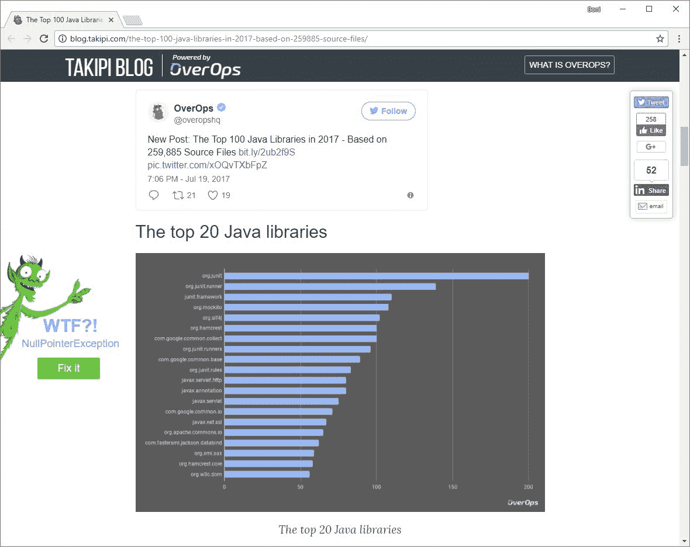
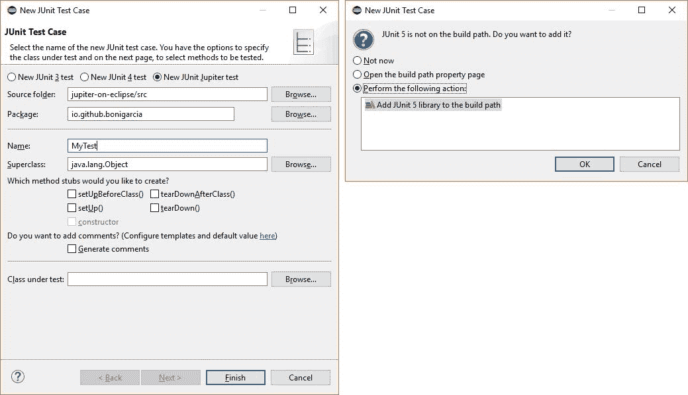
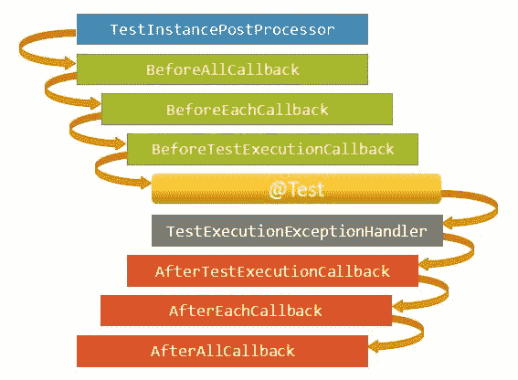

# JUnit 5 的新功能

那些能够想象任何事情的人，可以创造不可能的事情。

*- 艾伦·图灵*

JUnit 是 JVM 中最重要的测试框架，也是软件工程中最有影响力的框架之一。JUnit 5 是 JUnit 的下一代，其第一个**正式版本**（5.0.0）于 2017 年 9 月 10 日发布。正如我们将了解的那样，JUnit 5 相对于 JUnit 4 来说是一次小革命，提供了全新的架构、编程和扩展模型。本章内容包括以下内容：

+   **通往 JUnit 5**：在第一节中，我们将了解创建 JUnit 的新主要版本的动机（即 JUnit 4 的限制），指导 JUnit 5 开发的设计原则，以及 JUnit 5 开源社区的详细信息。

+   **JUnit 5 架构**：JUnit 5 是一个由三个主要组件组成的模块化框架，分别是 Platform、Jupiter 和 Vintage。

+   **在 JUnit 5 中运行测试**：我们将了解如何使用流行的构建工具（如 Maven 或 Gradle）以及 IDE（如 IntelliJ 或 Eclipse）运行 JUnit 5 测试。

+   **JUnit 5 的扩展模型**：扩展模型允许第三方库和框架通过它们自己的添加来扩展 JUnit 5 的编程模型。

# 通往 JUnit 5

自 2006 年 JUnit 4 首次发布以来，软件测试发生了很大变化。自那时起，不仅 Java 和 JVM 发生了变化，我们的测试需求也变得更加成熟。我们不再只编写单元测试。除了验证单个代码片段外，软件工程师和测试人员还要求其他类型的测试，如集成测试和端到端测试。

此外，我们对测试框架的期望已经增长。如今，我们要求这些框架具有高级功能，比如可扩展性或模块化等。在本节中，我们将了解 JUnit 4 的主要限制，JUnit 5 的愿景以及支持其开发的社区。

# JUnit 5 的动机

根据多项研究，JUnit 4 是 Java 项目中使用最多的库。例如，《GitHub 上排名前 100 的 Java 库》是 OverOps（@overopshq）发布的一份知名报告，OverOps 是一家专注于大规模 Java 和 Scala 代码库的软件分析公司。

在 2017 年的报告中，分析了 GitHub 上排名前 1000 的 Java 项目（按星级）使用的独特 Java 库的导入语句。根据结果，JUnit 4 是 Java 库的无可争议的王者：`org.junit`和`org.junit.runner`包的导入分别位列第一和第二。



GitHub 上排名前 20 的 Java 库

尽管事实如此，JUnit 4 是十多年前创建的一个框架，存在着一些重要的限制，这些限制要求对框架进行完全重新设计。

# 模块化

首先，JUnit 4 不是模块化的。如下图所示，JUnit 4 的架构完全是单片的。JUnit 4 的所有功能都由`junit.jar`依赖提供。因此，JUnit 4 中的不同测试机制，如测试发现和执行，在 JUnit 4 中是紧密耦合的。


JUnit 4 的架构

约翰内斯·林克（Johannes Link）是 JUnit 5 核心团队成员之一，他在 2015 年 8 月 13 日接受 Jax 杂志采访时总结了这个问题（在 JUnit 5 开始时）：

JUnit 作为一个平台的成功阻碍了它作为测试工具的发展。我们要解决的基本问题是通过分离足够强大和稳定的 API 来执行测试用例。

# JUnit 4 运行器

JUnit 4 的运行器 API 也有一个重要的威慑作用。正如在第一章中所描述的，“关于软件质量和 Java 测试的回顾”，在 JUnit 4 中，运行器是用于管理测试生命周期的 Java 类。JUnit 4 中的运行器 API 非常强大，但是有一个重要的缺点：运行器不可组合，也就是说，我们一次只能使用一个运行器。

例如，参数化测试无法与 Spring 测试支持结合使用，因为两个测试都会使用自己的运行器实现。在 Java 中，每个测试用例都使用自己独特的`@RunWith`注解。第一个使用`Parameterized`运行器。

```java
import org.junit.Test;
import org.junit.runner.RunWith;
import org.junit.runners.Parameterized;

@RunWith(Parameterized.class)
public class MyParameterizedTest {

   @Test
   public void myFirstTest() {
      // my test code
   }

}
```

虽然这个第二个例子使用了`SpringJUnit4ClassRunner`运行器，但由于 JUnit 4 的限制（运行器不可组合），它不能与前一个例子结合使用：

```java
import org.junit.Test;
import org.junit.runner.RunWith;
import org.springframework.test.context.junit4.SpringJUnit4ClassRunner;

@RunWith(SpringJUnit4ClassRunner.class)
public class MySpringTest {

   @Test
   public void yetAnotherTest() {
      // my test code
   }

}
```

# JUnit 4 规则

由于 JUnit 4 中对同一测试类中 JUnit 4 运行器的唯一性的严格限制，JUnit 的 4.7 版本引入了方法级规则的概念，这些规则是测试类中带有`@Rule`注解的字段。这些规则允许通过在执行测试之前和之后执行一些代码来添加或重新定义测试行为。JUnit 4.9 还包括类级别规则的概念，这些规则是在类中的所有测试之前和之后执行的规则。通过使用`@ClassRule`注解静态字段来标识这些规则，如下例所示：

```java
import org.junit.ClassRule;
import org.junit.Test;
import org.junit.rules.TemporaryFolder;

public class MyRuleTest {

   @ClassRule
   public static TemporaryFolder temporaryFolder = new TemporaryFolder();

   @Test
   public void anotherTest() {
      // my test code
   }

}
```

虽然规则更简单且大多可组合，但它们也有其他缺点。在使用 JUnit 4 规则进行复杂测试时的主要不便之处在于，我们无法使用单个规则实体来进行方法级和类级的测试。归根结底，这对自定义生命周期管理（在之前/之后的行为）施加了限制。

# JUnit 5 的开始

尽管 JUnit 4 是全球数百万 Java 开发人员的默认测试框架，但没有一位活跃的 JUnit 维护者受雇于其雇主从事这项工作。因此，为了克服 JUnit 4 的缺点，Johannes Link 和 Marc Philipp 于 2015 年 7 月在 Indiegogo（国际众筹网站）上启动了 JUnit Lambda 众筹活动（[`junit.org/junit4/junit-lambda-campaign.html`](http://junit.org/junit4/junit-lambda-campaign.html)）：


JUnit Lambda 众筹活动

JUnit Lambda 是该项目的名称，它是当前 JUnit 5 框架的种子。在项目名称中加入 lambda 一词强调了从项目一开始就使用 Java 8 的想法。引用 JUnit Lambda 项目网站：

目标是在 JVM 上为开发人员测试创建一个最新的基础。这包括专注于 Java 8 及以上，以及启用许多不同的测试风格。

JUnit Lambda 众筹活动从 2015 年 7 月持续到 10 月。这是一个成功的活动，从全球 474 个个人和公司筹集了 53,937 欧元。从这一点开始，JUnit 5 的启动团队成立了，加入了来自 Eclipse、Gradle、IntelliJ 或 Spring 的人员。

JUnit Lambda 项目成为 JUnit 5，并且指导开发过程的设计原则如下：

+   模块化：如前所述，JUnit 4 不是模块化的，这会导致一些问题。从一开始，JUnit 5 的架构就是完全模块化的，允许开发人员使用他们需要的框架的特定部分。

+   具有重点在可组合性上的强大扩展模型：可扩展性对于现代测试框架是必不可少的。因此，JUnit 5 应该提供与第三方框架（如 Spring 或 Mockito 等）的无缝集成。

+   API 分离：将测试发现和执行与测试定义分离。

+   与旧版本的兼容性：支持在新的 JUnit 5 平台中执行旧版 Java 3 和 Java 4。

+   用于编写测试的现代编程模型（Java 8）：如今，越来越多的开发人员使用 Java 8 的新功能编写代码，如 lambda 表达式。JUnit 4 是基于 Java 5 构建的，但 JUnit 5 是使用 Java 8 从头开始创建的。

# JUnit 5 社区

JUnit 5 的源代码托管在 GitHub 上（[`github.com/junit-team/junit5`](https://github.com/junit-team/junit5)）。JUnit 5 框架的所有模块都已根据开源许可证 EPL v1.0 发布。有一个例外，即名为`junit-platform-surefire-provider`的模块（稍后描述）已使用 Apache License v2.0 发布。

JUnit 开发路线图（[`github.com/junit-team/junit5/wiki/Roadmap`](https://github.com/junit-team/junit5/wiki/Roadmap)）以及不同发布和里程碑的定义和状态（[`github.com/junit-team/junit5/milestones/`](https://github.com/junit-team/junit5/milestones/)）在 GitHub 上是公开的。以下表格总结了这个路线图：

| 阶段 | 日期 | 发布 |
| --- | --- | --- |
| 0. 众筹 | 2015 年 7 月至 2015 年 10 月 | - |
| 1. 启动 | 2015 年 10 月 20 日至 22 日 | - |
| 2. 第一个原型 | 2015 年 10 月 23 日至 2015 年 11 月底 | - |
| 3. Alpha 版本 | 2016 年 2 月 1 日 | 5.0 Alpha |
| 4. **第一个里程碑** | 2016 年 7 月 9 日 | 5.0 M1：稳定的、有文档的面向 IDE 的 API（启动器 API 和引擎 SPI），动态测试 |
| 5. **额外的里程碑** | 2016 年 7 月 23 日（5.0 M2）2016 年 11 月 30 日（5.0 M3）2017 年 4 月 1 日（5.0 M4）2017 年 7 月 5 日（5.0 M5）2017 年 7 月 16 日（5.0 M6） | 5.0 M2：错误修复和小的改进发布 5.0 M3：JUnit 4 互操作性，额外的发现选择器 5.0 M4：测试模板，重复测试和参数化测试 5.0 M5：动态容器和小的 API 更改 5.0 M6：Java 9 兼容性，场景测试，JUnit Jupiter 的额外扩展 API |
| 6. **发布候选**（**RC**） | 2017 年 7 月 30 日 2017 年 7 月 30 日 2017 年 8 月 23 日 | 5.0 RC1：最终错误修复和文档改进 5.0 RC2：修复 Gradle 对*junit-jupiter-engine*的使用 5.0 RC3：配置参数和错误修复 |
| 7. **正式发布**（**GA**） | 2017 年 9 月 10 日 | 5.0 GA：第一个稳定版本发布 |

JUnit 5 的贡献者不仅仅是开发人员。贡献者还是测试人员、维护者和沟通者。在撰写本文时，GitHub 上最多的 JUnit 5 贡献者是：

+   Sam Brannen（[@sam_brannen](https://twitter.com/sam_brannen)）：Spring Framework 和 JUnit 5 的核心贡献者。Swiftmind 的企业 Java 顾问。Spring 和 JUnit 培训师。会议发言人。

+   Marc Philipp（[@marcphilipp](https://twitter.com/marcphilipp)）：LogMeIn 的高级软件工程师，JUnit 或 Usus 等开源项目的活跃贡献者。会议发言人。

+   Johannes Link（[@johanneslink](https://twitter.com/johanneslink)）：程序员和软件治疗师。JUnit 5 支持者。

+   Matthias Merdes：德国海德堡移动有限公司的首席开发人员。


GitHub 上最多的 JUnit 5 贡献者

以下列表提供了一些在线 JUnit 5 资源：

+   官方网站（[`junit.org/junit5/`](https://twitter.com/hashtag/JUnit5)）。

+   源代码（[`github.com/junit-team/junit5/`](https://github.com/junit-team/junit5/)）。

+   JUnit 5 开发者指南（[`junit.org/junit5/docs/current/user-guide/`](http://junit.org/junit5/docs/current/user-guide/)）。参考文档。

+   JUnit 团队的 Twitter（[`twitter.com/junitteam`](https://twitter.com/junitteam)）。通常，关于 JUnit 5 的推文都标有`#JUnit5`（[`twitter.com/hashtag/JUnit5`](https://twitter.com/hashtag/JUnit5)）。

+   问题（[`github.com/junit-team/junit5/issues`](https://github.com/junit-team/junit5/issues)）。GitHub 上的问题或对额外功能的建议。

+   Stack Overflow 上的问题（[`stackoverflow.com/questions/tagged/junit5`](https://stackoverflow.com/questions/tagged/junit5)）。Stack Overflow 是一个流行的计算机编程问答网站。标签`junit5`应该用于询问关于 JUnit 5 的问题。

+   JUnit 5 JavaDoc（[`junit.org/junit5/docs/current/api/`](http://junit.org/junit5/docs/current/api/)）。

+   JUnit 5 Gitter（[`gitter.im/junit-team/junit5`](https://gitter.im/junit-team/junit5)），这是一个即时通讯和聊天室系统，用于与 JUnit 5 团队成员和其他从业者直接讨论。

+   JVM 的开放测试联盟（[`github.com/ota4j-team/opentest4j`](https://github.com/ota4j-team/opentest4j)）。这是 JUnit 5 团队发起的一个倡议，其目标是为 JVM 上的测试库（JUnit、TestNG、Spock 等）和第三方断言库（Hamcrest、AssertJ 等）提供一个最小的共同基础。其想法是使用一组通用的异常，以便 IDE 和构建工具可以在所有测试场景中以一致的方式支持（到目前为止，JVM 上还没有测试的标准，唯一的共同构建块是 Java 异常`java.lang.AssertionError`）。

# JUnit 5 架构

JUnit 5 框架已经被设计为可以被不同的编程客户端消费。第一组客户端是 Java 测试。这些测试可以基于 JUnit 4（使用旧的测试编程模型的测试）、JUnit 5（使用全新的编程模型的测试）甚至其他类型的 Java 测试（第三方）。第二组客户端是构建工具（如 Maven 或 Gradle）和 IDE（如 IntelliJ 或 Eclipse）。

为了以松散耦合的方式实现所有这些部分的集成，JUnit 5 被设计为模块化的。如下图所示，JUnit 5 框架由三个主要组件组成，称为 Platform、Jupiter 和 Vintage：


JUnit 5 架构：高级组件

JUnit 5 架构的高级组件列举如下：

+   第一个高级组件称为*Jupiter*。它提供了 JUnit 5 框架全新的编程和扩展模型。

+   在 JUnit 5 的核心中，我们找到了 JUnit *Platform*。这个组件旨在成为 JVM 中执行任何测试框架的基础。换句话说，它提供了运行 Jupiter 测试、传统的 JUnit 4 以及第三方测试（例如 Spock、FitNesse 等）的机制。

+   JUnit 5 架构的最后一个高级组件称为*Vintage*。该组件允许在 JUnit 平台上直接运行传统的 JUnit 测试。

让我们更仔细地查看每个组件的细节，以了解它们的内部模块：


JUnit 5 架构：模块

如前图所示，有三种类型的模块：

+   **测试 API**：这些是面向用户（即软件工程师和测试人员）的模块。这些模块为特定的测试引擎提供了编程模型（例如，`junit-jupiter-api`用于 JUnit 5 测试，`junit`用于 JUnit 4 测试）。

+   **测试引擎**：这些模块允许在 JUnit 平台内执行一种测试（Jupiter 测试、传统的 JUnit 4 或其他 Java 测试）。它们是通过扩展通用的*Platform Engine*（`junit-platform-engine`）创建的。

+   **测试启动器**：这些模块为外部构建工具和 IDE 提供了在 JUnit 平台内进行测试发现的能力。这个 API 被工具如 Maven、Gradle、IntelliJ 等所使用，使用`junit-platform-launcher`模块。

由于这种模块化架构，JUnit 框架暴露了一组接口：

+   **API**（**应用程序编程接口**）用于编写测试，*Jupiter API*。这个 API 的详细描述就是所谓的 Jupiter 编程模型，它在本书的第三章*JUnit 5 标准测试*和第四章*使用高级 JUnit 功能简化测试*中有详细描述。

+   **SPI**（**服务提供者接口**）用于发现和执行测试，*Engine SPI*。这个 SPI 通常由测试引擎扩展，最终提供编写测试的编程模型。

+   用于测试发现和执行的 API，*Launcher API*。这个 API 通常由编程客户端（IDE 和构建工具）消耗。

API 和 SPI 都是软件工程师用于特定目的的一组资产（通常是类和接口）。不同之处在于 API 是*调用*，而 SPI 是*扩展*。

# 测试引擎 SPI

测试引擎 SPI 允许在 JVM 之上创建测试执行器。在 JUnit 5 框架中，有两个测试引擎实现：

+   `junit-vintage-engine`：这允许在 JUnit 平台中运行 JUnit 3 和 4 的测试。

+   `junit-jupiter-engine`：这允许在 JUnit 平台中运行 JUnit 5 的测试。

此外，第三方测试库（例如 Spock、TestNG 等）可以通过提供自定义测试引擎来插入 JUnit 平台。为此，这些框架应该通过扩展 JUnit 5 接口`org.junit.platform.engine.TestEngine`来创建自己的测试引擎。为了扩展这个接口，必须重写三个强制性方法：

+   `getId`：测试引擎的唯一标识符。

+   `discover`：查找和过滤测试的逻辑。

+   `execute`：运行先前找到的测试的逻辑。

以下示例提供了自定义测试引擎的框架：

```java
package io.github.bonigarcia;

import org.junit.platform.engine.EngineDiscoveryRequest;
import org.junit.platform.engine.ExecutionRequest;
import org.junit.platform.engine.TestDescriptor;
import org.junit.platform.engine.TestEngine;
import org.junit.platform.engine.UniqueId;
import org.junit.platform.engine.support.descriptor.EngineDescriptor;

public class MyCustomEngine implements TestEngine {

    public static final String *ENGINE_ID* = "my-custom-engine";

    @Override
    public String getId() {
        return *ENGINE_ID*;
    }

    @Override
    public TestDescriptor discover(EngineDiscoveryRequest discoveryRequest,
            UniqueId uniqueId) {
        // Discover test(s) and return a TestDescriptor object
        TestDescriptor testDescriptor = new EngineDescriptor(uniqueId,
                "My test");
        return testDescriptor;
    }

    @Override
    public void execute(ExecutionRequest request) {
        // Use ExecutionRequest to execute TestDescriptor
        TestDescriptor rootTestDescriptor =             
                request.getRootTestDescriptor();
        request.getEngineExecutionListener()
                .executionStarted(rootTestDescriptor);
    }

}
```

社区在 JUnit 5 团队的 GitHub 网站上的维基中维护了一份现有测试引擎的列表（例如 Specsy、Spek 等）：[`github.com/junit-team/junit5/wiki/Third-party-Extensions`](https://github.com/junit-team/junit5/wiki/Third-party-Extensions)。

# 测试启动器 API

JUnit 5 的目标之一是使 JUnit 与其编程客户端（构建工具和 IDE）之间的接口更加强大和稳定。为此目的，已经实现了测试启动器 API。这个 API 被 IDE 和构建工具用于发现、过滤和执行测试。

仔细查看此 API 的细节，我们会发现`LauncherDiscoveryRequest`类，它公开了一个流畅的 API，用于选择测试的位置（例如类、方法或包）。这组测试可以进行过滤，例如使用匹配模式：

```java
import static org.junit.platform.engine.discovery.ClassNameFilter.includeClassNamePatterns;
import static org.junit.platform.engine.discovery.DiscoverySelectors.selectClass;
import static org.junit.platform.engine.discovery.DiscoverySelectors.selectPackage;

import org.junit.platform.launcher.Launcher;
import org.junit.platform.launcher.LauncherDiscoveryRequest;
import org.junit.platform.launcher.TestPlan;
import org.junit.platform.launcher.core.LauncherDiscoveryRequestBuilder;
import org.junit.platform.launcher.core.LauncherFactory;

// Discover and filter tests
LauncherDiscoveryRequest request = LauncherDiscoveryRequestBuilder
     .*request*()
     .*selectors*(*selectPackage*("io.github.bonigarcia"),     
      selectClass(MyTest.class))
     .*filters*(i*ncludeClassNamePatterns*(".*Test")).build();
Launcher launcher = LauncherFactory.create();
TestPlan plan = launcher.discover(request);
```

之后，可以使用`TestExecutionListener`类执行生成的测试套件。这个类也可以用于获取反馈和接收事件：

```java
import org.junit.platform.launcher.TestExecutionListener;
import org.junit.platform.launcher.listeners.SummaryGeneratingListener;

// Executing tests
TestExecutionListener listener = new SummaryGeneratingListener();
launcher.registerTestExecutionListeners(listener);
launcher.execute(request);
```

# 在 JUnit 5 中运行测试

在撰写本文时，Jupiter 测试可以通过多种方式执行：

+   **使用构建工具**：Maven（在模块`junit-plaform-surefire-provider`中实现）或 Gradle（在模块`junit-platform-gradle-plugin`中实现）。

+   **使用控制台启动器**：一个命令行 Java 应用程序，允许从控制台启动 JUnit 平台。

+   **使用 IDE**：IntelliJ（自 2016.2 版）和 Eclipse（自 4.7 版，Oxygen）。

由于我们将要发现，并且由于 JUnit 5 的模块化架构，我们需要在我们的项目中包含三个依赖项：一个用于测试 API（实现测试），另一个用于测试引擎（运行测试），最后一个用于测试启动器（发现测试）。

# 使用 Maven 进行 Jupiter 测试

为了在 Maven 项目中运行 Jupiter 测试，我们需要正确配置`pom.xml`文件。首先，我们需要将`junit-jupiter-api`模块作为依赖项包含进去。这是为了编写我们的测试，通常使用测试范围：

```java
<dependencies>
   <dependency>
      <groupId>org.junit.jupiter</groupId>
      <artifactId>junit-jupiter-api</artifactId>
      <version>${junit.jupiter.version}</version>
      <scope>test</scope>
   </dependency>
</dependencies>
```

一般来说，建议使用最新版本的依赖项。为了检查该版本，我们可以在 Maven 中央仓库（[`search.maven.org/`](http://search.maven.org/)）上进行检查。

然后，必须声明`maven-surefire-plugin`。在内部，此插件需要两个依赖项：测试启动器（`junit-platform-surefire-provider`）和测试引擎（`junit-jupiter-engine`）：

```java
<build>
   <plugins>
      <plugin>
         <artifactId>maven-surefire-plugin</artifactId>
         <version>${maven-surefire-plugin.version}</version>
         <dependencies>
             <dependency>
                <groupId>org.junit.platform</groupId>
                <artifactId>junit-platform-surefire-provider</artifactId>
                <version>${junit.platform.version}</version>
            </dependency>
            <dependency>
               <groupId>org.junit.jupiter</groupId>
               <artifactId>junit-jupiter-engine</artifactId>
               <version>${junit.jupiter.version}</version>
            </dependency>
         </dependencies>
      </plugin>
   </plugins>
 </build>
```

本书的所有源代码都可以在 GitHub 存储库[`github.com/bonigarcia/mastering-junit5`](https://github.com/bonigarcia/mastering-junit5)上公开获取。

最后但同样重要的是，我们需要创建一个 Jupiter 测试用例。到目前为止，我们还没有学习如何实现 Jupiter 测试（这部分在第三章中有介绍，JUnit 5 标准测试）。然而，我们在这里执行的测试是演示 JUnit 5 框架执行的最简单的测试。Jupiter 测试在其最小表达形式中只是一个 Java 类，其中的一个（或多个）方法被注释为`@Test`（包`org.junit.jupiter.api`）。以下代码段提供了一个示例：

```java
package io.github.bonigarcia;

import static org.junit.jupiter.api.Assertions.assertEquals;

import org.junit.jupiter.api.Test;

class MyFirstJUnit5Test {

   @Test
   void myFirstTest() {
       String message = "1+1 should be equal to 2";
       System.*out*.println(message);
       *assertEquals*(2, 1 + 1, message);
   }

}
```

JUnit 在运行时需要 Java 8（或更高版本）。但是，我们仍然可以测试使用先前版本的 Java 编译的代码。

如下图所示，可以使用命令`mvn test`执行此测试：

！[](img/00024.gif)

使用 Maven 运行 Jupiter 测试

# 使用 Gradle 运行 Jupiter 测试

现在，我们将研究相同的示例，但这次使用 Gradle 执行。因此，我们需要配置`build.gradle`文件。在此文件中，我们需要定义：

+   Jupiter API 的依赖项（`junit-jupiter-api`）。

+   测试引擎的依赖项（`junit-jupiter-engine`）。

+   测试启动器的插件（`junit-platform-gradle-plugin`）。

`build.gradle`的完整源代码如下：

```java
buildscript {
   repositories {
      mavenCentral()
   }
   dependencies {
      classpath("org.junit.platform:junit-platform-gradle-plugin:${junitPlatformVersion}")
   }
}
repositories {
   mavenCentral()
}

apply plugin: 'java'
apply plugin: 'eclipse'
apply plugin: 'idea'
apply plugin: 'org.junit.platform.gradle.plugin'

compileTestJava {
   sourceCompatibility = 1.8
   targetCompatibility = 1.8
   options.compilerArgs += '-parameters'
}

dependencies {
   testCompile("org.junit.jupiter:junit-jupiter-api:${junitJupiterVersion}")
   testRuntime("org.junit.jupiter:junit-jupiter-engine:${junitJupiterVersion}")
}
```

我们使用命令`gradle test`来从命令行使用 Gradle 运行我们的 Jupiter 测试：

！[](img/00025.gif)

使用 Gradle 运行 Jupiter 测试

# 使用 Maven 运行传统测试

以下是我们想要在 JUnit 平台内运行传统测试（在本例中为 JUnit 4）的图像：

```java
package io.github.bonigarcia;

import static org.junit.Assert.assertEquals;

import org.junit.Test;

public class LegacyJUnit4Test {

   @Test
   public void myFirstTest() {
      String message = "1+1 should be equal to 2";
      System.*out*.println(message);
      *assertEquals*(message, 2, 1 + 1);
   }

}
```

为此，在 Maven 中，我们首先需要在`pom.xml`中包含旧的 JUnit 4 依赖项，如下所示：

```java
<dependencies>
   <dependency>
      <groupId>junit</groupId>
      <artifactId>junit</artifactId>
      <version>4.12</version>
      <scope>test</scope>
   </dependency>
</dependencies>
```

然后，我们需要包含`maven-surefire-plugin`，使用以下插件的依赖项：测试引擎（`junit-vintage-engine`）和测试启动器（`junit-platform-surefire-provider`）：

```java
<build>
   <plugins>
      <plugin>
         <artifactId>maven-surefire-plugin</artifactId>
         <version>${maven-surefire-plugin.version}</version>
         <dependencies>
            <dependency>
               <groupId>org.junit.platform</groupId>
               <artifactId>junit-platform-surefire-provider</artifactId>
               <version>${junit.platform.version}</version>
            </dependency>
            <dependency>
                <groupId>org.junit.vintage</groupId>
                <artifactId>junit-vintage-engine</artifactId>
                <version>${junit.vintage.version}</version>
            </dependency>
         </dependencies>
      </plugin>
   </plugins>
</build>
```

从命令行执行也将使用命令`mvn test`：

！[](img/00026.gif)

使用 Maven 运行传统测试

# 使用 Gradle 运行传统测试

如果我们想要执行之前示例中提到的相同测试（`io.github.bonigarcia.LegacyJUnit4Test`），但这次使用 Gradle，我们需要在`build.gradle`文件中包含以下内容：

+   JUnit 4.12 的依赖项。

+   测试引擎的依赖项（`junit-vintage-engine`）。

+   测试启动器的插件（`junit-platform-gradle-plugin`）。

因此，`build.gradle`的完整源代码如下：

```java
buildscript {
   repositories {
      mavenCentral()
   }
   dependencies {
      classpath("org.junit.platform:junit-platform-gradle-plugin:${junitPlatformVersion}")
   }
}

repositories {
   mavenCentral()
}

apply plugin: 'java'
apply plugin: 'eclipse'
apply plugin: 'idea'
apply plugin: 'org.junit.platform.gradle.plugin'

compileTestJava {
   sourceCompatibility = 1.8
   targetCompatibility = 1.8
   options.compilerArgs += '-parameters'
}

dependencies {
   testCompile("junit:junit:${junitLegacy}")
   testRuntime("org.junit.vintage:junit-vintage-engine:${junitVintageVersion}")
}
```

从命令行执行如下：


使用 Gradle 运行传统测试

# 控制台启动器

`ConsoleLauncher`是一个命令行 Java 应用程序，允许从控制台启动 JUnit 平台。例如，它可以用于从命令行运行 Vintage 和 Jupiter 测试。

包含所有依赖项的可执行 JAR 已发布在中央 Maven 仓库的`junit-platform-console-standalone`工件下。独立的控制台启动器可以如下执行：

```java
java -jar junit-platform-console-standalone-version.jar <Options>
```

示例 GitHub 存储库[*junit5-console-launcher*](https://github.com/bonigarcia/mastering-junit5/tree/master/junit5-console-launcher)包含了 Console Launcher 的简单示例。如下图所示，在 Eclipse 中创建了一个运行配置项，运行主类`org.junit.platform.console.ConsoleLauncher`。然后，使用选项`--select-class`和限定类名（在本例中为`io.github.bonigarcia.EmptyTest`）作为参数传递测试类名。之后，我们可以运行应用程序，在 Eclipse 的集成控制台中获取测试结果：


在 Eclipse 中使用 ConsoleLauncher 的示例

# 在 JUnit 4 中的 Jupiter 测试

JUnit 5 被设计为向前和向后兼容。一方面，Vintage 组件支持在 JUnit 3 和 4 上运行旧代码。另一方面，JUnit 5 提供了一个 JUnit 4 运行器，允许在支持 JUnit 4 但尚未直接支持新的 JUnit Platform 5 的 IDE 和构建系统中运行 JUnit 5。

让我们看一个例子。假设我们想在不支持 JUnit 5 的 IDE 中运行 Jupiter 测试，例如，一个旧版本的 Eclipse。在这种情况下，我们需要用`@RunWith(JUnitPlatform.class)`注解我们的 Jupiter 测试。`JUnitPlatform`运行器是一个基于 JUnit 4 的运行器，它可以在 JUnit 4 环境中运行任何编程模型受支持的测试。因此，我们的测试结果如下：

```java
package io.github.bonigarcia;

import static org.junit.jupiter.api.Assertions.assertEquals;

import org.junit.jupiter.api.Test;
import org.junit.platform.runner.JUnitPlatform;
import org.junit.runner.RunWith;

@RunWith(JUnitPlatform.class)
public class JUnit5CompatibleTest {

   @Test 
   void myTest() {
      String message = "1+1 should be equal to 2";
      System.*out*.println(message);
 *assertEquals*(2, 1 + 1, message);
   }

}
```

如果这个测试包含在一个 Maven 项目中，我们的`pom.xml`应该包含以下依赖项：

```java
<dependencies>
   <dependency>
      <groupId>org.junit.jupiter</groupId>
      <artifactId>junit-jupiter-api</artifactId>
      <version>${junit.jupiter.version}</version>
      <scope>test</scope>
    </dependency>
    <dependency>
       <groupId>org.junit.jupiter</groupId>
       <artifactId>junit-jupiter-engine</artifactId>
       <version>${junit.jupiter.version}</version>
       <scope>test</scope>
     </dependency>
     <dependency>
        <groupId>org.junit.platform</groupId>
        <artifactId>junit-platform-runner</artifactId>
        <version>${junit.platform.version}</version>
        <scope>test</scope>
     </dependency>
 </dependencies>
```

另一方面，对于 Gradle 项目，我们的`build.gradle`如下：

```java
buildscript {
   repositories {
      mavenCentral()
   }
   dependencies {
      classpath("org.junit.platform:junit-platform-gradle-plugin:${junitPlatformVersion}")
   }
}

repositories {
   mavenCentral()
}

apply plugin: 'java'
apply plugin: 'eclipse'
apply plugin: 'idea'
apply plugin: 'org.junit.platform.gradle.plugin'

compileTestJava {
   sourceCompatibility = 1.8
   targetCompatibility = 1.8
   options.compilerArgs += '-parameters'
}

dependencies {
   testCompile("org.junit.jupiter:junit-jupiter-api:${junitJupiterVersion}")
   testRuntime("org.junit.jupiter:junit-jupiter-engine:${junitJupiterVersion}")
   testCompile("org.junit.platform:junit-platform-runner:${junitPlatformVersion}")
}
```

# IntelliJ

IntelliJ 2016.2+是第一个原生支持执行 Jupiter 测试的 IDE。如下图所示，可以使用 IDE 的集成功能执行任何 Jupiter 测试：


在 IntelliJ 2016.2+中运行 Jupiter 测试

# Eclipse

Eclipse 4.7（*Oxygen*）支持 JUnit 5 的 beta 版本。由于这个原因，Eclipse 提供了直接在 Eclipse 中运行 Jupiter 测试的能力，如下面的截图所示：


在 Eclipse 4.7+中运行 Jupiter 测试

此外，Eclipse 4.7（*Oxygen*）提供了一个向导，可以简单地创建 Jupiter 测试，如下面的图片所示：



在 Eclipse 中创建 Jupiter 测试的向导

# JUnit 5 的扩展模型

如前所述，Jupiter 是 JUnit 5 的新编程模型的名称，详细描述在第三章中，*JUnit 5 标准测试*和第四章，*使用高级 JUnit 功能简化测试*，以及扩展模型。扩展模型允许使用自定义添加扩展 Jupiter 编程模型。由于这一点，第三方框架（如 Spring 或 Mockito 等）可以无缝地与 JUnit 5 实现互操作性。这些框架提供的扩展将在第五章中进行研究，*JUnit 5 与外部框架的集成*。在当前部分，我们分析扩展模型的一般性能以及 JUnit 5 中提供的扩展。

与 JUnit 4 中以前的扩展点相比（即测试运行器和规则），JUnit 5 的扩展模型由一个单一的、连贯的概念组成：**扩展 API**。这个 API 允许任何第三方（工具供应商、开发人员等）扩展 JUnit 5 的核心功能。我们需要了解的第一件事是，Jupiter 中的每个新扩展都实现了一个名为`Extension`的接口。这个接口是一个*标记*接口，也就是说，它是一个没有字段或方法的 Java 接口：

```java
package org.junit.jupiter.api.extension;

import static org.apiguardian.api.API.Status.STABLE;

import org.apiguardian.api.API;

/**
 * Marker interface for all extensions.
 *
 * @since 5.0
 */
@API(status = STABLE, since = "5.0")
public interface Extension {
}
```

为了简化 Jupiter 扩展的创建，JUnit 5 提供了一组扩展点，允许在测试生命周期的不同部分执行自定义代码。下表包含了 Jupiter 中的扩展点摘要，其详细信息将在下一节中介绍：

| **扩展点** | **由想要实现的扩展** |
| --- | --- |
| `TestInstancePostProcessor` | 在测试实例化后提供额外行为 |
| `BeforeAllCallback` | 在测试容器中所有测试被调用之前提供额外行为 |
| `BeforeEachCallback` | 在每个测试被调用前为测试提供额外行为 |
| `BeforeTestExecutionCallback` | 在每个测试执行前立即为测试提供额外行为 |
| `TestExecutionExceptionHandler` | 处理测试执行期间抛出的异常 |
| `AfterAllCallback` | 在所有测试被调用后，为测试容器提供额外行为 |
| `AfterEachCallback` | 在每个测试被调用后为测试提供额外行为 |
| `AfterTestExecutionCallback` | 在每个测试执行后立即为测试提供额外行为 |
| `ExecutionCondition` | 在运行时条件化测试执行 |
| `ParameterResolver` | 在运行时解析参数 |

一旦我们创建了一个扩展，为了使用它，我们需要使用注解 `ExtendWith`。这个注解可以用来注册一个或多个扩展。它可以声明在接口、类、方法、字段，甚至其他注解中：

```java
import org.junit.jupiter.api.Test;
import org.junit.jupiter.api.extension.ExtendWith;

public class MyTest {

   @ExtendWith(MyExtension.class)
   @Test
   public void test() {
     // My test logic
   }

}
```

# 测试生命周期

有一组旨在控制测试生命周期的扩展点。首先，`TestInstancePostProcessor` 可以用于在测试实例化后执行一些逻辑。之后，有不同的扩展来控制测试前阶段：

+   `BeforeAllCallback` 在所有测试之前定义要执行的逻辑。

+   `BeforeEachCallback` 在测试方法之前定义要执行的逻辑。

+   `BeforeTestExecutionCallback` 在测试方法之前定义要执行的逻辑。

同样，还有控制测试后阶段的扩展：

+   `AfterAllCallback` 在所有测试之后定义要执行的逻辑。

+   `AfterEachCallback` 在测试方法之后定义要执行的逻辑。

+   `AfterTestExecutionCallback` 在测试方法之后定义要执行的逻辑。

在 `Before*` 和 `After*` 回调之间，有一个提供收集异常的扩展：`TestExecutionExceptionHandler`。

所有这些回调及其在测试生命周期中的顺序如下图所示：



扩展回调的生命周期

让我们看一个例子。我们创建了一个名为 `IgnoreIOExceptionExtension` 的扩展，它实现了 `TestExecutionExceptionHandler`。在这个例子中，扩展检查异常是否是 `IOException`。如果是，异常就被丢弃：

```java
package io.github.bonigarcia;

import java.io.IOException;
import org.junit.jupiter.api.extension.ExtensionContext;
import org.junit.jupiter.api.extension.TestExecutionExceptionHandler;

public class IgnoreIOExceptionExtension
   implements TestExecutionExceptionHandler {

   @Override
   public void handleTestExecutionException(ExtensionContext context,
          Throwable throwable) throws Throwable {
      if (throwable instanceof IOException) {
         return;
      }
      throw throwable;
   }

}
```

考虑以下测试类，其中包含两个测试（`@Test`）。第一个用 `@ExtendWith` 和我们自定义的扩展（`IgnoreIOExceptionExtension`）进行了注释：

```java
package io.github.bonigarcia;

import java.io.IOException;
import org.junit.jupiter.api.Test;
import org.junit.jupiter.api.extension.ExtendWith;

public class ExceptionTest {

   @ExtendWith(IgnoreIOExceptionExtension.class)
   @Test
   public void firstTest() throws IOException {
      throw new IOException("IO Exception");
   }

   @Test
   public void secondTest() throws IOException {
      throw new IOException("My IO Exception");
   }

}
```

在执行这个测试类时，第一个测试成功了，因为 `IOException` 已经被我们的扩展内部处理了。另一方面，第二个测试会失败，因为异常没有被处理。

可以在控制台中看到这个测试类的执行结果。请注意，我们使用 Maven 命令 `mvn test -Dtest=ExceptionTest` 选择要执行的测试：


忽略异常示例的输出

# 条件扩展点

为了创建根据给定条件激活或停用测试的扩展，JUnit 5 提供了一个条件扩展点，称为 `ExecutionCondition`。下面的代码片段显示了这个扩展点的声明：

```java
package org.junit.jupiter.api.extension;

import static org.apiguardian.api.API.Status.STABLE;

import org.apiguardian.api.API;

@FunctionalInterface
@API(status = STABLE, since = "5.0")
public interface ExecutionCondition extends Extension {
   ConditionEvaluationResult evaluateExecutionCondition         
     ExtensionContext context);

}
```

该扩展可以用于停用容器中的所有测试（可能是一个类）或单个测试（可能是一个测试方法）。该扩展的示例在第三章的*C 条件测试执行*部分中提供，*JUnit 5 标准测试*。

# 依赖注入

`ParameterResolver`扩展提供了方法级别的依赖注入。在这个例子中，我们可以看到如何使用名为`MyParameterResolver`的`ParameterResolver`的自定义实现来在测试方法中注入参数。在代码后面，我们可以看到这个解析器将简单地注入硬编码的字符串参数，值为`my parameter`：

```java
package io.github.bonigarcia;

import org.junit.jupiter.api.extension.ExtensionContext;
import org.junit.jupiter.api.extension.ParameterContext;
import org.junit.jupiter.api.extension.ParameterResolutionException;
import org.junit.jupiter.api.extension.ParameterResolver;

public class MyParameterResolver implements ParameterResolver {

    @Override
    public boolean supportsParameter(ParameterContext parameterContext,
            ExtensionContext extensionContext)
            throws ParameterResolutionException {
        return true;
    }

    @Override
    public Object resolveParameter(ParameterContext parameterContext,
            ExtensionContext extensionContext)
            throws ParameterResolutionException {
        return "my parameter";
    }

}
```

然后，这个参数解析器可以像往常一样在测试中使用，声明为`@ExtendWith`注解：

```java
package io.github.bonigarcia;

import org.junit.jupiter.api.Test;
import org.junit.jupiter.api.extension.ExtendWith;

public class DependencyInjectionTest {

   @ExtendWith(MyParameterResolver.class)
   @Test
   public void test(Object parameter) {
      System.*out*.println("My parameter " + parameter);
   }
}
```

最后，如果我们执行这个测试（例如使用 Maven 和命令行），我们可以看到注入的参数被记录在标准输出中：


依赖注入扩展示例的输出

# 第三方扩展

```java
SpringExtension:
```

```java
package org.springframework.test.context.junit.jupiter;

import org.junit.jupiter.api.extension.*;

public class SpringExtension implements BeforeAllCallback,     
   AfterAllCallback,
   TestInstancePostProcessor, BeforeEachCallback, AfterEachCallback,
   BeforeTestExecutionCallback, AfterTestExecutionCallback,
   ParameterResolver {

   @Override
   public void afterTestExecution(TestExtensionContext context) 
    throws Exception {
      // implementation
   }

   // Rest of methods
}
```

JUnit 5 的现有扩展列表（例如 Spring，Selenium，Docker 等）由社区在 JUnit 5 团队的 GitHub 网站的 wiki 中维护：[`github.com/junit-team/junit5/wiki/Third-party-Extensions`](https://github.com/junit-team/junit5/wiki/Third-party-Extensions)。其中一些也在第五章中有详细介绍，*JUnit 5 与外部框架的集成*。

# 总结

本章概述了 JUnit 5 测试框架。由于 JUnit 4 的限制（单片架构，无法组合测试运行器，以及测试规则的限制），需要一个新的主要版本的框架。为了进行实现，JUnit Lambda 项目在 2015 年发起了一场众筹活动。结果，JUnit 5 开发团队诞生了，并于 2017 年 9 月 10 日发布了该框架的 GA 版本。

JUnit 5 被设计为现代化（即从一开始就使用 Java 8 和 Java 9 兼容），并且是模块化的。JUnit 5 内的三个主要组件是：Jupiter（新的编程和扩展模型），Platform（在 JVM 中执行任何测试框架的基础），以及 Vintage（与传统的 JUnit 3 和 4 测试集成）。在撰写本文时，JUnit 5 测试可以使用构建工具（Maven 或 Gradle）以及 IDE（IntelliJ 2016.2+或 Eclipse 4.7+）来执行。

JUnit 5 的扩展模型允许任何第三方扩展其核心功能。为了创建 JUnit 5 扩展，我们需要实现一个或多个 JUnit 扩展点（如`BeforeAllCallback`，`ParameterResolver`或`ExecutionCondition`等），然后使用`@ExtendWith`注解在我们的测试中注册扩展。

在接下来的第三章中，*JUnit 5 标准测试*，我们将学习 Jupiter 编程模型的基础知识。换句话说，我们将学习如何创建标准的 JUnit 5 测试。
