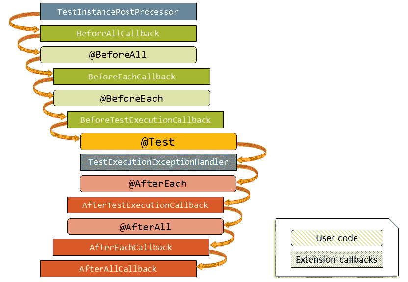
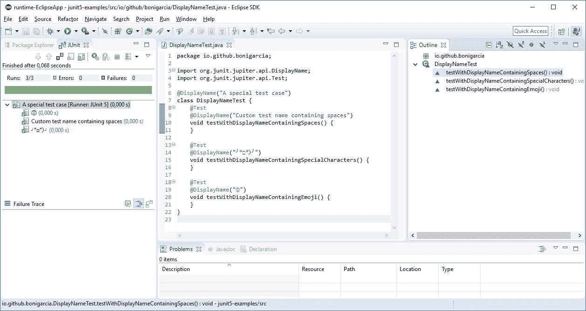
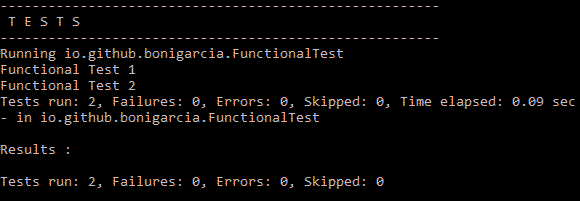
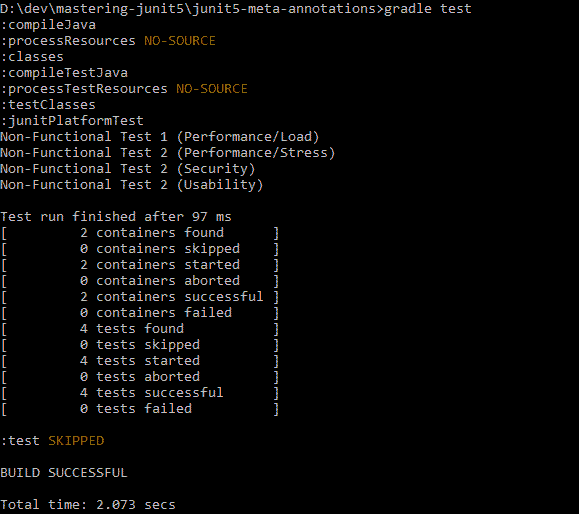
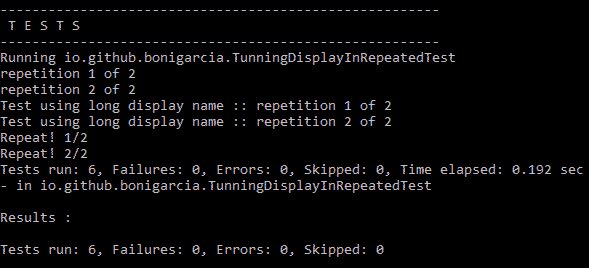
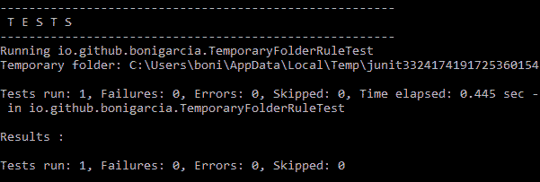

# JUnit 5 标准测试

言语是廉价的。给我看代码。

*- Linus Torvalds*

JUnit 5 提供了一个全新的编程模型，称为 Jupiter。我们可以将这个编程模型看作是软件工程师和测试人员的 API，允许创建 JUnit 5 测试。这些测试随后在 JUnit 平台上执行。正如我们将要发现的那样，Jupiter 编程模型允许创建许多不同类型的测试。本章介绍了 Jupiter 的基础知识。为此，本章结构如下：

+   **测试生命周期**：在本节中，我们分析了 Jupiter 测试的结构，描述了在 JUnit 5 编程模型中管理测试生命周期的注解。然后，我们了解如何跳过测试，以及如何为测试添加自定义显示名称的注解。

+   **断言**：在本节中，首先我们简要介绍了称为断言（也称为谓词）的验证资产。其次，我们研究了 Jupiter 中如何实现这些断言。最后，我们介绍了一些关于断言的第三方库，提供了一些 Hamcrest 的示例。

+   **标记和过滤测试**：在本节中，首先我们将学习如何为 Jupiter 测试创建标签，即如何在 JUnit 5 中创建标签。然后，我们将学习如何使用 Maven 和 Gradle 来过滤我们的测试。最后，我们将分析如何使用 Jupiter 创建元注解。

+   **条件测试执行**：在本节中，我们将学习如何根据给定条件禁用测试。之后，我们将回顾 Jupiter 中所谓的假设，这是 Jupiter 提供的一个机制，只有在某些条件符合预期时才运行测试。

+   **嵌套测试**：本节介绍了 Jupiter 如何允许表达一组测试之间的关系，称为嵌套测试。

+   **重复测试**：本节回顾了 Jupiter 如何提供重复执行指定次数的测试的能力。

+   **从 JUnit 4 迁移到 JUnit 5**：本节提供了一组关于 JUnit 5 和其直接前身 JUnit 4 之间主要区别的提示。然后，本节介绍了 Jupiter 测试中对几个 JUnit 4 规则的支持。

# 测试生命周期

正如我们在第一章中所看到的，一个单元测试用例由四个阶段组成：

1.  **设置**（可选）：首先，测试初始化测试夹具（在 SUT 的图片之前）。

1.  **练习**：其次，测试与 SUT 进行交互，从中获取一些结果。

1.  **验证**：第三，将来自被测试系统的结果与预期值进行比较，使用一个或多个断言（也称为谓词）。因此，创建了一个测试判决。

1.  **拆卸**（可选）：最后，测试释放测试夹具，将 SUT 恢复到初始状态。

在 JUnit 4 中，有不同的注解来控制这些测试阶段。JUnit 5 遵循相同的方法，即使用 Java 注解来标识 Java 类中的不同方法，实现测试生命周期。在 Jupiter 中，所有这些注解都包含在`org.junit.jupiter.api`包中。

JUnit 的最基本注解是`@Test`，它标识了必须作为测试执行的方法。因此，使用`org.junit.jupiter.api.Test`注解的 Java 方法将被视为测试。这个注解与 JUnit 4 的`@Test`的区别有两个方面。一方面，Jupiter 的`@Test`注解不声明任何属性。在 JUnit 4 中，`@Test`可以声明测试超时（作为长属性，以毫秒为单位的超时时间），另一方面，在 JUnit 5 中，测试类和测试方法都不需要是 public（这是 JUnit 4 中的要求）。

看一下下面的 Java 类。可能，这是我们可以用 Jupiter 创建的最简单的测试用例。它只是一个带有`@Test`注解的方法。测试逻辑（即前面描述的练习和验证阶段）将包含在`myTest`方法中。

```java
package io.github.bonigarcia;

import org.junit.jupiter.api.Test;

class SimpleJUnit5Test {

    @Test
    void mySimpleTest() {
          // My test logic here
    }

}
```

Jupiter 注解（也位于包`org.junit.jupiter.api`中）旨在控制 JUnit 5 测试中的设置和拆卸阶段，如下表所述：

| **JUnit 5 注解** | **描述** | **JUnit 4 的等效** |
| --- | --- | --- |
| `@BeforeEach` | 在当前类中的每个`@Test`之前执行的方法 | `@Before` |
| `@AfterEach` | 在当前类中的每个`@Test`之后执行的方法 | `@After` |
| `@BeforeAll` | 在当前类中的所有`@Test`之前执行的方法 | `@BeforeClass` |
| `@AfterAll` | 在当前类中的所有`@Test`之后执行的方法 | `@AfterClass` |

这些注解（`@BeforeEach`，`@AfterEach`，`@AfterAll`和`@BeforeAll`）注解的方法始终会被继承。

下图描述了这些注解在 Java 类中的执行顺序：


控制测试生命周期的 Jupiter 注解

让我们回到本节开头看到的测试的通用结构。现在，我们能够将 Jupiter 注解映射到测试用例的不同部分，以控制测试生命周期。如下图所示，我们通过使用`@BeforeAll`和`@BeforeEach`注解的方法进行设置阶段。然后，我们在使用`@Test`注解的方法中进行练习和验证阶段。最后，我们在使用`@AfterEach`和`@AfterAll`注解的方法中进行拆卸过程。


单元测试阶段与 Jupiter 注解之间的关系

让我们看一个简单的例子，它在一个单独的 Java 类中使用了所有这些注解。这个例子定义了两个测试（即，使用`@Test`注解的两个方法），并且我们使用`@BeforeAll`，`@BeforeEach`，`@AfterEach`和`@AfterAll`注解为测试生命周期的其余部分定义了额外的方法：

```java
package io.github.bonigarcia;

import org.junit.jupiter.api.AfterAll;
import org.junit.jupiter.api.AfterEach;
import org.junit.jupiter.api.BeforeAll;
import org.junit.jupiter.api.BeforeEach;
import org.junit.jupiter.api.Test;

class LifecycleJUnit5Test {

      @BeforeAll
      static void setupAll() {
            System.*out*.println("Setup ALL TESTS in the class");
      }

      @BeforeEach
      void setup() {
            System.*out*.println("Setup EACH TEST in the class");
      }

      @Test
      void testOne() {
            System.*out*.println("TEST 1");
      }

      @Test
      void testTwo() {
            System.*out*.println("TEST 2");
      }

      @AfterEach
      void teardown() {
            System.*out*.println("Teardown EACH TEST in the class");
      }

      @AfterAll
      static void teardownAll() {
            System.*out*.println("Teardown ALL TESTS in the class");
      }

}
```

如果我们运行这个测试类，首先会执行`@BeforeAll`。然后，两个测试方法将按顺序执行，即先执行第一个，然后执行另一个。在每次执行中，测试之前使用`@BeforeEach`注解的设置方法将在测试之前执行，然后执行`@AfterEach`方法。以下截图显示了使用 Maven 和命令行执行测试的情况：


控制其生命周期的 Jupiter 测试的执行

# 测试实例生命周期

为了提供隔离的执行，JUnit 5 框架在执行实际测试（即使用`@Test`注解的方法）之前创建一个新的测试实例。这种*每方法*的测试实例生命周期是 Jupiter 测试和其前身（JUnit 3 和 4）的行为。作为新功能，这种默认行为可以在 JUnit 5 中通过简单地使用`@TestInstance(Lifecycle.PER_CLASS)`注解来改变。使用这种模式，测试实例将每个类创建一次，而不是每个测试方法创建一次。

这种*每类*的行为意味着可以将`@BeforeAll`和`@AfterAll`方法声明为非静态的。这对于与一些高级功能一起使用非常有益，比如嵌套测试或默认测试接口（在下一章中解释）。 

总的来说，考虑到扩展回调（如第二章*JUnit 5 中的新功能*中所述的*JUnit 5 的扩展模型*），用户代码和扩展的相对执行顺序如下图所示：



用户代码和扩展的相对执行顺序

# 跳过测试

Jupiter 注释`@Disabled`（位于包`org.junit.jupiter.api`中）可用于跳过测试。它可以在类级别或方法级别使用。以下示例在方法级别使用注释`@Disabled`，因此强制跳过测试：

```java
package io.github.bonigarcia;

import org.junit.jupiter.api.Disabled;
import org.junit.jupiter.api.Test;

class DisabledTest {

    @Disabled
    @Test
    void skippedTest() {
    }

}
```

如下截图所示，当我们执行此示例时，测试将被视为已跳过：


禁用测试方法的控制台输出

在这个例子中，注释`@Disabled`放置在类级别，因此类中包含的所有测试都将被跳过。请注意，通常可以在注释中指定自定义消息，通常包含禁用的原因：

```java
package io.github.bonigarcia;

import org.junit.jupiter.api.Disabled;
import org.junit.jupiter.api.Test;

@Disabled("All test in this class will be skipped")
class AllDisabledTest {

    @Test
    void skippedTestOne() {
    }

    @Test
    void skippedTestTwo() {
    }

}
```

以下截图显示了在执行测试用例时（在此示例中使用 Maven 和命令行）跳过测试案例的情况：


禁用测试类的控制台输出

# 显示名称

JUnit 4 基本上通过使用带有`@Test`注释的方法的名称来识别测试。这对测试名称施加了限制，因为这些名称受到在 Java 中声明方法的方式的限制。

为了解决这个问题，Jupiter 提供了声明自定义显示名称（与测试名称不同）的能力。这是通过注释`@DisplayName`完成的。此注释为测试类或测试方法声明了自定义显示名称。此名称将由测试运行器和报告工具显示，并且可以包含空格、特殊字符，甚至表情符号。

看看以下示例。我们使用`@DisplayName`为测试类和类中声明的三个测试方法注释了自定义测试名称：

```java
package io.github.bonigarcia;

import org.junit.jupiter.api.DisplayName;
import org.junit.jupiter.api.Test;

@DisplayName("A special test case")
class DisplayNameTest {

    @Test
    @DisplayName("Custom test name containing spaces")
    void testWithDisplayNameContainingSpaces() {
    }

    @Test
    @DisplayName("(╯°Д°)╯")
    void testWithDisplayNameContainingSpecialCharacters() {
    }

    @Test
    @DisplayName("")
    void testWithDisplayNameContainingEmoji() {
    }

}
```

因此，当在符合 JUnit 5 的 IDE 中执行此测试时，我们会看到这些标签。以下图片显示了在 IntelliJ 2016.2+上执行示例的情况：


在 IntelliJ 中使用*@DisplayName*执行测试案例

另一方面，显示名称也可以在 Eclipse 4.7（Oxygen）或更新版本中看到：



在 Eclipse 中使用*@DisplayName*执行测试案例

# 断言

我们知道，测试案例的一般结构由四个阶段组成：设置、执行、验证和拆卸。实际测试发生在第二和第三阶段，当测试逻辑与被测试系统交互时，从中获得某种结果。这个结果在验证阶段与预期结果进行比较。在这个阶段，我们找到了我们所谓的断言。在本节中，我们将更仔细地研究它们。

断言（也称为谓词）是一个`boolean`语句，通常用于推理软件的正确性。从技术角度来看，断言由三部分组成（见列表后的图像）：

1.  首先，我们找到预期值，这些值来自我们称之为测试预言的东西。测试预言是预期输出的可靠来源，例如，系统规范。

1.  其次，我们找到真正的结果，这是由测试对 SUT 进行的练习阶段产生的。

1.  最后，这两个值使用一些逻辑比较器进行比较。这种比较可以通过许多不同的方式进行，例如，我们可以比较对象的身份（相等或不相等），大小（更高或更低的值），等等。结果，我们得到一个测试结论，最终将定义测试是否成功或失败。


断言的示意图

# Jupiter 断言

让我们继续讨论 JUnit 5 编程模型。Jupiter 提供了许多断言方法，例如 JUnit 4 中的方法，并且还添加了一些可以与 Java 8 lambda 一起使用的方法。所有 JUnit Jupiter 断言都是位于`org.junit.jupiter`包中的`Assertions`类中的静态方法。

以下图片显示了这些方法的完整列表：


Jupiter 断言的完整列表（类*org.junit.jupiter.Assertions*）

以下表格回顾了 Jupiter 中不同类型的基本断言：

| **断言** | **描述** |
| --- | --- |
| `fail` | 以给定的消息和/或异常失败测试 |
| `assertTrue` | 断言提供的条件为真 |
| `assertFalse` | 断言提供的条件为假 |
| `assertNull` | 断言提供的对象为 `null` |
| `assertNotNull` | 断言提供的对象不是 `null` |
| `assertEquals` | 断言两个提供的对象相等 |
| `assertArrayEquals` | 断言两个提供的数组相等 |
| `assertIterableEquals` | 断言两个可迭代对象深度相等 |
| `assertLinesMatch` | 断言两个字符串列表相等 |
| `assertNotEquals` | 断言两个提供的对象不相等 |
| `assertSame` | 断言两个对象相同，使用 `==` 进行比较 |
| `assertNotSame` | 断言两个对象不同，使用 `!=` 进行比较 |

对于表中包含的每个断言，都可以提供一个可选的失败消息（String）。这个消息始终是断言方法中的最后一个参数。这与 JUnit 4 有一点小区别，因为在 JUnit 4 中，这个消息是方法调用中的第一个参数。

以下示例显示了一个使用 `assertEquals`、`assertTrue` 和 `assertFalse` 断言的测试。请注意，我们在类的开头导入了静态断言方法，以提高测试逻辑的可读性。在示例中，我们找到了 `assertEquals` 方法，这里比较了两种原始类型（也可以用于对象）。其次，`assertTrue` 方法评估一个 `boolean` 表达式是否为真。第三，`assertFalse` 方法评估一个布尔表达式是否为假。在这种情况下，请注意消息是作为 Lamdba 表达式创建的。这样，断言消息会被懒惰地评估，以避免不必要地构造复杂的消息：

```java
package io.github.bonigarcia;

import static org.junit.jupiter.api.Assertions.assertEquals;
import static org.junit.jupiter.api.Assertions.assertFalse;
import static org.junit.jupiter.api.Assertions.assertTrue;

import org.junit.jupiter.api.Test;

class StandardAssertionsTest {

    @Test
    void standardAssertions() {
          *assertEquals*(2, 2);
          *assertTrue*(true,
          "The optional assertion message is now the last parameter");
          *assertFalse*(false, () -> "Really " + "expensive " + "message" 
            + ".");
    }

}
```

本节的以下部分将回顾 Jupiter 提供的高级断言：`assertAll`、`assertThrows`、`assertTimeout` 和 `assertTimeoutPreemptively`。

# 断言组

一个重要的 Jupiter 断言是 `assertAll`。这个方法允许同时对不同的断言进行分组。在分组断言中，所有断言都会被执行，任何失败都将一起报告。

方法 `assertAll` 接受 lambda 表达式（`Executable…`）的可变参数或这些表达式的流（`Stream<Executable>`）。可选地，`assertAll` 的第一个参数可以是一个用于标记断言组的字符串消息。

让我们看一个例子。在以下测试中，我们使用 lambda 表达式对一对 `assertEquals` 进行分组：

```java
package io.github.bonigarcia;

import static org.junit.jupiter.api.Assertions.assertAll;
import static org.junit.jupiter.api.Assertions.assertEquals;

import org.junit.jupiter.api.Test;

class GroupedAssertionsTest {

    @Test
    void groupedAssertions() {
          Address address = new Address("John", "Smith");
          // In a grouped assertion all assertions are executed, and any
          // failures will be reported together.
          *assertAll*("address", () -> *assertEquals*("John", 
          address.getFirstName()),
              () -> *assertEquals*("User", address.getLastName()));
    }

}
```

在执行这个测试时，将评估组中的所有断言。由于第二个断言失败（`lastname` 不匹配），在最终的判决中报告了一个失败，如下截图所示：


分组断言示例的控制台输出

# 断言异常

另一个重要的 Jupiter 断言是 `assertThrows`。这个断言允许验证在一段代码中是否引发了给定的异常。为此，`assertThrows` 方法接受两个参数。首先是预期的异常类，其次是可执行对象（lambda 表达式），其中应该发生异常：

```java
package io.github.bonigarcia;

import static org.junit.jupiter.api.Assertions.assertEquals;
import static org.junit.jupiter.api.Assertions.assertThrows;

import org.junit.jupiter.api.Test;

class ExceptionTest {

    @Test
    void exceptionTesting() {
          Throwable exception = 
            *assertThrows*(IllegalArgumentException.class,
            () -> {
               throw new IllegalArgumentException("a message");});
          *assertEquals*("a message", exception.getMessage());
    }

}
```

这里期望抛出 `IllegalArgumentException`，而这实际上是在这个 lambda 表达式中发生的。下面的截图显示了测试实际上成功了：


*assertThrows* 示例的控制台输出

# 断言超时

为了评估 JUnit 5 测试中的超时，Jupiter 提供了两个断言：`assertTimeout` 和 `assertTimeoutPreemptively`。一方面，`assertTimeout` 允许我们验证给定操作的超时。在这个断言中，使用标准 Java 包 `java.time` 的 `Duration` 类定义了预期时间。

我们将看到几个运行示例，以阐明这个断言方法的使用。在下面的类中，我们找到两个使用`assertTimeout`的测试。第一个测试旨在成功，因为我们期望给定操作的持续时间少于 2 分钟，而我们在那里什么也没做。另一方面，第二个测试将失败，因为我们期望给定操作的持续时间最多为 10 毫秒，而我们强制它持续 100 毫秒。

```java
package io.github.bonigarcia;

import static java.time.Duration.ofMillis;
import static java.time.Duration.ofMinutes;
import static org.junit.jupiter.api.Assertions.assertTimeout;

import org.junit.jupiter.api.Test;

class TimeoutExceededTest {

    @Test
    void timeoutNotExceeded() {
          *assertTimeout*(*ofMinutes*(2), () -> {
              // Perform task that takes less than 2 minutes
          });
    }

    @Test
    void timeoutExceeded() {
          *assertTimeout*(*ofMillis*(10), () -> {
              Thread.*sleep*(100);
          });
    }
}
```

当我们执行这个测试时，第二个测试被声明为失败，因为超时已经超过了 90 毫秒：


*assertTimeout*第一个示例的控制台输出

让我们看看使用`assertTimeout`的另外两个测试。在第一个测试中，`assertTimeout`在给定的超时时间内将代码作为 lambda 表达式进行评估，获取其结果。在第二个测试中，`assertTimeout`在给定的超时时间内评估一个方法，获取其结果：

```java
package io.github.bonigarcia;

import static java.time.Duration.ofMinutes;
import static org.junit.jupiter.api.Assertions.assertEquals;
import static org.junit.jupiter.api.Assertions.assertTimeout;

import org.junit.jupiter.api.Test;

class TimeoutWithResultOrMethodTest {

    @Test
    void timeoutNotExceededWithResult() {
          String actualResult = *assertTimeout*(*ofMinutes*(1), () -> {
              return "hi there";
          });
          *assertEquals*("hi there", actualResult);
    }

    @Test
    void timeoutNotExceededWithMethod() {
          String actualGreeting = *assertTimeout*(*ofMinutes*(1),
              TimeoutWithResultOrMethodTest::*greeting*);
          *assertEquals*("hello world!", actualGreeting);
    }

    private static String greeting() {
          return "hello world!";
    }

}
```

在这两种情况下，测试所花费的时间都少于预期，因此它们都成功了：


*assertTimeout*第二个示例的控制台输出

另一个 Jupiter 断言超时的方法称为`assertTimeoutPreemptively`。与`assertTimeout`相比，`assertTimeoutPreemptively`的区别在于`assertTimeoutPreemptively`不会等到操作结束，当超过预期的超时时，执行会被中止。

在这个例子中，测试将失败，因为我们模拟了一个持续 100 毫秒的操作，并且我们定义了 10 毫秒的超时：

```java
package io.github.bonigarcia;

import static java.time.Duration.ofMillis;
import static org.junit.jupiter.api.Assertions.assertTimeoutPreemptively;

import org.junit.jupiter.api.Test;

class TimeoutWithPreemptiveTerminationTest {

      @Test
      void timeoutExceededWithPreemptiveTermination() {
            *assertTimeoutPreemptively*(*ofMillis*(10), () -> {
                 Thread.*sleep*(100);
            });
      }

}
```

在这个例子中，当达到 10 毫秒的超时时，测试立即被声明为失败：


*assertTimeoutPreemptively*示例的控制台输出

# 第三方断言库

正如我们所见，Jupiter 提供的内置断言已经足够满足许多测试场景。然而，在某些情况下，可能需要更多的额外功能，比如匹配器。在这种情况下，JUnit 团队建议使用以下第三方断言库：

+   Hamcrest（[`hamcrest.org/`](http://hamcrest.org/)）：一个断言框架，用于编写允许以声明方式定义规则的匹配器对象。

+   AssertJ（[`joel-costigliola.github.io/assertj/`](http://joel-costigliola.github.io/assertj/)）：用于 Java 的流畅断言。

+   Truth（[`google.github.io/truth/`](https://google.github.io/truth/)）：一个用于使测试断言和失败消息更易读的断言 Java 库。

在本节中，我们将简要回顾一下 Hamcrest。这个库提供了断言`assertThat`，它允许创建可读性高且高度可配置的断言。方法`assertThat`接受两个参数：第一个是实际对象，第二个是`Matcher`对象。这个匹配器实现了接口`org.hamcrest.Matcher`，并允许对期望进行部分或完全匹配。Hamcrest 提供了不同的匹配器实用程序，比如`is`，`either`，`or`，`not`和`hasItem`。匹配器方法使用了构建器模式，允许组合一个或多个匹配器来构建一个匹配器链。

为了使用 Hamcrest，首先我们需要在项目中导入依赖项。在 Maven 项目中，这意味着我们必须在`pom.xml`文件中包含以下依赖项：

```java
<dependency>
      <groupId>org.hamcrest</groupId>
      <artifactId>hamcrest-core</artifactId>
      <version>${hamcrest.version}</version>
      <scope>test</scope>
</dependency>
```

如果我们使用 Gradle，我们需要在`build.gradle`文件中添加相应的配置：

```java
dependencies {
      testCompile("org.hamcrest:hamcrest-core:${hamcrest}")
}
```

通常情况下，建议使用最新版本的 Hamcrest。我们可以在 Maven 中央网站上检查它（[`search.maven.org/`](http://search.maven.org/)）。

以下示例演示了如何在 Jupiter 测试中使用 Hamcrest。具体来说，这个测试使用了断言`assertThat`，以及匹配器`containsString`，`equalTo`和`notNullValue`：

```java
package io.github.bonigarcia;

import static org.hamcrest.CoreMatchers.containsString;
import static org.hamcrest.CoreMatchers.equalTo;
import static org.hamcrest.CoreMatchers.notNullValue;
import static org.hamcrest.MatcherAssert.assertThat;

import org.junit.jupiter.api.Test;

class HamcrestTest {

    @Test
    void assertWithHamcrestMatcher() {
          *assertThat*(2 + 1, *equalTo*(3));
          *assertThat*("Foo", *notNullValue*());
          *assertThat*("Hello world", *containsString*("world"));
    }

}
```

如下截图所示，这个测试执行时没有失败：


使用 Hamcrest 断言库的示例的控制台输出

# 标记和过滤测试

在 JUnit 5 编程模型中，可以通过注解`@Tag`（包`org.junit.jupiter.api`）为测试类和方法打标签。这些标签可以后来用于过滤测试的发现和执行。在下面的示例中，我们看到了在类级别和方法级别使用`@Tag`的情况：

```java
package io.github.bonigarcia;

import org.junit.jupiter.api.Tag;
import org.junit.jupiter.api.Test;

@Tag("simple")
class SimpleTaggingTest {

      @Test
      @Tag("taxes")
      void testingTaxCalculation() {
      }

}
```

从 JUnit 5 M6 开始，标记测试的标签应满足以下语法规则：

+   标签不能为空或空白。

+   修剪的标签（即去除了前导和尾随空格的标签）不得包含空格。

+   修剪的标签不得包含 ISO 控制字符，也不得包含以下保留字符：`,`，`(`，`)`，`&`，`|`和`!`。

# 使用 Maven 过滤测试

正如我们已经知道的，我们需要在 Maven 项目中使用`maven-surefire-plugin`来执行 Jupiter 测试。此外，该插件允许我们以多种方式过滤测试执行：通过 JUnit 5 标签进行过滤，还可以使用`maven-surefire-plugin`的常规包含/排除支持。

为了按标签过滤，应该使用`maven-surefire-plugin`配置的属性`includeTags`和`excludeTags`。让我们看一个示例来演示如何。考虑同一个 Maven 项目中包含的以下测试。一方面，这个类中的所有测试都被标记为`functional`。

```java
package io.github.bonigarcia;

import org.junit.jupiter.api.Tag;
import org.junit.jupiter.api.Test;

@Tag("functional")
class FunctionalTest {

    @Test
    void testOne() {
        System.*out*.println("Functional Test 1");
    }

    @Test
    void testTwo() {
        System.*out*.println("Functional Test 2");
    }

}
```

另一方面，第二个类中的所有测试都被标记为`non-functional`，每个单独的测试也被标记为更多的标签（`performance`，`security`，`usability`等）：

```java
package io.github.bonigarcia;

import org.junit.jupiter.api.Tag;
import org.junit.jupiter.api.Test;

@Tag("non-functional")
class NonFunctionalTest {

    @Test
    @Tag("performance")
    @Tag("load")
    void testOne() {
        System.*out*.println("Non-Functional Test 1 (Performance/Load)");
    }

    @Test
    @Tag("performance")
    @Tag("stress")
    void testTwo() {
        System.*out*.println("Non-Functional Test 2 (Performance/Stress)");
    }

    @Test
    @Tag("security")
    void testThree() {
        System.*out*.println("Non-Functional Test 3 (Security)");
    }

    @Test
    @Tag("usability")
    void testFour() {
        System.*out*.println("Non-Functional Test 4 (Usability)");    }

}
```

如前所述，我们在 Maven 的`pom.xml`文件中使用配置关键字`includeTags`和`excludeTags`。在这个例子中，我们包含了带有标签`functional`的测试，并排除了`non-functional`：

```java
    <build>
        <plugins>
            <plugin>
                <artifactId>maven-surefire-plugin</artifactId>
                <version>${maven-surefire-plugin.version}</version>
                <configuration>
                    <properties>
                        <includeTags>functional</includeTags>
                        <excludeTags>non-functional</excludeTags>
                    </properties>
                </configuration>
                <dependencies>
                    <dependency>
                        <groupId>org.junit.platform</groupId>
                        <artifactId>junit-platform-surefire-provider</artifactId>
                        <version>${junit.platform.version}</version>
                    </dependency>
                    <dependency>
                        <groupId>org.junit.jupiter</groupId>
                        <artifactId>junit-jupiter-engine</artifactId>
                        <version>${junit.jupiter.version}</version>
                    </dependency>
                </dependencies>
            </plugin>
        </plugins>
    </build>
```

结果是，当我们尝试执行项目中的所有测试时，只有两个测试会被执行（带有标签`functional`的测试），其余的测试不被识别为测试：



通过标签过滤的 Maven 执行

# Maven 常规支持

Maven 插件的常规包含/排除支持仍然可以用于选择由`maven-surefire-plugin`执行的测试。为此，我们使用关键字`includes`和`excludes`来配置插件执行时用于过滤的测试名称模式。请注意，对于包含和排除，可以使用正则表达式来指定测试文件名的模式：

```java
<configuration>
   <includes>
      <include>**/Test*.java</include>
      <include>**/*Test.java</include>
      <include>**/*TestCase.java</include>
   </includes>
</configuration>
<configuration>
   <excludes>
      <exclude>**/TestCircle.java</exclude>
      <exclude>**/TestSquare.java</exclude>
   </excludes>
</configuration>
```

这三个模式，即包含单词*Test*或以*TestCase*结尾的 Java 文件，默认情况下由*maven-surefire 插件*包含。

# 使用 Gradle 过滤测试

现在让我们转到 Gradle。正如我们已经知道的，我们也可以使用 Gradle 来运行 JUnit 5 测试。关于过滤过程，我们可以根据以下选择要执行的测试：

+   测试引擎：使用关键字引擎，我们可以包含或排除要使用的测试引擎（即`junit-jupiter`或`junit-vintage`）。

+   Jupiter 标签：使用关键字`tags`。

+   Java 包：使用关键字`packages`。

+   类名模式：使用关键字`includeClassNamePattern`。

默认情况下，测试计划中包含所有引擎和标签。只应用包含单词`Tests`的类名。让我们看一个工作示例。我们在前一个 Maven 项目中重用相同的测试，但这次是在一个 Gradle 项目中：

```java
junitPlatform {
      filters {
            engines {
                  include 'junit-jupiter'
                  exclude 'junit-vintage'
            }
            tags {
                  include 'non-functional'
                  exclude 'functional'
            }
            packages {
                  include 'io.github.bonigarcia'
                  exclude 'com.others', 'org.others'
            }
            includeClassNamePattern '.*Spec'
            includeClassNamePatterns '.*Test', '.*Tests'
      }
}
```

请注意，我们包含标签`non-functional`并排除`functional`，因此我们执行了四个测试：


通过标签过滤的 Gradle 执行

# 元注解

本节的最后部分是关于元注释的定义。JUnit Jupiter 注释可以在其他注释的定义中使用（即可以用作元注释）。这意味着我们可以定义自己的组合注释，它将自动继承其元注释的语义。这个特性非常方便，可以通过重用 JUnit 5 注释`@Tag`来创建我们自定义的测试分类。

让我们看一个例子。考虑测试用例的以下分类，其中我们将所有测试分类为功能和非功能，然后在非功能测试下再进行另一级分类：


测试的示例分类（功能和非功能）

有了这个方案，我们将为树结构的叶子创建我们自定义的元注释：`@Functional`，`@Security`，`@Usability`，`@Accessiblity`，`@Load`和`@Stress`。请注意，在每个注释中，我们使用一个或多个`@Tag`注释，具体取决于先前定义的结构。首先，我们可以看到`@Functional`的声明：

```java
package io.github.bonigarcia;

import java.lang.annotation.ElementType;
import java.lang.annotation.Retention;
import java.lang.annotation.RetentionPolicy;
import java.lang.annotation.Target;
import org.junit.jupiter.api.Tag;

@Target({ ElementType.***TYPE**, ElementType.**METHOD** })* @Retention(RetentionPolicy.***RUNTIME**)* @Tag("functional")
public @interface Functional {
}
```

然后，我们使用标签`non-functional`和`security`定义注释`@Security`：

```java
package io.github.bonigarcia;

import java.lang.annotation.ElementType;
import java.lang.annotation.Retention;
import java.lang.annotation.RetentionPolicy;
import java.lang.annotation.Target;
import org.junit.jupiter.api.Tag;

@Target({ ElementType.***TYPE**, ElementType.**METHOD** })* @Retention(RetentionPolicy.***RUNTIME**)* @Tag("non-functional")
@Tag("security")
public @interface Security {
}
```

同样，我们定义注释`@Load`，但这次标记为`non-functional`，`performance`和`load`：

```java
package io.github.bonigarcia;

import java.lang.annotation.ElementType;
import java.lang.annotation.Retention;
import java.lang.annotation.RetentionPolicy;
import java.lang.annotation.Target;
import org.junit.jupiter.api.Tag;

@Target({ ElementType.***TYPE**, ElementType.**METHOD** })* @Retention(RetentionPolicy.***RUNTIME**)* @Tag("non-functional")
@Tag("performance")
@Tag("load")
public @interface Load {
}
```

最后，我们创建注释`@Stress`（带有标签`non-functional`，`performance`和`stress`）：

```java
package io.github.bonigarcia;

import java.lang.annotation.ElementType;
import java.lang.annotation.Retention;
import java.lang.annotation.RetentionPolicy;
import java.lang.annotation.Target;
import org.junit.jupiter.api.Tag;

@Target({ ElementType.***TYPE**, ElementType.**METHOD** })* @Retention(RetentionPolicy.***RUNTIME**)* @Tag("non-functional")
@Tag("performance")
@Tag("stress")
public @interface Stress {
}
```

现在，我们可以使用我们的注释来标记（以及稍后过滤）测试。例如，在以下示例中，我们在类级别使用注释`@Functional`：

```java
package io.github.bonigarcia;

import org.junit.jupiter.api.Test;

@Functional
class FunctionalTest {

      @Test
      void testOne() {
            System.*out*.println("Test 1");
      }

      @Test
      void testTwo() {
            System.*out*.println("Test 2");
      }

}
```

我们还可以在方法级别使用注释。在以下测试中，我们使用不同的注释（`@Load`，`@Stress`，`@Security`和`@Accessibility`）对不同的测试（方法）进行注释：

```java
package io.github.bonigarcia;

import org.junit.jupiter.api.Test;

class NonFunctionalTest {

    @Test
    @Load
    void testOne() {
        System.*out*.println("Test 1");
    }

    @Test
    @Stress
    void testTwo() {
        System.*out*.println("Test 2");
    }

    @Test
    @Security
    void testThree() {
        System.*out*.println("Test 3");
    }

    @Test
    @Usability
    void testFour() {
        System.*out*.println("Test 4");    }

}
```

总之，我们可以通过简单地更改包含的标签来过滤测试。一方面，我们可以按标签`functional`进行过滤。请注意，在这种情况下，只有两个测试被执行。以下代码片段显示了使用 Maven 进行此类过滤的输出：


使用 Maven 和命令行按标签（功能）过滤测试

另一方面，我们也可以使用不同的标签进行过滤，例如`non-functional`。以下图片显示了这种类型的过滤示例，这次使用 Gradle。和往常一样，我们可以通过分叉 GitHub 存储库（[`github.com/bonigarcia/mastering-junit5`](https://github.com/bonigarcia/mastering-junit5)）来玩这些示例：

>

使用 Gradle 和命令行按标签（非功能）过滤测试

# 条件测试执行

为了为测试执行建立自定义条件，我们需要使用 JUnit 5 扩展模型（在第二章中介绍，*JUnit 5 的新功能*，在*JUnit 5 的扩展模型*部分引入）。具体来说，我们需要使用名为`ExecutionCondition`的条件扩展点。此扩展可以用于停用类中的所有测试或单个测试。

我们将看到一个工作示例，其中我们创建一个自定义注释来基于操作系统禁用测试。首先，我们创建一个自定义实用枚举来选择一个操作系统（`WINDOWS`，`MAC`，`LINUX`和`OTHER`）：

```java
package io.github.bonigarcia;

public enum Os {
    ***WINDOWS***, ***MAC***, ***LINUX***, ***OTHER***;

    public static Os determine() {
        Os out = ***OTHER***;
        String myOs = System.*getProperty*("os.name").toLowerCase();
        if (myOs.contains("win")) {
            out = ***WINDOWS***;
        } 
        else if (myOs.contains("mac")) {
            out = ***MAC***;
        } 
        else if (myOs.contains("nux")) {
            out = ***LINUX***;
        }
        return out;
    }
}
```

然后，我们创建`ExecutionCondition`的扩展。在这个例子中，通过检查自定义注释`@DisabledOnOs`是否存在来进行评估。当存在注释`@DisabledOnOs`时，操作系统的值将与当前平台进行比较。根据该条件的结果，测试将被禁用或启用。

```java
package io.github.bonigarcia;

import java.lang.reflect.AnnotatedElement;
import java.util.Arrays;
import java.util.Optional;
import org.junit.jupiter.api.extension.ConditionEvaluationResult;
import org.junit.jupiter.api.extension.ExecutionCondition;
import org.junit.jupiter.api.extension.ExtensionContext;
import org.junit.platform.commons.util.AnnotationUtils;

public class OsCondition implements ExecutionCondition {

    @Override
    public ConditionEvaluationResult evaluateExecutionCondition(
            ExtensionContext context) {
          Optional<AnnotatedElement> element = context.getElement();
          ConditionEvaluationResult out = ConditionEvaluationResult
                .*enabled*("@DisabledOnOs is not present");
          Optional<DisabledOnOs> disabledOnOs = AnnotationUtils
                .*findAnnotation*(element, DisabledOnOs.class);
          if (disabledOnOs.isPresent()) {
             Os myOs = Os.*determine*();
             if(Arrays.asList(disabledOnOs.get().value())
                 .contains(myOs)) {
             out = ConditionEvaluationResult
               .*disabled*("Test is disabled on " + myOs);
             } 
 else {
               out = ConditionEvaluationResult
                .*enabled*("Test is not disabled on " + myOs);
             }
           }
           System.*out*.println("--> " + out.getReason().get());
           return out;
    }

}
```

此外，我们需要创建我们的自定义注释`@DisabledOnOs`，该注释也使用`@ExtendWith`进行注释，指向我们的扩展点。

```java
package io.github.bonigarcia;

import java.lang.annotation.ElementType;
import java.lang.annotation.Retention;
import java.lang.annotation.RetentionPolicy;
import java.lang.annotation.Target;
import org.junit.jupiter.api.extension.ExtendWith;

@Target({ ElementType.*TYPE*, ElementType.*METHOD* })
@Retention(RetentionPolicy.*RUNTIME*)
@ExtendWith(OsCondition.class)
public @interface DisabledOnOs {
    Os[] value();
}
```

最后，我们在 Jupiter 测试中使用我们的注释`@DisabledOnOs`。

```java
import org.junit.jupiter.api.Test;

import static io.github.bonigarcia.Os.*MAC*;
import static io.github.bonigarcia.Os.*LINUX*;

class DisabledOnOsTest {

    @DisabledOnOs({ *MAC*, *LINUX* })
    @Test
    void conditionalTest() {
        System.*out*.println("This test will be disabled on MAC and LINUX");
    }

}
```

如果我们在 Windows 机器上执行此测试，则测试不会被跳过，如下面的快照所示：


条件测试示例的执行

# 假设

在本节的这一部分是关于所谓的假设。假设允许我们仅在某些条件符合预期时运行测试。所有 JUnit Jupiter 假设都是位于`org.junit.jupiter`包内的`Assumptions`类中的静态方法。以下截图显示了该类的所有方法：


*org.junit.jupiter.Assumptions*类的方法

一方面，`assumeTrue`和`assumeFalse`方法可用于跳过未满足前提条件的测试。另一方面，`assumingThat`方法用于条件测试中的一部分的执行：

```java
package io.github.bonigarcia;

import static org.junit.jupiter.api.Assertions.*fail*;
import static org.junit.jupiter.api.Assumptions.*assumeFalse*;
import static org.junit.jupiter.api.Assumptions.*assumeTrue*;
import static org.junit.jupiter.api.Assumptions.*assumingThat*;

import org.junit.jupiter.api.Test;

class AssumptionsTest {

    @Test
    void assumeTrueTest() {
        *assumeTrue*(false);
        *fail*("Test 1 failed");
    }

    @Test
    void assumeFalseTest() {
        *assumeFalse*(this::getTrue);
        *fail*("Test 2 failed");
    }

    private boolean getTrue() {
        return true;
    }

    @Test
    void assummingThatTest() {
        *assumingThat*(false, () -> *fail*("Test 3 failed"));
    }

}
```

请注意，在这个示例中，前两个测试（`assumeTrueTest`和`assumeFalseTest`）由于假设条件不满足而被跳过。然而，在`assummingThatTest`测试中，只有测试的这一部分（在这种情况下是一个 lambda 表达式）没有被执行，但整个测试并没有被跳过：


假设测试示例的执行

# 嵌套测试

嵌套测试使测试编写者能够更多地表达一组测试中的关系和顺序。JUnit 5 使得嵌套测试类变得轻而易举。我们只需要用`@Nested`注解内部类，其中的所有测试方法也将被执行，从顶级类中定义的常规测试到每个内部类中定义的测试。

我们需要考虑的第一件事是，只有非静态嵌套类（即内部类）才能作为`@Nested`测试。嵌套可以任意深入，并且每个测试的设置和拆卸（即`@BeforeEach`和`@AfterEach`方法）都会在嵌套测试中继承。然而，内部类不能定义`@BeforeAll`和`@AfterAll`方法，因为 Java 不允许内部类中有静态成员。然而，可以使用`@TestInstance(Lifecycle.PER_CLASS)`注解在测试类中避免这种限制。正如本章节中的*测试实例生命周期*部分所描述的，该注解强制每个类实例化一个测试实例，而不是每个方法实例化一个测试实例（默认行为）。这样，`@BeforeAll`和`@AfterAll`方法就不需要是静态的，因此可以在嵌套测试中使用。

让我们看一个由一个 Java 类组成的简单示例，该类有两个级别的内部类，即，该类包含两个嵌套的内部类，这些内部类带有`@Nested`注解。正如我们所看到的，该类的三个级别都有测试。请注意，顶级类定义了一个设置方法（`@BeforeEach`），并且第一个嵌套类（在示例中称为`InnerClass1`）也是如此。在顶级类中，我们定义了一个单一的测试（称为`topTest`），并且在每个嵌套类中，我们找到另一个测试（分别称为`innerTest1`和`innerTest2`）：

```java
package io.github.bonigarcia;

import org.junit.jupiter.api.BeforeEach;
import org.junit.jupiter.api.Nested;
import org.junit.jupiter.api.Test;

class NestTest {

    @BeforeEach
    void setup1() {
        System.*out*.println("Setup 1");
    }

    @Test
    void topTest() {
       System.*out*.println("Test 1");
    }

    @Nested
    class InnerClass1 {

        @BeforeEach
        void setup2() {
            System.*out*.println("Setup 2");
        }

        @Test
        void innerTest1() {
            System.*out*.println("Test 2");
        }

        @Nested
        class InnerClass2 {

            @Test
 void innerTest2() {
                System.*out*.println("Test 3");
            }
        } 
    }

}
```

如果我们执行这个示例，我们可以通过简单地查看控制台跟踪来追踪嵌套测试的执行。请注意，顶级`@BeforeEach`方法（称为`setup1`）总是在每个测试之前执行。因此，在实际测试执行之前，控制台中始终存在`Setup 1`的跟踪。每个测试也会在控制台上写一行。正如我们所看到的，第一个测试记录了`Test 1`。之后，执行了内部类中定义的测试。第一个内部类执行了测试`innerTest1`，但在此之后，顶级类和第一个内部类的设置方法被执行（分别记录了`Setup 1`和`Setup 2`）。

最后，执行了最后一个内部类中定义的测试（`innerTest2`），但通常情况下，在测试之前会执行一系列的设置方法：


嵌套测试示例的控制台输出

嵌套测试可以与显示名称（即注解`@DisplayName`）一起使用，以帮助生成易读的测试输出。以下示例演示了如何使用。这个类包含了测试栈实现的结构，即*后进先出*（LIFO）集合。该类首先设计了在栈刚实例化时进行测试（方法`isInstantiatedWithNew`）。之后，第一个内部类（`WhenNew`）应该测试栈作为空集合（方法`isEmpty`，`throwsExceptionWhenPopped`和`throwsExceptionWhenPeeked`）。最后，第二个内部类应该测试栈不为空时的情况（方法`isNotEmpty`，`returnElementWhenPopped`和`returnElementWhenPeeked`）：

```java
package io.github.bonigarcia;

import org.junit.jupiter.api.DisplayName;
import org.junit.jupiter.api.Nested;
import org.junit.jupiter.api.Test;

@DisplayName("A stack test")

 class StackTest {

     @Test
     @DisplayName("is instantiated")
     void isInstantiated() {
     }

     @Nested
     @DisplayName("when empty")
     class WhenNew {

         @Test
         @DisplayName("is empty")
         void isEmpty() {
         }

         @Test
         @DisplayName("throws Exception when popped")
         void throwsExceptionWhenPopped() {
         }

         @Test
         @DisplayName("throws Exception when peeked")
         void throwsExceptionWhenPeeked() {
         }

         @Nested
         @DisplayName("after pushing an element")
         class AfterPushing {

             @Test
             @DisplayName("it is no longer empty")
             void isNotEmpty() {
             }

             @Test
             @DisplayName("returns the element when popped")
             void returnElementWhenPopped() {
             }

             @Test
             @DisplayName("returns the element when peeked")
             void returnElementWhenPeeked() {
             }

         }
     }
 }
```

这种类型的测试的目的是双重的。一方面，类结构为测试的执行提供了顺序。另一方面，使用`@DisplayName`提高了测试执行的可读性。我们可以看到，当测试在 IDE 中执行时，特别是在 IntelliJ IDEA 中。


在 Intellij IDEA 上使用*@DisplayName*执行嵌套测试

# 重复测试

JUnit Jupiter 提供了通过简单地使用`@RepeatedTest`方法对测试进行指定次数的重复的能力，指定所需的总重复次数。每次重复的测试行为与常规的`@Test`方法完全相同。此外，每次重复的测试都保留相同的生命周期回调（`@BeforeEach`，`@AfterEach`等）。

以下 Java 类包含一个将重复五次的测试：

```java
package io.github.bonigarcia;

import org.junit.jupiter.api.RepeatedTest;

class SimpleRepeatedTest {

    @RepeatedTest(5)
    void test() {
        System.*out*.println("Repeated test");
    }

}
```

由于这个测试只在标准输出中写了一行（`Repeated test`），当在控制台中执行这个测试时，我们会看到这个迹象出现五次：


在控制台中执行重复测试

除了指定重复次数外，还可以通过`@RepeatedTest`注解的 name 属性为每次重复配置自定义显示名称。显示名称可以是由静态文本和动态占位符组成的模式。目前支持以下内容：

+   `{displayName}`：这是`@RepeatedTest`方法的名称。

+   `{currentRepetition}`：这是当前的重复次数。

+   `{totalRepetitions}`：这是总的重复次数。

以下示例显示了一个类，其中有三个重复测试，其中显示名称使用了`@RepeatedTest`的属性名称：

```java
package io.github.bonigarcia;

import org.junit.jupiter.api.DisplayName;
import org.junit.jupiter.api.RepeatedTest;
import org.junit.jupiter.api.TestInfo;

class TunningDisplayInRepeatedTest {

    @RepeatedTest(value = 2, name = "{displayName} 
    {currentRepetition}/{totalRepetitions}")
    @DisplayName("Repeat!")
    void customDisplayName(TestInfo testInfo) {
        System.*out*.println(testInfo.getDisplayName());
    }

    @RepeatedTest(value = 2, name = RepeatedTest.*LONG_DISPLAY_NAME*)
    @DisplayName("Test using long display name")
    void customDisplayNameWithLongPattern(TestInfo testInfo) {
        System.*out*.println(testInfo.getDisplayName());
    }

    @RepeatedTest(value = 2, name = RepeatedTest.*SHORT_DISPLAY_NAME*)
    @DisplayName("Test using short display name")
    void customDisplayNameWithShortPattern(TestInfo testInfo) {
        System.*out*.println(testInfo.getDisplayName());
    }

}
```

在这个测试中，这些重复测试的显示名称将如下所示：

+   对于测试`customDisplayName`，显示名称将遵循长显示格式：

+   `重复 1 次，共 2 次`。

+   `重复 2 次，共 2 次`。

+   对于测试`customDisplayNameWithLongPattern`，显示名称将遵循长显示格式：

+   `重复！1/2`。

+   `重复！2/2`。

+   对于测试`customDisplayNameWithShortPattern`，此测试中的显示名称将遵循短显示格式：

+   `使用长显示名称的测试::重复 1 次，共 2 次`。

+   `使用长显示名称的测试::重复 2 次，共 2 次`。



在与*@DisplayName*结合使用的重复测试示例中执行

# 从 JUnit 4 迁移到 JUnit 5

JUnit 5 不支持 JUnit 4 的功能，比如规则和运行器。然而，JUnit 5 通过 JUnit Vintage 测试引擎提供了一个渐进的迁移路径，允许我们在 JUnit 平台上执行传统的测试用例（包括 JUnit 4 和 JUnit 3）。

以下表格可用于总结 JUnit 4 和 5 之间的主要区别：

| **功能** | **JUnit 4** | **JUnit 5** |
| --- | --- | --- |
| 注解包 | `org.junit` | `org.junit.jupiter.api` |
| 声明测试 | `@Test` | `@Test` |
| 所有测试的设置 | `@BeforeClass` | `@BeforeAll` |
| 每个测试的设置 | `@Before` | `@BeforeEach` |
| 每个测试的拆卸 | `@After` | `@AfterEach` |
| 所有测试的拆卸 | `@AfterClass` | `@AfterAll` |
| 标记和过滤 | `@Category` | `@Tag` |
| 禁用测试方法或类 | `@Ignore` | `@Disabled` |
| 嵌套测试 | 不适用 | `@Nested` |
| 重复测试 | 使用自定义规则 | `@Repeated` |
| 动态测试 | 不适用 | `@TestFactory` |
| 测试模板 | 不适用 | `@TestTemaplate` |
| 运行器 | `@RunWith` | 此功能已被扩展模型 (`@ExtendWith`) 取代 |
| 规则 | `@Rule` 和 `@ClassRule` | 此功能已被扩展模型 (`@ExtendWith`) 取代 |

# Jupiter 中的规则支持

如前所述，Jupiter 不原生支持 JUnit 4 规则。然而，JUnit 5 团队意识到 JUnit 4 规则如今在许多测试代码库中被广泛采用。为了实现从 JUnit 4 到 JUnit 5 的无缝迁移，JUnit 5 团队实现了 `junit-jupiter-migrationsupport` 模块。如果要在项目中使用这个模块，应该导入模块依赖。Maven 的示例在这里：

```java
<dependency>
   <groupId>org.junit.jupiter</groupId>
   <artifactId>junit-jupiter-migrationsupport</artifactId>
   <version>${junit.jupiter.version}</version>
   <scope>test</scope>
</dependency>
```

这个依赖的 Gradle 声明是这样的：

```java
dependencies {
      testCompile("org.junit.jupiter:junit-jupiter-
      migrationsupport:${junitJupiterVersion}")
}
```

JUnit 5 中的规则支持仅限于与 Jupiter 扩展模型在语义上兼容的规则，包括以下规则：

+   `junit.rules.ExternalResource` (包括 `org.junit.rules.TemporaryFolder`)。

+   `junit.rules.Verifier` (包括 `org.junit.rules.ErrorCollector`)。

+   `junit.rules.ExpectedException`。

为了在 Jupiter 测试中启用这些规则，测试类应该用类级别的注解 `@EnableRuleMigrationSupport` 进行注解（位于包 `org.junit.jupiter.migrationsupport.rules` 中）。让我们看几个例子。首先，以下测试用例在 Jupiter 测试中定义并使用了 `TemporaryFolder` JUnit 4 规则：

```java
package io.github.bonigarcia;

import java.io.IOException;
import org.junit.Rule;
import org.junit.jupiter.api.AfterEach;
import org.junit.jupiter.api.BeforeEach;
import org.junit.jupiter.api.Test;
import org.junit.jupiter.migrationsupport.rules.EnableRuleMigrationSupport;
import org.junit.rules.TemporaryFolder;

@EnableRuleMigrationSupport
class TemporaryFolderRuleTest {

    @Rule
    TemporaryFolder temporaryFolder = new TemporaryFolder();

    @BeforeEach
    void setup() throws IOException {
        temporaryFolder.create();
    }

    @Test
    void test() {
        System.*out*.println("Temporary folder: " +         
            temporaryFolder.getRoot());
    }

    @AfterEach
    void teardown() {
        temporaryFolder.delete();
    }

}
```

在执行这个测试时，临时文件夹的路径将被记录在标准输出中：



使用 JUnit 4 的 *TemporaryFolder* 规则执行 Jupiter 测试

以下测试演示了在 Jupiter 测试中使用 `ErrorCollector` 规则。请注意，收集器规则允许在发现一个或多个问题后继续执行测试：

```java
package io.github.bonigarcia;

import static org.hamcrest.CoreMatchers.equalTo;

import org.junit.Rule;
import org.junit.jupiter.api.Test;
import org.junit.jupiter.migrationsupport.rules.EnableRuleMigrationSupport;
import org.junit.rules.ErrorCollector;

@EnableRuleMigrationSupport
class ErrorCollectorRuleTest {

    @Rule
    public ErrorCollector collector = new ErrorCollector();

    @Test
    void test() {
        collector.checkThat("a", *equalTo*("b"));
        collector.checkThat(1, *equalTo*(2));
        collector.checkThat("c", *equalTo*("c"));
    }

}
```

这些问题将在测试结束时一起报告：


使用 JUnit 4 的 *ErrorCollector* 规则执行 Jupiter 测试

最后，`ExpectedException` 规则允许我们配置测试以预期在测试逻辑中抛出给定的异常：

```java
package io.github.bonigarcia;

import org.junit.Rule;
import org.junit.jupiter.api.Test;
import org.junit.jupiter.migrationsupport.rules.EnableRuleMigrationSupport;
import org.junit.rules.ExpectedException;

@EnableRuleMigrationSupport
class ExpectedExceptionRuleTest {

    @Rule
    ExpectedException thrown = ExpectedException.*none*();

    @Test
    void throwsNothing() {
    }

    @Test
    void throwsNullPointerException() {
        thrown.expect(NullPointerException.class);
        throw new NullPointerException();
    }

}
```

在这个例子中，即使第二个测试引发了 `NullPointerException`，由于预期到了这个异常，测试将被标记为成功。


使用 JUnit 4 的 *ExpectedException* 规则执行 Jupiter 测试

# 总结

在本章中，我们介绍了 JUnit 5 框架全新编程模型 Jupiter 的基础知识。这个编程模型提供了丰富的 API，可以被从业者用来创建测试用例。Jupiter 最基本的元素是注解 `@Test`，它标识 Java 类中作为测试的方法（即对 SUT 进行测试和验证的逻辑）。此外，还有不同的注解可以用来控制测试生命周期，即 `@BeforeAll`、`@BeforeEach`、`@AfterEach` 和 `@AfterAll`。其他有用的 Jupiter 注解包括 `@Disabled`（跳过测试）、`@DisplayName`（提供测试名称）、`@Tag`（标记和过滤测试）。

Jupiter 提供了丰富的断言集，这些断言是 `Assertions` 类中的静态方法，用于验证从 SUT 获取的结果是否与某个预期值相对应。我们可以通过多种方式对测试执行施加条件。一方面，我们可以使用 `Assumptions` 仅在某些条件符合预期时运行测试（或其中的一部分）。

我们已经学习了如何使用`@Nested`注解简单地创建嵌套测试，这可以用来按照嵌套类的关系顺序执行测试。我们还学习了使用 JUnit 5 编程模型创建重复测试的简便方法。`@RepeatedTest`注解用于此目的，可以重复执行指定次数的测试。最后，我们看到 Jupiter 为几个传统的 JUnit 4 测试规则提供了支持，包括`ExternalResource`、`Verifier`和`ExpectedException`。

在第四章中，*使用高级 JUnit 功能简化测试*，我们继续探索 JUnit 编程模型。具体来说，我们回顾了 JUnit 5 的高级功能，包括依赖注入、动态测试、测试接口、测试模板、参数化测试、JUnit 5 与 Java 9 的兼容性。最后，我们回顾了 JUnit 5.1 中计划的一些功能，这些功能在撰写本文时尚未实现。
