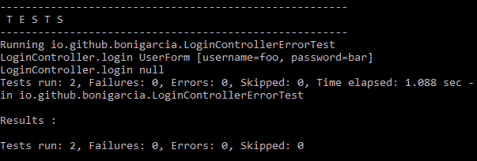
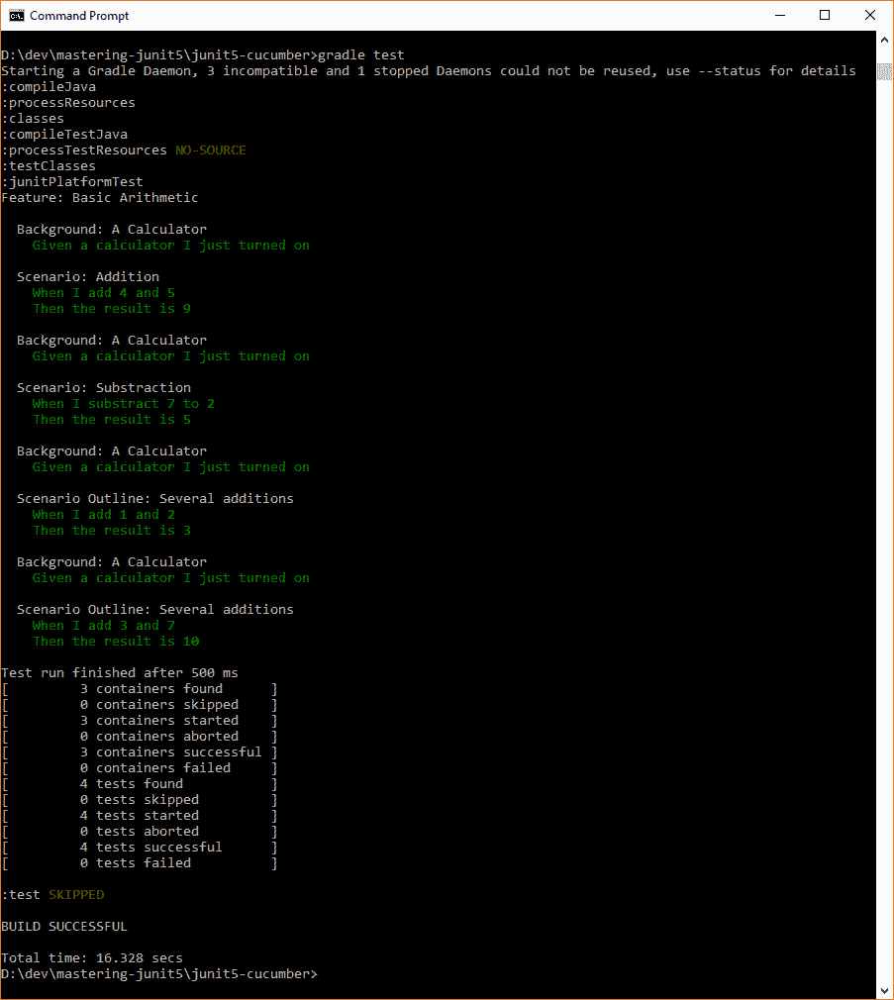
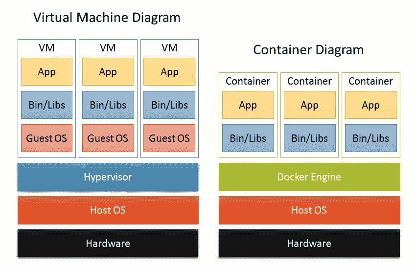
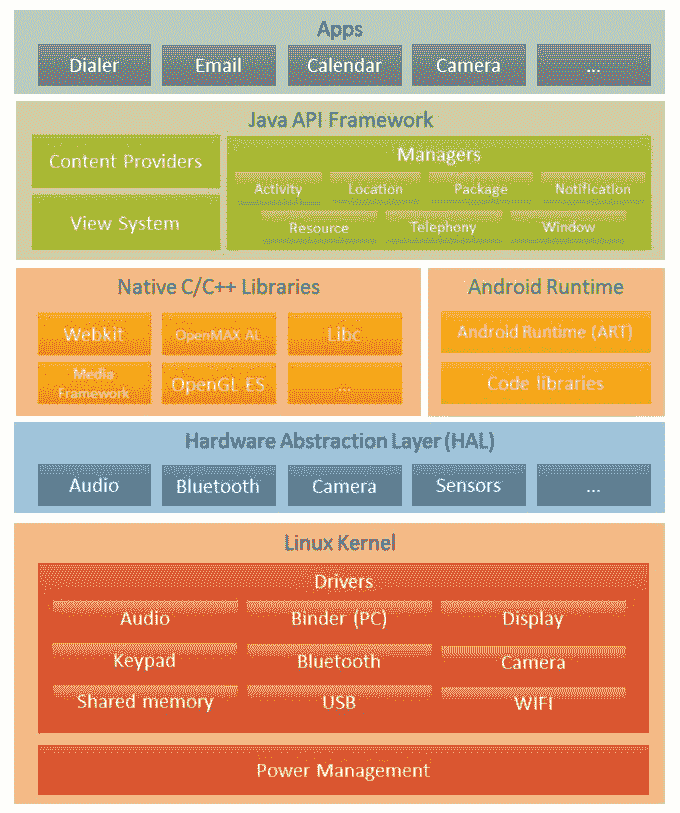
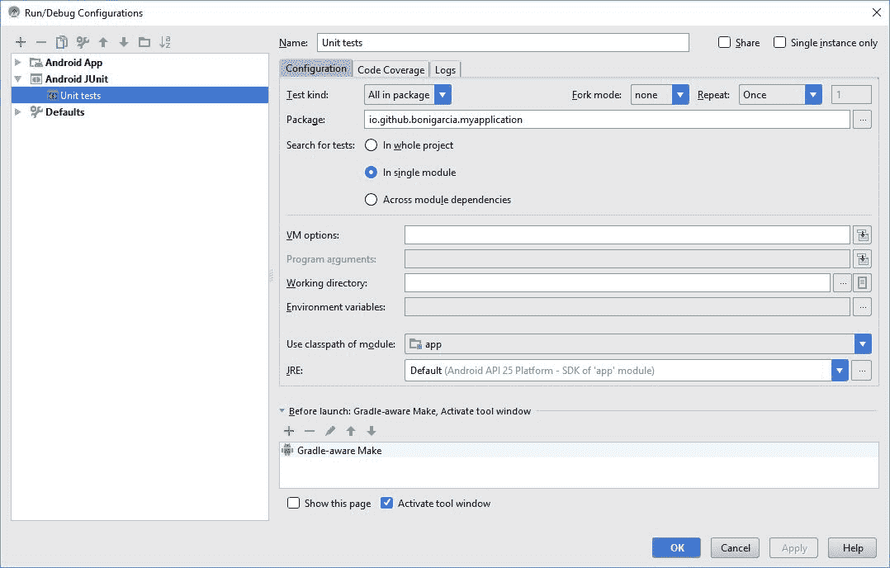
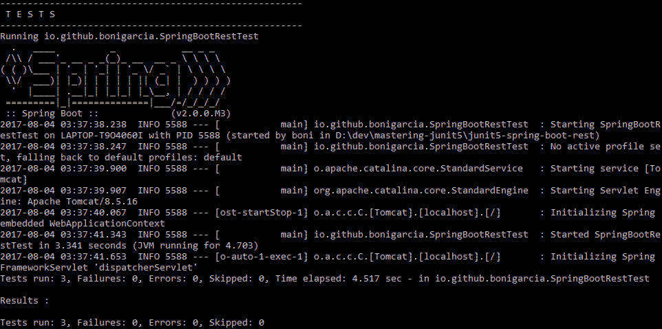

# JUnit 5 与外部框架的集成

如果我看得比别人更远，那是因为我站在巨人的肩膀上。

- 艾萨克·牛顿

正如在第二章中描述的，JUnit 5 的扩展模型允许我们通过第三方（工具供应商、开发人员等）扩展 JUnit 5 的核心功能。在 Jupiter 扩展模型中，扩展点是扩展实现的回调接口，然后在 JUnit 5 框架中注册（激活）。正如我们将在本章中发现的那样，JUnit 5 的扩展模型可以用于与现有第三方框架提供无缝集成。具体来说，在本章中，我们将审查 JUnit 5 与以下技术的扩展：

+   **Mockito**：模拟（测试替身）单元测试框架。

+   **Spring**：用于构建企业应用程序的 Java 框架。

+   **Selenium**：用于自动化导航和评估 Web 应用程序的测试框架。

+   **Cucumber**：测试框架，允许我们按照**行为驱动开发**（**BDD**）风格编写验收测试。

+   **Docker**：一种软件技术，允许我们将任何应用程序打包并作为轻量级和可移植的容器运行。

此外，我们发现 JUnit 5 扩展模型并不是与外部世界集成的唯一方式。具体来说，我们研究了 JUnit 5 如何与以下内容一起使用：

+   **Android**（基于 Linux 的移动操作系统）：我们可以使用 JUnit 5 的 Gradle 插件在 Android 项目中运行 Jupiter 测试。

+   **REST**（用于设计分布式系统的架构风格）：我们可以简单地使用第三方库（如 REST Assured 或 WireMock）与 REST 服务进行交互和验证，或者使用 Spring 的完全集成方法（测试与服务实现一起）。

# Mockito

Mockito ([`site.mockito.org/`](http://site.mockito.org/))是一个用于 Java 的开源模拟单元测试框架，于 2008 年 4 月首次发布。当然，Mockito 并不是 Java 的唯一模拟框架；还有其他的，比如以下这些：

+   EasyMock ([`easymock.org/`](http://easymock.org/)).

+   JMock ([`www.jmock.org/`](http://www.jmock.org/)).

+   PowerMock ([`powermock.github.io/`](http://powermock.github.io/)).

+   JMockit ([`jmockit.org/`](http://jmockit.org/)).

我们可以说，在撰写本文时，Mockito 是大多数开发人员和测试人员在 Java 测试中首选的模拟框架。为了证明这一点，我们使用了以下截图，显示了 Google 趋势（[`trends.google.com/`](https://trends.google.com/)）中 Mockito、EasyMock、JMock、PowerMock 和 JMockit 从 2004 年到 2017 年的发展。在这段时期的开始，我们可以看到 EasyMock 和 JMock 受到了很大的关注；然而，与其他框架相比，Mockito 更受欢迎：


Google 趋势演变的 Mockito、EasyMock、JMock、PowerMock 和 JMockit

# Mockito 简介

正如在第一章中介绍的，软件测试有不同的级别，如单元测试、集成测试、系统测试或验收测试。关于单元测试，它们应该在单个软件部分（例如单个类）的隔离环境中执行。在这个测试级别，目标是验证单元的功能，而不是它的依赖关系。

换句话说，我们想要测试所谓的**被测系统**（**SUT**），而不是它的**依赖组件**（**DOCs**）。为了实现这种隔离，我们通常使用*测试替身*来替换这些 DOCs。模拟对象是一种测试替身，它们被编程为对真实 DOC 的期望。

简而言之，Mockito 是一个允许创建模拟对象、存根和验证的测试框架。为此，Mockito 提供了一个 API 来隔离 SUT 及其 DOC。一般来说，使用 Mockito 涉及三个不同的步骤：

1.  **模拟对象**：为了隔离我们的 SUT，我们使用 Mockito API 来创建其关联 DOC 的模拟对象。这样，我们确保 SUT 不依赖于其真实的 DOC，我们的单元测试实际上是专注于 SUT。

1.  **设置期望**：与其他测试替身（如存根）相比，模拟对象的差异性在于可以根据单元测试的需要编程自定义期望。在 Mockito 的术语中，这个过程被称为存根方法，这些方法属于模拟对象。默认情况下，模拟对象模仿真实对象的行为。在实际操作中，这意味着模拟对象返回适当的虚拟值，例如布尔类型的 false，对象的 null，整数或长整数返回类型的 0，等等。Mockito 允许我们使用丰富的 API 更改这种行为，该 API 允许存根在调用方法时返回特定值。

当模拟对象没有编程任何期望（即，它没有*存根方法*），从技术上讲，它不是*模拟*对象，而是*虚拟*对象（请参阅第一章，*软件质量和 Java 测试的回顾*，以获取定义）。

1.  **验证**：归根结底，我们正在创建测试，因此，我们需要为 SUT 实现某种验证。Mockito 提供了一个强大的 API 来进行不同类型的验证。通过这个 API，我们评估与 SUT 和 DOC 的交互，验证模拟对象的调用顺序，或捕获和验证传递给存根方法的参数。此外，Mockito 的验证能力可以与 JUnit 的内置断言能力或使用第三方断言库（例如 Hamcrest、AssertJ 或 Truth）相结合。请参阅第三章中的*断言*部分，*JUnit 5 标准测试*。

下表总结了按前述阶段分组的 Mockito API：

| **Mockito API** | **描述** | **阶段** |
| --- | --- | --- |
| `@Mock` | 此注解标识要由 Mockito 创建的模拟对象。这通常用于 DOC。 | 1.模拟对象 |
| `@InjectMocks` | 此注解标识要注入模拟对象的对象。这通常用于我们要测试的单元，也就是我们的 SUT。 | 1.模拟对象 |
| `@Spy` | 除了模拟对象，Mockito 还允许我们创建间谍对象（即部分模拟实现，因为它们在非存根方法中使用真实实现）。 | 1.模拟对象 |
| `Mockito.when(x).thenReturn(y)``Mockito.doReturn(y).when(x)` | 这些方法允许我们指定给定模拟对象的存根方法（`x`）应返回的值（`y`）。 | 2.设置期望（*存根方法*） |
| `Mockito.when(x).thenThrow(e)``Mockito.doThrow(e).when(x)` | 这些方法允许我们指定在调用给定模拟对象的存根方法（`x`）时应抛出的异常（`e`）。 | 2.设置期望（*存根方法*） |
| `Mockito.when(x).thenAnswer(a)``Mockito.doAnswer(a).when(x)` | 与返回硬编码值不同，当调用模拟对象的给定方法（`x`）时，将执行动态用户定义的逻辑（`Answer a`）。 | 2.设置期望（*存根方法*） |
| `Mockito.when(x).thenCallRealMethod()``Mockito.doCallRealMethod().when(x)` | 此方法允许我们调用实际方法而不是模拟方法。 | 2.设置期望（*存根方法*） |
| `Mockito.doNothing().when(x)` | 在使用 spy 时，默认行为是调用对象的真实方法。为了避免执行`void`方法`x`，使用此方法。 | 2.设置期望（*存根方法*） |
| `BDDMockito.given(x).willReturn(y)``BDDMockito.given(x).willThrow(e)``BDDMockito.given(x).willAnswer(a)``BDDMockito.given(x).willCallRealMethod()` | 行为驱动开发是一种测试方法，其中测试以场景的形式指定，并作为*给定*（初始上下文）、*当*（事件发生）和*然后*（确保某些结果）实现。Mockito 通过`BDDMockito`类支持这种类型的测试。存根方法（`x`）的行为等同于`Mockito.when(x)`。 | 2.设置期望（*存根方法*） |

| `Mockito.verify()` | 此方法验证模拟对象的调用。可以使用以下方法选择性地增强此验证：

+   `times(n)`: 调用存根方法`n`次。

+   `never()`: 存根方法从未被调用。

+   `atLeastOnce()`: 存根方法至少被调用一次。

+   `atLeast(n)`: 存根方法至少被调用 n 次。

+   `atMost(n)`: 存根方法最多调用 n 次。

+   `only()`: 如果在模拟对象上调用了任何其他方法，则模拟失败。

+   `timeout(m)`: 在最多`m`毫秒内调用此方法。

| 3.验证 |
| --- |
| `Mockito.verifyZeroInteractions()``Mockito.verifyNoMoreInteractions()` | 这两种方法验证存根方法没有交互。在内部，它们使用相同的实现。 | 3.验证 |
| `@Captor` | 此注释允许我们定义一个`ArgumentChaptor`对象，旨在验证传递给存根方法的参数。 | 3.验证 |
| `Mockito.inOrder` | 它有助于验证与模拟对象的交互是否按照给定的顺序执行。 | 3.验证 |

在表格之前描述的不同注释的使用（`@Mock`，`@InjectMocks`，`@Spy`和`@Captor`）是可选的，尽管出于测试可读性的考虑是值得推荐的。换句话说，有多种使用不同 Mockito 类的注释的替代方法。例如，为了创建一个`Mock`，我们可以使用注释`@Mock`，如下所示：

```java
@Mock
MyDoc docMock;
```

这个的替代方法是使用`Mockito.mock`方法，如下所示：

```java
MyDoc docMock = Mockito.*mock*(MyDoc.class)
```

以下部分包含了在 Jupiter 测试中使用前面表格中描述的 Mockito API 的全面示例。

# Mockito 的 JUnit 5 扩展

在撰写本文时，尚无官方的 JUnit 5 扩展来在 Jupiter 测试中使用 Mockito。尽管如此，JUnit 5 团队提供了一个简单易用的 Java 类，实现了一个简单但有效的 Mockito 扩展。这个类可以在 JUnit 5 用户指南中找到（[`junit.org/junit5/docs/current/user-guide/`](http://junit.org/junit5/docs/current/user-guide/)），其代码如下：

```java
import static org.mockito.Mockito.*mock*;

import java.lang.reflect.Parameter;
import org.junit.jupiter.api.extension.ExtensionContext;
import org.junit.jupiter.api.extension.ExtensionContext.Namespace;
import org.junit.jupiter.api.extension.ExtensionContext.Store;
import org.junit.jupiter.api.extension.ParameterContext;
import org.junit.jupiter.api.extension.ParameterResolver;
import org.junit.jupiter.api.extension.TestInstancePostProcessor;
import org.mockito.Mock;
import org.mockito.MockitoAnnotations;
public class MockitoExtension
        implements TestInstancePostProcessor, ParameterResolver {

    @Override
    public void postProcessTestInstance(Object testInstance,
            ExtensionContext context) {
        MockitoAnnotations.*initMocks*(testInstance);
    }

    @Override
    public boolean supportsParameter(ParameterContext parameterContext,
       ExtensionContext extensionContext) {
      return 
       parameterContext.getParameter().isAnnotationPresent(Mock.class);
    }

    @Override
    public Object resolveParameter(ParameterContext parameterContext,
            ExtensionContext extensionContext) {
        return getMock(parameterContext.getParameter(), extensionContext);
    }

    private Object getMock(Parameter parameter,
            ExtensionContext extensionContext) {
        Class<?> mockType = parameter.getType();
        Store mocks = extensionContext
                .getStore(Namespace.*create*(MockitoExtension.class, 
                mockType));
        String mockName = getMockName(parameter);
        if (mockName != null) {
            return mocks.getOrComputeIfAbsent(mockName,
                    key -> *mock*(mockType, mockName));
        } else {
            return mocks.getOrComputeIfAbsent(mockType.getCanonicalName(),
                    key -> *mock*(mockType));
        }
    }

    private String getMockName(Parameter parameter) {
        String explicitMockName = 
                parameter.getAnnotation(Mock.class).name()
                .trim();
        if (!explicitMockName.isEmpty()) {
            return explicitMockName;
        } else if (parameter.isNamePresent()) {
            return parameter.getName();
        }
        return null;
    }

}
```

这个扩展（以及其他扩展）计划在开源项目 JUnit Pioneer（[`junit-pioneer.org/`](http://junit-pioneer.org/)）中发布。该项目由 Java 开发人员 Nicolai Parlog 维护，他还是博客 CodeFX（[`blog.codefx.org/`](https://blog.codefx.org/)）的作者。

检查前面的类，我们可以看到它只是 Jupiter 扩展模型的一个用例（在本书的第二章中描述了 Jupiter 扩展模型），它实现了扩展回调`TestInstancePostProcessor`和`ParameterResolver`。由于第一个，在测试用例实例化后，将调用`postProcessTestInstance`方法，并且在此方法的主体中，将进行模拟的初始化：

```java
MockitoAnnotations.*initMocks*(testInstance)
```

这与在 JUnit 4 中使用 Mockito 的运行器的效果相同：`@RunWith(MockitoJUnitRunner.class)`。

此外，这个扩展还实现了接口`ParameterResolver`。这意味着在测试中，注册了这个扩展（`@ExtendWith(MockitoExtension.class)`）的情况下，将允许在方法级别进行依赖注入。特别是，这个注解将为用`@Mock`注解的测试参数注入模拟对象（位于`org.mockito`包中）。

让我们看一些例子来澄清这个扩展与 Mockito 一起使用的情况。像往常一样，我们可以在 GitHub 仓库[`github.com/bonigarcia/mastering-junit5`](https://github.com/bonigarcia/mastering-junit5)上找到这些例子的源代码。前面的扩展（`MockitoExtension`）的副本包含在项目`junit5-mockito`中。为了指导这些例子，我们在软件应用程序中实现了一个典型的用例：用户在软件系统中的登录。

在这个用例中，我们假设用户与由三个类组成的系统进行交互：

+   `LoginController`：接收用户的请求，并返回响应的类。这个请求被分派到`LoginService`组件。

+   `LoginService`：这个类实现了用例的功能。为了实现这个目的，它需要确认用户是否在系统中得到了认证。为了做到这一点，它需要读取`LoginRepository`类中实现的持久化层。

+   `LoginRepository`：这个类允许访问系统的持久化层，通常是通过数据库实现的。这个类也可以被称为**数据访问对象**（**DAO**）。

在组合方面，这三个类的关系如下：


登录用例类图（类之间的组合关系）

用例中涉及的两个基本操作（登录和注销）的序列图如下图所示：


登录用例序列图

我们使用几个简单的 Java 类来实现这个例子。首先，`LoginController`通过组合使用`LoginService`：

```java
package io.github.bonigarcia;

public class LoginController {
    public LoginService loginService = new LoginService();

    public String login(UserForm userForm) {
        System.*out*.println("LoginController.login " + userForm);
        try {
            if (userForm == null) {
                return "ERROR";
            } else if (loginService.login(userForm)) {
                return "OK";
            } else {
                return "KO";
            }
        } catch (Exception e) {
            return "ERROR";
        }
    }

    public void logout(UserForm userForm) {
        System.*out*.println("LoginController.logout " + userForm);
        loginService.logout(userForm);
    }
}
```

`UserForm`对象是一个简单的 Java 类，有时被称为**普通的 Java 对象**（**POJO**），有两个属性 username 和 password：

```java
package io.github.bonigarcia;

public class UserForm {

    public String username;
    public String password;

    public UserForm(String username, String password) {
        this.username = username;
        this.password = password;
    }

    // Getters and setters

    @Override
    public String toString() {
        return "UserForm [username=" + username + ", password=" + password
                + "]";
    }
}
```

然后，服务依赖于`LoginRepository`进行数据访问。在这个例子中，服务还使用 Java 列表实现了用户注册，其中存储了经过认证的用户：

```java
package io.github.bonigarcia;

import java.util.ArrayList;
import java.util.List;

public class LoginService {

    private LoginRepository loginRepository = new LoginRepository();
    private List<String> usersLogged = new ArrayList<>();

    public boolean login(UserForm userForm) {
        System.*out*.println("LoginService.login " + userForm);

        // Preconditions
        checkForm(userForm);

        // Same user cannot be logged twice
        String username = userForm.getUsername();
        if (usersLogged.contains(username)) {
            throw new LoginException(username + " already logged");
        }

        // Call to repository to make logic
        boolean login = loginRepository.login(userForm);

        if (login) {
            usersLogged.add(username);
        }

        return login;
    }

    public void logout(UserForm userForm) {
        System.*out*.println("LoginService.logout " + userForm);

        // Preconditions
        checkForm(userForm);

        // User should be logged beforehand
        String username = userForm.getUsername();
        if (!usersLogged.contains(username)) {
            throw new LoginException(username + " not logged");
        }

        usersLogged.remove(username);
    }

    public int getUserLoggedCount() {
        return usersLogged.size();
    }

    private void checkForm(UserForm userForm) {
        assert userForm != null;
        assert userForm.getUsername() != null;
        assert userForm.getPassword() != null;
    }

}
```

最后，`LoginRepository`如下。为了简单起见，这个组件实现了一个映射，而不是访问真实的数据库，其中存储了系统中假设用户的凭据（其中`key`*=* username，`value`=password）：

```java
package io.github.bonigarcia;

import java.util.HashMap;
import java.util.Map;

public class LoginRepository {

    Map<String, String> users;

    public LoginRepository() {
        users = new HashMap<>();
        users.put("user1", "p1");
        users.put("user2", "p3");
        users.put("user3", "p4");
    }

    public boolean login(UserForm userForm) {
        System.*out*.println("LoginRepository.login " + userForm);
        String username = userForm.getUsername();
        String password = userForm.getPassword();
        return users.keySet().contains(username)
                && users.get(username).equals(password);
    }

}
```

现在，我们将使用 JUnit 5 和 Mockito 来测试我们的系统。首先，我们测试控制器组件。由于我们正在进行单元测试，我们需要将`LoginController`登录与系统的其余部分隔离开来。为了做到这一点，我们需要模拟它的依赖关系，在这个例子中，是`LoginService`组件。使用在开头解释的 SUT/DOC 术语，在这个测试中，我们的 SUT 是`LoginController`类，它的 DOC 是`LoginService`类。

为了使用 JUnit 5 实现我们的测试，首先我们需要使用`@ExtendWith`注册`MockitoExtension`。然后，我们用`@InjectMocks`（类`LoginController`）声明 SUT，用`@Mock`（类`LoginService`）声明它的 DOC。我们实现了两个测试（`@Test`）。第一个测试（`testLoginOk`）指定了当调用模拟`loginService`的 login 方法时，这个方法应该返回 true。之后，SUT 被实际执行，并且它的响应被验证（在这种情况下，返回的字符串必须是`OK`）。此外，Mockito API 再次被用来评估与模拟`LoginService`的交互是否没有更多。第二个测试（`testLoginKo`）是等价的，但是将 login 方法的存根设为返回 false，因此 SUT（`LoginController`）的响应在这种情况下必须是`KO`：

```java
package io.github.bonigarcia;

import static org.junit.jupiter.api.Assertions.*assertEquals*;
import static org.mockito.Mockito.*verify*;
import static org.mockito.Mockito.*verifyNoMoreInteractions*;
import static org.mockito.Mockito.*verifyZeroInteractions*;
import static org.mockito.Mockito.*when*;

import org.junit.jupiter.api.Test;
import org.junit.jupiter.api.extension.ExtendWith;
import org.mockito.InjectMocks;
import org.mockito.Mock;
import io.github.bonigarcia.mockito.MockitoExtension;

@ExtendWith(MockitoExtension.class)
class LoginControllerLoginTest {

    // Mocking objects
    @InjectMocks
    LoginController loginController;

    @Mock
    LoginService loginService;

    // Test data
    UserForm userForm = new UserForm("foo", "bar");

    @Test
    void testLoginOk() {
        // Setting expectations (stubbing methods)
        *when*(loginService.login(userForm)).thenReturn(true);

        // Exercise SUT
        String reseponseLogin = loginController.login(userForm);

        // Verification
        *assertEquals*("OK", reseponseLogin);
        *verify*(loginService).login(userForm);
        *verifyNoMoreInteractions*(loginService);
    }

    @Test
    void testLoginKo() {
        // Setting expectations (stubbing methods)
        *when*(loginService.login(userForm)).thenReturn(false);

        // Exercise SUT
        String reseponseLogin = loginController.login(userForm);

        // Verification
        *assertEquals*("KO", reseponseLogin);
        *verify*(loginService).login(userForm);
        *verifyZeroInteractions*(loginService);
    }

}
```

如果我们执行这个测试，简单地检查标准输出上的跟踪，我们可以检查 SUT 是否实际执行了。此外，我们确保验证阶段在两个测试中都成功了，因为它们都通过了：


使用 JUnit 5 和 Mockito 执行*LoginControllerLoginTest*的单元测试

现在让我们转到另一个例子，在这个例子中，我们测试了`LoginController`组件的负面情况（即错误情况）。以下类包含两个测试，第一个（`testLoginError`）旨在评估系统的响应（应该是`ERROR`），当使用空表单时。在第二个测试（`testLoginException`）中，我们编写了模拟`loginService`的方法，当首次使用任何表单时引发异常。然后，我们执行 SUT（`LoginController`）并评估响应是否实际上是`ERROR`：

请注意，当设置模拟方法的期望时，我们使用了参数匹配器 any（Mockito 默认提供）。

```java
package io.github.bonigarcia;

import static org.junit.jupiter.api.Assertions.*assertEquals*;
import static org.mockito.ArgumentMatchers.*any*;
import static org.mockito.Mockito.*when*;

import org.junit.jupiter.api.Test;
import org.junit.jupiter.api.extension.ExtendWith;
import org.mockito.InjectMocks;
import org.mockito.Mock;
import io.github.bonigarcia.mockito.MockitoExtension;

@ExtendWith(MockitoExtension.class)
class LoginControllerErrorTest {

    @InjectMocks
    LoginController loginController;

    @Mock
    LoginService loginService;

    UserForm userForm = new UserForm("foo", "bar");

    @Test
    void testLoginError() {
        // Exercise
        String response = loginController.login(null);

        // Verify
        *assertEquals*("ERROR", response);
    }

    @Test
    void testLoginException() {
        // Expectation
        *when*(loginService.login(*any*(UserForm.class)))
                .thenThrow(IllegalArgumentException.class);

        // Exercise
        String response = loginController.login(userForm);

        // Verify
        *assertEquals*("ERROR", response);
    }

}
```

同样，在 shell 中运行测试时，我们可以确认两个测试都正确执行，SUT 也被执行了：



使用 JUnit 5 和 Mockito 执行*LoginControllerErrorTest*的单元测试

让我们看一个使用 BDD 风格的例子。为此，使用了`BDDMockito`类。请注意，该类的静态方法 given 在示例中被导入。然后，实现了四个测试。实际上，这四个测试与之前的例子（`LoginControllerLoginTest`和`LoginControllerErrorTest`）完全相同，但这次使用了 BDD 风格和更紧凑的风格（一行命令）。

```java
package io.github.bonigarcia;

import static org.junit.jupiter.api.Assertions.*assertEquals*;
import static org.mockito.ArgumentMatchers.*any*;
import static org.mockito.BDDMockito.*given*;

import org.junit.jupiter.api.Test;
import org.junit.jupiter.api.extension.ExtendWith;
import org.mockito.InjectMocks;
import org.mockito.Mock;
import io.github.bonigarcia.mockito.MockitoExtension;

@ExtendWith(MockitoExtension.class)
class LoginControllerBDDTest {

    @InjectMocks
    LoginController loginController;

    @Mock
    LoginService loginService;

    UserForm userForm = new UserForm("foo", "bar");

    @Test
    void testLoginOk() {
        *given*(loginService.login(userForm)).willReturn(true);
        *assertEquals*("OK", loginController.login(userForm));
    }

    @Test
    void testLoginKo() {
        *given*(loginService.login(userForm)).willReturn(false);
        *assertEquals*("KO", loginController.login(userForm));
    }

    @Test
    void testLoginError() {
        *assertEquals*("ERROR", loginController.login(null));
    }

    @Test
    void testLoginException() {
        *given*(loginService.login(*any*(UserForm.class)))
                .willThrow(IllegalArgumentException.class);
        *assertEquals*("ERROR", loginController.login(userForm));
    }

}
```

执行这个测试类意味着执行了四个测试。如下截图所示，它们全部通过了：


使用 JUnit 5 和 Mockito 执行*LoginControllerBDDTest*的单元测试

现在让我们转到系统的下一个组件：`LoginService`。在下面的例子中，我们旨在对该组件进行单元测试，因此首先使用注解`@InjectMocks`将 SUT 注入到我们的测试中。然后，使用注解`@Mock`对 DOC（`LoginRepository`）进行模拟。该类包含三个测试。第一个（`testLoginOk`）旨在验证当接收到正确的表单时 SUT 的响应。第二个测试（`testLoginKo`）验证相反的情况。最后，第三个测试还验证了系统的错误情况。该服务的实现保留了已登录用户的注册表，并且不允许同一用户登录两次。因此，我们实现了一个测试（`testLoginTwice`），用于验证当同一用户尝试两次登录时是否引发了异常`LoginException`：

```java
package io.github.bonigarcia;

import static org.junit.jupiter.api.Assertions.*assertFalse*;
import static org.junit.jupiter.api.Assertions.*assertThrows*;
import static org.junit.jupiter.api.Assertions.*assertTrue*;
import static org.mockito.ArgumentMatchers.*any*;
import static org.mockito.Mockito.*atLeast*;
import static org.mockito.Mockito.*times*;
import static org.mockito.Mockito.*verify*;
import static org.mockito.Mockito.*when*;

import org.junit.jupiter.api.Test;
import org.junit.jupiter.api.extension.ExtendWith;
import org.mockito.InjectMocks;
import org.mockito.Mock;
import io.github.bonigarcia.mockito.MockitoExtension;

@ExtendWith(MockitoExtension.class)
class LoginServiceTest {

    @InjectMocks
    LoginService loginService;

    @Mock
    LoginRepository loginRepository;

    UserForm userForm = new UserForm("foo", "bar");

    @Test
    void testLoginOk() {
        *when*(loginRepository.login(*any*(UserForm.class))).thenReturn(true);
        *assertTrue*(loginService.login(userForm));
        *verify*(loginRepository, *atLeast*(1)).login(userForm);
    }

    @Test
    void testLoginKo() {
        *when*(loginRepository.login(*any*(UserForm.class))).thenReturn(false);
        *assertFalse*(loginService.login(userForm));
        *verify*(loginRepository, *times*(1)).login(userForm);
    }

    @Test
    void testLoginTwice() {
        *when*(loginRepository.login(userForm)).thenReturn(true);
        *assertThrows*(LoginException.class, () -> {
            loginService.login(userForm);
            loginService.login(userForm);
        });
    }

}
```

像往常一样，在 shell 中执行测试可以让我们了解事情的进展。我们可以检查登录服务已经被执行了四次（因为在第三个测试中，我们执行了两次）。但由于预期到了`LoginException`，该测试是成功的（其他两个也是）：


使用 JUnit 5 和 Mockito 执行*LoginServiceTest*的单元测试

以下类提供了一个简单的例子，用于捕获模拟对象的参数。我们定义了一个类型为`ArgumentCaptor<UserForm>`的类属性，并用`@Captor`进行了注释。然后，在测试的主体中，执行了 SUT（在本例中是`LoginService`）并捕获了方法 login 的参数。最后，评估了这个参数的值：

```java
package io.github.bonigarcia;

import static org.junit.jupiter.api.Assertions.*assertEquals*;
import static org.mockito.Mockito.*verify*;

import org.junit.jupiter.api.Test;
import org.junit.jupiter.api.extension.ExtendWith;
import org.mockito.ArgumentCaptor;
import org.mockito.Captor;
import org.mockito.InjectMocks;
import org.mockito.Mock;
import io.github.bonigarcia.mockito.MockitoExtension;

@ExtendWith(MockitoExtension.class)
class LoginServiceChaptorTest {

    @InjectMocks
    LoginService loginService;

    @Mock
    LoginRepository loginRepository;

    @Captor
    ArgumentCaptor<UserForm> argCaptor;

    UserForm userForm = new UserForm("foo", "bar");

    @Test
    void testArgumentCaptor() {
        loginService.login(userForm);
        *verify*(loginRepository).login(argCaptor.capture());
        *assertEquals*(userForm, argCaptor.getValue());
    }

}
```

再次，在控制台中，我们检查 SUT 是否被执行，并且测试被声明为成功：


使用 JUnit 5 和 Mockito 执行*LoginServiceChaptorTest*的单元测试

我们在本章中看到的最后一个与 Mockito 相关的示例与使用 spy 有关。如前所述，默认情况下，spy 在非存根方法中使用真实实现。因此，如果我们在 spy 对象中不存根方法，我们在测试中得到的是真实对象。这就是下一个示例中发生的情况。正如我们所看到的，我们正在使用`LoginService`作为我们的 SUT，然后我们对对象`LoginRepository`进行了监视。由于在测试的主体中，我们没有在 spy 对象中编程期望，我们在测试中评估了真实系统。

总的来说，测试数据准备好了，以获得正确的登录（使用用户名`user`和密码`p1`，这些值在`LoginRepository`的实际实现中是固定的），然后一些虚拟值用于无法登录：

```java
package io.github.bonigarcia;

import static org.junit.jupiter.api.Assertions.*assertFalse*;
import static org.junit.jupiter.api.Assertions.*assertTrue*;
 import org.junit.jupiter.api.Test;
import org.junit.jupiter.api.extension.ExtendWith;
import org.mockito.InjectMocks;
import org.mockito.Spy;
import io.github.bonigarcia.mockito.MockitoExtension;

@ExtendWith(MockitoExtension.class)
class LoginServiceSpyTest {

    @InjectMocks
    LoginService loginService;

    @Spy
    LoginRepository loginRepository;

    UserForm userOk = new UserForm("user1", "p1");
    UserForm userKo = new UserForm("foo", "bar");

    @Test
    void testLoginOk() {
        *assertTrue*(loginService.login(userOk));
    }

    @Test
    void testLoginKo() {
        *assertFalse*(loginService.login(userKo));
    }
}
```

在 shell 中，我们可以检查两个测试是否正确执行，而且在这种情况下，实际组件（`LoginService`和`LoginRepository`）确实被执行：


使用 JUnit 5 和 Mockito 执行*LoginServiceSpyTest*的单元测试

这些示例展示了 Mockito 的几种功能，但当然不是全部。有关更多信息，请访问官方 Mockito 参考网站[`site.mockito.org/`](http://site.mockito.org/)。

# Spring

Spring ([`spring.io/`](https://spring.io/))是一个用于构建企业应用程序的开源 Java 框架。它最初是由 Rod Johnson 在 2002 年 10 月与他的书*Expert One-on-One J2EE Design and Development*一起编写的。Spring 最初的动机是摆脱 J2EE 的复杂性，提供一个轻量级的基础设施，旨在使用简单的 POJO 作为构建块来简化企业应用程序的开发。

# Spring 简介

Spring 框架的核心技术被称为**控制反转**（**IoC**），这是在实际使用这些对象的类之外实例化对象的过程。这些对象在 Spring 行话中被称为 bean 或组件，并且默认情况下被创建为*单例*对象。负责创建 bean 的实体称为 Spring IoC 容器。这是通过**依赖注入**（**DI**）实现的，它是提供对象的依赖关系而不是自己构造它们的过程。

IoC 和 DI 经常可以互换使用。然而，正如前面的段落所描述的，这些概念并不完全相同（IoC 是通过 DI 实现的）。

正如本节的下一部分所描述的，Spring 是一个模块化的框架。Spring 的核心功能（即 IoC）在`spring-context`模块中提供。该模块提供了创建**应用程序上下文**的能力，即 Spring 的 DI 容器。在 Spring 中有许多不同的定义应用程序上下文的方式。最重要的两种类型是以下两种：

+   `AnnotationConfigApplicationContext`：应用程序上下文，接受带注释的类来标识要在容器中执行的 Spring bean。在这种类型的上下文中，通过使用注释`@Component`对普通类进行注释来标识 bean。这不是唯一将类声明为 Spring bean 的方法。还有进一步的原型注释：`@Controller`（用于表示层的原型，在 Web 模块中使用，MVC），`@Repository`（用于持久层的原型，在数据访问模块中使用，称为 Spring Data），和`@Service`（用于服务层）。这三个注释用于分离应用程序的各个层。最后，使用`@Configuration`注释的类允许通过使用`@Bean`注释方法来定义 Spring bean（这些方法返回的对象将成为容器中的 Spring bean）：


用于定义 bean 的 Spring 原型

+   `ClassPathXmlApplicationContext`：应用程序上下文，接受在项目类路径中声明的 XML 文件中的 bean 定义。

基于注解的上下文配置是在 Spring 2.5 中引入的。Spring IoC 容器与实际编写配置元数据（即 bean 定义）的格式完全解耦。如今，许多开发人员选择基于注解的配置而不是基于 XML 的配置。因此，在本书中，我们将只在示例中使用基于注解的上下文配置。

让我们看一个简单的例子。首先，我们需要在项目中包含`spring-context`依赖项。例如，作为 Maven 依赖项：

```java
<dependency>
    <groupId>org.springframework</groupId>
    <artifactId>spring-context</artifactId>
    <version>${spring-context.version}</version>
</dependency>
```

然后，我们创建一个可执行的 Java 类（即带有 main 方法）。请注意，在这个类中有一个类级别的注解：`@ComponentScan`。这是 Spring 中非常重要的一个注解，因为它允许声明 Spring 将在其中查找注解形式的 bean 定义的包。如果没有定义特定的包（就像在示例中一样），扫描将从声明此注解的类的包中进行（在示例中是包`io.github.bonigarcia`）。在 main 方法的主体中，我们使用`AnnotationConfigApplicationContext`创建 Spring 应用程序上下文。从该上下文中，我们获取其类为`MessageComponent`的 Spring 组件，并将其`getMessage()`方法的结果写入标准输出：

```java
package io.github.bonigarcia;

import org.springframework.context.annotation.AnnotationConfigApplicationContext;
import org.springframework.context.annotation.ComponentScan;

@ComponentScan
public class MySpringApplication {

    public static void main(String[] args) {
        try (AnnotationConfigApplicationContext context = new 
                AnnotationConfigApplicationContext(
                MySpringApplication.class)) {
            MessageComponent messageComponent = context
                    .getBean(MessageComponent.class);
            System.*out*.println(messageComponent.getMessage());
        }
    }

}
```

bean `MessageComponent` 在以下类中定义。请注意，它只是在类级别使用`@Component`注解声明为 Spring 组件。然后，在这个例子中，我们使用类构造函数注入另一个名为`MessageService`的 Spring 组件：

```java
package io.github.bonigarcia;

import org.springframework.beans.factory.annotation.Autowired;
import org.springframework.stereotype.Component;

@Component
public class MessageComponent {

    private MessageService messageService;

    public MessageComponent(MessageService messageService) {
       this.messageService = messageService;
    }

    public String getMessage() {
        return messageService.getMessage();
    }

}
```

在这一点上，值得回顾一下进行 Spring 组件依赖注入的不同方式：

1.  字段注入：注入的组件是一个带有`@Autowired`注解的类字段，就像之前的例子一样。作为一个好处，这种类型的注入消除了杂乱的代码，比如 setter 方法或构造函数参数。

1.  Setter 注入：注入的组件在类中声明为字段，然后为该字段创建一个带有`@Autowired`注解的 setter。

1.  构造函数注入：依赖项被注入到带有`@Autowired`注解的类构造函数中（图中的 3-a）。这是前面示例中展示的方式。从 Spring 4.3 开始，不再需要使用`@Autowired`注解构造函数来进行注入（3-b）。

最新的注入方式（*3-b*）有很多好处，比如促进了无需反射机制的可测试性（例如，通过模拟库实现）。此外，它可以让开发人员思考类的设计，因为许多注入的依赖项意味着许多构造函数参数，这应该被避免（*上帝对象*反模式）。


Spring 中依赖注入（Autowired）的不同方式

我们示例中的最后一个组件名为`MessageService`。请注意，这也是一个 Spring 组件，这次使用`@Service`注解来强调其服务性质（从功能角度来看，这与使用`@Component`注解类是一样的）：

```java
package io.github.bonigarcia;

import org.springframework.stereotype.Service;

@Service
public class MessageService {

    public String getMessage() {
        return "Hello world!";
    }

}
```

现在，如果我们执行这个示例的主类（称为`MySpringApplication`，请参见源代码），我们将使用 try with resources 创建一个基于注解的应用程序上下文（这样应用程序上下文将在最后关闭）。Spring IoC 容器将创建两个 bean：`MessageService`和`MessageComponet`。使用应用程序上下文，我们寻找 bean`MessageComponet`并调用其方法`getMessage`，最终将其写入标准输出：

```java
package io.github.bonigarcia;

import org.springframework.context.annotation.AnnotationConfigApplicationContext;
import org.springframework.context.annotation.ComponentScan;

@ComponentScan
public class MySpringApplication {

    public static void main(String[] args) {
        try (AnnotationConfigApplicationContext context = new 
                AnnotationConfigApplicationContext(
                MySpringApplication.class)) {
            MessageComponent messageComponent = context
                    .getBean(MessageComponent.class);
            System.*out*.println(messageComponent.getMessage());
        }
    }

}
```

# Spring 模块

Spring 框架是模块化的，允许开发人员只使用框架提供的所需模块。这些模块的完整列表可以在[`spring.io/projects`](https://spring.io/projects)上找到。以下表格总结了一些最重要的模块：

| **Spring 项目** | **标志** | **描述** |
| --- | --- | --- |
| Spring 框架 |  | 提供了对 DI，事务管理，Web 应用程序（Spring MCV），数据访问，消息传递等的核心支持。 |
| Spring IO 平台 |  | 将核心 Spring API 整合成一个具有连贯性和版本化的基础平台，用于现代应用程序。 |
| Spring Boot |  | 简化了独立的，生产级的基于 Spring 的应用程序的创建，最小化配置。它遵循约定优于配置的方法。 |
| Spring 数据 |  | 通过全面的 API 简化数据访问，以处理关系数据库，NoSQL，映射-减少算法等。 |
| Spring Cloud |  | 提供了一组库和常见模式，用于构建和部署分布式系统和微服务。 |
| Spring 安全 |  | 为基于 Spring 的应用程序提供可定制的身份验证和授权功能。 |
| Spring 集成 |  | 为基于 Spring 的应用程序提供了基于轻量级 POJO 的消息传递，以与外部系统集成。 |
| Spring 批处理 |  | 提供了一个轻量级框架，旨在实现企业系统操作的稳健批处理应用程序的开发。 |

# Spring 测试简介

Spring 有一个名为`spring-test`的模块，支持对 Spring 组件进行单元测试和集成测试。除其他功能外，该模块提供了创建用于测试目的的 Spring 应用程序上下文或创建模拟对象以隔离测试代码的能力。有不同的注解支持这些测试功能。最重要的注解列表如下：

+   `@ContextConfiguration`：此注解用于确定如何为集成测试加载和配置`ApplicationContext`。例如，它允许从注释类（使用元素类）加载应用程序上下文，或者从 XML 文件中声明的 bean 定义（使用元素位置）加载应用程序上下文。

+   `@ActiveProfiles`：此注解用于指示容器在应用程序上下文加载期间应激活哪些定义配置文件（例如，开发和测试配置文件）。

+   `@TestPropertySource`：此注解用于配置属性文件的位置和要添加的内联属性。

+   `@WebAppConfiguration`：此注解用于指示 Spring 上下文加载的`ApplicationContext`是`WebApplicationContext`。

此外，`spring-test`模块提供了几种功能，用于执行测试中通常需要的不同操作，即：

+   Spring 的`org.springframework.mock.web`包含一组 Servlet API 模拟对象，用于测试 web 上下文。例如，`MockMvc`对象允许执行 HTTP 请求（`POST`，`GET`，`PUT`，`DELETE`等），并验证响应（状态码，内容类型或响应主体）。

+   `org.springframework.mock.jndi`包含**Java 命名和目录接口**（**JNDI**）SPI 的实现，可用于为测试设置简单的 JNDI 环境。例如，使用`SimpleNamingContextBuilder`类，我们可以在测试中提供 JNDI 数据源。

+   `org.springframework.test.jdbc`包含`JdbcTestUtils`类，这是一组旨在简化标准数据库访问的 JDBC 实用函数。

+   `org.springframework.test.util`包含`ReflectionTestUtils`类，这是一组实用方法，用于在测试应用程序代码时设置非公共字段或调用私有/受保护的 setter 方法。

# 测试 Spring Boot 应用程序

如前所述，Spring Boot 是 Spring 系列项目的一个项目，旨在简化 Spring 应用程序的开发。使用 Spring Boot 的主要好处总结如下：

+   Spring Boot 应用程序只是一个使用主要约定优于配置的 Spring `ApplicationContext`。由于这一点，使用 Spring 进行开发变得更快。

+   `@SpringBootApplication`注解用于标识 Spring Boot 项目中的主类。

+   Spring Boot 提供了一系列开箱即用的非功能特性：嵌入式 servlet 容器（Tomcat、Jetty 和 Undertow）、安全性、度量、健康检查或外部化配置。

+   创建独立运行的应用程序，只需使用命令`java -jar`即可（即使是 Web 应用程序）。

+   Spring Boot **命令行界面**（**CLI**）允许运行 Groovy 脚本，快速原型化 Spring。

+   Spring Boot 的工作方式与任何标准的 Java 库相同，也就是说，要使用它，我们只需要在项目类路径中添加适当的`spring-boot-*.jar`（通常使用构建工具如 Maven 或 Gradle）。Spring Boot 提供了许多*starters*，旨在简化将不同的库添加到类路径的过程。以下表格包含了其中几个起始器：

| **名称** | **描述** |
| --- | --- |
| `spring-boot-starter` | 核心起始器，包括自动配置支持和日志记录 |
| `spring-boot-starter-batch` | 用于使用 Spring Batch 的起始器 |
| `spring-boot-starter-cloud-connectors` | 用于使用 Spring Cloud Connectors 的起始器，简化了连接到云平台（如 Cloud Foundry 和 Heroku）中的服务 |
| `spring-boot-starter-data-jpa` | 用于使用 Hibernate 的 Spring Data JPA 的起始器 |
| `spring-boot-starter-integration` | 用于使用 Spring Integration 的起始器 |
| `spring-boot-starter-jdbc` | 用于使用 Tomcat JDBC 连接池的 JDBC 的起始器 |
| `spring-boot-starter-test` | 用于使用库测试 Spring Boot 应用程序，包括 JUnit、Hamcrest 和 Mockito |
| `spring-boot-starter-thymeleaf` | 用于使用 Thymeleaf 视图构建 MVC Web 应用程序的起始器 |
| `spring-boot-starter-web` | 用于构建 Web 应用程序，包括 REST 的起始器，使用 Tomcat 作为默认的嵌入式容器 |
| `spring-boot-starter-websocket` | 用于使用 Spring 框架的 WebSocket 支持构建 WebSocket 应用程序的起始器 |

有关 Spring Boot 的完整信息，请访问官方参考：[`projects.spring.io/spring-boot/.`](https://projects.spring.io/spring-boot/)

Spring Boot 提供了不同的功能来简化测试。例如，它提供了`@SpringBootTest`注解，该注解用于测试类的类级别。此注解将为这些测试创建`ApplicationContext`（类似于`@ContextConfiguration`，但适用于基于 Spring Boot 的应用程序）。正如我们在前一节中所看到的，在`spring-test`模块中，我们使用注解`@ContextConfiguration(classes=… )`来指定要加载哪个 bean 定义（Spring `@Configuration`）。在测试 Spring Boot 应用程序时，通常不需要这样做。Spring Boot 的测试注解将自动搜索主配置，如果没有明确定义，则会从包含测试的包开始向上搜索，直到找到一个带有`@SpringBootApplication`注解的类。

Spring Boot 还简化了对 Spring 组件的模拟使用。为此，提供了`@MockBean`注解。此注解允许在我们的`ApplicationContext`中为 bean 定义一个 Mockito 模拟。它可以是新的 bean，也可以替换单个现有的 bean 定义。模拟 bean 在每个测试方法后会自动重置。这种方法通常被称为容器内测试，与容器外测试相对应，在容器外测试中，使用模拟库（例如 Mockito）来单元测试 Spring 组件，而无需 Spring `ApplicationContext`。下一节中显示了 Spring 应用程序的两种类型的单元测试示例。

# 用于 Spring 的 JUnit 5 扩展

为了将`spring-test`的功能集成到 JUnit 5 的 Jupiter 编程模型中，开发了`SpringExtension`。这个扩展是 Spring 5 的`spring-test`模块的一部分。让我们看看几个 Junit 5 和 Spring 5 一起的例子。

假设我们想对前一部分描述的 Spring 应用程序进行容器内集成测试，由三个类组成：`MySpringApplication`，`MessageComponent`和`MessageService`。正如我们所学的，为了对这个应用程序实施 Jupiter 测试，我们需要采取以下步骤：

1.  用`@ContextConfiguration`注释我们的测试类，以指定需要加载哪个`ApplicationContext`。

1.  使用`@ExtendWith(SpringExtension.class)`注释我们的测试类，以启用`spring-test`进入 Jupiter。

1.  在我们的测试类中注入我们想要评估的 Spring 组件。

1.  实现我们的测试（`@Test`）。

例如：

```java
package io.github.bonigarcia;

import static org.junit.jupiter.api.Assertions.*assertEquals*;

import org.junit.jupiter.api.Test;
import org.junit.jupiter.api.extension.ExtendWith;
import org.springframework.beans.factory.annotation.Autowired;
import org.springframework.test.context.ContextConfiguration;
import org.springframework.test.context.junit.jupiter.SpringExtension;

@ExtendWith(SpringExtension.class)
@ContextConfiguration(classes = { MySpringApplication.class })
class SimpleSpringTest {

    @Autowired
    public MessageComponent messageComponent;

    @Test
    public void test() {
        *assertEquals*("Hello world!", messageComponent.getMessage());
    }

}
```

这是一个非常简单的例子，其中评估了名为`MessageComponent`的 Spring 组件。当启动此测试时，我们的`ApplicationContext`被初始化，并且所有 Spring 组件都在其中。在这个例子中，bean `MessageComponent`被注入到测试中，通过调用方法`getMessage()`并验证其响应来进行评估。

值得回顾一下这个测试需要哪些依赖项。使用 Maven 时，这些依赖项如下：

```java
    <dependencies>
        <dependency>
            <groupId>org.springframework</groupId>
            <artifactId>spring-context</artifactId>
            <version>${spring.version}</version>
        </dependency>
        <dependency>
            <groupId>org.springframework</groupId>
            <artifactId>spring-test</artifactId>
            <version>${spring.version}</version>
            <scope>test</scope>
        </dependency>
        <dependency>
            <groupId>org.junit.jupiter</groupId>
            <artifactId>junit-jupiter-api</artifactId>
            <version>${junit.jupiter.version}</version>
            <scope>test</scope>
        </dependency>
    </dependencies>
```

另一方面，如果我们使用 Gradle，依赖关系子句将如下所示：

```java
dependencies {
    compile("org.springframework:spring-context:${springVersion}")
    testCompile("org.springframework:spring-test:${springVersion}")
    testCompile("org.junit.jupiter:junit-jupiter-api:${junitJupiterVersion}")
    testRuntime("org.junit.jupiter:junit-jupiter-engine:${junitJupiterVersion}")
}
```

请注意，在这两种情况下，实现应用程序需要`spring-context`依赖项，然后我们需要`spring-test`和`junit-jupiter`来测试它。为了实现等效的应用程序和测试，但这次使用 Spring Boot，首先我们需要更改我们的`pom.xml`（使用 Maven 时）：

```java
<project  
    xsi:schemaLocation="http://maven.apache.org/POM/4.0.0 http://maven.apache.org/xsd/maven-4.0.0.xsd">
    <modelVersion>4.0.0</modelVersion>
    <groupId>io.github.bonigarcia</groupId>
    <artifactId>junit5-spring-boot</artifactId>
    <version>1.0.0</version>

    <parent>
        <groupId>org.springframework.boot</groupId>
        <artifactId>spring-boot-starter-parent</artifactId>
        <version>2.0.0.M3</version>
    </parent>

    <properties>
        <junit.jupiter.version>5.0.0</junit.jupiter.version>
        <junit.platform.version>1.0.0</junit.platform.version>
        <java.version>1.8</java.version>
        <maven.compiler.target>${java.version}</maven.compiler.target>
        <maven.compiler.source>${java.version}</maven.compiler.source>
        <project.build.sourceEncoding>UTF-8</project.build.sourceEncoding>
        <project.reporting.outputEncoding>UTF-8</project.reporting.outputEncoding>
    </properties>

    <dependencies>
        <dependency>
            <groupId>org.springframework.boot</groupId>
            <artifactId>spring-boot-starter</artifactId>
        </dependency>
        <dependency>
            <groupId>org.springframework.boot</groupId>
            <artifactId>spring-boot-starter-test</artifactId>
            <scope>test</scope>
        </dependency>
        <dependency>
            <groupId>org.junit.jupiter</groupId>
            <artifactId>junit-jupiter-api</artifactId>
            <version>${junit.jupiter.version}</version>
            <scope>test</scope>
        </dependency>
    </dependencies>

    <build>
        <plugins>
            <plugin>
                <artifactId>maven-surefire-plugin</artifactId>
                <dependencies>
                    <dependency>
                        <groupId>org.junit.platform</groupId>
                        <artifactId>junit-platform-surefire-provider</artifactId>
                        <version>${junit.platform.version}</version>
                    </dependency>
                    <dependency>
                        <groupId>org.junit.jupiter</groupId>
                        <artifactId>junit-jupiter-engine</artifactId>
                        <version>${junit.jupiter.version}</version>
                    </dependency>
                </dependencies>
            </plugin>
            <plugin>
                <groupId>org.springframework.boot</groupId>
                <artifactId>spring-boot-maven-plugin</artifactId>
                <executions>
                    <execution>
                        <goals>
                            <goal>repackage</goal>
                        </goals>
                    </execution>
                </executions>
            </plugin>
        </plugins>
    </build>

    <repositories>
        <repository>
            <id>spring-milestones</id>
            <url>https://repo.spring.io/libs-milestone</url>
        </repository>
    </repositories>

    <pluginRepositories>
        <pluginRepository>
            <id>spring-milestones</id>
            <url>https://repo.spring.io/milestone</url>
        </pluginRepository>
    </pluginRepositories>

</project>
```

或者我们的`build.gradle`（使用 Gradle 时）：

```java
buildscript {
    ext {
        springBootVersion = '2.0.0.M3'
        junitPlatformVersion = '1.0.0'
    }

    repositories {
        mavenCentral()
        maven {
            url 'https://repo.spring.io/milestone'
        }
    }

    dependencies {
        classpath("org.springframework.boot:spring-boot-gradle-plugin:${springBootVersion}")
        classpath("org.junit.platform:junit-platform-gradle-plugin:${junitPlatformVersion}")
    }
}

repositories {
    mavenCentral()
    maven {
        url 'https://repo.spring.io/libs-milestone'
    }
}

apply plugin: 'java'
apply plugin: 'eclipse'
apply plugin: 'idea'
apply plugin: 'org.springframework.boot'
apply plugin: 'io.spring.dependency-management'
apply plugin: 'org.junit.platform.gradle.plugin'

jar {
    baseName = 'junit5-spring-boot'
    version = '1.0.0'
}

compileTestJava {
    sourceCompatibility = 1.8
    targetCompatibility = 1.8
    options.compilerArgs += '-parameters'
}

dependencies {
    compile('org.springframework.boot:spring-boot-starter')
    testCompile("org.springframework.boot:spring-boot-starter-test")
    testCompile("org.junit.jupiter:junit-jupiter-api:${junitJupiterVersion}")
    testRuntime("org.junit.jupiter:junit-jupiter-engine:${junitJupiterVersion}")
}
```

为了将我们的原始 Spring 应用程序转换为 Spring Boot，我们的组件（在示例中称为`MessageComponent`和`MessageService`）将完全相同，但我们的主类会有一些变化（见此处）。请注意，我们在类级别使用`@SpringBootApplication`注释，使用 Spring Boot 的典型引导机制实现主方法。仅用于记录目的，我们正在实现一个用`@PostConstruct`注释的方法。这个方法将在启动应用程序上下文之前触发：

```java
package io.github.bonigarcia;

import javax.annotation.PostConstruct;
import org.slf4j.Logger;
import org.slf4j.LoggerFactory;
import org.springframework.beans.factory.annotation.Autowired;
import org.springframework.boot.SpringApplication;
import org.springframework.boot.autoconfigure.SpringBootApplication;

@SpringBootApplication
public class MySpringBootApplication {
    final Logger log = LoggerFactory.*getLogger*(MySpringBootApplication.class);

    @Autowired
    public MessageComponent messageComponent;

    @PostConstruct
    private void setup() {
        log.info("*** {} ***", messageComponent.getMessage());
    }

    public static void main(String[] args) throws Exception {
        new SpringApplication(MySpringBootApplication.class).run(args);
    }

}
```

测试的实现将是直接的。我们需要做的唯一更改是用`@SpringBootTest`注释测试，而不是`@ContextConfiguration`（Spring Boot 自动查找并启动我们的`ApplicationContext`）：

```java
package io.github.bonigarcia;

import static org.junit.jupiter.api.Assertions.*assertEquals*;
 import org.junit.jupiter.api.Test;
import org.junit.jupiter.api.extension.ExtendWith;
import org.springframework.beans.factory.annotation.Autowired;
import org.springframework.boot.test.context.SpringBootTest;
import org.springframework.test.context.junit.jupiter.SpringExtension;

@ExtendWith(SpringExtension.class)
@SpringBootTest
class SimpleSpringBootTest {

    @Autowired
    public MessageComponent messagePrinter;

    @Test
    public void test() {
        *assertEquals*("Hello world!", messagePrinter.getMessage());
    }

}
```

在控制台执行测试，我们可以看到实际上应用程序在测试之前启动（请注意开头的不可错过的 spring ASCII 横幅）。

之后，我们的测试使用`ApplicationContext`来验证一个 Spring 组件，测试结果成功：


使用 Spring Boot 执行测试

结束这一部分时，我们看到一个使用 Spring Boot 实现的简单的 Web 应用程序。关于依赖项，我们需要做的唯一更改是包含启动的`spring-boot-starter-web`（而不是通用的`spring-boot-starter`）。就是这样，我们可以开始实现基于 Spring 的 Web 应用程序。

我们将实现一个非常简单的`@Controller`，即处理来自浏览器的请求的 Spring bean。在我们的例子中，控制器映射的唯一 URL 是默认资源`/`：

```java
package io.github.bonigarcia;

import static org.springframework.web.bind.annotation.RequestMethod.*GET*;

import org.springframework.beans.factory.annotation.Autowired;
import org.springframework.stereotype.Controller;
import org.springframework.web.bind.annotation.RequestMapping;

@Controller
public class WebController {

    @Autowired
    private PageService pageService;

    @RequestMapping(value = "/", method = *GET*)
    public String greeting() {
        return pageService.getPage();
    }

}
```

这个组件注入了一个名为`PageService`的服务，负责返回响应`/`请求加载的实际页面。这个服务的内容也非常简单：

```java
package io.github.bonigarcia;

import org.springframework.stereotype.Service;

@Service
public class PageService {

    public String getPage() {
        return "/index.html";
    }

}
```

按照约定（我们在这里使用 Spring Boot），基于 Spring 的 Web 应用程序的静态资源位于项目类路径中的一个名为`static`的文件夹中。根据 Maven/Gradle 项目的结构，这个文件夹位于`src/main/resources`路径下（见下面的截图）。请注意，这里有两个页面（我们在测试中从一个页面切换到另一个页面，敬请关注）：


示例项目*junit5-spring-boot-web*的内容

让我们继续进行有趣的部分：测试。在这个项目中，我们正在实现三个 Jupiter 测试。第一个测试旨在验证对页面`/index.html`的直接调用。如前所述，这个测试需要使用 Spring 扩展（`@ExtendWith(SpringExtension.class)`）并声明为 Spring Boot 测试（`@SpringBootTest`）。为了执行对 Web 应用程序的请求，我们使用`MockMvc`的一个实例，以多种方式验证响应（HTTP 响应代码、内容类型和响应内容主体）。这个实例是使用 Spring Boot 注解`@AutoConfigureMockMvc`自动配置的。

在 Spring Boot 之外，可以使用一个名为`MockMvcBuilders`的构建器类来创建`MockMvc`对象，而不是使用`@AutoConfigureMockMvc`。在这种情况下，应用程序上下文被用作该构建器的参数。

```java
package io.github.bonigarcia;

import static org.hamcrest.core.StringContains.*containsString*;
import static org.springframework.test.web.servlet.request.MockMvcRequestBuilders.*get*;
import static org.springframework.test.web.servlet.result.MockMvcResultMatchers.*content*;
import static org.springframework.test.web.servlet.result.MockMvcResultMatchers.*status*;

import org.junit.jupiter.api.Test;
import org.junit.jupiter.api.extension.ExtendWith;
import org.springframework.beans.factory.annotation.Autowired;
import org.springframework.boot.test.autoconfigure.web.servlet.AutoConfigureMockMvc;
import org.springframework.boot.test.context.SpringBootTest;
import org.springframework.test.context.junit.jupiter.SpringExtension;
import org.springframework.test.web.servlet.MockMvc;

@ExtendWith(SpringExtension.class)
@SpringBootTest
@AutoConfigureMockMvc
class IndexTest {

    @Autowired
    MockMvc mockMvc;

    @Test
    void testIndex() throws Exception {
        mockMvc.perform(*get*("/index.html")).andExpect(*status*().isOk())
                .andExpect(*content*().contentType("text/html")).andExpect(
                        *content*().string(*containsString*("This is index 
                        page")));
    }

}
```

再次，在 shell 中运行这个测试，我们可以确认应用程序实际上被执行了。默认情况下，嵌入式 Tomcat 监听端口`8080`。之后，测试成功执行：


在容器内第一次测试的控制台输出

第二个测试类似，但作为一个差异因素，它使用了测试能力`@MockBean`来通过模拟覆盖一个 spring 组件（在这个例子中，`PageService`）。在测试的主体中，我们首先对模拟对象的`getPage`方法进行存根处理，以改变组件的默认响应为`redirect:/page.html`。结果，当使用`MockMvc`对象在测试中请求资源`/`时，我们将获得一个 HTTP 302 响应（重定向）到资源`/page.html`（实际上是一个存在的页面，如项目截图所示）：

```java
package io.github.bonigarcia;

import static org.mockito.Mockito.*doReturn*;
import static org.springframework.test.web.servlet.request.MockMvcRequestBuilders.*get*;
import static org.springframework.test.web.servlet.result.MockMvcResultMatchers.*redirectedUrl*;
import static org.springframework.test.web.servlet.result.MockMvcResultMatchers.*status*;

import org.junit.jupiter.api.Test;
import org.junit.jupiter.api.extension.ExtendWith;
import org.springframework.beans.factory.annotation.Autowired;
import org.springframework.boot.test.autoconfigure.web.servlet.AutoConfigureMockMvc;
import org.springframework.boot.test.context.SpringBootTest;
import org.springframework.boot.test.mock.mockito.MockBean;
import org.springframework.test.context.junit.jupiter.SpringExtension;
import org.springframework.test.web.servlet.MockMvc;

@ExtendWith(SpringExtension.class)
@SpringBootTest
@AutoConfigureMockMvc
class RedirectTest {

    @MockBean
    PageService pageService;

    @Autowired
    MockMvc mockMvc;

    @Test
    void test() throws Exception {
        *doReturn*("redirect:/page.html").when(pageService).getPage();
        mockMvc.perform(*get*("/")).andExpect(*status*().isFound())
                .andExpect(*redirectedUrl*("/page.html"));
    }

}
```

同样，在 shell 中，我们可以确认测试启动了 Spring 应用程序，然后正确执行了：


在容器内第二次测试的控制台输出

这个项目中的最后一个测试是一个“容器外”测试的示例。在前面的测试示例中，Spring 上下文在测试中被使用。另一方面，下面的测试完全依赖 Mockito 来执行系统组件，这次不启动 Spring 应用程序上下文。请注意，我们在这里使用`MockitoExtension`扩展，使用组件`WebController`作为我们的 SUT（`@InjectMocks`）和组件`PageService`作为 DOC（`@Mock`）：

```java
package io.github.bonigarcia;

import static org.junit.jupiter.api.Assertions.*assertEquals*;
import static org.mockito.Mockito.*times*;
import static org.mockito.Mockito.*verify*;
import static org.mockito.Mockito.*when*;

import org.junit.jupiter.api.Test;
import org.junit.jupiter.api.extension.ExtendWith;
import org.mockito.InjectMocks;
import org.mockito.Mock;
import io.github.bonigarcia.mockito.MockitoExtension;

@ExtendWith(MockitoExtension.class)
class OutOfContainerTest {

    @InjectMocks
    private WebController webController;

    @Mock
    private PageService pageService;

    @Test
    void test() {
        *when*(pageService.getPage()).thenReturn("/my-page.html");
        *assertEquals*("/my-page.html", webController.greeting());
        *verify*(pageService, *times*(1)).getPage();
    }

}
```

这一次，在测试的执行中，我们没有看到 Spring 的痕迹，因为在执行测试之前没有启动应用程序容器：


在容器外测试的控制台输出

# Selenium

Selenium（[`www.seleniumhq.org/`](http://www.seleniumhq.org/)）是一个开源的 Web 测试框架，自 2008 年成立以来，已经成为事实上的 Web 自动化库。在接下来的部分中，我们将回顾 Selenium 的主要特性以及如何在 JUnit 5 测试中使用它。

# Selenium 简介

Selenium 由不同的项目组成。首先，我们找到了 Selenium IDE。它是一个 Firefox 插件，实现了用于 Web 应用程序的“录制和回放”（R&P）模式。因此，它允许记录与 Firefox 的手动交互，并以自动化方式回放该录制。

第二个项目被命名为**Selenium Remote Control**（**RC**）。这个组件能够使用不同的编程语言（如 Java、C#、Python、Ruby、PHP、Perl 或 JavaScript）自动驱动不同类型的浏览器。这个组件在 SUT 中注入了一个名为 Selenium Core 的 JavaScript 库。这个库由一个名为 Selenium RC Server 的中间组件控制，该组件接收来自测试代码的请求（见下图）。由于同源策略，Selenium RC 存在重要的安全问题。

因此，它在 2016 年被弃用，以支持 Selenium WebDriver：


Selenium RC 架构

我们回顾 Selenium RC 只是为了介绍 Selenium WebDriver。如今，Selenium RC 已经被弃用，强烈不建议使用。

从功能角度来看，Selenium WebDriver 等同于 RC（即允许使用代码控制浏览器）。作为差异化方面，Selenium WebDriver 使用每个浏览器的本机支持自动化来调用浏览器。由 Selenium WebDriver 提供的语言绑定（在下图中标记为 Test）与特定于浏览器的二进制文件通信，这个二进制文件充当真实浏览器之间的桥梁。例如，这个二进制文件对于 Chrome 被称为*chromedriver*（[`sites.google.com/a/chromium.org/chromedriver/`](https://sites.google.com/a/chromium.org/chromedriver/)），对于 Firefox 被称为*geckodriver*（[`github.com/mozilla/geckodriver`](https://github.com/mozilla/geckodriver)）。测试与驱动程序之间的通信是通过 HTTP 上的 JSON 消息使用所谓的 JSON Wire Protocol 完成的。

这个机制最初由 WebDriver 团队提出，在 W3C WebDriver API 中得到了标准化（[`www.w3.org/TR/webdriver/`](https://www.w3.org/TR/webdriver/)）：

Selenium WebDriver 架构

Selenium 组合中的最后一个项目称为 Selenium Grid。它可以被看作是 Selenium WebDriver 的扩展，因为它允许在远程机器上分发浏览器执行。有许多节点，每个节点在不同的操作系统上运行，并且具有不同的浏览器。Hub 服务器跟踪这些节点，并将请求代理给它们（见下图）：

Selenium Grid 架构

以下表格总结了 WebDriver API 的主要特性：

| **WebDriver 特性和描述** | **示例** |
| --- | --- |
| 创建 WebDriver 对象：它允许创建 WebDriver 实例，这些实例从测试代码中远程控制浏览器。 |

```java
WebDriver driver = new FirefoxDriver();

WebDriver driver = new ChromeDriver();

WebDriver driver = new OperaDriver();
```

|

| 导航：它允许导航到给定的 URL。 |
| --- |

```java
driver.get("http://junit.org/junit5/");
```

|

| 定位元素：它允许使用不同的策略（按 id、名称、类名、CSS 选择器、链接文本、标签名或 XPath）来识别网页上的元素（WebElement）。 |
| --- |

```java
WebElement webElement = driver.findElement(By.*id("id"));* driver.findElement(By.*name("name"));* driver.findElement(By.*className("class"));* driver.findElement(By.*cssSelector("cssInput"));* driver.findElement(By.*linkText("text"));* driver.findElement(By.*tagName("tag name"));* driver.findElement(By.*xpath("/html/body/div[4]"));*
```

|

| 与元素交互：从给定的 WebElement，我们可以进行不同类型的自动交互，比如点击元素、输入文本或清除输入字段、读取属性等。 |
| --- |

```java
webElement.click();
webElement.sendKeys("text");
webElement.clear();
String text = webElement.getText();
String href = webElement.getAttribute("href");
String css = webElement.getCssValue("css");
Dimension dim = webElement.getSize();
boolean enabled = webElement.isEnabled();
boolean selected = webElement.isSelected();
boolean displayed = webElement.isDisplayed();
```

|

| 处理等待：WebDriver 可以处理显式和隐式的等待。 |
| --- |

```java
// Explicit
WebDriverWait wait = new WebDriverWait(driver, 30);
wait.until(ExpectedConditions);

// Implicit wait
driver.manage().timeouts().implicitlyWait(30, ***SECONDS***);
```

|

XPath（XML Path Language）是一种用于构建表达式以解析和处理类似 XML 的文档（例如 HTML）的语言。

# 用于 Selenium 的 JUnit 5 扩展

为了简化在 JUnit 5 中使用 Selenium WebDriver，可以使用名为`selenium-jupiter`的开源 JUnit 5 扩展。这个扩展是使用 JUnit 5 扩展模型提供的依赖注入功能构建的。由于这个特性，不同类型的对象可以作为参数注入到 JUnit 5 的`@Test`方法中。具体来说，`selenium-jupiter`允许注入`WebDriver`接口的子类型（例如`ChromeDriver`、`FirefoxDriver`等）。

使用`selenium-jupiter`非常容易。首先，我们需要在项目中导入依赖项（通常作为测试依赖项）。在 Maven 中，可以按照以下步骤完成：

```java
<dependency>
        <groupId>io.github.bonigarcia</groupId>
        <artifactId>selenium-jupiter</artifactId>
        <version>${selenium-jupiter.version}</version>
        <scope>test</scope>
</dependency>
```

`selenium-jupiter`依赖于几个库，这些库作为传递性`依赖项`添加到我们的项目中，即：

+   `Selenium-java`（`org.seleniumhq.selenium:selenium-java`）：Selenium WebDriver 的 Java 库。

+   WebDriverManager（`io.github.bonigarcia:webdrivermanager`）：用于在 Java 运行时自动管理 Selenium WebDriver 二进制文件的 Java 库（[`github.com/bonigarcia/webdrivermanager`](https://github.com/bonigarcia/webdrivermanager)）。

+   Appium（`io.appium:java-client`）：Appium 的 Java 客户端，这是一个测试框架，扩展了 Selenium 以自动化测试原生、混合和移动 Web 应用程序（[`appium.io/`](http://appium.io/)）。

一旦在我们的项目中包含了`selenium-jupiter`，我们需要在我们的 JUnit 5 测试中声明`selenium-jupiter`扩展，只需用`@ExtendWith(SeleniumExtension.class)`进行注释。然后，在我们的`@Test`方法中需要包含一个或多个参数，其类型实现了 WebDriver 接口，`selenium-jupiter`在内部控制 WebDriver 对象的生命周期。`selenium-jupiter`支持的 WebDriver 子类型如下：

+   `ChromeDriver`：这用于控制 Google Chrome 浏览器。

+   `FirefoxDriver`：这用于控制 Firefox 浏览器。

+   `EdgeDriver`：这用于控制 Microsoft Edge 浏览器。

+   `OperaDriver`：这用于控制 Opera 浏览器。

+   `SafariDriver`：这用于控制 Apple Safari 浏览器（仅在 OSX El Capitan 或更高版本中可能）。

+   `HtmlUnitDriver`：这用于控制 HtmlUnit（无头浏览器，即没有 GUI 的浏览器）。

+   `PhantomJSDriver`：这用于控制 PhantomJS（另一个无头浏览器）。

+   `InternetExplorerDriver`：这用于控制 Microsoft Internet Explorer。尽管该浏览器受支持，但 Internet Explorer 已被弃用（支持 Edge），强烈不建议使用。

+   `RemoteWebDriver`：这用于控制远程浏览器（Selenium Grid）。

+   `AppiumDriver`：这用于控制移动设备（Android 和 iOS）。

考虑以下类，它使用`selenium-jupiter`，即使用`@ExtendWith(SeleniumExtension.**class**)`声明 Selenium 扩展。这个例子定义了三个测试，将使用本地浏览器执行。第一个（名为`testWithChrome`）使用 Chrome 作为浏览器。为此，借助于`selenium-jupiter`的依赖注入功能，方法只需要声明一个使用`ChromeDriver`类型的方法参数。然后，在测试的主体中，调用了该对象中的`WebDriver` API。请注意，这个测试只是打开一个网页，并断言标题是否符合预期。接下来的测试（`testWithFirefoxAndOpera`）类似，但这次同时使用两个不同的浏览器：Firefox（使用`FirefoxDriver`的实例）和 Opera（使用`OperaDriver`的实例）。第三个也是最后一个测试（`testWithHeadlessBrowsers`）声明并使用了两个无头浏览器（`HtmlUnit`和`PhantomJS`）：

```java
package io.github.bonigarcia;

import static org.junit.jupiter.api.Assertions.*assertNotNull*;
import static org.junit.jupiter.api.Assertions.*assertTrue*;
 import org.junit.jupiter.api.Test;
import org.junit.jupiter.api.extension.ExtendWith;
import org.openqa.selenium.chrome.ChromeDriver;
import org.openqa.selenium.firefox.FirefoxDriver;
import org.openqa.selenium.htmlunit.HtmlUnitDriver;
import org.openqa.selenium.opera.OperaDriver;
import org.openqa.selenium.phantomjs.PhantomJSDriver;

@ExtendWith(SeleniumExtension.class)
public class LocalWebDriverTest {

    @Test
    public void testWithChrome(ChromeDriver chrome) {
        chrome.get("https://bonigarcia.github.io/selenium-jupiter/");
        *assertTrue*(chrome.getTitle().startsWith("selenium-jupiter"));
    }

    @Test
    public void testWithFirefoxAndOpera(FirefoxDriver firefox,
            OperaDriver opera) {
        firefox.get("http://www.seleniumhq.org/");
        opera.get("http://junit.org/junit5/");
        *assertTrue*(firefox.getTitle().startsWith("Selenium"));
        *assertTrue*(opera.getTitle().equals("JUnit 5"));
    }

    @Test
    public void testWithHeadlessBrowsers(HtmlUnitDriver htmlUnit,
            PhantomJSDriver phantomjs) {
        htmlUnit.get("https://bonigarcia.github.io/selenium-jupiter/");
        phantomjs.get("https://bonigarcia.github.io/selenium-jupiter/");
        *assertTrue*(htmlUnit.getTitle().contains("JUnit 5 extension"));
        *assertNotNull*(phantomjs.getPageSource());
    }

}
```

为了正确执行这个测试类，应该在运行之前安装所需的浏览器（Chrome、Firefox 和 Opera）。另一方面，无头浏览器（HtmlUnit 和 PhantomJS）作为 Java 依赖项使用，因此无需手动安装它们。

让我们看另一个例子，这次使用远程浏览器（即 Selenium Grid）。再次，这个类使用`selenium-jupiter`扩展。测试（`testWithRemoteChrome`）声明了一个名为`remoteChrome`的单个参数，类型为`RemoteWedbrider`。这个参数用`@DriverUrl`和`@DriverCapabilities`进行注释，分别指定了 Selenium 服务器（或 Hub）的 URL 和所需的能力。关于能力，我们正在配置使用 Chrome 浏览器版本 59：

为了正确运行这个测试，Selenium 服务器应该在本地主机上运行，并且需要在 Hub 中注册一个节点（Chrome 59）。

```java
package io.github.bonigarcia;

import static org.junit.jupiter.api.Assertions.*assertTrue*;
 import org.junit.jupiter.api.Test;
import org.junit.jupiter.api.extension.ExtendWith;
import org.openqa.selenium.remote.RemoteWebDriver;

@ExtendWith(SeleniumExtension.class)
public class RemoteWebDriverTest {

    @Test
    void testWithRemoteChrome(
            @DriverUrl("http://localhost:4444/wd/hub") 
            @DriverCapabilities(capability = {
                   @Capability(name = "browserName", value ="chrome"),
                   @Capability(name = "version", value = "59") }) 
                   RemoteWebDriver remoteChrome)
            throws InterruptedException {
        remoteChrome.get("https://bonigarcia.github.io/selenium-    
            jupiter/");
        *assertTrue*(remoteChrome.getTitle().contains("JUnit 5 
            extension"));
    }

}
```

在本节的最后一个示例中，我们使用了`AppiumDriver`。具体来说，我们设置了使用 Android 模拟设备中的 Chrome 浏览器的能力（`@DriverCapabilities`）。同样，这个模拟器需要在运行测试的机器上提前启动和运行：

```java
package io.github.bonigarcia;

import static org.junit.jupiter.api.Assertions.*assertTrue*;
 import org.junit.jupiter.api.Test;
import org.junit.jupiter.api.extension.ExtendWith;
import org.openqa.selenium.By;
import org.openqa.selenium.WebElement;
import org.openqa.selenium.remote.DesiredCapabilities;
import io.appium.java_client.AppiumDriver;

@ExtendWith(SeleniumExtension.class)
public class AppiumTest {

    @DriverCapabilities
    DesiredCapabilities capabilities = new DesiredCapabilities();
    {
        capabilities.setCapability("browserName", "chrome");
        capabilities.setCapability("deviceName", "Android");
    }

    @Test
    void testWithAndroid(AppiumDriver<WebElement> android) {
        String context = android.getContext();
        android.context("NATIVE_APP");
        android.findElement(By.*id*("com.android.chrome:id/terms_accept"))
                .click();
        android.findElement(By.*id*("com.android.chrome:id/negative_button"))
                .click();
        android.context(context);
        android.get("https://bonigarcia.github.io/selenium-jupiter/");
        *assertTrue*(android.getTitle().contains("JUnit 5 extension"));
    }

}
```

有关`Selenium-Jupiter`的更多示例，请访问[`bonigarcia.github.io/selenium-jupiter/`](https://bonigarcia.github.io/selenium-jupiter/)。

# Cucumber

Cucumber（[`cucumber.io/`](https://cucumber.io/)）是一个旨在自动化接受测试的测试框架，遵循**行为驱动开发**（**BDD**）风格编写。Cucumber 是用 Ruby 编写的，尽管其他语言的实现（包括 Java、JavaScript 和 Python）也是可用的。

# Cucumber 简介

Cucumber 执行以 Gherkin 语言编写的测试。这是一种纯文本自然语言（例如英语或 Cucumber 支持的其他 60 多种语言之一），具有给定的结构。Gherkin 旨在供非程序员使用，通常是客户、业务分析师、经理等。

Gherkin 文件的扩展名是`*.feature*`。

在 Gherkin 文件中，非空行可以以关键字开头，后面是自然语言的文本。主要关键字如下：

+   **Feature**：要测试的软件功能的高级描述。它可以被视为用例描述。

+   **Scenario**：说明业务规则的具体示例。场景遵循相同的模式：

+   描述初始上下文。

+   描述一个事件。

+   描述预期的结果。

这些操作在 Gherkin 行话中被称为步骤，主要是**Given**、**When**或**Then**：

有两个额外的步骤：**And**（用于逻辑和不同步骤）和**But**（用于**And**的否定形式）。

+   **Given**：测试开始前的前提条件和初始状态。

+   **When**：测试期间用户执行的操作。

+   **Then**：在**When**子句中执行的操作的结果。

+   **Background**：为了避免在不同场景中重复步骤，关键字 background 允许声明这些步骤，这些步骤在后续场景中被重用。

+   **Scenario Outline**：在这些场景中，步骤标有变量（使用符号`**<**`和`**>**`）。

+   **Examples**：场景大纲声明总是后跟一个或多个示例部分，这是一个包含**Scenario Outline**中声明的变量值的容器表。

当一行不以关键字开头时，Cucumber 不会解释该行。它用于自定义描述。

一旦我们定义了要测试的功能，我们需要所谓的*步骤定义*，它允许将纯文本 Gherkin 转换为实际执行我们的 SUT 的操作。在 Java 中，可以通过注解来轻松地实现这一点，用于注释步骤实现的方法：`@Given`、`@Then`、`@When`、`@And`和`@But`。每个步骤的字符串值可以包含正则表达式，这些正则表达式被映射为方法中的字段。在下一节中看一个例子。

# Cucumber 的 JUnit 5 扩展

最新版本的 Cucumber Java 工件包含了 Cucumber 的 JUnit 5 扩展。本节包含了一个在 Gherkin 中定义的功能的完整示例，以及使用 Cucumber 执行它的 JUnit 5。和往常一样，这个示例的源代码托管在 GitHub 上（[`github.com/bonigarcia/mastering-junit5`](https://github.com/bonigarcia/mastering-junit5)）。

包含此示例的项目结构如下：


JUnit 5 与 Cucumber 项目结构和内容

首先，我们需要创建我们的 Gherkin 文件，这个文件旨在测试一个简单的计算器系统。这个计算器将是我们的 SUT 或测试对象。我们的功能文件的内容如下：

```java
Feature: Basic Arithmetic
  Background: A Calculator
    *Given* a calculator I just turned on
  Scenario: Addition
    *When* I add 4 and 5
    *Then* the result is 9
  Scenario: Substraction
    *When* I substract 7 to 2
    *Then* the result is 5
  Scenario Outline: Several additions
    *When* I add *<a>* and *<b>
*    *Then* the result is *<c>
*  Examples: Single digits
    | a | b | c  |
    | 1 | 2 | 3  |
    | 3 | 7 | 10 |
```

然后，我们需要实现我们的步骤定义。如前所述，我们使用注解和正则表达式将 Gherkin 文件中包含的文本映射到 SUT 的实际练习，具体取决于步骤：

```java
package io.github.bonigarcia;

import static org.junit.jupiter.api.Assertions.*assertEquals*;

import cucumber.api.java.en.Given;
import cucumber.api.java.en.Then;
import cucumber.api.java.en.When;
 public class CalculatorSteps {

    private Calculator calc;

    @Given("^a calculator I just turned on$")
    public void setup() {
        calc = new Calculator();
    }

    @When("^I add (\\d+) and (\\d+)$")
    public void add(int arg1, int arg2) {
        calc.push(arg1);
        calc.push(arg2);
        calc.push("+");
    }

    @When("^I substract (\\d+) to (\\d+)$")
    public void substract(int arg1, int arg2) {
        calc.push(arg1);
        calc.push(arg2);
        calc.push("-");
    }

    @Then("^the result is (\\d+)$")
    public void the_result_is(double expected) {
        *assertEquals*(expected, calc.value());
    }

}
```

当然，我们仍然需要实现我们的 JUnit 5 测试。为了实现 Cucumber 和 JUnit 5 的集成，需要通过`@ExtendWith(CucumberExtension.**class**)`在我们的类中注册 Cucumber 扩展。在内部，`CucumberExtension`实现了 Jupiter 扩展模型的`ParameterResolver`回调。其目标是将 Cucumber 功能的相应测试注入为 Jupiter `DynamicTest`对象。请注意示例中如何使用`@TestFactory`。

可选地，我们可以使用`@CucumberOptions`注释我们的测试类。此注释允许配置测试的 Cucumber 设置。此注释的允许元素为：

+   `plugin`：内置格式：pretty、progress、JSON、usage 等。默认值：`{}`。

+   `dryRun`：检查是否所有步骤都有定义。默认值：`false`。

+   `features`：功能文件的路径。默认值：`{}`。

+   `glue`：步骤定义的路径。默认值：`{}`。

+   `tags`：要执行的功能中的标签。默认值`{}`。

+   `monochrome`：以可读的方式显示控制台输出。默认值：`false`。

+   `format`：要使用的报告格式。默认值：`{}`。

+   `strict`：如果有未定义或挂起的步骤，则失败。默认值：`false`。

```java
package io.github.bonigarcia;

import java.util.List;
import java.util.stream.Collectors;
import java.util.stream.Stream;
import org.junit.jupiter.api.DynamicTest;
import org.junit.jupiter.api.TestFactory;
import org.junit.jupiter.api.extension.ExtendWith;
import cucumber.api.CucumberOptions;
import cucumber.api.junit.jupiter.CucumberExtension;

@CucumberOptions(plugin = { "pretty" })
@ExtendWith(CucumberExtension.class)
public class CucumberTest {

    @TestFactory
    public Stream<DynamicTest> runCukes(Stream<DynamicTest> scenarios) {
        List<DynamicTest> tests = scenarios.collect(Collectors.*toList*());
        return tests.stream();
    }

}
```

此时，我们可以使用 JUnit 5 执行我们的 Cucumber 套件。在下面的示例中，我们看到了使用 Gradle 运行测试时的输出：



使用 Gradle 使用 Cucumber 执行 JUnit 5

# Docker

Docker（[`www.docker.com/`](https://www.docker.com/)）是一种开源软件技术，允许将任何应用程序打包并作为轻量级和便携式容器运行。它提供了一个命令行程序，一个后台守护程序和一组远程服务，简化了容器的生命周期。

# Docker 简介

在历史上，UNIX 风格的操作系统使用术语"jail"来描述修改后的隔离运行时环境。**Linux 容器**（**LXC**）项目始于 2008 年，汇集了 cgroups、内核命名空间或 chroot（等等）以提供完全隔离的执行。LXC 的问题在于难度，因此 Docker 技术应运而生。

Docker 隐藏了 Linux 内核的上述资源隔离功能（cgroups、内核命名空间等）的底层复杂性，以允许独立的容器在单个 Linux 实例中运行。Docker 提供了一个高级 API，允许将任何应用程序打包、分发和作为容器运行。

在 Docker 中，容器包含应用程序及其依赖项。多个容器可以在同一台机器上运行，并与其他容器共享相同的操作系统内核。每个容器都作为用户空间中的隔离进程运行。

与**虚拟机**（**VM**）不同，在 Docker 容器中不需要使用虚拟化程序，虚拟化程序是允许创建和运行 VM 的软件（例如：VirtualBox、VMware、QEMU 或 Virtual PC）。

VM 和容器的架构如下图所示：



虚拟机与容器

Docker 平台有两个组件：Docker 引擎负责创建和运行容器；Docker Hub（[`hub.docker.com/`](https://hub.docker.com/)）是一个用于分发容器的云服务。Docker Hub 提供了大量的公共容器镜像供下载。Docker 引擎是一个由三个主要组件组成的客户端服务器应用程序：

+   作为守护进程实现的服务器（`dockerd`命令）。

+   一个 REST API，指定程序可以用来与守护进程通信并指示其要执行的接口。

+   一个**命令行界面**（**CLI**）客户端（`docker`命令）。

# Docker 的 JUnit 5 扩展

如今，容器正在改变我们开发、分发和运行软件的方式。这对于**持续集成**（**CI**）测试环境尤其有趣，其中与 Docker 的融合直接影响效率的提高。

关于 JUnit 5，在撰写本文时，有一个名为 JUnit5-Docker 的开源 JUnit 5 扩展，用于 Docker（[`faustxvi.github.io/junit5-docker/`](https://faustxvi.github.io/junit5-docker/)）。该扩展充当 Docker 引擎的客户端，并允许在运行类的测试之前启动一个 Docker 容器（从 Docker Hub 下载）。该容器在测试结束时停止。为了使用 JUnit5-Docker，首先需要在项目中添加依赖。在 Maven 中：

```java
<dependency>
   <groupId>com.github.faustxvi</groupId>
   <artifactId>junit5-docker</artifactId>
   <version>${junit5-docker.version}</version>
   <scope>test</scope>
</dependency>
```

在 Gradle 中：

```java
dependencies {
    testCompile("com.github.faustxvi:junit5-docker:${junitDockerVersion}")
}
```

使用 JUnit5-Docker 非常简单。我们只需要用`@Docker`注解标记我们的测试类。此注解中可用的元素如下：

+   `image`：要启动的 Docker 镜像。

+   `ports`：Docker 容器的端口映射。这是必需的，因为至少一个端口必须对容器可见才能有用。

+   `environments`：要传递给 Docker 容器的可选环境变量。默认值：`{}`。

+   `waitFor`：在运行测试之前等待的可选日志。默认值：`@WaitFor(NOTHING)`。

+   `newForEachCase`：布尔标志，确定是否应为每个测试用例重新创建容器。如果应该仅为测试类创建一次，则该值将为 false。默认值：`true`。

考虑以下示例。这个测试类使用`@Docker`注解在每个测试开始时启动一个 MySql 容器（容器镜像 MySQL）。内部容器端口是`3306`，将映射到主机端口`8801`。然后，定义了几个环境属性（MySql 根密码、默认数据库、用户名和密码）。测试的执行将在容器日志中出现*mysqld: ready for connections*的迹象之前不会开始（这表明 MySql 实例已经启动）。在测试的主体中，我们对在容器中运行的 MySQL 实例进行 JDBC 连接。

这个测试是在 Windows 机器上执行的。因此，JDBC URL 的主机是 192.168.99.100，这是 Docker Machine 的 IP。这是一个工具，允许在虚拟主机上安装 Docker Engine，比如 Windows 或 Mac（[`docs.docker.com/machine/`](https://docs.docker.com/machine/)）。在 Linux 机器上，这个 IP 可能是 127.0.0.1（本地主机）。

```java
package io.github.bonigarcia;
 import static org.junit.jupiter.api.Assertions.*assertFalse*;

import java.sql.Connection;
import java.sql.DriverManager;
import org.junit.jupiter.api.Test;
import com.github.junit5docker.Docker;
import com.github.junit5docker.Environment;
import com.github.junit5docker.Port;
import com.github.junit5docker.WaitFor;

@Docker(image = "mysql", ports = @Port(exposed = 8801, inner = 3306), environments = {
        @Environment(key = "MYSQL_ROOT_PASSWORD", value = "root"),
        @Environment(key = "MYSQL_DATABASE", value = "testdb"),
        @Environment(key = "MYSQL_USER", value = "testuser"),
        @Environment(key = "MYSQL_PASSWORD", value = "secret"), }, 
            waitFor = @WaitFor("mysqld: ready for connections"))

public class DockerTest {

    @Test
   void test() throws Exception {
        Class.*forName*("com.mysql.jdbc.Driver");
        Connection connection = DriverManager.*getConnection*(
                "jdbc:mysql://192.168.99.100:8801/testdb", "testuser",
                "secret");
        *assertFalse*(connection.isClosed());
        connection.close();
    }

}
```

在 Docker Windows 终端中执行此测试的过程如下：


使用 JUnit5-Docker 扩展执行测试

# Android

Android ([`www.android.com/`](https://www.android.com/))是一个基于修改版 Linux 的开源移动操作系统。它最初由一家名为 Android 的初创公司开发，于 2005 年被 Google 收购和支持。

根据美国 IT 研究和咨询公司 Gartner Inc.的报告，2017 年 Android 和 iOS 占全球智能手机销量的 99%以上，如下图所示：


智能手机操作系统市场。图片由 www.statista.com 创建。

# Android 简介

Android 是一个基于 Linux 的软件堆栈，分为几个层。这些层，从下到上分别是：

+   **Linux 内核**：这是 Android 平台的基础。该层包含 Android 设备各种硬件组件的低级设备驱动程序。

+   **硬件抽象层**（**HAL**）：该层提供标准接口，将硬件功能暴露给更高级别的 Java API 框架。

+   **Android 运行时**（**ART**）：它为`.dex`文件提供运行时环境，这是一种设计用于最小内存占用的字节码格式。ART 是 Android 5.0 上的第一个版本（见下表）。在该版本之前，Dalvik 是 Android 运行时。

+   **本地 C/C++库**：该层包含用 C 和 C++编写的本地库，如 OpenGL ES，用于高性能 2D 和 3D 图形处理。

+   **Java API 框架**：Android 的整个功能集通过用 Java 编写的 API 可供开发人员使用。这些 API 是创建 Android 应用程序的构建块，例如：视图系统（用于应用程序 UI）、资源管理器（用于国际化、图形、布局）、通知管理器（用于状态栏中的自定义警报）、活动管理器（用于管理应用程序的生命周期）或内容提供程序（用于使应用程序能够访问其他应用程序的数据，如联系人等）。

+   **应用程序**：Android 带有一组核心应用程序，如电话、联系人、浏览器等。此外，还可以从 Google Play（以前称为 Android Market）下载和安装许多其他应用程序：

Android 分层架构

自首次发布以来，Android 经历了许多更新，如下表所述：

| **Android 版本** | **代号** | **API 级别** | **Linux 内核版本** | **发布日期** |
| --- | --- | --- | --- | --- |
| 1.5 | Cupcake | 3 | 2.6.27 | 2009 年 4 月 30 日 |
| 1.6 | Donut | 4 | 2.6.29 | 2009 年 9 月 15 日 |
| 2.0, 2.1 | Eclair | 5, 6, 7 | 2.6.29 | 2009 年 10 月 26 日 |
| 2.2 | Froyo | 8 | 2.6.32 | 2010 年 5 月 20 日 |
| 2.3 | Gingerbread | 9, 10 | 2.6.35 | 2010 年 12 月 6 日 |
| 3.0, 3.1, 3.2 | Honeycomb | 11, 12, 13 | 2.6.36 | 2011 年 2 月 22 日 |
| 4.0 | Ice Cream Sandwich | 14, 15 | 3.0.1 | 2011 年 10 月 18 日 |
| 4.1, 4.2, 4.3 | Jelly Bean | 16, 17, 18 | 3.0.31, 3.0.21, 3.4.0 | 2012 年 7 月 9 日 |
| 4.4 | KitKat | 19, 20 | 3.10 | 2013 年 10 月 31 日 |
| 5.0, 5.1 | Lollipop | 21, 22 | 3.16.1 | 2014 年 11 月 12 日 |
| 6.0 | Marshmallow | 23 | 3.18.10 | 2015 年 10 月 5 日 |
| 7.0, 7.1 | Nougat | 24, 25 | 4.4.1 | 2016 年 8 月 22 日 |
| 8.0 | Android O | 26 | 待定 | 待定 |

从开发者的角度来看，Android 提供了丰富的应用程序框架，可以为移动设备构建应用程序。Android 应用程序是用 Java 编程语言编写的。Android **软件开发工具包**（**SDK**）将 Java 代码与任何数据和资源文件编译成一个`.apk`（Android 包）文件，该文件可以安装在 Android 设备上，如智能手机、平板电脑、智能电视或智能手表。

有关 Android 开发的完整信息，请访问[`developer.android.com/`](https://developer.android.com/)。

Android Studio 是 Android 开发的官方 IDE。它是基于 IntelliJ IDEA 构建的。在 Android Studio 中，Android 项目的构建过程由 Gradle 构建系统管理。在安装 Android Studio 时，还可以安装两个附加工具：

+   **Android SDK**：其中包含开发 Android 应用程序所需的所有软件包和工具。SDK 管理器允许下载和安装不同版本的 SDK（请参见上表）。

+   **Android 虚拟设备**（**AVD**）：这是一个允许我们模拟实际设备的仿真器。AVD 管理器允许下载和安装不同的仿真 Android 虚拟设备，分为四类：手机、平板电脑、电视和手表。

# Android 项目中的 JUnit 5 的 Gradle 插件

在撰写本文时，Android 项目中尚无对 JUnit 5 的官方支持。为解决这个问题，创建了一个名为`android-junit5`的开源 Gradle 插件（[`github.com/aurae/android-junit5`](https://github.com/aurae/android-junit5)）。要在项目中使用此插件，首先需要在我们的`build.gradle`文件中指定适当的依赖项：

```java
buildscript {
    dependencies {
        classpath "de.mannodermaus.gradle.plugins:android-junit5:1.0.0"
    }
}
```

为了在我们的项目中使用此插件，我们需要在我们的`build.gradle`文件中使用`apply plugin`子句扩展我们的项目功能：

```java
apply plugin: "com.android.application"
apply plugin: "de.mannodermaus.android-junit5"

dependencies {
    testCompile junitJupiter()
}
```

`android-junit5`插件配置了`junitPlatform`任务，在测试执行阶段自动附加了 Jupiter 和 Vintage 引擎。例如，考虑以下项目示例，通常托管在 GitHub 上（[`github.com/bonigarcia/mastering-junit5/tree/master/junit5-android`](https://github.com/bonigarcia/mastering-junit5/tree/master/junit5-android)）。以下是 Android Studio 中导入此项目的屏幕截图：

在 IntelliJ 上兼容 JUnit 5 的 Android 项目

现在，我们将在 Android Studio 中创建一个 Android JUnit 运行配置。如屏幕截图所示，我们使用`All in package`选项来引用包含测试的包（在本例中为`io.github.bonigarcia.myapplication`）：



Android JUnit 运行配置

如果我们启动上述的运行配置，项目中的所有测试都将被执行。这些测试可以无缝地使用 JUnit 4 编程模型（Vintage）甚至 JUnit 5（Jupiter）：


在 IntelliJ 中的 Android 项目中执行 Jupiter 和 Vintage 测试

# REST

Roy Fielding 是一位 1965 年出生的美国计算机科学家。他是 HTTP 协议的作者之一，也是 Apache Web 服务器的合著者。在 2000 年，Fielding 在他的博士论文《Architectural Styles and the Design of Network-based Software Architecture》中创造了 REST（REpresentational State Transfer）一词。REST 是一种用于设计分布式系统的架构风格。它不是一个标准，而是一组约束。REST 通常与 HTTP 一起使用。一方面，严格遵循 REST 原则的实现通常被称为 RESTful。另一方面，那些遵循这些原则的宽松实现被称为 RESTlike。

# REST 简介

REST 遵循客户端-服务器架构。服务器负责处理一组服务，监听客户端发出的请求。客户端和服务器之间的通信必须是无状态的，这意味着服务器不会存储来自客户端的任何记录，因此客户端发出的每个请求都必须包含服务器处理所需的所有信息。

REST 架构的构建块被称为资源。资源定义了将要传输的信息的类型。资源应该以唯一的方式进行标识。在 HTTP 中，访问资源的方式是提供其完整的 URL，也称为 API 端点。每个资源都有一个表示，这是资源当前状态的机器可读解释。如今，表示通常使用 JSON，但也可以使用其他格式，如 XML 或 YAML。

一旦我们确定了资源和表示格式，我们需要指定可以对它们进行的操作，也就是动作。动作可能是任何东西，尽管有一组任何面向资源的系统都应该提供的常见动作：CRUD（创建、检索、更新和删除）动作。REST 动作可以映射到 HTTP 方法（所谓的动词），如下所示：

+   `GET`：读取资源。

+   `POST`：向服务器发送新资源。

+   `PUT`：更新给定资源。

+   `DELETE`：删除资源。

+   `PATCH`：部分更新资源。

+   `HEAD`：询问给定资源是否存在，而不返回任何表示。

+   `OPTIONS`：检索给定资源上可用动词的列表。

在 REST 中，*幂等性*的概念很重要。例如，`GET`、`DELETE`或`PUT`被认为是幂等的，因为这些请求的效果无论发送一次还是多次都应该是相同的。另一方面，`POST`不是幂等的，因为每次请求都会创建一个不同的资源。

REST，基于 HTTP 时可以受益于标准的 HTTP 状态码。在 REST 中经常重用的典型 HTTP 状态码有：

+   `200 OK`：请求成功，返回了请求的内容。通常用于 GET 请求。

+   `201 Created`：资源已创建。在响应 POST 或 PUT 请求时很有用。

+   `204 No content`：操作成功，但没有返回内容。对于不需要响应主体的操作（例如 DELETE）很有用。

+   `301 Moved permanently`：此资源已移至另一个位置，并返回该位置。

+   `400 Bad request`：发出的请求有问题（例如，缺少一些必需的参数）。

+   `401 Unauthorized`：在请求的资源对用户不可访问时进行身份验证时很有用。

+   `403 Forbidden`：资源不可访问，但与 401 不同，身份验证不会影响响应。

+   `404 Not found`：提供的 URL 未标识任何资源。

+   405 Method not allowed. 对资源使用的 HTTP 动词不允许。（例如，对只读资源进行 PUT 操作）。

+   `500 Internal server error`：服务器端发生意外情况时的通用错误代码。

以下图片显示了 REST 的客户端-服务器交互示例。HTTP 消息的主体在请求和响应中都使用 JSON：

REST 序列图示例

# 使用 Jupiter 的 REST 测试库

REST API 如今变得越来越普遍。因此，对 REST 服务进行评估的适当策略是可取的。在本节中，我们将学习如何在我们的 JUnit 5 测试中使用多个测试库。

首先，我们可以使用开源库 REST Assured（[`rest-assured.io/`](http://rest-assured.io/)）。REST Assured 允许通过受 Ruby 或 Groovy 等动态语言启发的流畅 API 验证 REST 服务。要在我们的测试项目中使用 REST Assured，我们只需要在 Maven 中添加适当的依赖项：

```java
<dependency>
   <groupId>io.rest-assured</groupId>
   <artifactId>rest-assured</artifactId>
   <version>${rest-assured.version}</version>
   <scope>test</scope>
</dependency>
```

或者在 Gradle 中：

```java
dependencies {
    testCompile("io.rest-assured:rest-assured:${restAssuredVersion}")
}
```

之后，我们可以使用 REST Assured API。以下类包含两个测试示例。首先向免费在线 REST 服务[`echo.jsontest.com/`](http://echo.jsontest.com/)发送请求。然后验证响应代码和主体内容是否符合预期。第二个测试使用另一个免费在线 REST 服务（[`services.groupkt.com/`](http://services.groupkt.com/)），并验证响应：

```java
package io.github.bonigarcia;

import static io.restassured.RestAssured.*given*;
import static org.hamcrest.Matchers.*equalTo*;

import org.junit.jupiter.api.Test;
 public class PublicRestServicesTest {

    @Test
    void testEchoService() {
        String key = "foo";
        String value = "bar";
        given().when().get("http://echo.jsontest.com/" + key + "/" + value)
                .then().assertThat().statusCode(200).body(key, 
                equalTo(value));
    }

    @Test
    void testCountryService() {
        *given*().when()
                .get("http://services.groupkt.com/country/get/iso2code/ES")
                .then().assertThat().statusCode(200)
                .body("RestResponse.result.name", *equalTo*("Spain"));
    }

}
```

在控制台中使用 Maven 运行此测试，我们可以检查两个测试都成功：


使用 REST Assured 执行测试

在第二个示例中，除了测试，我们还将实现服务器端，即 REST 服务实现。为此，我们将使用在本章中介绍的 Spring MVC 和 Spring Boot（请参见*Spring*部分）。

在 Spring 中实现 REST 服务非常简单。首先，我们只需要使用`@RestController`注解一个 Java 类。在这个类的主体中，我们需要添加使用`@RequestMapping`注解的方法。这些方法将监听我们的 REST API 中实现的不同 URL（端点）。`@RequestMapping`的可接受元素有：

+   `value`：这是路径映射 URL。

+   `method`：找到要映射到的 HTTP 请求方法。

+   `params`：找到映射请求的参数，缩小主要映射。

+   `headers`：找到映射请求的标头。

+   `consumes`：找到映射请求的可消耗媒体类型。

+   `produces`：找到映射请求的可生产媒体类型。

如下类的代码所示，我们的服务示例实现了三种不同的操作：`GET /books`（读取系统中的所有书籍），`GET /book/{index}`（根据其标识符读取书籍），以及`POST /book`（创建书籍）。

```java
package io.github.bonigarcia;
 import java.util.List;
import org.springframework.beans.factory.annotation.Autowired;
import org.springframework.http.HttpStatus;
import org.springframework.http.ResponseEntity;
import org.springframework.web.bind.annotation.PathVariable;
import org.springframework.web.bind.annotation.RequestBody;
import org.springframework.web.bind.annotation.RequestMapping;
import org.springframework.web.bind.annotation.RequestMethod;
import org.springframework.web.bind.annotation.RestController;

@RestController
public class MyRestController {

    @Autowired
    private LibraryService libraryService;

    @RequestMapping(value = "/books", method = RequestMethod.*GET*)
    public List<Book> getBooks() {
        return libraryService.getBooks();
    }

    @RequestMapping(value = "/book/{index}", method = RequestMethod.*GET*)
    public Book getTeam(@PathVariable("index") int index) {
        return libraryService.getBook(index);
    }

    @RequestMapping(value = "/book", method = RequestMethod.*POST*)
    public ResponseEntity<Boolean> addBook(@RequestBody Book book) {
        libraryService.addBook(book);
        return new ResponseEntity<Boolean>(true, HttpStatus.*CREATED*);
    }

}
```

由于我们正在为 Spring 实现 Jupiter 测试，我们需要使用`SpringExtension`和`SpringBootTest`注解。作为新功能，我们将注入`spring-test`提供的测试组件，名为`TestRestTemplate`。

这个组件是标准 Spring 的`RestTemplate`对象的包装器，可以无缝地实现 REST 客户端。在我们的测试中，它请求我们的服务（在执行测试之前启动），并使用响应来验证结果。

注意，对象`MockMvc`（在*Spring*部分中解释）也可以用于测试 REST 服务。与`TestRestTemplate`相比，前者用于从客户端测试（即响应代码、主体、内容类型等），而后者用于从服务器端测试服务。例如，在这个例子中，对服务调用（`getForEntity`和`postForEntity`）的响应是 Java 对象，其范围仅限于服务器端（在客户端，此信息被序列化为 JSON）。

```java
package io.github.bonigarcia;

import static org.junit.Assert.*assertEquals*;
import static org.springframework.boot.test.context.SpringBootTest.WebEnvironment.*RANDOM_PORT*;
import static org.springframework.http.HttpStatus.*CREATED*;
import static org.springframework.http.HttpStatus.*OK*;
 import java.time.LocalDate;
import org.junit.jupiter.api.Test;
import org.junit.jupiter.api.extension.ExtendWith;
import org.springframework.beans.factory.annotation.Autowired;
import org.springframework.boot.test.context.SpringBootTest;
import org.springframework.boot.test.web.client.TestRestTemplate;
import org.springframework.http.ResponseEntity;
import org.springframework.test.context.junit.jupiter.SpringExtension;

@ExtendWith(SpringExtension.class)
@SpringBootTest(webEnvironment = *RANDOM_PORT*)
class SpringBootRestTest {

    @Autowired
    TestRestTemplate restTemplate;

    @Test
    void testGetAllBooks() {
        ResponseEntity<Book[]> responseEntity = restTemplate
                .getForEntity("/books", Book[].class);
        *assertEquals*(*OK*, responseEntity.getStatusCode());
        *assertEquals*(3, responseEntity.getBody().length);
    }

    @Test
    void testGetBook() {
        ResponseEntity<Book> responseEntity = restTemplate
                .getForEntity("/book/0", Book.class);
        *assertEquals*(*OK*, responseEntity.getStatusCode());
        *assertEquals*("The Hobbit", responseEntity.getBody().getName());
    }

    @Test
    void testPostBook() {
        Book book = new Book("I, Robot", "Isaac Asimov",
                LocalDate.*of*(1950, 12, 2));
        ResponseEntity<Boolean> responseEntity = restTemplate
                .postForEntity("/book", book, Boolean.class);
        *assertEquals*(*CREATED*, responseEntity.getStatusCode());
        *assertEquals*(true, responseEntity.getBody());
        ResponseEntity<Book[]> responseEntity2 = restTemplate
                .getForEntity("/books", Book[].class);
        *assertEquals*(responseEntity2.getBody().length, 4);
    }

}
```

如下面的截图所示，我们的 Spring 应用在运行测试之前启动，测试成功执行：



使用 TestRestTemplate 输出 Jupiter 测试的结果以验证 REST 服务。

最后，我们看到一个示例，其中使用了 WireMock 库（[`wiremock.org/`](http://wiremock.org/)）。这个库允许模拟 REST 服务，即所谓的 HTTP *模拟服务器*。这个模拟服务器捕获对服务的传入请求，并提供存根化的响应。这种能力对于测试一个消费 REST 服务的系统非常有用，但在测试期间服务不可用（或者我们可以测试调用服务的组件）。

像往常一样，我们看到一个示例来演示其用法。假设我们有一个系统，它消费远程 REST 服务。为了实现该服务的客户端，我们使用 Retrofit 2（[`square.github.io/retrofit/`](http://square.github.io/retrofit/)），这是一个高度可配置的 Java HTTP 客户端。我们定义了用于消费此服务的接口，如下面的类所示。请注意，该服务公开了三个端点，旨在读取远程文件（打开文件、读取流和关闭流）：

```java
package io.github.bonigarcia;

import okhttp3.ResponseBody;
import retrofit2.Call;
import retrofit2.http.POST;
import retrofit2.http.Path;
 public interface RemoteFileApi {

    @POST("/api/v1/paths/{file}/open-file")
    Call<ResponseBody> openFile(@Path("file") String file);

    @POST("/api/v1/streams/{streamId}/read")
    Call<ResponseBody> readStream(@Path("streamId") String streamId);

    @POST("/api/v1/streams/{streamId}/close")
    Call<ResponseBody> closeStream(@Path("streamId") String streamId);

}
```

然后我们实现了消费 REST 服务的类。在这个例子中，它是一个简单的 Java 类，根据构造函数参数传递的 URL 连接到远程服务：

```java
package io.github.bonigarcia;

import java.io.IOException;
import okhttp3.ResponseBody;
import retrofit2.Call;
import retrofit2.Response;
import retrofit2.Retrofit;
import retrofit2.adapter.rxjava.RxJavaCallAdapterFactory;
import retrofit2.converter.gson.GsonConverterFactory;
 public class RemoteFileService {

    private RemoteFileApi remoteFileApi;

    public RemoteFileService(String baseUrl) {
        Retrofit retrofit = new Retrofit.Builder()
                .addCallAdapterFactory(RxJavaCallAdapterFactory.*create*())
                .addConverterFactory(GsonConverterFactory.*create*())
                .baseUrl(baseUrl).build();
        remoteFileApi = retrofit.create(RemoteFileApi.class);
    }

    public byte[] getFile(String file) throws IOException {
        Call<ResponseBody> openFile = remoteFileApi.openFile(file);
        Response<ResponseBody> execute = openFile.execute();
        String streamId = execute.body().string();
        System.*out*.println("Stream " + streamId + " open");

        Call<ResponseBody> readStream = remoteFileApi.readStream(streamId);
        byte[] content = readStream.execute().body().bytes();
        System.*out*.println("Received " + content.length + " bytes");

        remoteFileApi.closeStream(streamId).execute();
        System.*out*.println("Stream " + streamId + " closed");

        return content;
    }

}
```

最后，我们实现了一个 JUnit 5 测试来验证我们的服务。请注意，我们正在创建模拟服务器（`**new** WireMockServer`）并在测试的设置中使用 WireMock 提供的`stubFor(...)`静态方法来存根 REST 服务调用（`@BeforeEach`）。由于在这种情况下，SUT 非常简单且没有文档，我们直接在每个测试的设置中实例化`RemoteFileService`类，使用模拟服务器 URL 作为构造函数参数。最后，我们测试我们的服务（使用模拟服务器）简单地执行名为`wireMockServer`的对象，例如通过调用`getFile`方法并评估其输出。

```java

package io.github.bonigarcia;

import static com.github.tomakehurst.wiremock.client.WireMock.*aResponse*;
import static com.github.tomakehurst.wiremock.client.WireMock.*configureFor*;
import static com.github.tomakehurst.wiremock.client.WireMock.*post*;
import static com.github.tomakehurst.wiremock.client.WireMock.*stubFor*;
import static com.github.tomakehurst.wiremock.client.WireMock.*urlEqualTo*;
import static com.github.tomakehurst.wiremock.core.WireMockConfiguration.*options*;
import static org.junit.jupiter.api.Assertions.*assertEquals*;
 import java.io.IOException;
import java.net.ServerSocket;
import org.junit.jupiter.api.AfterEach;
import org.junit.jupiter.api.BeforeEach;
import org.junit.jupiter.api.Test;
import com.github.tomakehurst.wiremock.WireMockServer;

public class RemoteFileTest {

    RemoteFileService remoteFileService;
    WireMockServer wireMockServer;

    // Test data
    String filename = "foo";
    String streamId = "1";
    String contentFile = "dummy";

    @BeforeEach
    void setup() throws Exception {
        // Look for free port for SUT instantiation
        int port;
        try (ServerSocket socket = new ServerSocket(0)) {
            port = socket.getLocalPort();
        }
        remoteFileService = new RemoteFileService("http://localhost:" + 
             port);

        // Mock server
        wireMockServer = new WireMockServer(*options*().port(port));
        wireMockServer.start();
        *configureFor*("localhost", wireMockServer.port());

        // Stubbing service
        *stubFor*(*post*(*urlEqualTo*("/api/v1/paths/" + filename + "/open-
           file"))
           .willReturn(*aResponse*().withStatus(200).withBody(streamId)));
        *stubFor*(*post*(*urlEqualTo*("/api/v1/streams/" + streamId + 
           "/read"))
           .willReturn(*aResponse*().withStatus(200).withBody(contentFile)));
        *stubFor*(*post*(*urlEqualTo*("/api/v1/streams/" + streamId + /close"))
           .willReturn(*aResponse*().withStatus(200)));
    }

    @Test
    void testGetFile() throws IOException {
        byte[] fileContent = remoteFileService.getFile(filename);
        *assertEquals*(contentFile.length(), fileContent.length);
    }

    @AfterEach
    void teardown() {
        wireMockServer.stop();
    }

}
```

在控制台中执行测试时，我们可以看到内部 HTTP 服务器由 WireMock 控制在测试执行之前启动。然后，测试执行了三个 REST 操作（打开流、读取字节、关闭流），最后处理了模拟服务器：


使用 WireMock 执行模拟 REST 服务器的测试

# 总结

本节详细介绍了如何将 JUnit 5 与第三方框架、库和平台结合使用。由于 Jupiter 扩展模型，开发人员可以创建扩展，实现与外部框架对 JUnit 5 的无缝集成。首先，我们看到了*MockitoExtension*，这是 JUnit 5 团队提供的一个扩展，用于在 Jupiter 测试中使用 Mockito（Java 中臭名昭著的模拟框架）。然后，我们使用了*SpringExtension*，这是 Spring Framework 5 版本中提供的官方扩展。该扩展将 Spring 集成到 JUnit 5 编程模型中，使我们能够在测试中使用 Spring 的应用程序上下文（即 Spring 的 DI 容器）。

我们还审查了由*selenium-jupiter*实施的*SeleniumExtension*，这是一个为 Selenium WebDriver（用于 Web 应用程序的测试框架）提供 JUnit 5 扩展的开源项目。借助这个扩展，我们可以使用不同的浏览器自动与 Web 应用程序和模拟的移动设备（使用 Appium）进行交互。然后，我们看到了*CucumberExtension*，它允许使用 Gherkin 语言指定 JUnit 5 验收测试，遵循 BDD 风格。最后，我们看到了如何使用开源的 JUnit5-Docker 扩展在执行 JUnit 5 测试之前启动 Docker 容器（从 Docker Hub 下载镜像）。

此外，我们发现扩展模型并不是与 JUnit 测试交互的唯一方式。例如，为了在 Android 项目中运行 Jupiter 测试，我们可以使用`android-junit5`插件。另一方面，即使没有专门用于使用 JUnit 5 评估 REST 服务的自定义扩展，与这些库的集成也是直截了当的：我们只需在项目中包含适当的依赖项，并在测试中使用它（例如，REST Assured、Spring 或 WireMock）。
