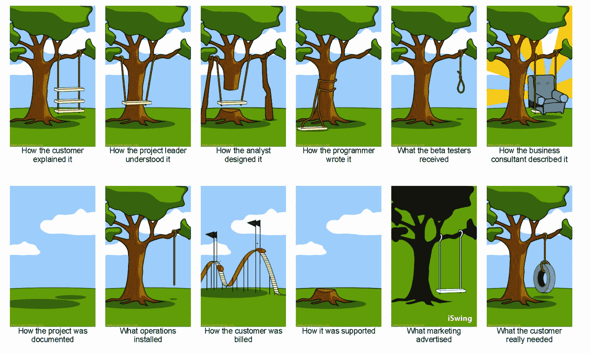
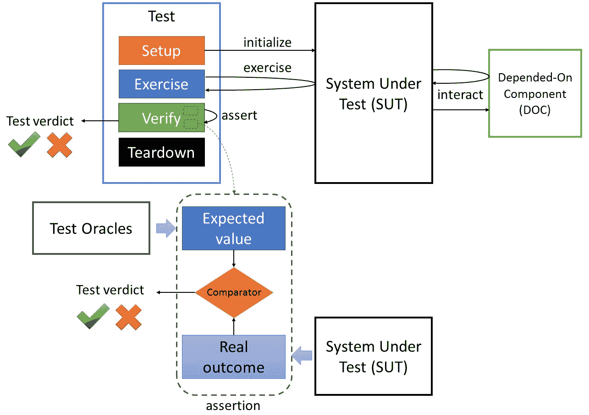

# 第六章：从需求到测试用例

*程序测试可以用来显示错误的存在，但永远不能用来显示错误的不存在！- Edsger Dijkstra*

本章提供了一些知识基础，旨在帮助软件工程师编写有意义的测试用例。这个过程的起点是理解正在测试的系统的要求。没有这些信息，设计和实施有价值的测试是不可行的。在实际编写测试之前，可能会执行几个动作，即测试计划和测试设计。一旦我们开始测试编码过程，我们需要牢记一套编写正确代码的原则，以及一套要避免的反模式和坏味道。所有这些信息都以以下部分的形式在本章中提供：

+   **要求的重要性**：本节概述了软件开发过程，从提出需要由软件系统满足的一些需求开始，然后经过几个阶段，通常包括分析、设计、实施和测试。

+   **测试计划**：在软件项目开始时可以生成一个名为*测试计划*的文档。本节根据 IEEE 829 测试文档标准审查了测试计划的结构。正如我们将发现的那样，测试计划的完整陈述是一个非常细粒度的过程，特别适用于团队之间的沟通对项目成功至关重要的大型项目。

+   **测试设计**：在开始编写测试代码之前，考虑这些测试的蓝图总是一个好的做法。在本节中，我们回顾了设计我们的测试时需要考虑的主要方面。我们强调测试数据（预期结果），这些数据为测试断言提供支持。在这方面，我们回顾了一些黑盒数据生成技术（等价分区和边界分析）和白盒（测试覆盖）。

+   **软件测试原则**：本节提供了一组可以帮助我们编写测试的最佳实践。

+   **测试反模式**：最后，还审查了相反的一面：在编写我们的测试用例时要避免的模式和代码坏味道。

# 要求的重要性

软件系统是为满足一组消费者（最终用户或客户）的某种需求而构建的。理解这些需求是软件工程中最具挑战性的问题之一，因为消费者的需求通常是模糊的（特别是在项目的早期阶段）。此外，这些需求在项目的整个生命周期中也经常发生深刻的变化。弗雷德·布鲁克斯（Fred Brooks），一位著名的软件工程师和计算机科学家，在他的开创性著作《神话般的程序员月度（1975）》中定义了这个问题：

*构建软件系统中最困难的部分是准确决定要构建什么。概念工作中没有其他部分像确立详细的技术要求那样困难……如果做错了，没有其他部分会像这样严重地瘫痪最终的系统。后来纠正这一点也是最困难的。*

无论如何，消费者的需求都是任何软件项目的试金石。从这些需求中，可以得出一系列功能。我们将功能定义为软件系统功能的高级描述。从每个功能中，应该派生出一个或多个要求（功能性和非功能性）。要求是关于软件的一切，以满足消费者的期望。场景（真实生活的例子而不是抽象描述）对于为要求描述添加细节是有用的。软件系统的要求组和/或功能列表通常被称为规范。

在软件工程中，定义需求的阶段被称为需求引出。在这个阶段，软件工程师需要澄清他们试图解决的问题是什么。在这个阶段结束时，开始对系统进行建模是一种常见做法。为此，通常会使用建模语言（通常是 UML）来创建一组图表。UML 图表，通常适用于引出阶段的是用例图（系统功能的模型及其与涉及的参与者的关系）。

并不是所有的软件项目都会进行建模。例如，敏捷方法更多地基于素描原则，而不是正式的建模策略。

需求在分析阶段应该进行细化。在这个阶段，已经陈述的需求被分析，以解决不完整、模糊或矛盾的问题。因此，在这个阶段很可能会继续建模，例如使用高级类图，尚未与任何特定技术相关联。一旦分析清楚（也就是系统的“是什么”），我们需要找出“如何”来实现它。这个阶段被称为设计。在设计阶段，项目的指导方针应该被建立。为此，软件系统的架构通常是从需求中派生出来的。建模技术再次被广泛应用于设计的不同方面。在这一点上可以使用一系列 UML 图，包括结构图（组件、部署、对象、包和配置文件图）和行为图（活动、通信、序列或状态图）。从设计开始，实际的实现（即编码）可以开始了。

在设计阶段进行的建模量因不同因素而异，包括生产软件的公司类型和规模（跨国公司、中小企业、政府等）、开发过程（瀑布、螺旋、原型、敏捷等）、项目类型（企业、开源等）、软件类型（定制软件、商业现成软件等）甚至参与人员的背景（经验、职业等）。总的来说，设计需要被理解为软件工程师在项目中参与的不同角色之间的沟通方式。通常情况下，项目越大，基于不同建模图的细粒度设计就越必要。

关于测试，为了制定适当的测试计划（有关详细信息，请参见下一节），我们需要再次使用需求引出的数据，即需求和/或功能列表。换句话说，为了验证我们的系统，我们需要事先知道我们对它有什么期望。除了验证，进行一些验证也是可取的（根据 Boehm 的说法：我们是否在构建正确的产品？）。这是必要的，因为有时候规定的内容（功能和需求）与消费者的实际需求之间存在差距。因此，验证是一种高级别的评估方法，为了进行验证，最终消费者可以参与其中（在部署软件系统后验证软件系统）。所有这些想法都在下图中描述：

软件工程通用开发过程

迄今为止，所提出的术语（沟通、需求引出、分析、设计、实施/测试和部署）没有通用的工作流程。在前面的图表中，它遵循线性流程，然而，在实践中，它可以遵循迭代、演进或并行的工作流程。

为了说明软件工程不同阶段可能涉及的潜在问题（分析、设计、实施等），值得回顾一下经典卡通《项目真正的运作方式》。这张图片的原始来源不详（有追溯到 1960 年代的版本）。2007 年，一个名为《项目卡通》的网站出现了（[`www.projectcartoon.com/`](http://www.projectcartoon.com/)），允许定制原始卡通的新场景。以下图表是该网站提供的卡通的 1.5 版本：

项目的真正运作方式，版本 1.5（由[www.projectcartoon.com](http://www.projectcartoon.com)创建的插图）

如果我们思考这张图片，我们会发现问题的根源来自需求，客户在开始时解释得很糟糕，而项目负责人理解得更糟糕。从那时起，整个软件工程过程就变成了“传话游戏”。解决所有这些问题超出了本书的范围，但作为一个良好的开始，我们需要特别关注需求，它指导整个过程，当然也包括测试。

# 测试计划

测试路径的第一步可以是生成一个名为*测试计划*的文档，这是进行软件测试的蓝图。这份文件描述了测试工作的目标、范围、方法、重点和分配。准备这样的文件的过程是思考软件系统验证需求的一个有用方式。同样，当 SUT 的规模和涉及的团队很大时，这份文件尤其有用，因为不同角色的工作分离使得沟通成为项目成功的潜在障碍。

创建测试计划的一种方法是遵循 IEEE 829 测试文档标准。尽管这个标准对大多数软件项目来说可能太过正式，但值得审查这个标准提出的指南，并在我们的软件项目中使用需要的部分（如果有的话）。IEEE 829 提出的步骤如下：

1.  **分析产品**：这部分强调了从消费者需求中提取系统需求的理解。正如已经解释的那样，如果没有关于软件的信息，就不可能测试软件。

1.  **设计测试策略**：计划的这一部分包括几个部分，包括：

+   定义测试范围，即要测试的系统组件（在范围内）和不测试的部分（超出范围）。正如后面所解释的，全面的测试是不可行的，我们需要仔细选择要测试的内容。这不是一个简单的选择，它可以由不同的因素决定，例如精确的客户要求、项目预算和时间安排，以及涉及的软件工程师的技能。

+   确定测试类型，即应该进行哪些级别的测试（单元、集成、系统、验收）以及哪种测试策略（黑盒、白盒、非功能性）。

+   记录风险，即可能在项目中引起不同问题的潜在问题。

1.  **定义测试目标**：在计划的这一部分中，列出了要测试的功能列表，以及测试每个功能的目标。

1.  **定义测试标准**：这些标准通常由两部分组成，即：

+   暂停标准，例如在多少失败的测试中，新功能的开发将暂停，直到团队解决所有失败。

+   退出标准，例如应通过的关键测试的百分比，以便继续进行下一阶段的开发。

1.  **资源规划**：计划的这一部分致力于总结进行测试活动所需的资源。这可能是人员、设备或基础设施。

1.  **计划测试环境**：它由将要执行测试的软件和硬件设置组成。

1.  **日程安排和估算**：在这个阶段，经理们应该将整个项目分解为小任务，估算工作量（人月）。

1.  **确定测试交付物**：确定必须维护以支持测试活动的所有文档。

可以看出，测试计划是一个复杂的任务，通常由经理在大型项目中执行。在本章的其余部分，我们将继续探讨如何编写测试用例，但从最接近实际测试编码的角度来看。

# 测试设计

为了正确设计测试，我们需要具体定义需要实现的内容。为此，重要的是要记住测试的通用结构，已在第一章中解释过，*关于软件质量和 Java 测试的回顾*。因此，对于每个测试，我们需要定义：

+   测试装置是什么，也就是 SUT 中进行测试所需的状态？这是在测试的开始阶段称为设置。在测试结束时，测试装置可能在拆卸阶段被释放。

+   SUT 是什么，如果我们正在进行单元测试，它的 DOC(s)是什么？单元测试应该是独立的，因此我们需要为 DOC(s)定义测试替身（通常是模拟对象或间谍）。

+   断言是什么？这是测试的关键部分。没有断言，我们无法声称测试实际上已经完成。为了设计断言，值得回顾一下它的通用结构。简而言之，断言包括比较一些预期值（测试数据）和从 SUT 获得的实际结果。如果任何一个断言是负面的，测试将被宣布为失败（测试判决）：

测试用例和断言的一般模式

测试数据在测试过程中起着至关重要的作用。测试数据的来源通常被称为测试预言，通常可以从需求中提取。然而，还有一些其他常用的测试预言来源，例如：

+   产生预期输出的不同程序（反向关系）。

+   提供近似结果的启发式或统计预言。

+   基于人类专家经验的价值观。

此外，测试数据可以根据底层测试技术进行推导。当使用黑盒测试时，也就是说，使用一些输入来执行特定的基于需求的测试，并期望得到一些输出时，可以采用不同的技术，例如等价分区或边界分析。另一方面，如果我们使用白盒测试，结构将是我们测试的基础，因此测试覆盖率将是选择最大化这些覆盖率的测试输入的关键。在接下来的章节中，将对这些技术进行审查。

# 等价分区

等价分区（也称为等价类分区）是一种黑盒技术（即，它依赖于系统的需求），旨在减少应该针对 SUT 执行的测试数量。这项技术最早由 Glenford Myers 于 1978 年定义为：

“*将程序的输入域划分为有限数量的类[集合]的技术，然后确定一组精心选择的最小测试用例来代表这些类。*”

换句话说，等价类划分提供了一个标准来回答问题*我们需要多少测试*？*。其思想是将所有可能的输入测试数据（通常是大量的组合）划分为一组我们假定 SUT 以相同方式处理的值。我们称这些值的集合为等价类。其思想是测试等价类中的一个代表值就足够了，因为假定所有值都是以相同方式被 SUT 处理的。

通常，对于给定的 SUT，等价类可以分为两种类型：有效和无效的输入。等价类划分测试理论确保只需要一个每个分区的测试用例来评估程序对相关分区的行为（有效和无效类）。以下过程描述了如何系统地进行给定 SUT 的等价类划分：

1.  首先，我们确定 SUT 的所有可能有效输入的域。要找出这些值，我们依赖于规范（特性或功能需求）。我们假定 SUT 能够正确处理这些值（有效的等价类）。

1.  如果我们的规范规定等价类的某些元素被不同方式处理，它们应该分配到另一个等价类。

1.  这个域之外的值可以被视为另一个等价类，这次是无效输入。

1.  对于每个等价类，选择一个代表值。这个决定是一个启发式过程，通常基于测试人员的经验。

1.  对于每个测试输入，还选择适当的测试输出，有了这些值，我们就能完成我们的测试用例（测试练习和断言）。

# 边界分析

任何程序员都知道，错误经常出现在等价类的边界上（例如，数组的初始值，给定范围的最大值等）。边界值分析是一种方法，它通过查看测试输入的边界来补充等价类划分。它是由国家标准与技术研究所（NIST）在 1981 年定义的：

“*一种选择技术，其中测试数据被选择为位于输入域[或输出范围]类、数据结构和过程参数的‘边界’上*”。

总之，要在我们的测试中应用边界值分析，我们需要准确评估我们的 SUT 在等价类的边界上。因此，通常使用这种方法派生两个测试用例：等价类的上界和下界。

# 测试覆盖

测试覆盖是对 SUT 中为任何测试所执行的代码的比例。测试覆盖对于发现 SUT 中未经测试的部分非常有用。因此，它可以作为完美的白盒技术（结构性）来补充黑盒（功能性）。一般规定，80%或以上的测试覆盖率被认为是合理的。

有不同的 Java 库，可以简单地进行测试覆盖，例如：

+   Cobertura（[`cobertura.github.io/cobertura/`](http://cobertura.github.io/cobertura/)）：这是一个开源的报告工具，可以使用 Ant、Maven 或直接使用命令行执行。

+   EclEmma（[`www.eclemma.org/`](http://www.eclemma.org/)）：这是一个用于 Eclipse 的开源代码覆盖工具。从 Eclipse 4.7（Oxygen）开始，EclEmma 已经集成在 IDE 中。以下截图显示了 EclEmma 在 Eclipse 中如何突出显示 Java 类的代码覆盖率：

Eclipse 4.7（Oxygen）中使用 EclEmma 进行测试覆盖

+   JaCoCo（[`www.jacoco.org/jacoco/`](http://www.jacoco.org/jacoco/)）：这是一个由 EclEmma 团队基于另一个名为 EMMA（[`emma.sourceforge.net/`](http://emma.sourceforge.net/)）的旧覆盖库创建的开源代码覆盖库。JaCoCo 可以作为 Maven 依赖使用。

+   Codecov ([`codecov.io/`](https://codecov.io/))：这是一个提供友好的代码覆盖率网络仪表板的云解决方案。对于开源项目来说是免费的。

# 软件测试原则

详尽测试是指一种测试方法，它使用所有可能的测试输入组合来验证软件系统。这种方法只适用于微小的软件系统或具有有限数量可能操作和允许数据的组件。在大多数软件系统中，验证每种可能的排列和输入组合是不可行的，因此详尽测试只是一种理论方法。

因此，有人说软件系统中的缺陷无法被证明。这是由计算机科学先驱 Edsger W. Dijkstra 所说的（见本章开头的引用）。因此，测试最多只是抽样，它必须在任何软件项目中进行，以减少系统故障的风险（参见第一章，*关于软件质量和 Java 测试的回顾*，回顾软件缺陷分类）。由于我们无法测试所有内容，我们需要进行适当的测试。在本节中，我们将回顾一系列编写有效和高效测试用例的最佳实践，即：

+   **测试应该简单**：编写测试的软件工程师（称之为测试人员、程序员、开发人员或其他）应该避免尝试测试自己的程序。在测试方面，对于问题“谁监视守夜人？”的正确答案应该是没有人。我们的测试逻辑应该足够简单，以避免任何形式的元测试，因为这将导致逻辑之外的递归问题。间接地，如果我们保持测试简单，我们还会获得另一个理想的特性：测试将更容易维护。

+   **不要实现简单的测试**：制作简单的测试是一回事，实现 getter 或 setter 等虚拟代码是另一回事。如前所述，测试最多只是抽样，我们不能浪费宝贵的时间评估我们代码库的这种部分。

+   **易于阅读**：第一步是为我们的测试方法提供一个有意义的名称。此外，由于 JUnit 5 的`@DisplayName`注解，我们可以提供丰富的文本描述，定义测试的目标，而不受 Java 命名约束的限制。

+   单一责任原则：这是计算机编程的一个通用原则，规定每个类应该负责单一功能。它与内聚性的度量密切相关。在编写测试时，实现这一原则非常重要：单个测试应该只涉及特定的系统需求。

+   **测试数据是关键**：如前所述，从 SUT 得到的预期结果是测试的核心部分。正确管理这些数据对于创建有效的测试至关重要。幸运的是，JUnit 5 提供了丰富的工具箱来处理测试数据（参见第四章，*使用高级 JUnit 功能简化测试*中的*参数化测试*一节）。

+   **单元测试应该执行得非常快**：对于单元测试持有的一个普遍接受的经验法则是，单元测试的持续时间最多应该是一秒。为了实现这一目标，还需要单元测试适当地隔离 SUT，正确地加倍其 DOCs。

+   **测试必须可重复**：缺陷应该被重现多次，以便开发人员找到错误的原因。这是理论，但不幸的是这并不总是适用。例如，在多线程 SUT（实时或服务器端软件系统）中，可能会发生竞争条件。在这些情况下，可能会出现非确定性的缺陷（通常称为*heisenbugs*）。

+   **我们应该测试正面和负面的情况**：这意味着我们需要编写测试，以评估预期结果的输入条件，但我们也需要验证程序不应该执行的操作。除了满足其要求，程序还必须经过测试，以避免不需要的副作用。

+   **测试不能仅仅为了覆盖率而进行**：仅仅因为代码的所有部分都被一些测试触及，我们不能保证这些部分已经得到了彻底的测试。要想成为真实，测试必须以降低风险的方式进行分析。

# 测试的心理学

从心理学角度来看，测试的目标应该是执行软件系统，以发现缺陷。理解这一主张的动机可以在我们测试的成功中产生巨大的差异。

人类往往是以目标为导向的。如果我们进行测试以证明程序没有错误，我们往往会选择测试数据，这些数据很少引起程序故障的可能性。另一方面，如果目标是证明程序存在错误，我们将增加发现错误的可能性，为程序增加更多的价值。因此，测试通常被认为是一个破坏性的过程，因为测试人员应该证明 SUT 存在错误。

此外，试图证明软件中存在错误是一个可行的目标，而试图证明它们的不存在，正如前面所解释的，是不可能的。再次，心理学研究告诉我们，当人们知道一个任务是不可行的时，他们的表现会很差。

# 测试反模式

在软件设计中，模式是解决重复问题的可重用解决方案。其中有很多，包括单例、工厂、构建器、外观、代理、装饰器或适配器等。反模式也是模式，但是不受欢迎的。关于测试，了解一些这些反模式是值得的，以避免它们在我们的测试中出现：

+   **二等公民**：测试代码包含大量重复的代码，使其难以维护。

+   **免费搭车**（也称为*搭便车*）：不是编写一个新的方法来验证另一个特性/要求，而是在现有的测试中添加一个新的断言。

+   **快乐路径**：只验证预期结果，而不测试边界和异常。

+   **当地英雄**：一个依赖于特定本地环境的测试。这种反模式可以用短语“在我的机器上可以运行”来概括。

+   **隐藏的依赖**：在测试运行之前需要一些现有数据填充的测试。

+   **链式测试**：必须按特定顺序运行的测试，例如，将 SUT 更改为下一个预期状态。

+   **嘲弄**：一个单元测试包含太多的测试替身，以至于 SUT 根本没有被测试，而是从测试替身中返回数据。

+   **无声接收器**：即使发生意外异常，测试也能通过的测试。

+   **检查员**：一种违反封装的测试，对 SUT 的任何重构都需要在测试中反映这些变化。

+   **过度设置**：需要大量设置才能开始执行阶段的测试。

+   **肛门探测器**：一种测试，必须使用不健康的方式来执行其任务，比如使用反射读取私有字段。

+   **没有名称的测试**：测试方法的名称没有清晰地指示正在测试什么（例如，在错误跟踪工具中的标识符）。

+   **慢吞吞**：持续时间超过几秒的单元测试。

+   **闪烁的测试**：测试中包含竞争条件，使其不时失败。

+   **等待观察**：一个需要等待特定时间（例如`Thread.sleep()`）才能验证某些预期行为的测试。

+   **不恰当的共享装置**：测试使用测试装置，甚至不需要设置/拆卸。

+   巨人：一个包含大量测试方法的测试类（上帝对象）。

+   湿地：创建持久数据的测试，但在完成时没有清理。

+   布谷鸟：一个单元测试在实际测试之前建立某种固定装置，但随后测试以某种方式丢弃了这个固定装置。

+   秘密捕手：一个测试没有进行任何断言，依赖于抛出异常并由测试框架报告为失败。

+   环境破坏者：一个测试需要使用给定的环境变量（例如，一个允许同时执行的自由端口号）。

+   分身：将被测试的代码部分复制到一个新的类中，以便测试可见。

+   母鸡：一个不仅仅满足测试需求的固定装置。

+   测试一切：不应该违反单一职责原则的测试。

+   线击手：一个没有对 SUT 进行任何真正验证的测试。

+   连体双胞胎：被称为“单元测试”但实际上是集成测试，因为 SUT 和 DOC 之间没有隔离。

+   说谎者：一个测试并不测试原本应该测试的内容。

# 代码异味

代码异味（在软件中称为“坏味道”）是源代码中不希望出现的症状。代码异味本身并不是问题，但它们可能表明附近存在某种问题。

如前所述，测试应该简单易读。因此，代码异味在任何情况下都不应该存在于我们的测试中。总的来说，通用的代码异味在我们的测试中可能会被避免。一些最常见的代码异味包括以下内容：

+   重复的代码：克隆的代码在软件中总是一个坏主意，因为它违反了“不要重复自己”的原则（DRY）。在测试中，这个问题甚至更糟，因为测试逻辑必须非常清晰。

+   高复杂度：太多的分支或循环可能被潜在地简化为更小的部分。

+   长方法：一个变得过于庞大的方法总是有问题的，当这个方法是一个测试时，这是一个非常糟糕的症状。

+   不合适的命名约定：变量、类和方法的名称应该简洁。使用非常长的标识符被认为是一种坏味道，但过度使用短（或无意义）的标识符也是如此。

# 总结

测试设计的起点应该是需求列表。如果这些需求尚未被正式引出，至少我们需要了解 SUT 功能，这反映了软件的需求。从这一点出发，可以采取几种策略。通常情况下，达到我们的目标没有唯一的路径，最终目标应该是降低项目的风险。

本章回顾了一个旨在创建有效和高效测试用例的过程。这个过程涉及需求分析、测试计划的定义、测试用例的设计，最后编写测试用例。我们应该意识到，尽管软件测试是技术任务，但它涉及一些重要的人类心理因素。软件工程师和测试人员应该了解这些因素，以便遵循最佳实践，并避免常见的错误。

在第七章“测试管理”中，我们将了解在一个活跃的软件项目中如何管理软件测试活动。首先，我们将回顾在常见的软件开发过程中（如瀑布、螺旋、迭代、敏捷或测试驱动开发）何时以及如何进行测试。然后，我们将审查旨在在 JUnit 5 的上下文中自动化软件开发过程的服务器端基础设施（如 Jenkins 或 Travis）。最后，我们将学习如何使用所谓的问题跟踪系统和测试报告库跟踪 Jupiter 测试发现的缺陷。
