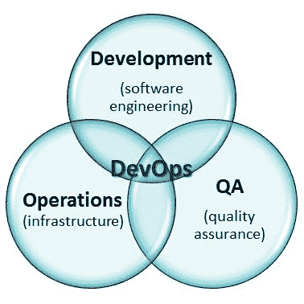
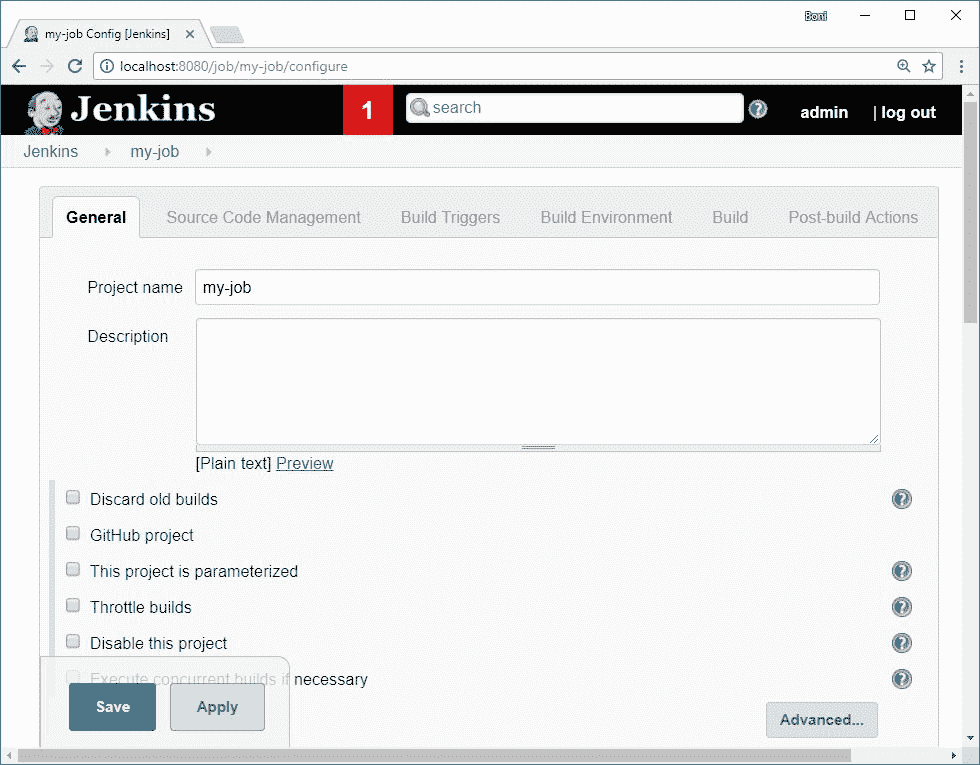
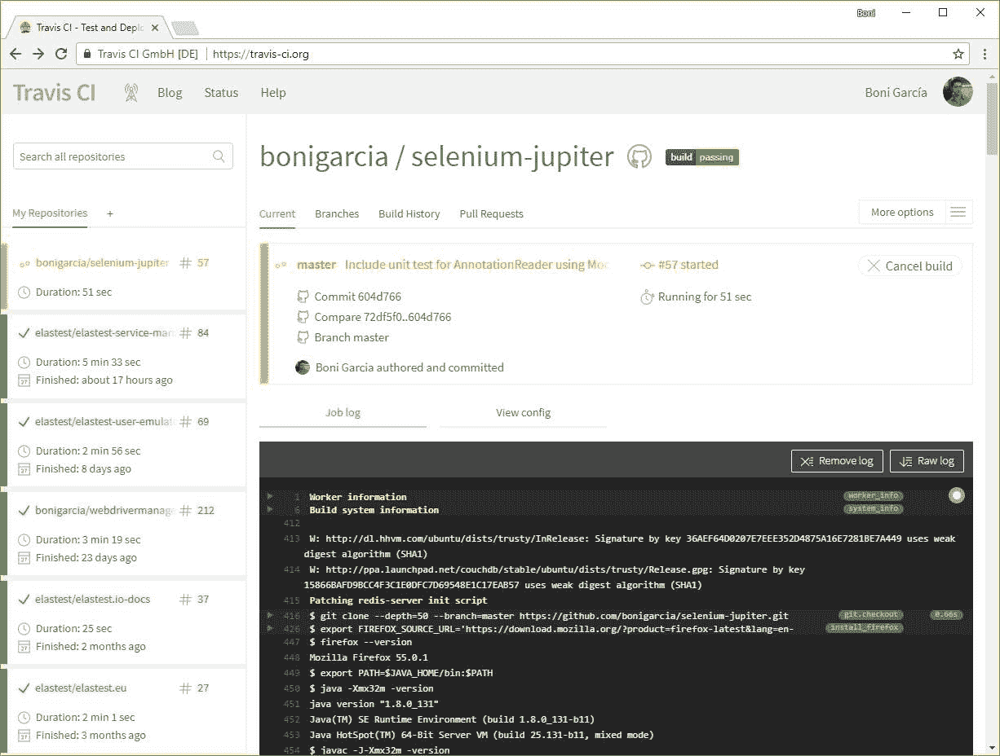
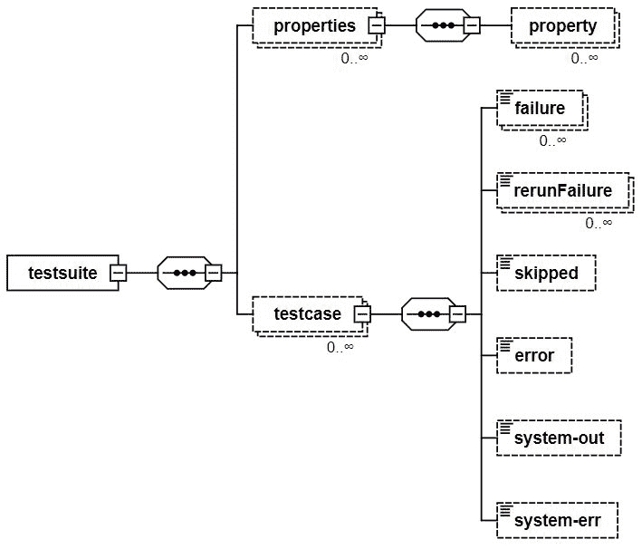
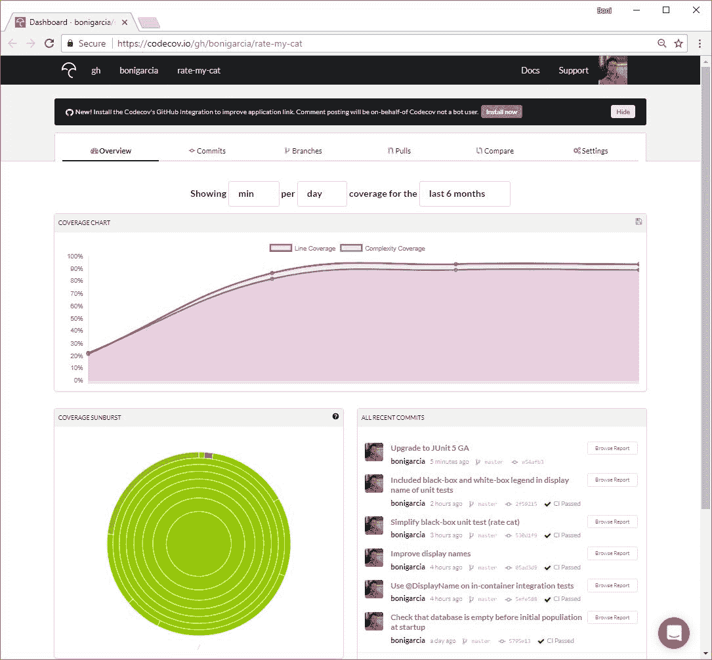
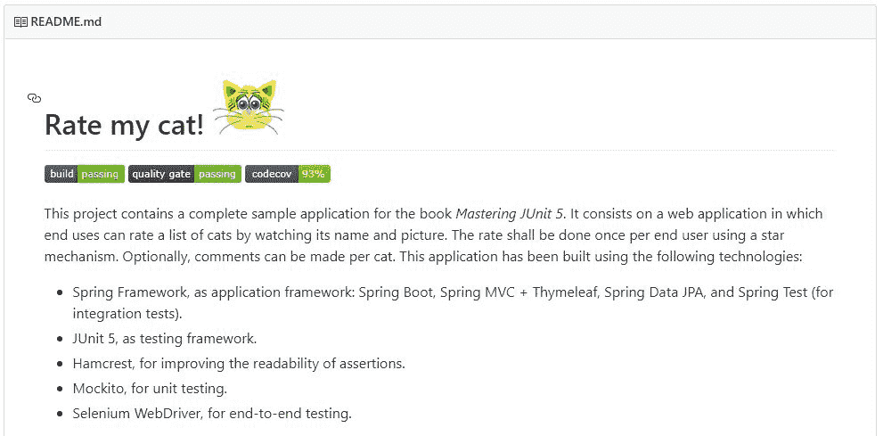

# 第七章：测试管理

重要的是不停地质疑。

*- 阿尔伯特·爱因斯坦*

这是本书的最后一章，其目标是指导如何理解软件测试活动在一个活跃的软件项目中是如何管理的。为了达到这个目的，本章分为以下几个部分：

+   **软件开发过程**：在本节中，我们研究了在不同方法论中何时执行测试：**行为驱动开发**（**BDD**）、**测试驱动开发**（**TDD**）、**先测试开发**（**TFD**）和**最后测试开发**（**TLD**）。

+   **持续集成**（**CI**）：在本节中，我们将了解持续集成，这是软件开发实践，其中构建、测试和集成的过程是持续进行的。这个过程的常见触发器通常是向源代码库（例如 GitHub）提交新更改（补丁）。此外，在本节中，我们将学习如何扩展持续集成，回顾持续交付和持续部署的概念。最后，我们介绍了目前两个最重要的构建服务器：Jenkins 和 Travis CI。

+   **测试报告**：在本节中，我们将首先了解 xUnit 框架通常报告测试执行的 XML 格式。这种格式的问题在于它不易阅读。因此，有一些工具可以将这个 XML 转换成更友好的格式，通常是 HTML。我们回顾了两种替代方案：Maven Surefire Report 和 Allure。

+   **缺陷跟踪系统**：在本节中，我们回顾了几个问题跟踪系统：JIRA、Bugzilla、Redmine、MantisBT 和 GitHub 问题。

+   **静态分析**：在本节中，一方面我们回顾了几种自动化分析工具（*linters*），如 Checkstyle、FindBugs、PMD 和 SonarQube。另一方面，我们描述了几种同行评审工具，如 Collaborator、Crucible、Gerrit 和 GitHub 拉取请求审查。

+   **将所有部分整合在一起**：为了结束本书，在最后一节中，我们展示了一个完整的示例应用程序，在这个应用程序中，使用了本书中介绍的一些主要概念进行了不同类型的测试（单元测试、集成测试和端到端测试）。

# 软件开发过程

在软件工程中，软件开发过程（也称为软件开发生命周期）是指用于创建软件系统所需的活动、行为和任务的工作流程。正如在第六章中介绍的，*从需求到测试用例*，任何软件开发过程中通常的阶段包括：

+   *what*的定义：需求获取、分析和用例建模。

+   *how*的定义：结构和行为图的系统架构和建模。

+   实际的软件开发（编码）。

+   使软件可供使用的一系列活动（发布、安装、激活等）。

在整个软件开发过程中设计和实施测试的时间安排导致了不同的测试方法论，即（见列表后的图表）：

+   **行为驱动开发**（**BDD**）：在分析阶段开始时，软件消费者（最终用户或客户）与开发团队的一些成员（通常是项目负责人、经理或分析师）进行了对话。这些对话用于具体化场景（即，具体示例以建立对系统功能的共同理解）。这些示例构成了使用工具（如 Cucumber）开发验收测试的基础（有关更多详细信息，请参阅第五章，*JUnit 5 与外部框架的集成*）。在 BDD 中描述验收测试（例如，在 Cucumber 中使用 Gherkin）产生了准确描述应用程序功能的自动化测试和文档。BDD 方法自然地与迭代或敏捷方法论对齐，因为很难事先定义需求，并且随着团队对项目的了解而不断发展。

术语*敏捷*是在 2001 年敏捷宣言的诞生时被推广的（[`agilemanifesto.org/`](http://agilemanifesto.org/)）。它是由 17 位软件从业者（Kent Beck、James Grenning、Robert C. Martin、Mike Beedle、Jim Highsmith、Steve Mellor、Arie van Bennekum、Andrew Hunt、Ken Schwaber、Alistair Cockburn、Ron Jeffries、Jeff Sutherland、Ward Cunningham、Jon Kern、Dave Thomas、Martin Fowler 和 Brian Marick）撰写的，并包括一系列 12 条原则，以指导迭代和以人为中心的软件开发过程。基于这些原则，出现了几种软件开发框架，如 SCRUM、看板或极限编程（XP）。

+   **测试驱动开发**（**TDD**）：TDD 是一种方法，其中测试在实际软件设计之前被设计和实施。其思想是将分析阶段获得的需求转化为具体的测试用例。然后，软件被设计和实施以通过这些测试。TDD 是 XP 方法的一部分。

+   **测试优先开发**（**TFD**）：在这种方法中，测试是在设计阶段之后但实际实施 SUT 之前实施的。这样可以确保在实际实施之前正确理解了软件单元。这种方法在统一过程中得到遵循，这是一种流行的迭代和增量软件开发过程。**统一过程**（**RUP**）是统一过程的一个知名框架实现。除了 TFD，RUP 还支持其他方法，如 TDD 和 TLD。

+   **测试后开发**（**TLD**）：在这种方法论中，测试的实施是在实际软件（SUT）的实施之后进行的。这种测试方法遵循经典的软件开发流程，如瀑布（顺序）、增量（多瀑布）或螺旋（风险导向的多瀑布）。


软件开发过程中的测试方法

到目前为止，这些术语没有普遍接受的定义。这些概念不断发展和辩论，就像软件工程本身一样。请将其视为一个提议，适用于大量的软件项目。

关于谁负责编写测试，有一个普遍接受的共识。广泛建议 SUT 开发人员应编写单元测试。在某些情况下，特别是在小团队中，这些开发人员还负责其他类型的测试。

此外，独立测试组的角色（通常称为测试人员或 QA 团队）也是一种常见的做法，特别是在大型团队中。这种角色分离的目标之一是消除可能存在的利益冲突。我们不能忘记，从生理学角度来看，测试被理解为一种破坏性的活动（目标是发现缺陷）。这个独立的测试组通常负责集成、系统和非功能测试。在这种情况下，两组工程师应该密切合作；在进行测试时，开发人员应该随时准备纠正错误并尽量减少未来的错误。

最后，通常会在异构组中进行高级别的验收测试，包括非程序员（客户、业务分析、管理人员等）与软件工程师或测试人员（例如，在 Cucumber 中实现步骤定义）。

# 持续集成

CI 的概念最早是由 Grady Booch（美国软件工程师，与 Ivar Jacobson 和 James Rumbaugh 一起开发 UML 而闻名）于 1991 年首次提出的。**极限编程**（**XP**）方法采用了这个术语，使其非常流行。根据 Martin Fowler 的说法，CI 的定义如下：

*持续集成是一个软件开发实践，团队成员经常集成他们的工作，通常每个人至少每天集成一次 - 导致每天多次集成。每次集成都由自动构建（包括测试）进行验证，以尽快检测到集成错误。*

在 CI 系统中，我们可以识别出不同的部分。首先，我们需要一个源代码存储库，这是一个文件存档，用于托管软件项目的源代码，通常使用版本控制系统。如今，首选的版本控制系统是 Git（最初由 Linus Torvalds 开发），而不是较早的解决方案，如 CVS 或 SVN。在撰写本文时，领先的版本控制存储库是 GitHub（[`github.com/`](https://github.com/)），正如其名称所示，它是基于 Git 的。此外，还有其他选择，如 GitLab（[`gitlab.com`](https://gitlab.com)）、BitBucket（[`bitbucket.org/`](https://bitbucket.org/)）或 SourceForge（[`sourceforge.net/`](https://sourceforge.net/)）。后者曾经是领先的开发平台，但现在使用较少。

源代码存储库的副本与开发人员的本地环境同步。编码工作是针对这个本地副本进行的。开发人员应该每天提交新的更改（称为*补丁*）到远程存储库。频繁的提交可以避免由于对同一文件的相互修改而导致的冲突错误。

CI 的基本理念是每次提交都应该执行构建并测试带有新更改的软件。因此，我们需要一个自动化这个过程的服务器端基础设施。这个基础设施被称为构建服务器（或直接 CI 服务器）。目前最重要的两个构建服务器是 Jenkins 和 Travis CI。它们的详细信息将在下一小节中提供。作为构建过程的结果，构建服务器应该通知原始开发人员的处理结果。如果测试成功，补丁将合并到代码库中：


持续集成过程

靠近 CI，术语 DevOps 已经蓬勃发展。DevOps 来自*开发*和*运维*，它是一个强调项目软件中不同团队之间沟通和协作的软件开发过程的名称：开发（软件工程）、QA（**质量保证**）和运维（基础设施）。DevOps 这个术语也指的是一个工作职位，通常负责构建服务器的设置、监控和运行：



DevOps 处于开发、运维和 QA 之间

如下图所示，CI 的概念可以扩展到：

+   **持续交付**：当 CI 管道正确完成时，至少一个软件发布将部署到测试环境（例如，将 SNAPSHOT 工件部署到 Maven 存档器）。在此阶段，还可以执行验收测试。

+   **持续部署**：作为自动化工具链的最后一步，软件的发布可以发布到生产环境（例如，将 Web 应用程序部署到每个提交的生产服务器，以通过完整的管道）。


持续集成、持续交付和持续部署链

# Jenkins

Jenkins ([`jenkins.io/`](https://jenkins.io/))是一个开源的构建服务器，支持构建、部署和自动化任何项目。Jenkins 是用 Java 开发的，可以通过其 Web 界面轻松管理。Jenkins 实例的全局配置包括关于 JDK、Git、Maven、Gradle、Ant 和 Docker 的信息。

Jenkins 最初是由 Sun Microsystems 于 2004 年开发的 Hudson 项目。在 Sun 被 Oracle 收购后，Hudson 项目被分叉为一个开源项目，并更名为 Jenkins。Hudson 和 Jenkins 这两个名字都是为了听起来像典型的英国男仆名字。其想法是它们帮助开发人员执行乏味的任务，就像一个乐于助人的男仆一样。

在 Jenkins 中，构建通常由版本控制系统中的新提交触发。此外，构建可以由其他机制启动，例如定期的 cron 任务，甚至可以通过 Jenkins 界面手动启动。

Jenkins 由于其插件架构而具有很高的可扩展性。由于这些插件，Jenkins 已经扩展到由大量第三方框架、库、系统等组成的丰富插件生态系统。这是由开源社区维护的。Jenkins 插件组合可在[`plugins.jenkins.io/`](https://plugins.jenkins.io/)上找到。

在 Jenkins 的核心，我们找到了作业的概念。作业是由 Jenkins 监控的可运行实体。如此屏幕截图所示，Jenkins 作业由四个组成：

+   **源代码管理**：这是源代码存储库（Git、SVN 等）的 URL

+   **构建触发器**：这是启动构建过程的机制，例如源代码存储库中的新更改、外部脚本、定期等。

+   **构建环境**：可选设置，例如在构建开始前删除工作空间，卡住时中止构建等。

+   **作业步骤的集合**：这些步骤可以使用 Maven、Gradle、Ant 或 shell 命令完成。之后，可以配置后构建操作，例如存档工件、发布 JUnit 测试报告（我们将在本章后面描述此功能）、电子邮件通知等。



Jenkins 作业配置

配置作业的另一种有趣方式是使用 Jenkins *pipeline*，它是使用 Pipeline DSL（基于 Groovy 的特定领域语言）描述构建工作流程。Jenkins 管道描述通常存储在一个名为 Jenkinsfile 的文件中，该文件可以受源代码存储库的控制。简而言之，Jenkins 管道是由步骤组成的阶段的声明性链。例如：

```java
pipeline {
    agent any
    stages {
        stage('Build') {
            steps {
                sh 'make'
            }
        }
        stage('Test') {
            steps {
                sh 'make check'
                junit 'reports/**/*.xml'
            }
        }
        stage('Deploy') {
            steps {
                sh 'make publish'
            }
        }
    }
}
```

# Travis CI

Travis CI ([`travis-ci.org/`](https://travis-ci.org/))是一个分布式构建服务器，用于构建和测试托管在 GitHub 上的软件项目。Travis 支持无需收费的开源项目。

Travis CI 的配置是使用名为*.travis.yaml*的文件完成的。该文件的内容使用不同的关键字进行结构化，包括：

+   `language`：项目语言，即 java、node_js、ruby、python 或 php 等（完整列表可在[`docs.travis-ci.com/user/languages/`](https://docs.travis-ci.com/user/languages/)上找到）。

+   `sudo`：如果需要超级用户权限（例如安装 Ubuntu 软件包）的标志值。

+   `dist`：可以在 Linux 环境（Ubuntu Precise 12.04 或 Ubuntu Trusty 14.04）上执行构建。

+   `addons`：apt-get 命令的基本操作的声明性快捷方式。

+   `install`：Travis 构建生命周期的第一部分，其中完成所需依赖项的安装。可以选择使用`before_install`来启动此部分。

+   `script`：构建的实际执行。此阶段可以选择由`before_script`和`after_script`包围。

+   `deploy`：最后，可以选择在此阶段进行构建的部署。此阶段有其自己的生命周期，由`before_deploy`和`after_deploy`控制。

YAML 是一种轻量级标记语言，由于其简约的语法，广泛用于配置文件。最初它被定义为 Yet Another Markup Language，但后来被重新定义为 YAML Ain't Markup Language，以区分其作为数据导向的目的。

```java
.travis.yaml:
```

```java
language: java
sudo: false
dist: trusty

addons:
    firefox: latest
    apt:
        packages:
            - google-chrome-stable
    sonarcloud:
        organization: "bonigarcia-github"
        token:
            secure: "encripted-token"

before_script:
    - export DISPLAY=:99.0
    - sh -e /etc/init.d/xvfb start &
    - sleep 3

script:
    - mvn test sonar:sonar
    - bash <(curl -s https://codecov.io/bash)
```

Travis CI 提供了一个 Web 仪表板，我们可以在其中检查使用 Travis CI 生成的当前和过去构建的状态，这些构建是在我们的 GitHub 帐户中使用 Travis CI 的项目中生成的：



Travis CI 仪表板

# 测试报告

从其最初版本开始，JUnit 测试框架引入了一种 XML 文件格式来报告测试套件的执行情况。多年来，这种 XML 格式已成为报告测试结果的*事实*标准，在 xUnit 家族中广泛采用。

这些 XML 可以由不同的程序处理，以以人类友好的格式显示结果。这就是构建服务器所做的事情。例如，Jenkins 实现了一个名为`JUnitResultArchiver`的工具，它解析作业测试执行产生的 XML 文件为 HTML。

尽管这种 XML 格式已经变得普遍，但并没有普遍的正式定义。JUnit 测试执行器（例如 Maven，Gradle 等）通常使用自己的 XSD（XML 模式定义）。例如，在 Maven 中，这种 XML 报告的结构如下图所示。请注意，测试套件由一组属性和一组测试用例组成。每个测试用例可以声明为失败（具有某些断言失败的测试），跳过（忽略的测试）和错误（具有意外异常的测试）。如果测试套件的主体中没有出现这些状态中的任何一个，那么测试将被解释为成功。最后，对于每个测试用例，XML 还存储标准输出（*system-out*）和标准错误输出（*system-err*）：



Maven Surefire XML 报告的模式表示

`rerunFailure`是 Maven Surefire 为重试不稳定（间歇性）测试而实现的自定义状态（[`maven.apache.org/surefire/maven-surefire-plugin/examples/rerun-failing-tests.html`](http://maven.apache.org/surefire/maven-surefire-plugin/examples/rerun-failing-tests.html)）。

关于 JUnit 5，用于运行 Jupiter 测试的 Maven 和 Gradle 插件（分别为`maven-surefire-plugin`和`junit-platform-gradle-plugin`）遵循此 XML 格式编写测试执行结果。在接下来的部分中，我们将看到如何将此 XML 输出转换为人类可读的 HTML 报告。

# Maven Surefire 报告

默认情况下，`maven-surefire-plugin`生成来自测试套件执行的 XML 结果为`${basedir}/target/surefire-reports/TEST-*.xml`。可以使用插件`maven-surefire-report-plugin`轻松将此 XML 输出解析为 HTML。为此，我们只需要在`pom.xml`的报告子句中声明此插件，如下所示：

```java
<reporting>
    <plugins>
        <plugin>
            <groupId>org.apache.maven.plugins</groupId>
            <artifactId>maven-surefire-report-plugin</artifactId>
            <version>${maven-surefire-report-plugin.version}</version>
        </plugin>
    </plugins>
</reporting>
```

这样，当我们调用 Maven 生命周期以进行文档（`mvn site`）时，测试结果的 HTML 页面将包含在总体报告中。

查看报告的示例，使用 GitHub 存储库示例中的项目`junit5-reporting`（[`github.com/bonigarcia/mastering-junit5`](https://github.com/bonigarcia/mastering-junit5)）：


由 maven-surefire-report-plugin 生成的 HTML 报告

# Allure

Allure（[`allure.qatools.ru/`](http://allure.qatools.ru/)）是一个轻量级的开源框架，用于为不同的编程语言生成测试报告，包括 Java，Python，JavaScript，Ruby，Groovy，PHP，.NET 和 Scala。总的来说，Allure 使用 XML 测试输出并将其转换为 HTML5 丰富报告。

Allure 支持 JUnit 5 项目。这可以使用 Maven 和 Gradle 来完成。关于 Maven，我们需要在`maven-surefire-plugin`中注册一个监听器。这个监听器将是类 AllureJunit5（位于库`io.qameta.allure:allure-junit5`中），它基本上是 JUnit 5 的`TestExecutionListener`的实现。正如在第二章中所描述的，*JUnit 5 的新功能*，`TestExecutionListener`是 Launcher API 的一部分，用于接收有关测试执行的事件。总的来说，这个监听器允许 Allure 在生成 JUnit 平台时编译测试信息。这些信息由 Allure 存储为 JSON 文件。之后，我们可以使用插件`io.qameta.allure:allure-maven`从这些 JSON 文件生成 HTML5。命令是：

```java
mvn test
mvn allure:serve
```

我们的`pom.xml`的内容应包含以下内容：

```java
<dependencies>
    <dependency>
        <groupId>io.qameta.allure</groupId>
        <artifactId>allure-junit5</artifactId>
        <version>${allure-junit5.version}</version>
        <scope>test</scope>
    </dependency>
    <dependency>
        <groupId>org.junit.jupiter</groupId>
        <artifactId>junit-jupiter-api</artifactId>
        <version>${junit.jupiter.version}</version>
        <scope>test</scope>
    </dependency>
</dependencies>

<build>
    <plugins>
        <plugin>
            <artifactId>maven-surefire-plugin</artifactId>
            <version>${maven-surefire-plugin.version}</version>
            <configuration>
                <properties>
                    <property>
                        <name>listener</name>
                        <value>io.qameta.allure.junit5.AllureJunit5</value>
                    </property>
                </properties>
                <systemProperties>
                    <property>
                        <name>allure.results.directory</name>
                        <value>${project.build.directory}/allure-results</value>
                    </property>
                </systemProperties>
            </configuration>
            <dependencies>
                <dependency>
                    <groupId>org.junit.platform</groupId>
                    <artifactId>junit-platform-surefire-provider</artifactId>
                    <version>${junit.platform.version}</version>
                </dependency>
                <dependency>
                    <groupId>org.junit.jupiter</groupId>
                    <artifactId>junit-jupiter-engine</artifactId>
                    <version>${junit.jupiter.version}</version>
                </dependency>
            </dependencies>
        </plugin>
        <plugin>
            <groupId>io.qameta.allure</groupId>
            <artifactId>allure-maven</artifactId>
            <version>${allure-maven.version}</version>
        </plugin>
    </plugins>
</build>
```

使用 Gradle 也可以完成相同的过程，这次使用等效的插件`io.qameta.allure:allure-gradle`。总的来说，我们的`build.gradle`文件的内容应包含：

```java
buildscript {
    repositories {
        jcenter()
        mavenCentral()
    }
    dependencies {
        classpath("org.junit.platform:junit-platform-gradle-plugin:${junitPlatformVersion}")
        classpath("io.qameta.allure:allure-gradle:${allureGradleVersion}")
    }
}

apply plugin: 'io.qameta.allure'

dependencies {
    testCompile("org.junit.jupiter:junit-jupiter-api:${junitJupiterVersion}")
    testCompile("io.qameta.allure:allure-junit5:${allureJUnit5Version}")
    testRuntime("org.junit.jupiter:junit-jupiter-engine:${junitJupiterVersion}")
}
```

以下图片显示了使用上述步骤生成的 Allure 报告的几个屏幕截图（使用 Maven 或 Gradle 生成的最终结果相同）。该示例项目称为`junit5-allure`，通常托管在 GitHub 上。


在 JUnit 5 项目中生成的 Allure 报告

# 缺陷跟踪系统

缺陷跟踪系统（也称为 bug 跟踪系统，bug 跟踪器或问题跟踪器）是一个软件系统，用于跟踪软件项目中报告的软件缺陷。这种系统的主要好处是提供开发管理，bug 报告甚至功能请求的集中概览。通常还会维护一个待处理项目列表，通常称为积压。

有许多可用的缺陷跟踪系统，既有专有的也有开源的。在本节中，我们简要介绍了几个最知名的系统：

+   **JIRA**（[`www.atlassian.com/software/jira`](https://www.atlassian.com/software/jira)）：这是由 Atlasian 创建的专有缺陷跟踪系统。除了错误和问题跟踪外，它还提供了管理功能，如 SCRUM 和 Kanban 板，用于查询问题的语言（JIRA 查询语言），与外部系统的集成（例如 GitHub，Bitbucket），以及通过 Atlasian Marketplace（[`marketplace.atlassian.com/`](https://marketplace.atlassian.com/)）的插件机制来扩展 JIRA 的插件。

+   **Bugzilla**（[`www.bugzilla.org/`](https://www.bugzilla.org/)）：这是由 Mozilla 基金会开发的开源基于 Web 的缺陷跟踪系统。在其功能中，我们可以找到用于改善性能和可伸缩性的数据库，用于搜索缺陷的查询机制，集成电子邮件功能以及用户角色管理。

+   **Redmine**（[`www.redmine.org/`](http://www.redmine.org/)）：这是一个开源的基于 Web 的缺陷跟踪系统。它提供了维基，论坛，时间跟踪，基于角色的访问控制，或者用于项目管理的甘特图。

+   **MantisBT**（[`www.mantisbt.org/`](https://www.mantisbt.org/)）：它是另一个开源的、基于 Web 的缺陷跟踪系统，旨在简单而有效。其中的特点包括事件驱动的插件系统，允许官方和第三方扩展，多通道通知系统（电子邮件、RSS 订阅、Twitter 插件等），或基于角色的访问控制。

+   **GitHub issues**（[`guides.github.com/features/issues/`](https://guides.github.com/features/issues/)）：它是集成在每个 GitHub 存储库中的跟踪系统。GitHub issues 的方法是提供一个通用的缺陷跟踪系统，用于任务调度、讨论，甚至使用 GitHub issues 进行功能请求。每个问题都可以使用可自定义的标签系统进行分类，参与者管理和通知。

# 静态分析

这本即将完成的书主要关注软件测试。毫不奇怪，JUnit 就是关于测试的。但正如我们在第一章中所看到的，*关于软件质量和 Java 测试的回顾*，尽管软件测试是**验证和验证**（**V&V**）中最常见的活动，但并不是唯一的类型。另一个重要的活动组是静态分析，在这种活动中没有执行软件测试。

可以将不同的活动归类为静态分析。其中，自动化软件分析是一种相当廉价的替代方案，可以帮助显著提高内部代码质量。在本章中，我们将回顾几种自动化软件分析工具，即**linters**：

+   **Checkstyle**（[`checkstyle.sourceforge.net/`](http://checkstyle.sourceforge.net/)）：它分析 Java 代码遵循不同的规则，如缺少 Javadoc 注释，使用魔术数字，变量和方法的命名约定，方法的参数长度和行长度，导入的使用，一些字符之间的空格，类构造的良好实践，或重复的代码。它可以作为 Eclipse 或 IntelliJ 插件等使用。

+   **FindBugs**（[`findbugs.sourceforge.net/`](http://findbugs.sourceforge.net/)）：它在 Java 代码中查找三种类型的错误：

+   正确性错误：明显的编码错误（例如，类定义了`equal(Object)`而不是`equals(Object)`）。

+   不良实践：违反推荐最佳实践（丢弃异常、滥用 finalize 等）。

+   可疑错误：混乱的代码或以导致错误的方式编写（例如，类`literal`从未被使用，switch 穿透，未经确认的类型转换和多余的空指针检查）。

+   **PMD**（[`pmd.github.io/`](https://pmd.github.io/)）：它是一个跨语言的静态代码分析器，包括 Java、JavaScript、C++、C#、Go、Groovy、Perl、PHP 等。它有许多插件，包括 Maven、Gradle、Eclipse、IntelliJ 和 Jenkins。

+   **SonarQube**（[`www.sonarqube.org/`](https://www.sonarqube.org/)）：它（以前只是 Sonar）是一个基于 Web 的、开源的持续质量评估仪表板。它支持多种语言，包括 Java、C/C++、Objective-C、C#等。提供重复代码、代码异味、代码覆盖率、复杂性和安全漏洞的报告。SonarQube 有一个名为**SonarCloud**（[`sonarcloud.io/`](https://sonarcloud.io/)）的分布式版本。它可以在开源项目中免费使用，通过在`.travis.yml`中进行几行配置，包括 SonarCloud 组织标识符和安全令牌，与 Travis CI 实现无缝集成。这些参数可以在将 SonarCloud 帐户与 GitHub 关联后，在 SonarCloud Web 管理面板中获取。

```java
addons:
    sonarcloud:
        organization: "bonigarcia-github"
        token:
            secure: "encrypted-token"
```

之后，我们只需要使用 Maven 或 Gradle 调用 SonarCloud：

```java
script:
    - mvn test sonar:sonar
```

```java
script:
    - gradle test sonarQube
```

下图显示了 SonarCloud 仪表板，用于上一章节中描述的示例应用程序“Rate my cat!”：


SonarCloud 报告应用程序“Rate my cat!”

在许多软件项目中广泛采用的另一种分析静态技术是**同行审查**。这种方法在时间和精力方面相当昂贵，但正确应用时，可以保持非常高水平的内部代码质量。如今有许多旨在简化软件代码库的同行审查过程的工具。其中，我们找到了以下工具：

+   **Collaborator**（[`smartbear.com/product/collaborator/`](https://smartbear.com/product/collaborator/)）：SmartBear 公司创建的同行代码（和文档）审查专有工具。

+   **Crucible**（[`www.atlassian.com/software/crucible`](https://www.atlassian.com/software/crucible)）：Atlassian 创建的企业产品的本地代码审查专有工具。

+   **Gerrit**（[`www.gerritcodereview.com/`](https://www.gerritcodereview.com/)）：基于 Web 的开源代码协作工具。可以通过 GerritHub（[`gerrithub.io/`](http://gerrithub.io/)）与 GitHub 存储库一起使用。

+   **GitHub 拉取请求审查**（[`help.github.com/articles/about-pull-request-reviews/`](https://help.github.com/articles/about-pull-request-reviews/)）：在 GitHub 中，拉取请求是向第三方存储库提交贡献的一种方法。作为 GitHub 提供的协作工具的一部分，拉取请求允许以简单和集成的方式进行审查和评论。

# 将所有部分整合在一起

在本书的最后一节中，我们将通过一个实际示例回顾本书涵盖的一些主要方面。为此，我们将开发一个完整的应用程序，并使用 JUnit 5 实现不同类型的测试。

# 功能和需求

我们应用程序的历史始于一个热爱猫的假设人物。这个人拥有一群猫，他/她希望从外部世界得到关于它们的反馈。因此，这个人（我们从现在开始称之为*客户*）与我们联系，要求我们实现一个满足他/她需求的 Web 应用程序。该应用程序的名称将是“Rate my cat!”。在与客户的对话中，我们得出了应用程序开发的以下功能列表：

+   **F1**：每个用户应通过观看其名称和图片对猫的列表进行评分。

+   **F2**：每个用户应使用星级机制（从`0.5`到`5`星）对每只猫进行一次评分，还可以选择包括每只猫的评论。

作为我们开发过程中分析阶段的一部分，这些功能被细化为以下**功能需求**（**FR**）列表：

+   **FR1**：应用程序向最终用户呈现猫的列表（由名称和图片组成）。

+   **FR2**：每只猫都可以单独评分。

+   **FR3**：对猫进行评分的范围是从`0.5`到`5`（星）的区间。

+   **FR4**：除了每只猫的数字评分外，用户还应包括一些评论。

+   **FR5**：每个最终用户只能对每只猫（评论和/或星级）评分一次。

# 设计

由于我们的应用程序相当简单，我们决定在这里停止分析阶段，而不将我们的需求建模为用例。相反，我们继续使用经典的三层模型对 Web 应用程序进行高层架构设计：表示层、应用（或业务）逻辑和数据层。关于应用逻辑，如下图所示，需要两个组件。第一个称为`CatService`负责所有在需求列表中描述的评分操作。第二个称为`CookiesServices`用于处理 HTTP Cookies，需要实现 FR5*：


“Rate my cat!”应用程序的高层架构设计

在这个阶段，我们能够决定实现我们的应用程序所涉及的主要技术：

+   Spring 5：这将是我们应用程序的基础框架。具体来说，我们使用 Spring Boot 通过 Spring MVC 简化我们的 Web 应用程序的创建。此外，我们使用 Spring Data JPA 使用简单的 H2 数据库来持久化应用程序数据，并使用 Thymeleaf ([`www.thymeleaf.org/`](http://www.thymeleaf.org/))作为模板引擎（用于 MVC 中的视图）。最后，我们还使用 Spring Test 模块以简单的方式进行容器内集成测试。

+   JUnit 5：当然，我们不能使用与 JUnit 5 不同的测试框架来进行我们的测试用例。此外，为了提高我们断言的可读性，我们使用 Hamcrest。

+   Mockito：为了实现单元测试用例，我们将使用 Mockito 框架，在几个容器外的单元测试中将 SUT 与其 DOCs 隔离开来。

+   Selenium WebDriver：我们还将使用 Selenium WebDriver 实现不同的端到端测试，以便从 JUnit 5 测试中执行我们的 Web 应用程序。

+   GitHub：我们的源代码存储库将托管在公共 GitHub 存储库中。

+   Travis CI：我们的测试套件将在每次提交新补丁到我们的 GitHub 存储库时执行。

+   Codecov：为了跟踪我们测试套件的代码覆盖率，我们将使用 Codecov。

+   SonarCloud：为了提供对我们源代码内部质量的完整评估，我们通过 SonarCloud 补充我们的测试过程进行一些自动静态分析。

这里的屏幕截图显示了应用程序 GUI 的操作。本节的主要目标不是深入挖掘应用程序的实现细节。有关详细信息，请访问[`github.com/bonigarcia/rate-my-cat`](https://github.com/bonigarcia/rate-my-cat)上的应用程序的 GitHub 存储库。


应用程序 Rate my cat 的屏幕截图！

用于实现此示例的图片已从[`pixabay.com/`](https://pixabay.com/)上的免费图库中下载。

# 测试

现在让我们专注于这个应用程序的 JUnit 5 测试。我们实现了三种类型的测试：单元测试、集成测试和端到端测试。如前所述，对于单元测试，我们使用 Mockito 来隔离 SUT。我们决定使用包含不同 JUnit 5 测试的 Java 类来对我们应用程序的两个主要组件（`CatService`和`CookiesServices`）进行单元测试。

考虑第一个测试（称为`RateCatsTest`）。如代码所示，在这个类中，我们将类`CatService`定义为 SUT（使用注解`@InjectMocks`），将类`CatRepository`（由`CatService`使用依赖注入）定义为 DOC（使用注解`@Mock`）。这个类的第一个测试（`testCorrectRangeOfStars`）是一个参数化的 JUnit 5 测试的示例。这个测试的目标是评估`CatService`内的 rate 方法（方法`rateCate`）。为了选择这个测试的测试数据（输入），我们遵循黑盒策略，因此我们使用需求定义的信息。具体来说，*FR3*规定了用于评价猫的评分机制的星级范围。遵循边界分析方法，我们选择输入范围的边缘，即 0.5 和 5。第二个测试用例（`testCorrectRangeOfStars`）也测试相同的方法（`rateCat`），但这次测试评估了 SUT 在超出范围的输入时的响应（负面测试场景）。然后，在这个类中实现了另外两个测试，这次旨在评估*FR4*（即，还使用评论来评价猫）。请注意，我们使用 JUnit 5 的`@Tag`注解来标识每个测试及其相应的需求：

```java
package io.github.bonigarcia.test.unit;

import static org.hamcrest.CoreMatchers.*equalTo*;
import static org.hamcrest.MatcherAssert.*assertThat*;
import static org.hamcrest.text.IsEmptyString.*isEmptyString*;
import static org.junit.jupiter.api.Assertions.*assertThrows*;
import static org.mockito.ArgumentMatchers.*any*;
import static org.mockito.Mockito.*when*;

import java.util.Optional;
import org.junit.jupiter.api.DisplayName;
import org.junit.jupiter.api.Tag;
import org.junit.jupiter.api.Test;
import org.junit.jupiter.api.extension.ExtendWith;
import org.junit.jupiter.params.ParameterizedTest;
import org.junit.jupiter.params.provider.ValueSource;
import org.mockito.InjectMocks;
import org.mockito.Mock;
import io.github.bonigarcia.Cat;
import io.github.bonigarcia.CatException;
import io.github.bonigarcia.CatRepository;
import io.github.bonigarcia.CatService;
import io.github.bonigarcia.mockito.MockitoExtension;

@ExtendWith(MockitoExtension.class)
@DisplayName("Unit tests (black-box): rating cats")
@Tag("unit")
class RateCatsTest {

    @InjectMocks
    CatService catService;

    @Mock
    CatRepository catRepository;

    // Test data
    Cat dummy = new Cat("dummy", "dummy.png");
    int stars = 5;
    String comment = "foo";

    @ParameterizedTest(name = "Rating cat with {0} stars")
    @ValueSource(doubles = { 0.5, 5 })
    @DisplayName("Correct range of stars test")
    @Tag("functional-requirement-3")
    void testCorrectRangeOfStars(double stars) {
        *when*(catRepository.save(dummy)).thenReturn(dummy);
        Cat dummyCat = catService.rateCat(stars, dummy);
        *assertThat*(dummyCat.getAverageRate(), *equalTo*(stars));
    }

    @ParameterizedTest(name = "Rating cat with {0} stars")
    @ValueSource(ints = { 0, 6 })
    @DisplayName("Incorrect range of stars test")
    @Tag("functional-requirement-3")
    void testIncorrectRangeOfStars(int stars) {
        *assertThrows*(CatException.class, () -> {
            catService.rateCat(stars, dummy);
        });
    }

    @Test
    @DisplayName("Rating cats with a comment")
    @Tag("functional-requirement-4")
    void testRatingWithComments() {
        *when*(catRepository.findById(*any*(Long.class)))
            .thenReturn(Optional.*of*(dummy));
        Cat dummyCat = catService.rateCat(stars, comment, 0);
        *assertThat*(catService.getOpinions(dummyCat).iterator().next()
           .getComment(), *equalTo*(comment));
    }

    @Test
    @DisplayName("Rating cats with empty comment")
    @Tag("functional-requirement-4")
    void testRatingWithEmptyComments() {
        *when*(catRepository.findById(*any*(Long.class)))
            .thenReturn(Optional.*of*(dummy));
        Cat dummyCat = catService.rateCat(stars, dummy);
        *assertThat*(catService.getOpinions(dummyCat).iterator().next()
            .getComment(), *isEmptyString*());
    }

}
```

接下来，单元测试评估了 cookies 服务（*FR5*）。为此，以下测试使用`CookiesService`类作为 SUT，这次我们将模拟标准的 Java 对象，即操作 HTTP Cookies 的`javax.servlet.http.HttpServletResponse`。检查此测试类的源代码，我们可以看到第一个测试方法（称为`testUpdateCookies`）练习了服务方法`updateCookies`，验证了 cookies 的格式是否符合预期。接下来的两个测试（`testCheckCatInCookies`和`testCheckCatInEmptyCookies`）评估了服务的`isCatInCookies`方法，使用了积极的策略（即输入猫与 cookie 的格式相对应）和消极的策略（相反的情况）。最后，最后两个测试（`testUpdateOpinionsWithCookies`和`testUpdateOpinionsWithEmptyCookies`）练习了 SUT 的`updateOpinionsWithCookiesValue`方法，遵循相同的方法，即使用有效和空 cookie 检查 SUT 的响应。所有这些测试都是按照白盒策略实施的，因为它的测试数据和逻辑完全依赖于 SUT 的特定内部逻辑（在这种情况下，cookie 的格式和管理方式）。

这个测试并不是按照纯白盒方法进行的，因为它的目标是在 SUT 内部练习所有可能的路径。它可以被视为白盒，因为它直接与实现相关联，而不是与需求相关联。

```java
package io.github.bonigarcia.test.unit;

import static org.hamcrest.CoreMatchers.*containsString*;
import static org.hamcrest.CoreMatchers.*equalTo*;
import static org.hamcrest.CoreMatchers.*not*;
import static org.hamcrest.MatcherAssert.*assertThat*;
import static org.hamcrest.collection.IsEmptyCollection.*empty*;
import static org.mockito.ArgumentMatchers.*any*;
import static org.mockito.Mockito.*doNothing*;
import java.util.List;
import javax.servlet.http.Cookie;
import javax.servlet.http.HttpServletResponse;
import org.junit.jupiter.api.DisplayName;
import org.junit.jupiter.api.Tag;
import org.junit.jupiter.api.Test;
import org.junit.jupiter.api.extension.ExtendWith;
import org.mockito.InjectMocks;
import org.mockito.Mock;
import io.github.bonigarcia.Cat;
import io.github.bonigarcia.CookiesService;
import io.github.bonigarcia.Opinion;
import io.github.bonigarcia.mockito.MockitoExtension;

@ExtendWith(MockitoExtension.class)
@DisplayName("Unit tests (white-box): handling cookies")
@Tag("unit")
@Tag("functional-requirement-5")
class CookiesTest {
    @InjectMocks
    CookiesService cookiesService;
    @Mock
    HttpServletResponse response;

    // Test data
    Cat dummy = new Cat("dummy", "dummy.png");
    String dummyCookie = "0#0.0#_";

    @Test
    @DisplayName("Update cookies test")
    void testUpdateCookies() {
        *doNothing*().when(response).addCookie(*any*(Cookie.class));
        String cookies = cookiesService.updateCookies("", 0L, 0D, "", 
          response);
        *assertThat*(cookies,                         
 *containsString*(CookiesService.*VALUE_SEPARATOR*));
        *assertThat*(cookies, 
 *containsString*(Cookies.*CA**T_SEPARATOR*));
    }

    @Test
    @DisplayName("Check cat in cookies")
    void testCheckCatInCookies() {
        boolean catInCookies = cookiesService.isCatInCookies(dummy,
            dummyCookie);
        *assertThat*(catInCookies, *equalTo*(true));
    }

    @DisplayName("Check cat in empty cookies")
    @Test
    void testCheckCatInEmptyCookies() {
        boolean catInCookies = cookiesService.isCatInCookies(dummy, "");
        *assertThat*(catInCookies, *equalTo*(false));
    }

    @DisplayName("Update opinions with cookies")
    @Test
    void testUpdateOpinionsWithCookies() {
        List<Opinion> opinions = cookiesService
            .updateOpinionsWithCookiesValue(dummy, dummyCookie);
        *assertThat*(opinions, *not*(*empty*()));
    }

    @DisplayName("Update opinions with empty cookies")
    @Test
    void testUpdateOpinionsWithEmptyCookies() {
        List<Opinion> opinions = cookiesService
            .updateOpinionsWithCookiesValue(dummy, "");
        *assertThat*(opinions, *empty*());
    }

}
```

让我们继续下一个类型的测试：集成测试。对于这种类型的测试，我们将使用 Spring 提供的容器内测试功能。具体来说，我们使用 Spring 测试对象`MockMvc`来评估我们的应用程序的 HTTP 响应是否符合客户端的预期。在每个测试中，不同的请求被练习，以验证响应（状态码和内容类型）是否符合预期：

```java
package io.github.bonigarcia.test.integration;

import static org.springframework.test.web.servlet.request.MockMvcRequestBuilders.*get*;
import static org.springframework.test.web.servlet.request.MockMvcRequestBuilders.*post*;
import static org.springframework.test.web.servlet.result.MockMvcResultMatchers.*content*;
import static org.springframework.test.web.servlet.result.MockMvcResultMatchers.*status*;
import org.junit.jupiter.api.DisplayName;
import org.junit.jupiter.api.Tag;
import org.junit.jupiter.api.Test;
import org.junit.jupiter.api.extension.ExtendWith;
import org.springframework.beans.factory.annotation.Autowired;
import org.springframework.boot.test.context.SpringBootTest;
import org.springframework.test.context.junit.jupiter.SpringExtension;
import org.springframework.test.web.servlet.MockMvc;

@ExtendWith(SpringExtension.class)
@SpringBootTest
@DisplayName("Integration tests: HTTP reponses")
@Tag("integration")
@Tag("functional-requirement-1")
@Tag("functional-requirement-2")

class WebContextTest {

    @Autowired
    MockMvc mockMvc;

    @Test
    @DisplayName("Check home page (GET /)")
    void testHomePage() throws Exception {
        mockMvc.perform(*get*("/")).andExpect(*status*().isOk())
            .andExpect(*content*().contentType("text/html;charset=UTF-8"));
    }

    @Test
    @DisplayName("Check rate cat (POST /)")
    void testRatePage() throws Exception {
        mockMvc.perform(*post*("/").param("catId", "1").param("stars", "1")
            .param("comment", "")).andExpect(*status*().isOk())
            .andExpect(*content*().contentType("text/html;charset=UTF-8"));
    }

    @Test
    @DisplayName("Check rate cat (POST /) of an non-existing cat")
    void testRatePageCatNotAvailable() throws Exception {
        mockMvc.perform(*post*("/").param("catId", "0").param("stars", "1")
            .param("comment", "")).andExpect(*status*().isOk())
           .andExpect(*content*().contentType("text/html;charset=UTF-8"));
    }

    @Test
    @DisplayName("Check rate cat (POST /) with bad parameters")
    void testRatePageNoParameters() throws Exception {
        mockMvc.perform(*post*("/")).andExpect(*status*().isBadRequest());
    }

}
```

最后，我们还使用 Selenium WebDriver 实施了几个端到端测试。检查此测试的实现，我们可以看到这个测试同时使用了两个 JUnit 5 扩展：`SpringExtension`（在 JUnit 5 测试生命周期内启动/停止 Spring 上下文）和`SeleniumExtension`（在测试方法中注入 WebDriver 对象，用于控制 Web 浏览器）。特别是，在一个测试中我们使用了三种不同的浏览器：

+   PhantomJS（无头浏览器），以评估猫的列表是否在 Web GUI 中正确呈现（FR1）。

+   Chrome，通过应用程序 GUI 对猫进行评分（FR2）。

+   Firefox，使用 GUI 对猫进行评分，但结果出现错误（FR2）。

```java
package io.github.bonigarcia.test.e2e;

import static org.hamcrest.CoreMatchers.*containsString*;
import static org.hamcrest.CoreMatchers.*equalTo*;
import static org.hamcrest.MatcherAssert.*assertThat*;
import static org.openqa.selenium.support.ui.ExpectedConditions.*elementToBeClickable*;
import static org.springframework.boot.test.context.SpringBootTest.WebEnvironment.*RANDOM_PORT*;
 import java.util.List;
import org.junit.jupiter.api.DisplayName;
import org.junit.jupiter.api.Tag;
import org.junit.jupiter.api.Test;
import org.junit.jupiter.api.extension.ExtendWith;
import org.openqa.selenium.By;
import org.openqa.selenium.WebElement;
import org.openqa.selenium.chrome.ChromeDriver;
import org.openqa.selenium.firefox.FirefoxDriver;
import org.openqa.selenium.phantomjs.PhantomJSDriver;
import org.openqa.selenium.support.ui.WebDriverWait;
import org.springframework.boot.test.context.SpringBootTest;
import org.springframework.boot.web.server.LocalServerPort;
import org.springframework.test.context.junit.jupiter.SpringExtension;
import io.github.bonigarcia.SeleniumExtension;

@ExtendWith({ SpringExtension.class, SeleniumExtension.class })
@SpringBootTest(webEnvironment = *RANDOM_PORT*)
@DisplayName("E2E tests: user interface")
@Tag("e2e")
public class UserInferfaceTest {
    @LocalServerPort
    int serverPort;

    @Test
    @DisplayName("List cats in the GUI")
    @Tag("functional-requirement-1")
    public void testListCats(PhantomJSDriver driver) {
        driver.get("http://localhost:" + serverPort);
        List<WebElement> catLinks = driver
            .findElements(By.*className*("lightbox"));
        *assertThat*(catLinks.size(), *equalTo*(9));
    }

    @Test
    @DisplayName("Rate a cat using the GUI")
    @Tag("functional-requirement-2")
    public void testRateCat(ChromeDriver driver) {
        driver.get("http://localhost:" + serverPort);
        driver.findElement(By.*id*("Baby")).click();
        String fourStarsSelector = "#form1 span:nth-child(4)";
        new WebDriverWait(driver, 10)                     
            .until(*elementToBeClickable
*                (By.*cssSelector*(fourStarsSelector)));
        driver.findElement(By.*cssSelector*(fourStarsSelector)).click();
        driver.findElement(By.*xpath*("//*[@id=\"comment\"]"))
            .sendKeys("Very nice cat");
        driver.findElement(By.*cssSelector*("#form1 > button")).click();
        WebElement sucessDiv = driver
            .findElement(By.*cssSelector*("#success > div"));
        *assertThat*(sucessDiv.getText(), *containsString*("Your vote for               
            Baby"));
    }

    @Test
    @DisplayName("Rate a cat using the GUI with error")
    @Tag("functional-requirement-2")
    public void testRateCatWithError(FirefoxDriver driver) {
        driver.get("http://localhost:" + serverPort);
        driver.findElement(By.*id*("Baby")).click();
        String sendButtonSelector = "#form1 > button";
        new WebDriverWait(driver, 10).until(
 *elementToBeClickable*(By.*cssSelector*(sendButtonSelector)));
        driver.findElement(By.*cssSelector*(sendButtonSelector)).click();
        WebElement sucessDiv = driver
            .findElement(By.*cssSelector*("#error > div"));
        *assertThat*(sucessDiv.getText(), *containsString*(
            "You need to select some stars for rating each cat"));
    }

}
```

为了更容易追踪测试执行，在所有实施的测试中，我们使用`@DisplayName`选择了有意义的测试名称。此外，对于参数化测试，我们使用元素名称来细化每次测试执行的测试名称，具体取决于测试输入。以下是在 Eclipse 4.7（Oxygen）中执行测试套件的屏幕截图：


在 Eclipse 4.7 中执行应用程序“评价我的猫！”的测试套件

如前所述，我们使用 Travis CI 作为构建服务器，在开发过程中执行我们的测试。在 Travis CI 的配置（文件`.travis.yml`）中，我们设置了两个额外的工具，以增强我们应用程序的开发和测试过程。一方面，Codecov 提供了全面的测试覆盖报告。另一方面，SonarCloud 提供了完整的静态分析。这两个工具都由 Travis CI 触发，作为持续集成构建过程的一部分。因此，我们可以评估应用程序的测试覆盖率和内部代码质量（如代码异味、重复块或技术债务），以及我们的开发过程。

以下图片显示了 Codecov 提供的在线报告的屏幕截图（SonarCloud 提供的报告在本章的前一部分中呈现）：

\

Codecov 报告应用程序 Rate my cat！

最后但并非最不重要的是，我们在 GitHub 存储库的`README`中使用了几个*徽章*。具体来说，我们为 Travis CI（最后构建过程的状态）、SonarCloud（最后分析的状态）和 Codecov（最后代码覆盖分析的百分比）添加了徽章：



GitHub 应用程序 Rate my cat！的徽章

# 总结

在本章中，我们回顾了测试活动管理方面的几个问题。首先，我们了解到测试可以在软件开发过程（软件生命周期）的不同部分进行，这取决于测试方法论：BDD（在需求分析之前定义验收测试），TDD（在系统设计之前定义测试），TFD（在系统设计之后实现测试）和 TLD（在系统实现之后实现测试）。

CI 是在软件开发中越来越多地使用的一个过程。它包括对代码库的自动构建和测试。这个过程通常是由源代码存储库中的新提交触发的，比如 GitHub、GitLab 或 Bitbucket。CI 扩展到持续交付（当发布到开发环境）和持续部署（当不断地部署到生产环境）。我们回顾了当今最常用的两个构建服务器：Jenkins（*CI 作为服务*）和 Travis（内部）。

有一些其他工具可以用来改进测试的管理，例如报告工具（如 Maven Surefire Report 或 Allure）或缺陷跟踪系统（如 JIRA、Bugzilla、Redmine、MantisBT 和 GitHub 问题）。自动静态分析是测试的一个很好的补充，例如使用诸如 Checkstyle、FindBugs、PMD 或 SonarQube 之类的代码检查工具，以及同行审查工具，如 Collaborator、Crucible、Gerrit 和 GitHub 拉取请求审查。

为了结束这本书，本章的最后一部分介绍了一个完整的 Web 应用程序（名为*Rate my cat!*）及其相应的 JUnit 5 测试（单元测试、集成测试和端到端测试）。它包括使用本书中介绍的不同技术开发和评估的 Web 应用程序，即 Spring、Mockito、Selenium、Hamcrest、Travis CI、Codecov 和 SonarCloud。
