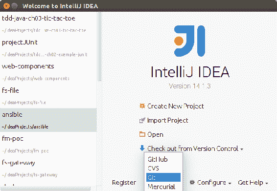
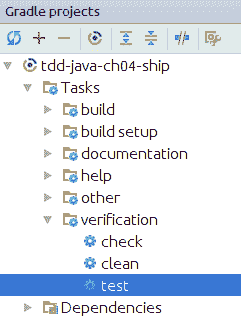

# 第四章：单元测试-关注您正在做的事情，而不是已经完成的事情

“要创造出非凡的东西，你的心态必须专注于最小的细节。”

-乔治·阿玛尼

正如承诺的那样，每一章都将探讨不同的 Java 测试框架，这一章也不例外。我们将使用 TestNG 来构建我们的规范。

在之前的第三章中，我们练习了红-绿-重构的过程。我们使用了单元测试，但并没有深入探讨单元测试在 TDD 背景下的工作原理。我们将在上一章的知识基础上进行更详细的讨论，试图解释单元测试到底是什么，以及它们如何适用于 TDD 构建软件的方法。

本章的目标是学习如何专注于我们当前正在处理的单元，并学会忽略或隔离那些已经完成的单元。

一旦我们熟悉了 TestNG 和单元测试，我们将立即开始进入下一个应用程序的需求并开始编码。

本章将涵盖以下主题：

+   单元测试

+   使用 TDD 进行单元测试

+   TestNG

+   遥控船的要求

+   开发遥控船

# 单元测试

频繁的手动测试对于除了最小的系统之外都太不切实际了。唯一的解决办法是使用自动化测试。它们是减少构建、部署和维护应用程序的时间和成本的唯一有效方法。为了有效地管理应用程序，实施和测试代码尽可能简单至关重要。简单是**极限编程**（**XP**）价值观之一（[`www.extremeprogramming.org/rules/simple.html`](http://www.extremeprogramming.org/rules/simple.html)），也是 TDD 和编程的关键。这通常是通过分成小单元来实现的。在 Java 中，单元是方法。作为最小的单元，它们提供的反馈循环是最快的，因此我们大部分时间都在思考和处理它们。作为实施方法的对应物，单元测试应该占所有测试的绝大部分比例。

# 什么是单元测试？

**单元测试**是一种实践，它迫使我们测试小的、独立的、孤立的代码单元。它们通常是方法，尽管在某些情况下，类甚至整个应用程序也可以被视为单元。为了编写单元测试，需要将测试代码与应用程序的其余部分隔离开来。最好是代码中已经融入了这种隔离，或者可以通过使用**模拟对象**来实现（有关模拟对象的更多内容将在第六章中介绍，*模拟-消除外部依赖*）。如果特定方法的单元测试跨越了该单元的边界，那么它们就变成了集成测试。这样一来，测试的范围就变得不那么清晰了。在出现故障的情况下，问题的范围突然增加，找到原因变得更加费力。

# 为什么进行单元测试？

一个常见的问题，特别是在严重依赖手动测试的组织中，是*为什么我们应该使用单元测试而不是功能和集成测试？*这个问题本身是有缺陷的。单元测试并不取代其他类型的测试。相反，单元测试减少了其他类型测试的范围。由于其性质，单元测试比任何其他类型的测试更容易和更快地编写，从而降低了成本和**上市时间**（**TTM**）。由于编写和运行它们的时间减少，它们往往更早地检测到问题。我们越快地检测到问题，修复问题的成本就越低。在创建后几分钟就被检测到的错误比在创建后几天、几周甚至几个月后被发现的错误要容易得多。

# 代码重构

**代码重构**是在不改变现有代码的外部行为的情况下改变现有代码结构的过程。重构的目的是改进现有的代码。这种改进可以出于许多不同的原因。我们可能希望使代码更易读，更简单，更易于维护，更廉价扩展等等。无论重构的原因是什么，最终目标总是以某种方式使其更好。这个目标的效果是减少技术债务；减少由于次优设计、架构或编码而需要完成的未决工作。

通常，我们通过应用一系列小的更改来进行重构，而不修改预期的行为。减少重构变化的范围允许我们持续确认这些变化没有破坏任何现有功能。有效获得这种确认的唯一方法是通过使用自动化测试。

单元测试的一个巨大好处是它们是最好的重构促进者。当没有自动化测试来确认应用程序仍然按预期行为时，重构就太冒险了。虽然任何类型的测试都可以用来提供重构所需的代码覆盖率，但在大多数情况下，只有单元测试可以提供所需的细节级别。

# 为什么不只使用单元测试？

此刻，你可能会想知道单元测试是否能够满足你所有的测试需求。不幸的是，情况并非如此。虽然单元测试通常涵盖了大部分的测试需求，但功能测试和集成测试应该是测试工具箱的一个重要部分。

我们将在后面的章节中更详细地介绍其他类型的测试。目前，它们之间的一些重要区别如下：

+   单元测试试图验证小的功能单元。在 Java 世界中，这些单元是方法。所有外部依赖，如调用其他类和方法或数据库调用，应该在内存中使用模拟、存根、间谍、伪造和虚拟对象来完成。Gerard Meszaros 创造了一个更一般的术语，**测试替身**，它包括了所有这些（[`en.wikipedia.org/wiki/Test_double`](http://en.wikipedia.org/wiki/Test_double)）。单元测试简单易写，运行速度快。它们通常是测试套件中最大的部分。

+   **功能**和**验收**测试的工作是验证我们正在构建的应用程序作为一个整体是否按预期工作。虽然这两者在目的上有所不同，但都有一个相似的目标。与验证代码的内部质量的单元测试不同，功能和验收测试试图确保系统从客户或用户的角度正确地工作。由于编写和运行这些测试所需的成本和工作量，这些测试通常比单元测试少。

+   **集成**测试旨在验证单独的单元、模块、应用程序，甚至整个系统是否正确地相互集成。你可能有一个使用后端 API 的前端应用程序，而这些 API 又与数据库进行通信。集成测试的工作就是验证系统的这三个独立组件确实是集成的，并且能够相互通信。由于我们已经知道所有的单元都在工作，所有功能和验收测试都通过了，集成测试通常是这三种测试中最小的，因为它们的工作只是确认所有的部件能够良好地协同工作：


测试金字塔表明，你应该有比高级测试（UI 测试，集成测试等）更多的单元测试。为什么呢？单元测试的编写成本更低，运行速度更快，并且同时提供更大的覆盖范围。以注册功能为例。我们应该测试当用户名为空时会发生什么，当密码为空时会发生什么，当用户名或密码不符合正确格式时会发生什么，当用户已经存在时会发生什么，等等。仅针对这个单一功能，可能会有数十甚至数百个测试。从 UI 编写并运行所有这些测试可能非常昂贵（编写耗时且运行缓慢）。另一方面，对执行此验证的方法进行单元测试很容易，编写快速，运行迅速。如果所有这些情况都通过单元测试覆盖，我们可以满意地进行单一集成测试，检查我们的 UI 是否在后端调用了正确的方法。如果是的话，从集成的角度来看，细节是无关紧要的，因为我们知道所有情况已经在单元级别上得到了覆盖。

# 使用 TDD 的单元测试

在 TDD 的环境中，我们编写单元测试的方式有何不同？主要的区别在于*何时*。传统上，单元测试是在实现代码完成后编写的，而在 TDD 中，我们在此之前编写测试—事情的顺序被颠倒了。没有 TDD，单元测试的目的是验证现有代码。TDD 教导我们，单元测试应该驱动我们的开发和设计。它们应该定义最小可能单元的行为。它们是待开发的微需求。一个测试告诉你接下来该做什么，以及何时完成它。根据测试的类型（单元测试、功能测试、集成测试等），下一步应该做什么的范围不同。在使用 TDD 进行单元测试的情况下，这个范围是最小可能的，意味着一个方法或者更常见的是其中的一部分。此外，通过由单元测试驱动的 TDD，我们被迫遵守一些设计原则，比如**保持简单，愚蠢**（**KISS**）。通过编写简单的测试，范围很小，这些测试的实现也往往很简单。通过强制测试不使用外部依赖，我们迫使实现代码具有良好设计的关注点分离。TDD 如何帮助我们编写更好的代码还有许多其他例子。这些好处无法仅通过单元测试实现。没有 TDD，单元测试被迫使用现有代码，并且对设计没有影响。

总之，没有 TDD 的单元测试的主要目标是验证现有代码。使用 TDD 程序提前编写的单元测试的主要目标是规范和设计，验证只是一个附带产品。这个附带产品通常比在实现之后编写测试时的质量要高。

TDD 迫使我们深思熟虑我们的需求和设计，编写能够运行的干净代码，创建可执行的需求，并安全而频繁地进行重构。最重要的是，我们最终得到了高测试代码覆盖率，用于在引入变更时对我们的所有代码进行回归测试。没有 TDD 的单元测试只给我们测试，而且通常质量存疑。

# TestNG

JUnit 和 TestNG 是两个主要的 Java 测试框架。在上一章中，您已经使用 JUnit 编写了测试，*Red-Green-Refactor – 从失败到成功直至完美*，并且希望您对其工作原理有了很好的理解。那 TestNG 呢？它诞生于对 JUnit 进行改进的愿望。事实上，它包含了一些 JUnit 没有的功能。

以下小节总结了它们之间的一些区别。我们不仅会尝试解释这些区别，还会在 TDD 的单元测试环境中对它们进行评估。

# @Test 注释

JUnit 和 TestNG 都使用`@Test`注释来指定哪个方法被视为测试。与 JUnit 不同，后者要求每个方法都要有`@Test`注释，而 TestNG 允许我们在类级别上使用这个注释。当以这种方式使用时，除非另有规定，否则所有公共方法都被视为测试：

```java
@Test
public class DirectionSpec {
  public void whenGetFromShortNameNThenReturnDirectionN() {
    Direction direction = Direction.getFromShortName('N');
    assertEquals(direction, Direction.NORTH);
  }

  public void whenGetFromShortNameWThenReturnDirectionW() { 
    Direction direction = Direction.getFromShortName('W'); 
    assertEquals(direction, Direction.WEST); 
  } 
} 
```

在这个例子中，我们将`@Test`注释放在`DirectionSpec`类的上面。结果，`whenGetFromShortNameNThenReturnDirectionN`和`whenGetFromShortNameWThenReturnDirectionW`方法都被视为测试。

如果该代码是使用 JUnit 编写的，那么这两个方法都需要有`@Test`注释。

# @BeforeSuite，@BeforeTest，@BeforeGroups，@AfterGroups，@AfterTest 和@AfterSuite 注释

这六个注释在 JUnit 中没有对应的。TestNG 可以使用 XML 配置将测试分组为套件。使用`@BeforeSuite`和`@AfterSuite`注释的方法在指定套件中的所有测试运行之前和之后运行。类似地，使用`@BeforeTest`和`@AfterTest`注释的方法在测试类的任何测试方法运行之前运行。最后，TestNG 测试可以组织成组。`@BeforeGroups`和`@AfterGroups`注释允许我们在指定组中的第一个测试之前和最后一个测试之后运行方法。

虽然这些注释在编写实现代码后的测试时可能非常有用，但在 TDD 的上下文中并没有太多用处。与通常的测试不同，通常是计划并作为一个独立项目编写的，TDD 教导我们一次编写一个测试并保持一切简单。最重要的是，单元测试应该快速运行，因此没有必要将它们分组到套件或组中。当测试快速运行时，运行除了全部之外的任何内容都是浪费。例如，如果所有测试在 15 秒内运行完毕，就没有必要只运行其中的一部分。另一方面，当测试很慢时，通常是外部依赖没有被隔离的迹象。无论慢测试背后的原因是什么，解决方案都不是只运行其中的一部分，而是解决问题。

此外，功能和集成测试往往会更慢，并且需要我们进行某种分离。然而，最好是在`build.gradle`中将它们分开，以便每种类型的测试作为单独的任务运行。

# @BeforeClass 和@AfterClass 注释

这些注释在 JUnit 和 TestNG 中具有相同的功能。在当前类中的第一个测试之前和最后一个测试之后运行带注释的方法。唯一的区别是 TestNG 不要求这些方法是静态的。这背后的原因可以在这两个框架运行测试方法时采取的不同方法中找到。JUnit 将每个测试隔离到其自己的测试类实例中，迫使我们将这些方法定义为静态的，因此可以在所有测试运行中重复使用。另一方面，TestNG 在单个测试类实例的上下文中执行所有测试方法，消除了这些方法必须是静态的需要。

# @BeforeMethod 和@AfterMethod 注释

`@Before`和`@After`注释等同于 JUnit。带注释的方法在每个测试方法之前和之后运行。

# @Test(enable = false)注释参数

JUnit 和 TestNG 都可以禁用测试。虽然 JUnit 使用单独的`@Ignore`注释，但 TestNG 使用`@Test`注释的布尔参数`enable`。在功能上，两者的工作方式相同，区别只在于我们编写它们的方式。

# @Test(expectedExceptions = SomeClass.class)注释参数

这是 JUnit 占优势的情况。虽然两者都提供了相同的指定预期异常的方式（在 JUnit 的情况下，参数简单地称为`expected`），JUnit 引入了规则，这是一种更优雅的测试异常的方式（我们在第二章，*工具、框架和环境*中已经使用过它们）。

# TestNG 与 JUnit 的总结

这两个框架之间还有许多其他的区别。为了简洁起见，我们在本书中没有涵盖所有内容。请查阅它们的文档以获取更多信息。

关于 JUnit 和 TestNG 的更多信息可以在[`junit.org/`](http://junit.org/)和[`testng.org/`](http://testng.org/)找到。

TestNG 提供了比 JUnit 更多的功能和更先进的功能。我们将在本章节中使用 TestNG，并且你会更好地了解它。你会注意到的一件事是，我们不会使用任何那些高级功能。原因是，在使用 TDD 时，当进行单元测试时，我们很少需要它们。功能和集成测试是不同类型的，它们会更好地展示 TestNG 的优势。然而，有一些工具更适合这些类型的测试，你会在接下来的章节中看到。

你应该使用哪一个？这个选择留给你。当你完成本章时，你将对 JUnit 和 TestNG 有实际的了解。

# 远程控制船只的要求

我们将在一个名为**Mars Rover**的著名 kata 的变体上进行工作，最初发表在*达拉斯黑客俱乐部*（[`dallashackclub.com/rover`](http://dallashackclub.com/rover)）。

想象一艘海军舰船被放置在地球的某个海域。由于这是 21 世纪，我们可以远程控制那艘船。

我们的工作是创建一个可以在海上移动船只的程序。

由于这是一本 TDD 书籍，本章的主题是单元测试，我们将使用 TDD 方法开发一个应用程序，重点放在单元测试上。在上一章中，第三章，*红-绿-重构-从失败到成功直至完美*，你学习了理论并且有了红-绿-重构过程的实际经验。我们将在此基础上继续，并尝试学习如何有效地使用单元测试。具体来说，我们将尝试集中精力在我们正在开发的一个单元上，并学习如何隔离和忽略一个单元可能使用的依赖项。不仅如此，我们还将尝试集中精力解决一个需求。因此，你只被呈现了高层次的需求；我们应该能够移动位于地球某处的远程控制船只。

为了简化，所有支持类已经被创建和测试过。这将使我们能够集中精力处理手头的主要任务，并且同时保持这个练习简洁。

# 开发远程控制船只

让我们从导入现有的 Git 存储库开始。

# 项目设置

让我们开始设置项目：

1.  打开 IntelliJ IDEA。如果已经打开了现有项目，请选择文件|关闭项目。

1.  你将看到一个类似于以下的屏幕：



1.  要从 Git 存储库导入项目，请点击从版本控制检出，然后选择 Git。在 Git 存储库 URL 字段中输入`https://bitbucket.org/vfarcic/tdd-java-ch04-ship.git`，然后点击克隆：


1.  当被问及是否要打开项目时，请选择是。

接下来，你将看到导入 Gradle 对话框。点击确定：


1.  IDEA 需要一些时间来下载`build.gradle`文件中指定的依赖项。一旦完成，你会看到一些类和相应的测试已经创建：


# 辅助类

假设你的一个同事开始了这个项目的工作。他是一个优秀的程序员和 TDD 实践者，你相信他有良好的测试代码覆盖率。换句话说，你可以依赖他的工作。然而，这位同事在离开度假之前没有完成应用程序，现在轮到你继续他停下的地方。他创建了所有的辅助类：`Direction`、`Location`、`Planet`和`Point`。你会注意到相应的测试类也在那里。它们的名称与它们测试的类相同，都带有`Spec`后缀（即`DirectionSpec`）。使用这个后缀的原因是为了明确测试不仅用于验证代码，还用作可执行规范。

在辅助类的顶部，你会找到`Ship`（实现）和`ShipSpec`（规范/测试）类。我们将在这两个类中花费大部分时间。我们将在`ShipSpec`中编写测试，然后在`Ship`类中编写实现代码（就像以前一样）。

由于我们已经学到了测试不仅用作验证代码的方式，还可以作为可执行文档，从现在开始，我们将使用规范或规范代替测试。

每当我们完成编写规范或实现它的代码时，我们都会从命令提示符中运行`gradle test`，或者使用 Gradle 项目 IDEA 工具窗口：



项目设置好后，我们就可以开始进行第一个需求了。

# 需求-起点和方向

我们需要知道船的当前位置，以便能够移动它。此外，我们还应该知道它面向的方向：北、南、东或西。因此，第一个需求如下：

你已经得到了船的初始起点（*x*，*y*）和它所面对的方向（*N*，*S*，*E*，或*W*）。

在我们开始处理这个需求之前，让我们先看看可以使用的辅助类。`Point`类保存了`x`和`y`坐标。它有以下构造函数：

```java
public Point(int x, int y) {
  this.x = x;
  this.y = y;
}
```

同样，我们有`Direction enum`类，其中包含以下值：

```java
public enum Direction {
  NORTH(0, 'N),
  EAST(1, 'E'),
  SOUTH(2, 'S'),
  WEST(3, 'W'), 
  NONE(4, 'X');
}
```

最后，有一个`Location`类，需要将这两个类作为构造函数参数传递：

```java
public Location(Point point, Direction direction) {
  this.point = point;
  this.direction = direction;
}
```

知道这一点，应该很容易为这个第一个需求编写测试。我们应该以与上一章相同的方式工作，第三章，*红-绿-重构-从失败到成功直至完美*。

尝试自己编写规范。完成后，将其与本书中的解决方案进行比较。然后用实现规范的代码进行相同的过程。尝试自己编写，完成后再与我们提出的解决方案进行比较。

# 规范-保持位置和方向在内存中

这个需求的规范可以是以下内容：

```java
@Test
public class ShipSpec {
  public void whenInstantiatedThenLocationIsSet() {
    Location location = new Location(new Point(21, 13), Direction.NORTH);
    Ship ship = new Ship(location);
    assertEquals(ship.getLocation(), location);
  } 
} 
```

这很容易。我们只是检查我们作为`Ship`构造函数传递的`Location`对象是否被存储，并且可以通过`location` getter 进行访问。

`@Test`注解-当 TestNG 在类级别上设置了`@Test`注解时，不需要指定哪些方法应该用作测试。在这种情况下，所有公共方法都被认为是 TestNG 测试。

# 实现

这个规范的实现应该相当容易。我们所需要做的就是将构造函数参数设置为`location`变量：

```java
public class Ship {
  private final Location location;

  public Ship(Location location) {
    this.location = location; 
  }

  public Location getLocation() {
    return location;
  } 
}
```

完整的源代码可以在`tdd-java-ch04-ship`存储库的`req01-location`分支中找到（[`bitbucket.org/vfarcic/tdd-java-ch04-ship/branch/req01-location`](https://bitbucket.org/vfarcic/tdd-java-ch04-ship/branch/req01-location)）。

# 重构

我们知道我们需要为每个规范实例化`Ship`，所以我们可以通过添加`@BeforeMethod`注解来重构规范类。代码可以如下：

```java
@Test
public class ShipSpec {

  private Ship ship;
  private Location location;

  @BeforeMethod
  public void beforeTest() {
    Location location = new Location(new Point(21, 13), Direction.NORTH);
    ship = new Ship(location);
  } 

  public void whenInstantiatedThenLocationIsSet() { 
    // Location location = new Location(new Point(21, 13), Direction.NORTH); 
    // Ship ship = new Ship(location); 
    assertEquals(ship.getLocation(), location); 
    } 
} 
```

没有引入新的行为。我们只是将代码的一部分移动到`@BeforeMethod`注解中，以避免重复，这将由我们即将编写的其余规范产生。现在，每次运行测试时，`ship`对象将以`location`作为参数实例化。

# 要求-向前和向后移动

现在我们知道了我们的飞船在哪里，让我们试着移动它。首先，我们应该能够向前和向后移动。

实现将飞船向前和向后移动的命令（*f*和*b*）。

“位置”辅助类已经有了实现这一功能的“向前”和“向后”方法：

```java
public boolean forward() {
  ...
}
```

# 规范-向前移动

例如，当我们面向北方并向前移动飞船时，它在*y*轴上的位置应该减少。另一个例子是，当飞船面向东方时，它应该将*x*轴位置增加 1。

第一个反应可能是编写类似以下两个规范：

```java
public void givenNorthWhenMoveForwardThenYDecreases() {
  ship.moveForward();
  assertEquals(ship.getLocation().getPoint().getY(), 12);
}

public void givenEastWhenMoveForwardThenXIncreases() {
  ship.getLocation().setDirection(Direction.EAST);
  ship.moveForward();
  assertEquals(ship.getLocation().getPoint().getX(), 22);
}
```

我们应该创建至少另外两个与飞船面向南方和西方的情况相关的规范。

然而，这不是编写单元测试的方式。大多数刚开始进行单元测试的人会陷入指定需要了解方法、类和库的内部工作知识的最终结果的陷阱。这种方法在许多层面上都存在问题。

在将外部代码包含在被指定的单元中时，我们应该考虑到，至少在我们的情况下，外部代码已经经过测试。我们知道它是有效的，因为我们每次对代码进行更改时都会运行所有测试。

每次实现代码更改时重新运行所有测试。

这确保了代码更改不会引起意外的副作用。

每当实现代码的任何部分发生更改时，都应该运行所有测试。理想情况下，测试执行速度快，可以由开发人员在本地运行。一旦代码提交到版本控制，应该再次运行所有测试，以确保由于代码合并而出现问题。当有多个开发人员在代码上工作时，这一点尤为重要。CI 工具，如 Jenkins、Hudson、Travind、Bamboo 和 Go-CD，应该用于从存储库中拉取代码、编译代码并运行测试。

这种方法的另一个问题是，如果外部代码发生更改，将有更多的规范需要更改。理想情况下，我们应该只被迫更改与将要修改的单元直接相关的规范。搜索所有其他调用该单元的地方可能非常耗时且容易出错。

为此要求编写规范的另一个更简单、更快、更好的方法是：

```java
public void whenMoveForwardThenForward() {
  Location expected = location.copy();
  expected.forward();
  ship.moveForward();
  assertEquals(ship.getLocation(), expected);
}
```

由于“位置”已经有“向前”方法，我们只需要确保执行该方法的适当调用。我们创建了一个名为`expected`的新“位置”对象，调用了“向前”方法，并将该对象与飞船在调用其`moveForward`方法后的位置进行了比较。

请注意，规范不仅用于验证代码，而且还用作可执行文档，更重要的是，作为一种思考和设计的方式。这第二次尝试更清楚地指定了其背后的意图。我们应该在`Ship`类内创建一个`moveForward`方法，并确保调用`location.forward`。

# 实施

有了这样一个小而明确定义的规范，编写实现它的代码应该相当容易：

```java
public boolean moveForward() { 
  return location.forward(); 
} 
```

# 规范-向后移动

现在我们已经指定并实现了向前移动，向后移动应该几乎相同：

```java
public void whenMoveBackwardThenBackward() {
  Location expected = location.copy();
  expected.backward();
  ship.moveBackward();
  assertEquals(ship.getLocation(), expected);
}
```

# 实施

与规范一样，向后移动的实现同样简单：

```java
public boolean moveBackward() {
  return location.backward();
}
```

此要求的完整源代码可以在`tdd-java-ch04-ship`存储库的`req02-forward-backward`分支中找到（[`bitbucket.org/vfarcic/tdd-java-ch04-ship/branch/req02-forward-backward`](https://bitbucket.org/vfarcic/tdd-java-ch04-ship/branch/req02-forward-backward)）。

# 要求 - 旋转船只

只是前后移动船只不会让我们走得太远。我们应该能够通过将船只向左或向右旋转来改变方向。

实现转向左和右的命令（*l*和*r*）。

在实现了前面的要求之后，这个要求应该很容易，因为它可以遵循相同的逻辑。`Location`辅助类已经包含了执行这个要求所需的`turnLeft`和`turnRight`方法。我们需要做的就是将它们整合到`Ship`类中。

# 规范 - 向左转

使用迄今为止我们所使用的相同指导方针，向左转的规范可以是以下内容：

```java
public void whenTurnLeftThenLeft() {
  Location expected = location.copy();
  expected.turnLeft();
  ship.turnLeft();
  assertEquals(ship.getLocation(), expected);
}
```

# 实施

你可能没有问题编写代码来通过先前的规范：

```java
public void turnLeft() {
  location.turnLeft();
}
```

# 规范 - 向右转

向右转应该几乎与向左转相同：

```java
public void whenTurnRightThenRight() {
  Location expected = location.copy();
  expected.turnRight();
  ship.turnRight();
  assertEquals(ship.getLocation(), expected);
}
```

# 实施

最后，让我们通过实现向右转的规范来完成这个要求：

```java
public void turnRight() {
  location.turnRight();
}
```

此要求的完整源代码可以在`tdd-java-ch04-ship`存储库的`req03-left-right`分支中找到（[`bitbucket.org/vfarcic/tdd-java-ch04-ship/branch/req03-left-right`](https://bitbucket.org/vfarcic/tdd-java-ch04-ship/branch/req03-left-right)）。

# 要求 - 命令

到目前为止，我们所做的一切都相当容易，因为有提供所有功能的辅助类。这个练习是为了学习如何停止尝试测试最终结果，而是专注于我们正在处理的一个单元。我们正在建立信任；我们必须相信其他人编写的代码（辅助类）。

从这个要求开始，你将不得不相信你自己写的代码。我们将以同样的方式继续。我们将编写规范，运行测试，看到它们失败；我们将编写实现，运行测试，看到它们成功；最后，如果我们认为代码可以改进，我们将进行重构。继续思考如何测试一个单元（方法）而不深入到单元将要调用的方法或类中。

现在我们已经实现了单独的命令（向前、向后、向左和向右），是时候把它们全部联系起来了。我们应该创建一个方法，允许我们将任意数量的命令作为单个字符串传递。每个命令都应该是一个字符，*f*表示向前，*b*表示向后，*l*表示向左，*r*表示向右。

船只可以接收一个包含命令的字符串（`lrfb`，它们分别等同于左、右、向前和向后）。

# 规范 - 单个命令

让我们从只有`f`（向前）字符的命令参数开始：

```java
public void whenReceiveCommandsFThenForward() {
  Location expected = location.copy();
  expected.forward();
  ship.receiveCommands("f");
  assertEquals(ship.getLocation(), expected);
}
```

这个规范几乎与`whenMoveForwardThenForward`规范相同，只是这一次，我们调用了`ship.receiveCommands("f")`方法。

# 实施

我们已经谈到了编写尽可能简单的代码以通过规范的重要性。

编写最简单的代码来通过测试。这确保了更清洁和更清晰的设计，并避免了不必要的功能。

这个想法是，实现越简单，产品就越好、维护就越容易。这个想法符合 KISS 原则。它指出，大多数系统如果保持简单而不是复杂，就能发挥最佳作用；因此，在设计中，简单性应该是一个关键目标，不必要的复杂性应该被避免。

这是一个应用这一规则的好机会。你可能倾向于编写类似以下的代码：

```java
public void receiveCommands(String commands) {
  if (commands.charAt(0) == 'f') {
    moveForward();
  }
}
```

在这个示例代码中，我们正在验证第一个字符是否为`f`，如果是的话，就调用`moveForward`方法。我们还可以做很多其他变化。然而，如果我们坚持简单原则，一个更好的解决方案是以下内容：

```java
public void receiveCommands(String command) {
  moveForward();
}
```

这是最简单和最短的可能使规范通过的代码。以后，我们可能会得到与代码的第一个版本更接近的东西；当事情变得更加复杂时，我们可能会使用某种循环或想出其他解决方案。就目前而言，我们只专注于一次规范，并试图使事情简单化。我们试图通过只专注于手头的任务来清空我们的头脑。

为了简洁起见，其余组合（`b`，`l`和`r`）在这里没有呈现（继续自己实现它们）。相反，我们将跳到此需求的最后一个规范。

# 规范-组合命令

现在我们能够处理一个命令（无论命令是什么），是时候添加发送一系列命令的选项了。规范可以是以下内容：

```java
public void whenReceiveCommandsThenAllAreExecuted() {
  Location expected = location.copy();
  expected.turnRight();
  expected.forward();
  expected.turnLeft();
  expected.backward();
  ship.receiveCommands("rflb");
  assertEquals(ship.getLocation(), expected);
}
```

这有点长，但仍然不是一个过于复杂的规范。我们传递命令`rflb`（右，前进，左，后退），并期望`Location`相应地改变。与以前一样，我们不验证最终结果（看坐标是否已更改），而是检查我们是否调用了正确的辅助方法。

# 实施

最终结果可能是以下内容：

```java
public void receiveCommands(String commands) {
  for (char command : commands.toCharArray()) {
    switch(command) {
      case 'f':
        moveForward();
        break;
      case 'b':
        moveBackward();
        break;
      case 'l':
        turnLeft();
        break;
      case 'r':
        turnRight();
        break;
    }
  }
}
```

如果您尝试自己编写规范和实施，并且遵循简单规则，您可能不得不多次重构代码才能得到最终解决方案。简单是关键，重构通常是一个受欢迎的必要性。重构时，请记住所有规范必须始终通过。

只有在所有测试都通过之后才进行重构。

好处：重构是安全的。

如果所有可能受到影响的实施代码都经过测试，并且它们都通过了，那么重构是相对安全的。在大多数情况下，不需要新的测试；对现有测试的小修改应该足够了。重构的预期结果是在修改代码之前和之后都使所有测试通过。

这个需求的完整源代码可以在`tdd-java-ch04-ship`存储库的`req04-commands`分支中找到（[`bitbucket.org/vfarcic/tdd-java-ch04-ship/branch/req04-commands`](https://bitbucket.org/vfarcic/tdd-java-ch04-ship/branch/req04-commands)）。

# 需求-表示球形地图

地球是一个球体，就像任何其他行星一样。当地球被呈现为地图时，到达一个边缘会将我们包装到另一个边缘；例如，当我们向东移动并到达太平洋的最远点时，我们被包装到地图的西侧，然后继续向美洲移动。此外，为了使移动更容易，我们可以将地图定义为一个网格。该网格的长度和高度应该表示为*x*轴和*y*轴。该网格应该具有最大长度（x）和高度（y）。

实现从网格的一边包装到另一边。

# 规范-行星信息

我们可以做的第一件事是将最大`X`和`Y`轴坐标的`Planet`对象传递给`Ship`构造函数。幸运的是，`Planet`是另一个已经制作（并测试过）的辅助类。我们需要做的就是实例化它并将其传递给`Ship`构造函数：

```java
public void whenInstantiatedThenPlanetIsStored() {
  Point max = new Point(50, 50);
  Planet planet = new Planet(max);
  ship = new Ship(location, planet);
  assertEquals(ship.getPlanet(), planet);
}
```

我们将行星的大小定义为 50 x 50，并将其传递给`Planet`类。然后，该类随后传递给`Ship`构造函数。您可能已经注意到构造函数需要一个额外的参数。在当前代码中，我们的构造函数只需要`location`。为了实现这个规范，它应该接受`planet`。

您如何在不违反任何现有规范的情况下实施此规范？

# 实施

让我们采取自下而上的方法。一个`assert`要求我们有一个`planet`的 getter：

```java
private Planet planet;
public Planet getPlanet() {
  return planet;
}
```

接下来，构造函数应该接受`Planet`作为第二个参数，并将其分配给先前添加的`planet`变量。第一次尝试可能是将其添加到现有的构造函数中，但这将破坏许多使用单参数构造函数的现有规范。这让我们只有一个选择 - 第二个构造函数：

```java
public Ship(Location location) {
  this.location = location;
}
public Ship(Location location, Planet planet) {
  this.location = location;
  this.planet = planet;
}
```

运行所有的规范，并确认它们都成功。

# 重构

我们的规范迫使我们创建第二个构造函数，因为改变原始构造函数会破坏现有的测试。然而，现在一切都是绿色的，我们可以进行一些重构，并摆脱单参数构造函数。规范类已经有了`beforeTest`方法，它在每个测试之前运行。我们可以将除了`assert`本身之外的所有内容都移到这个方法中：

```java
public class ShipSpec {
...
  private Planet planet;

  @BeforeMethod
  public void beforeTest() {
    Point max = new Point(50, 50);
    location = new Location(new Point(21, 13), Direction.NORTH);
    planet = new Planet(max);
    // ship = new Ship(location);
    ship = new Ship(location, planet);
  }

  public void whenInstantiatedThenPlanetIsStored() {
    // Point max = new Point(50, 50);
    // Planet planet = new Planet(max);
    // ship = new Ship(location, planet);
    assertEquals(ship.getPlanet(), planet);
  }
}
```

通过这个改变，我们有效地移除了`Ship`的单参数构造函数的使用。通过运行所有的规范，我们应该确认这个改变是有效的。

现在，由于不再使用单参数构造函数，我们可以将其从实现类中删除：

```java
public class Ship {
...
  // public Ship(Location location) {
  //   this.location = location;
  // }
  public Ship(Location location, Planet planet) {
    this.location = location;
    this.planet = planet;
  }
...
}
```

通过使用这种方法，所有的规范一直都是绿色的。重构没有改变任何现有功能，没有出现任何问题，整个过程进行得很快。

现在，让我们进入包装本身。

# 规范 - 处理地图边界

和其他情况一样，辅助类已经提供了我们需要的所有功能。到目前为止，我们使用了没有参数的`location.forward`方法。为了实现包装，有重载的`location.forward(Point max)`方法，当我们到达网格的末端时会包装位置。通过之前的规范，我们确保`Planet`被传递给`Ship`类，并且它包含`Point max`。我们的工作是确保在向前移动时使用`max`。规范可以是以下内容：

```java
public void whenOverpassingEastBoundaryThenPositionIsReset() {
  location.setDirection(Direction.EAST);
  location.getPoint().setX(planet.getMax().getX());
  ship.receiveCommands("f");
  assertEquals(location.getX(), 1);
}
```

# 实现

到目前为止，你应该已经习惯了一次只关注一个单位，并相信之前完成的工作都按预期工作。这个实现应该也不例外。我们只需要确保在调用`location.forward`方法时使用最大坐标：

```java
public boolean moveForward() {
  // return location.forward();
  return location.forward(planet.getMax());
}
```

对于`backward`方法，应该做相同的规范和实现。出于简洁起见，它被排除在本书之外，但可以在源代码中找到。

这个需求的完整源代码可以在`tdd-java-ch04-ship`仓库的`req05-wrap`分支中找到（[`bitbucket.org/vfarcic/tdd-java-ch04-ship/branch/req05-wrap`](https://bitbucket.org/vfarcic/tdd-java-ch04-ship/branch/req05-wrap)）。

# 需求 - 检测障碍物

我们几乎完成了。这是最后一个需求。

尽管地球大部分被水覆盖（约 70%），但也有大陆和岛屿可以被视为我们远程控制船只的障碍物。我们应该有一种方法来检测下一步移动是否会碰到这些障碍物。如果发生这种情况，移动应该被中止，船只应该停留在当前位置并报告障碍物。

在每次移动到新位置之前实现表面检测。如果命令遇到表面，船只将中止移动，停留在当前位置，并报告障碍物。

这个需求的规范和实现与我们之前做的非常相似，我们将留给你来完成。

以下是一些可能有用的提示：

+   `Planet`对象有一个接受障碍物列表的构造函数。

每个障碍物都是`Point`类的一个实例。

+   `location.foward`和`location.backward`方法有重载版本，接受障碍物列表。如果移动成功则返回`true`，失败则返回`false`。使用这个布尔值来构建`Ship.receiveCommands`方法所需的状态报告。

+   `receiveCommands` 方法应返回一个包含每个命令状态的字符串。`0` 可以表示 OK，`X` 可以表示移动失败（`00X0` = OK, OK, 失败, OK）。

此要求的完整源代码可以在 `tdd-java-ch04-ship` 仓库的 `req06-obstacles` 分支中找到（[`bitbucket.org/vfarcic/tdd-java-ch04-ship/branch/req06-obstacles`](https://bitbucket.org/vfarcic/tdd-java-ch04-ship/branch/req06-obstacles)）。

# 摘要

在本章中，我们选择了 TestNG 作为我们的测试框架。与 JUnit 相比，没有太大的区别，因为我们没有使用 TestNG 的更高级功能（例如数据提供者、工厂等）。在 TDD 中，我们是否真的需要这些功能是值得怀疑的。

访问 [`testng.org/`](http://testng.org/)，探索它，并自行决定哪个框架最适合您的需求。

本章的主要目标是学习如何一次只专注于一个单元。我们已经有了许多辅助类，并且我们尽力忽略它们的内部工作。在许多情况下，我们并没有编写验证最终结果是否正确的规范，但我们检查了我们正在处理的方法是否调用了这些辅助类的正确方法。在现实世界中，您将与其他团队成员一起工作在项目上，学会专注于自己的任务并相信其他人的工作符合预期是很重要的。对于第三方库也是一样的。测试所有内部过程的成本太高了。有其他类型的测试将尝试覆盖这些可能性。在进行单元测试时，焦点应该只放在我们当前正在处理的单元上。

现在您对如何在 TDD 的上下文中有效使用单元测试有了更好的理解，是时候深入了解 TDD 提供的其他优势了。具体来说，我们将探讨如何更好地设计我们的应用程序。
