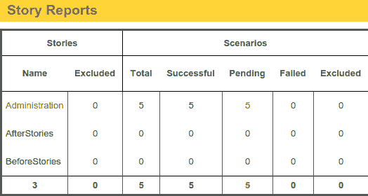
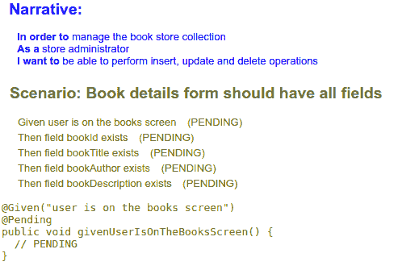
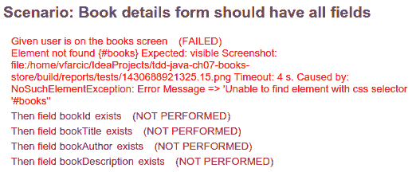
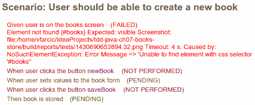
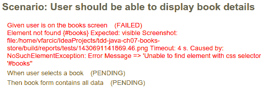
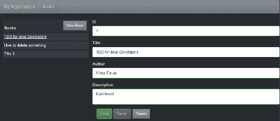

# 第八章：BDD - 与整个团队合作

“我不是一个伟大的程序员；我只是一个有着伟大习惯的好程序员。”

- 肯特·贝克

到目前为止，我们所做的一切都与只能由开发人员应用的技术有关。客户、业务代表和其他无法阅读和理解代码的人并未参与其中。

TDD 可以做得比我们到目前为止所做的更多。我们可以定义需求，与客户讨论，并就应该开发什么达成一致。我们可以使用这些需求并使它们可执行，以便驱动和验证我们的开发。我们可以使用通用语言编写验收标准。所有这些，以及更多，都是通过一种称为**行为驱动开发**（**BDD**）的 TDD 风格实现的。

我们将使用 BDD 方法开发一个书店应用程序。我们将用英语定义验收标准，分别实现每个功能，通过运行 BDD 场景确认其是否正常工作，并在必要时重构代码以达到所需的质量水平。该过程仍然遵循 TDD 的红-绿-重构，这是 TDD 的本质。主要区别在于定义级别。直到此刻，我们大多在单元级别工作，这次我们将稍微提高一点，并通过功能和集成测试应用 TDD。

我们选择的框架将是 JBehave 和 Selenide。

本章将涵盖以下主题：

+   不同类型的规范

+   行为驱动开发（BDD）

+   书店 BDD 故事

+   JBehave

# 不同的规范

我们已经提到 TDD 的一个好处是可执行的文档，它始终保持最新状态。然而，通过单元测试获得的文档通常是不够的。在这样低级别的工作中，我们可以深入了解细节；然而，很容易忽略整体情况。例如，如果您要检查我们为井字游戏创建的规范，您可能很容易忽略应用程序的要点。您会了解每个单元的功能以及它如何与其他单元互操作，但很难理解其背后的想法。准确地说，您会了解单元*X*执行*Y*并与*Z*通信；然而，功能文档和其背后的想法最多也是很难找到。

开发也是如此。在我们开始以单元测试的形式工作之前，我们需要先了解整体情况。在本书中，我们提出了用于编写规范的需求，这些规范导致了它们的实施。这些要求后来被丢弃了；它们已经不见了。我们没有把它们放入存储库，也没有用它们来验证我们工作的结果。

# 文档

在我们合作的许多组织中，文档是出于错误的原因而创建的。管理层倾向于认为文档与项目成功有某种关联——没有大量（通常是短暂的）文档，项目就会失败。因此，我们被要求花费大量时间规划、回答问题，并填写通常并非旨在帮助项目而是提供一种一切都在控制之下的错觉的问卷调查。有时候，某人的存在往往是通过文档来证明的（我的工作成果就是这份文件）。它还作为一种保证，表明一切都按计划进行（有一张 Excel 表格表明我们按计划进行）。然而，创建文档最常见的原因远非如此，而是一个简单陈述某些文档需要被创建的流程。我们可能会质疑这些文档的价值，然而，由于流程是神圣的，它们必须被制作出来。

不仅可能出于错误原因创建文档并且价值不够，而且通常情况下，它可能也会造成很大的损害。如果我们创建了文档，那么我们自然会相信它。但是，如果文档不是最新的，会发生什么？需求在变化，错误正在修复，正在开发新功能，有些功能正在被移除。如果给予足够的时间，所有传统文档都会过时。随着我们对代码进行的每一次更改，更新文档的任务是如此庞大和复杂，以至于迟早我们必须面对静态文档不反映现实的事实。如果我们对不准确的东西产生信任，我们的开发就是基于错误的假设。

唯一准确的文档是我们的代码。代码是我们开发的东西，我们部署的东西，也是唯一真实代表我们应用程序的来源。然而，代码并非每个参与项目的人都能阅读。除了程序员，我们可能还与经理、测试人员、业务人员、最终用户等一起工作。

为了寻找更好的定义什么构成更好的文档的方法，让我们进一步探讨一下潜在的文档使用者是谁。为了简单起见，我们将它们分为程序员（能够阅读和理解代码的人）和非程序员（其他人）。

# 面向程序员的文档

开发人员使用代码，既然我们已经确定代码是最准确的文档，那就没有理由不利用它。如果您想了解某个方法的作用，请查看该方法的代码。对某个类的功能有疑问？看看那个类。难以理解某段代码？我们有问题！然而，问题不是文档丢失，而是代码本身写得不好。

查看代码以理解代码通常还不够。即使您可能理解代码的功能，该代码的目的可能并不那么明显。它首先是为什么编写的呢？

这就是规格的作用。我们不仅在持续验证代码时使用它们，而且它们还充当可执行文档。它们始终保持最新，因为如果它们不是，它们的执行将失败。同时，虽然代码本身应该以易于阅读和理解的方式编写，但规格提供了一种更容易和更快速地理解我们编写某些实现代码的原因、逻辑和动机的方式。

使用代码作为文档并不排除其他类型。相反，关键不是避免使用静态文档，而是避免重复。当代码提供必要的细节时，首先使用它。在大多数情况下，这使我们得到更高级别的文档，例如概述、系统的一般目的、使用的技术、环境设置、安装、构建和打包，以及其他类型的数据，往往更像指南和快速启动信息而不是详细信息。对于这些情况，markdown 格式的简单`README`（[`whatismarkdown.com/`](http://whatismarkdown.com/)）往往是最好的。

对于所有基于代码的文档，TDD 是最好的启用程序。到目前为止，我们只与单元（方法）一起工作。我们还没有看到如何在更高层次上应用 TDD，比如，例如，功能规格。然而，在我们到达那里之前，让我们谈谈团队中的其他角色。

# 非程序员的文档

传统的测试人员倾向于形成与开发人员完全分离的团体。这种分离导致了越来越多的测试人员不熟悉代码，并假设他们的工作是质量检查。他们是流程结束时的验证者，起到了一种边境警察的作用，决定什么可以部署，什么应该退回。另一方面，越来越多的组织将测试人员作为团队的一部分，负责确保质量得到建立。后一组要求测试人员精通代码。对于他们来说，使用代码作为文档是非常自然的。然而，我们应该怎么处理第一组？对于不理解代码的测试人员，我们应该怎么办？此外，不仅（一些）测试人员属于这一组。经理、最终用户、业务代表等也包括在内。世界上充满了无法阅读和理解代码的人。

我们应该寻找一种方法来保留可执行文档提供的优势，但以一种所有人都能理解的方式编写它。此外，在 TDD 的方式下，我们应该允许每个人从一开始就参与可执行文档的创建。我们应该允许他们定义我们将用来开发应用程序的需求，并同时验证开发结果。我们需要一些能够在更高层次上定义我们将要做什么的东西，因为低级已经通过单元测试覆盖了。总之，我们需要可以作为需求的文档，可以执行的文档，可以验证我们工作的文档，并且可以被所有人编写和理解的文档。

向 BDD 问好。

# 行为驱动开发

行为驱动开发（BDD）是一种旨在在整个项目过程中保持对利益相关者价值的关注的敏捷过程；它是 TDD 的一种形式。规范是提前定义的，实施是根据这些规范进行的，并定期运行以验证结果。除了这些相似之处，还有一些区别。与 TDD 不同，BDD 鼓励我们在开始实施（编码）之前编写多个规范（称为场景）。尽管没有具体的规则，但 BDD 倾向于更高级的功能需求。虽然它也可以在单元级别上使用，但真正的好处是在采用可以被所有人编写和理解的更高级别方法时获得的。受众是另一个不同之处——BDD 试图赋予每个人（编码人员、测试人员、经理、最终用户、业务代表等）权力。

虽然基于单元级别的 TDD 可以被描述为从内到外（我们从单元开始，逐渐构建功能），但 BDD 通常被理解为从外到内（我们从功能开始，逐渐向内部单元发展）。BDD 充当了**验收标准**，作为准备就绪的指标。它告诉我们什么时候完成并准备投入生产。

我们首先定义功能（或行为），通过使用 TDD 和单元测试来处理它们，一旦完成一个完整的行为，就用 BDD 进行验证。一个 BDD 场景可能需要数小时甚至数天才能完成。在此期间，我们可以使用 TDD 和单元测试。完成后，我们运行 BDD 场景进行最终验证。TDD 是为编码人员设计的，具有非常快的周期，而 BDD 是为所有人设计的，具有更慢的周转时间。对于每个 BDD 场景，我们有许多 TDD 单元测试。

此时，您可能已经对 BDD 真正是什么感到困惑，所以让我们回顾一下。我们将从其格式的解释开始。

# 叙述

BDD 故事由一个叙述和至少一个场景组成。叙述只是提供信息，其主要目的是提供足够的信息，可以作为所有参与者之间沟通的开始（测试人员，业务代表，开发人员，分析师等）。它是一个简短而简单的功能描述，从需要它的人的角度讲述。

叙述的目标是回答三个基本问题：

1.  为了：应该构建的功能的好处或价值是什么？

1.  **作为**：谁需要所请求的功能？

1.  我想要：应该开发什么功能或目标？

一旦我们回答了这些问题，我们就可以开始定义我们认为最佳解决方案的内容。这种思考过程会产生提供更低级别细节的场景。

到目前为止，我们一直在低级别使用单元测试作为驱动力。我们从编码人员的角度规定了应该从哪里构建。我们假设高级需求早已定义，并且我们的工作是针对其中之一进行代码编写。现在，让我们退后几步，从头开始。

让我们假设，比如说，作为一个客户或业务代表。有人想到了这个好主意，我们正在与团队讨论。简而言之，我们想要建立一个在线书店。这只是一个想法，我们甚至不确定它会如何发展，所以我们想要开发一个**最小可行产品**（**MVP**）。我们想要探索的角色之一是商店管理员。这个人应该能够添加新书籍，更新或删除现有的书籍。所有这些操作都应该是可行的，因为我们希望这个人能够以高效的方式管理我们的书店收藏。我们为这个角色想出的叙述如下：

```java
In order to manage the book store collection efficiently 
As a store administrator 
I want to be able to add, update, and remove books 
```

现在我们知道了好处是什么（管理书籍），谁需要它（`管理员`），最后应该开发的功能是什么（`插入`，`更新`和`删除`操作）。请记住，这不是对应该做什么的详细描述。叙述的目的是引发一场讨论，从而产生一个或多个场景。

与 TDD 单元测试不同，叙述，实际上整个 BDD 故事，可以由任何人撰写。它们不需要编码技能，也不必涉及太多细节。根据组织的不同，所有叙述可以由同一个人（业务代表，产品所有者，客户等）撰写，或者可能是整个团队的协作努力。

现在我们对叙述有了更清晰的想法，让我们来看看场景。

# 场景

叙述作为一种沟通促进者，场景是该沟通的结果。它们应该描述角色（在*叙述*部分中指定）与系统的交互。与由开发人员为开发人员编写的代码不同，BDD 场景应该用简单的语言和最少的技术细节来定义，以便项目中的所有参与者（开发人员，测试人员，设计师，经理，客户等）都能对将添加到系统中的行为（或功能）有共同的理解。

场景充当叙述的验收标准。一旦与叙述相关的所有场景都成功运行，工作就可以被认为完成了。每个场景非常类似于一个单元测试，主要区别在于范围（一个方法对整个功能）和实现所需的时间（几秒钟或几分钟对几个小时甚至几天）。与单元测试类似，场景推动开发；它们首先被定义。

每个场景由描述和一个或多个以“给定”、“当”或“那么”开头的步骤组成。描述简短且仅供参考。它帮助我们一目了然地理解场景的功能。另一方面，步骤是场景的前提条件、事件和预期结果的序列。它们帮助我们明确定义行为，并且很容易将它们转化为自动化测试。

在本章中，我们将更多地关注 BDD 的技术方面以及它们如何融入开发者的思维方式。要了解更广泛的 BDD 使用和更深入的讨论，请参考 Gojko Adzic 的书《实例说明：成功团队如何交付正确的软件》。

“给定”步骤定义了上下文或前提条件，需要满足这些条件才能成功执行场景的其余部分。回到书籍管理的叙述，一个这样的前提条件可能是：

```java
Given user is on the books screen 
```

这是一个非常简单但非常必要的前提条件。我们的网站可能有很多页面，我们需要确保用户在执行任何操作之前处于正确的屏幕上。

“当”步骤定义了一个动作或某种事件。在我们的叙述中，我们定义了“管理员”应该能够“添加”、“更新”和“删除”书籍。让我们看看与“删除”操作相关的动作应该是什么：

```java
When user selects a book 
When user clicks the deleteBook button 
```

在这个例子中，我们使用“当”步骤定义了多个操作。首先，我们应该选择一本书，然后我们应该点击`deleteBook`按钮。在这种情况下，我们使用了一个 ID（`deleteBook`）来定义应该点击的按钮，而不是文本（删除书籍）。在大多数情况下，ID 更可取，因为它们提供了多种好处。它们是唯一的（在给定屏幕上只能存在一个 ID），它们为开发人员提供清晰的指示（创建一个带有 ID`deleteBook`的元素），并且它们不受同一屏幕上其他更改的影响。元素的文本可以很容易地改变；如果发生这种情况，使用它的所有场景也会失败。在网站的情况下，一个替代方案可能是 XPath。但是，尽量避免这种情况。它往往会因 HTML 结构的最小更改而失败。

与单元测试类似，场景应该是可靠的，并且在功能尚未开发或出现真正问题时失败。否则，当它们产生错误的负面影响时，开始忽略规范是一种自然反应。

最后，我们应该始终以某种验证结束场景。我们应该指定已执行操作的期望结果。按照相同的场景，我们的“那么”步骤可能是以下内容：

```java
Then book is removed 
```

这个结果在提供足够的数据和不涉及设计细节之间取得了平衡。例如，我们可以提到数据库，甚至更具体地说是 MongoDB。然而，在许多情况下，从行为角度来看，这些信息并不重要。我们只需确认书籍已从目录中删除，无论它存储在哪里。

现在我们熟悉了 BDD 故事格式，让我们写书店 BDD 故事。

# 书店 BDD 故事

在开始之前，请克隆位于[`bitbucket.org/vfarcic/tdd-java-ch08-books-store`](https://bitbucket.org/vfarcic/tdd-java-ch07-books-store)的可用代码。这是一个我们将在本章中使用的空项目。与以前的章节一样，它包含了每个部分的分支，以防您错过了什么。

我们将编写一个 BDD 故事，它将以纯文本格式、用简单的英语编写，没有任何代码。这样，所有利益相关者都可以参与并独立参与，而不受其编码能力的限制。稍后，我们将看到如何自动化我们正在编写的故事。

让我们首先在`stories`目录中创建一个名为`administration.story`的新文件：


我们已经有了之前写的叙述，所以我们将在此基础上进行构建：

```java
Narrative: 
In order to manage the book store collection efficiently 
As a store administrator 
I want to be able to add, update, and remove books 
```

我们将使用 JBehave 格式来编写故事。有关 JBehave 的更多详细信息即将推出。在此之前，请访问[`jbehave.org/`](http://jbehave.org/)获取更多信息。

叙述总是以`Narrative`行开始，然后是`In order to`、`As a`和`I want to`行。我们已经讨论过它们各自的含义。

现在我们知道了为什么、谁和什么的答案，是时候和团队的其他成员坐下来讨论可能的场景了。我们还没有谈论步骤（`Given`、`When`和`Then`），而只是潜在场景的概述或简短描述。列表可能如下：

```java
Scenario: Book details form should have all fields 
Scenario: User should be able to create a new book 
Scenario: User should be able to display book details 
Scenario: User should be able to update book details 
Scenario: User should be able to delete a book 
```

我们遵循 JBehave 语法，使用`Scenario`后跟一个简短的描述。在这个阶段没有必要详细讨论；这个阶段的目的是作为一个快速的头脑风暴会议。在这种情况下，我们想出了这五个场景。第一个应该定义我们将用来管理书籍的表单字段。其余的场景试图定义不同的管理任务。它们都没有什么真正创造性的。我们应该开发一个非常简单的应用的 MVP。如果证明成功，我们可以扩展并真正发挥我们的创造力。根据当前的目标，应用将是简单而直接的。

现在我们知道了我们的场景是什么，总体上，是时候适当地定义每一个了。让我们开始处理第一个：

```java
Scenario: Book details form should have all fields 

Given user is on the books screen 
Then field bookId exists 
Then field bookTitle exists 
Then field bookAuthor exists 
Then field bookDescription exists 
```

这个场景不包含任何动作；没有`When`步骤。它可以被视为一个健全性检查。它告诉开发人员书籍表单中应该有哪些字段。通过这些字段，我们可以决定使用什么数据模式。ID 足够描述性，我们知道每个字段是关于什么的（一个 ID 和三个文本字段）。请记住，这个场景（以及接下来的场景）都是纯文本，没有任何代码。主要优点是任何人都可以编写它们，我们会尽量保持这种方式。

让我们看看第二个场景应该是什么样子的：

```java
Scenario: User should be able to create a new book 

Given user is on the books screen 
When user clicks the button newBook 
When user sets values to the book form 
When user clicks the button saveBook 
Then book is stored 
```

这个场景比之前的一个好一点。有一个明确的前提条件（`user`应该在某个屏幕上）；有几个动作（点击`newBook`按钮，填写表单，点击`saveBook`按钮）；最后是结果的验证（书已存储）。

其余的场景如下（因为它们都以类似的方式工作，我们觉得没有必要单独解释每一个）：

```java
Scenario: User should be able to display book details 

Given user is on the books screen 
When user selects a book 
Then book form contains all data 

Scenario: User should be able to update book details 

Given user is on the books screen 
When user selects a book 
When user sets values to the book form 
Then book is stored 

Scenario: User should be able to delete a book 

Given user is on the books screen 
When user selects a book 
When user clicks the deleteBook button 
Then book is removed 
```

唯一值得注意的是，当合适时我们使用相同的步骤（例如，`When user selects a book`）。因为我们很快会尝试自动化所有这些场景，使用相同的步骤文本将节省我们一些时间，避免重复编写代码。在表达场景的最佳方式和自动化的便利性之间保持平衡是很重要的。我们可以修改现有场景中的一些内容，但在重构它们之前，让我们先介绍一下 JBehave。

源代码可以在`00-story`分支的`tdd-java-ch08-books-store` Git 存储库中找到，网址为[`bitbucket.org/vfarcic/tdd-java-ch08-books-store/branch/00-story`](https://bitbucket.org/vfarcic/tdd-java-ch07-books-store/branch/00-story)。

# JBehave

JBehave 运行 BDD 故事需要两个主要组件——运行器和步骤。运行器是一个类，它将解析故事，运行所有场景，并生成报告。步骤是与场景中编写的步骤匹配的代码方法。项目已经包含了所有 Gradle 依赖项，所以我们可以直接开始创建 JBehave 运行器。

# JBehave 运行器

JBehave 也不例外，每种类型的测试都需要一个运行器。在前几章中，我们使用了 JUnit 和 TestNG 运行器。虽然这两者都不需要任何特殊配置，但 JBehave 要求我们创建一个类，其中包含运行故事所需的所有配置。

以下是我们将在本章中使用的`Runner`代码：

```java
public class Runner extends JUnitStories { 

  @Override 
  public Configuration configuration() { 
    return new MostUsefulConfiguration() 
                  .useStoryReporterBuilder(getReporter()) 
                  .useStoryLoader(new LoadFromURL()); 
  } 

  @Override 
  protected List<String> storyPaths() { 
    String path = "stories/**/*.story"; 
    return new StoryFinder().findPaths(
                CodeLocations.codeLocationFromPath("").getFile(),
                Collections.singletonList(path), 
                new ArrayList<String>(),
                "file:"); 
  }

  @Override 
  public InjectableStepsFactory stepsFactory() {
    return new InstanceStepsFactory(configuration(), new Steps());
  } 

  private StoryReporterBuilder getReporter() { 
    return new StoryReporterBuilder() 
       .withPathResolver(new FilePrintStreamFactory.ResolveToSimpleName())
       .withDefaultFormats()
       .withFormats(Format.CONSOLE, Format.HTML);
  }
}
```

这是非常平淡无奇的代码，所以我们只会对一些重要的部分进行评论。重写的`storyPaths`方法将我们的故事文件位置设置为`stories/**/*.story`路径。这是标准的 Apache Ant ([`ant.apache.org/`](http://ant.apache.org/))语法，翻译成普通语言意味着`stories`目录或任何子目录（`**`）中以`.story`结尾的任何文件都将被包括在内。另一个重要的重写方法是`stepsFactory`，用于设置包含步骤定义的类（我们很快就会与它们一起工作）。在这种情况下，我们将其设置为一个名为`Steps`的单个类的实例（存储库已经包含了一个我们稍后会使用的空类）。

源代码可以在`01-runner`分支的` tdd-java-ch08-books-store` Git 存储库中找到，网址为[`bitbucket.org/vfarcic/tdd-java-ch08-books-store/branch/01-runner`](https://bitbucket.org/vfarcic/tdd-java-ch07-books-store/branch/01-runner)。

现在我们的运行器已经完成，是时候启动它并查看结果了。

# 待定步骤

我们可以使用以下 Gradle 命令运行我们的情景：

```java
$ gradle clean test
```

Gradle 只运行自上次执行以来发生变化的任务。由于我们的源代码不会总是改变（我们通常只修改文本格式的故事），因此需要在`test`之前运行`clean`任务以删除缓存。

JBehave 为我们创建了一个漂亮的报告，并将其放入`target/jbehave/view`目录。在您喜欢的浏览器中打开`reports.html`文件。

报告的初始页面显示了我们故事的列表（在我们的情况下，只有 Administration）和两个预定义的故事，称为 BeforeStories 和 AfterStories。它们的目的类似于`@BeforeClass`和`@AfterClass` JUnit 注解方法。它们在故事之前和之后运行，并且可以用于设置和拆除数据、服务器等。

这个初始报告页面显示我们有五种情景，它们都处于待定状态。这是 JBehave 告诉我们的方式，它们既不成功也不失败，而是我们使用的步骤背后缺少代码：



每行的最后一列包含一个链接，允许我们查看每个故事的详细信息：



在我们的情况下，所有的步骤都标记为待定。JBehave 甚至提出了我们需要为每个待定步骤创建的方法的建议。

总结一下，在这一点上，我们编写了一个包含五个情景的故事。这些情景中的每一个都相当于一个规范，既应该被开发，也应该用来验证开发是否正确完成。这些情景中的每一个都由几个步骤组成，定义了前提条件（`Given`）、行动（`When`）和预期结果（`Then`）。

现在是时候编写我们步骤背后的代码了。然而，在我们开始编码之前，让我们先介绍一下 Selenium 和 Selenide。

# Selenium 和 Selenide

Selenium 是一组可以用来自动化浏览器的驱动程序。我们可以使用它们来操作浏览器和页面元素，例如点击按钮或链接，填写表单字段，打开特定的 URL 等等。几乎所有浏览器都有相应的驱动程序，包括 Android、Chrome、FireFox、Internet Explorer、Safari 等等。我们最喜欢的是 PhantomJS，它是一个无界面的浏览器，比传统浏览器运行速度更快，我们经常用它来快速获取关于 Web 应用程序准备就绪的反馈。如果它按预期工作，我们可以继续在所有不同的浏览器和版本中尝试它，以确保我们的应用程序能够支持。

有关 Selenium 的更多信息可以在[`www.seleniumhq.org/`](http://www.seleniumhq.org/)找到，支持的驱动程序列表在[`www.seleniumhq.org/projects/webdriver/`](http://www.seleniumhq.org/projects/webdriver/)。

虽然 Selenium 非常适合自动化浏览器，但它也有缺点，其中之一是它在非常低的级别上操作。例如，点击按钮很容易，可以用一行代码完成：

```java
selenium.click("myLink") 
```

如果 ID 为`myLink`的元素不存在，Selenium 将抛出异常，测试将失败。虽然我们希望当预期的元素不存在时测试失败，但在许多情况下并不那么简单。例如，我们的页面可能会在异步请求服务器得到响应后才动态加载该元素。因此，我们可能不仅希望点击该元素，还希望等待直到它可用，并且只有在超时时才失败。虽然这可以用 Selenium 完成，但是这很繁琐且容易出错。此外，为什么我们要做别人已经做过的工作呢？让我们来认识一下 Selenide。

Selenide（[`selenide.org/`](http://selenide.org/)）是对 Selenium `WebDrivers`的封装，具有更简洁的 API、对 Ajax 的支持、使用 JQuery 风格的选择器等等。我们将在所有的 Web 步骤中使用 Selenide，您很快就会更加熟悉它。

现在，让我们写一些代码。

# JBehave 步骤

在开始编写步骤之前，安装 PhantomJS 浏览器。您可以在[`phantomjs.org/download.html`](http://phantomjs.org/download.html)找到有关您操作系统的说明。

安装了 PhantomJS 后，现在是时候指定一些 Gradle 依赖了：

```java
dependencies { 
    testCompile 'junit:junit:4.+' 
    testCompile 'org.jbehave:jbehave-core:3.+' 
    testCompile 'com.codeborne:selenide:2.+' 
    testCompile 'com.codeborne:phantomjsdriver:1.+' 
} 
```

您已经熟悉了 JUnit 和之前设置的 JBehave Core。两个新的添加是 Selenide 和 PhantomJS。刷新 Gradle 依赖项，以便它们包含在您的 IDEA 项目中。

现在是时候将 PhantomJS `WebDriver`添加到我们的`Steps`类中了：

```java
public class Steps { 

  private WebDriver webDriver; 

  @BeforeStory 
  public void beforeStory() { 
    if (webDriver == null) { 
      webDriver = new PhantomJSDriver(); 
      webDriverRunner.setWebDriver(webDriver); 
      webDriver.manage().window().setSize(new Dimension(1024, 768));
    }
  }
} 
```

我们使用`@BeforeStory`注解来定义我们用来进行一些基本设置的方法。如果驱动程序尚未指定，我们将设置为`PhantomJSDriver`。由于这个应用程序在较小的设备（手机、平板等）上会有不同的外观，因此我们需要清楚地指定屏幕的尺寸。在这种情况下，我们将其设置为合理的桌面/笔记本显示器分辨率 1024 x 768。

设置完成后，让我们编写我们的第一个待定步骤。我们可以简单地复制并粘贴报告中 JBehave 为我们建议的第一个方法：

```java
@Given("user is on the books screen") 
public void givenUserIsOnTheBooksScreen() { 
// PENDING 
} 
```

想象一下，我们的应用程序将有一个链接，点击它将打开书的界面。

为了做到这一点，我们需要执行两个步骤：

1.  打开网站主页。

1.  点击菜单中的书籍链接。

我们将指定这个链接的 ID 为`books`。ID 非常重要，因为它们可以让我们轻松地在页面上定位一个元素。

我们之前描述的步骤可以翻译成以下代码：

```java
private String url = "http://localhost:9001"; 

@Given("user is on the books screen") 
public void givenUserIsOnTheBooksScreen() { 
  open(url); 
  $("#books").click(); 
} 
```

我们假设我们的应用程序将在`localhost`的`9001`端口上运行。因此，我们首先打开主页的 URL，然后点击 ID 为`books`的元素。Selenide/JQuery 指定 ID 的语法是`#`。

如果我们再次运行我们的运行器，我们会看到第一步失败了，其余的仍然处于“待定”状态。现在，我们处于红色状态的红-绿-重构周期中。

让我们继续完成第一个场景中使用的其余步骤。第二个可以是以下内容：

```java
@Then("field bookId exists") 
public void thenFieldBookIdExists() { 
  $("#books").shouldBe(visible); 
} 
```

第三个步骤几乎相同，所以我们可以重构前一个方法，并将元素 ID 转换为变量：

```java
@Then("field $elementId exists") 
public void thenFieldExists(String elementId) { 
  $("#" + elementId).shouldBe(visible); 
} 
```

通过这个改变，第一个场景中的所有步骤都完成了。如果我们再次运行我们的测试，结果如下：



第一步失败了，因为我们甚至还没有开始实现我们的书店应用程序。Selenide 有一个很好的功能，每次失败时都会创建浏览器的截图。我们可以在报告中看到路径。其余的步骤处于未执行状态，因为场景的执行在失败时停止了。

接下来要做的事取决于团队的结构。如果同一个人既负责功能测试又负责实现，他可以开始实现并编写足够的代码使该场景通过。在许多其他情况下，不同的人负责功能规格和实现代码。在这种情况下，一个人可以继续为其余场景编写缺失的步骤，而另一个人可以开始实现。由于所有场景已经以文本形式编写，编码人员已经知道应该做什么，两者可以并行工作。我们将选择前一种方式，并为其余待办步骤编写代码。

让我们来看看下一个场景：



我们已经完成了上一个场景中一半的步骤，所以只剩下两个待办事项。在我们点击`newBook`按钮之后，我们应该给表单设置一些值，点击`saveBook`按钮，并验证书籍是否被正确存储。我们可以通过检查它是否出现在可用书籍列表中来完成最后一部分。

缺失的步骤可以是以下内容：

```java
@When("user sets values to the book form")
public void whenUserSetsValuesToTheBookForm() {
  $("#bookId").setValue("123");
  $("#bookTitle").setValue("BDD Assistant");
  $("#bookAuthor").setValue("Viktor Farcic");
  $("#bookDescription")
     .setValue("Open source BDD stories editor and runner");
}

@Then("book is stored")
public void thenBookIsStored() {
  $("#book123").shouldBe(present);
}
```

第二步假设每本可用的书都将以`book[ID]`的格式有一个 ID。

让我们来看看下一个场景：



就像在上一个场景中一样，还有两个待开发的步骤。我们需要有一种方法来选择一本书，并验证表单中的数据是否正确填充：

```java
@When("user selects a book") 
public void whenUserSelectsABook() { 
  $("#book1").click(); 
} 

@Then("book form contains all data") 
public void thenBookFormContainsAllData() { 
  $("#bookId").shouldHave(value("1")); 
  $("#bookTitle").shouldHave(value("TDD for Java Developers"));
  $("#bookAuthor").shouldHave(value("Viktor Farcic")); 
  $("#bookDescription").shouldHave(value("Cool book!")); 
} 
```

这两种方法很有趣，因为它们不仅指定了预期的行为（当点击特定书籍链接时，显示带有其数据的表单），还期望某些数据可用于测试。当运行此场景时，ID 为`1`的书，标题为`TDD for Java Developers`，作者为`Viktor Farcic`，描述为`Cool book!`的书应该已经存在。我们可以选择将这些数据添加到数据库中，或者使用一个将提前定义的值提供给测试的模拟服务器。无论如何选择设置测试数据的方式，我们都可以完成这个场景并进入下一个场景：


待办步骤的实现可以是以下内容：

```java
@When("user sets new values to the book form")
public void whenUserSetsNewValuesToTheBookForm() {
  $("#bookTitle").setValue("TDD for Java Developers revised");
  $("#bookAuthor").setValue("Viktor Farcic and Alex Garcia");
  $("#bookDescription").setValue("Even better book!"); 
  $("#saveBook").click(); 
} 

@Then("book is updated") 
public void thenBookIsUpdated() { 
  $("#book1").shouldHave(text("TDD for Java Developers revised"));
  $("#book1").click();
  $("#bookTitle").shouldHave(value("TDD for Java Developers revised"));
  $("#bookAuthor").shouldHave(value("Viktor Farcic and Alex Garcia")); 
  $("#bookDescription").shouldHave(value("Even better book!")); 
} 
```

最后，只剩下一个场景：


我们可以通过验证它不在可用书籍列表中来验证书籍是否已被移除：

```java
@Then("book is removed") 
public void thenBookIsRemoved() { 
  $("#book1").shouldNotBe(visible); 
} 
```

我们已经完成了步骤代码。现在，开发应用程序的人不仅有需求，还有一种验证每个行为（场景）的方法。他可以逐个场景地通过红-绿-重构周期。

源代码可以在`tdd-java-ch08-books-store` Git 存储库的`02-steps`分支中找到：[`bitbucket.org/vfarcic/tdd-java-ch08-books-store/branch/02-steps`](https://bitbucket.org/vfarcic/tdd-java-ch07-books-store/branch/02-steps)。

# 最终验证

让我们想象一个不同的人在代码上工作，应该满足我们的场景设定的要求。这个人一次选择一个场景，开发代码，运行该场景，并确认他的实现是正确的。一旦所有场景的实现都完成了，就是运行整个故事并进行最终验证的时候了。

为此，应用程序已经打包为`Docker`文件，并且我们已经为执行应用程序准备了一个带有 Vagrant 的虚拟机。

查看分支[`bitbucket.org/vfarcic/tdd-java-ch08-books-store/branch/03-validation`](https://bitbucket.org/vfarcic/tdd-java-ch07-books-store/branch/03-validation)并运行 Vagrant：

```java
$ vagrant up

```

输出应该类似于以下内容：

```java
==> default: Importing base box 'ubuntu/trusty64'...
==> default: Matching MAC address for NAT networking...
==> default: Checking if box 'ubuntu/trusty64' is up to date...
...
==> default: Running provisioner: docker...
    default: Installing Docker (latest) onto machine...
    default: Configuring Docker to autostart containers...
==> default: Starting Docker containers...
==> default: -- Container: books-fe
```

一旦 Vagrant 完成，我们可以通过在我们选择的浏览器中打开`http://localhost:9001`来查看应用程序：



现在，让我们再次运行我们的场景：

```java
$ gradle clean test
```

这一次没有失败，所有场景都成功运行了：


一旦所有场景都通过，我们就满足了验收标准，应用程序就可以交付到生产环境中。

# 总结

BDD，本质上是 TDD 的一种变体。它遵循编写测试（场景）在实现代码之前的相同基本原则。它推动开发并帮助我们更好地理解应该做什么。

一个主要的区别是生命周期持续时间。虽然 TDD 是基于单元测试的，我们从红色到绿色的转变非常快（如果不是秒数，就是分钟），BDD 通常采用更高级别的方法，可能需要几个小时甚至几天，直到我们从红色到绿色状态。另一个重要的区别是受众。虽然基于单元测试的 TDD 是开发人员为开发人员完成的，但 BDD 意图通过其无处不在的语言让每个人都参与其中。

虽然整本书都可以写关于这个主题，我们的意图是给你足够的信息，以便你可以进一步调查 BDD。

现在是时候看一看遗留代码以及如何使其更适合 TDD 了。
