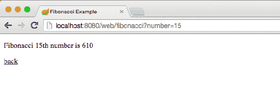

# 第十章：功能切换-部分完成功能的部署到生产环境

“不要让环境控制你。你改变你的环境。”

- 成龙

到目前为止，我们已经看到 TDD 如何使开发过程更容易，并减少了编写高质量代码所花费的时间。但还有另一个特殊的好处。随着代码被测试并且其正确性得到证明，我们可以进一步假设一旦所有测试都通过，我们的代码就已经准备好投入生产了。

有一些基于这个想法的软件生命周期方法。一些极限编程（XP）实践，如持续集成（CI）、持续交付和持续部署（CD）将被介绍。代码示例可以在[`bitbucket.org/alexgarcia/packt-tdd-java/src/`](https://bitbucket.org/alexgarcia/packt-tdd-java/src/)的`10-feature-toggles`文件夹中找到。

本章将涵盖以下主题：

+   持续集成、交付和部署

+   在生产环境中测试应用程序

+   功能切换

# 持续集成、交付和部署

TDD 与 CI、持续交付或 CD 密切相关。除了区别之外，这三种技术都有相似的目标。它们都试图促进对我们的代码的生产准备状态进行持续验证。在这方面，它们与 TDD 非常相似。它们都倡导非常短的开发周期，持续验证我们正在生产的代码，并持续保持我们的应用程序处于生产准备状态的意图。

本书的范围不允许我们详细介绍这些技术。事实上，整本书都可以写关于这个主题。我们只是简要解释一下这三者之间的区别。实践持续集成意味着我们的代码（几乎）始终与系统的其他部分集成在一起，如果出现问题，它将很快显现出来。如果发生这样的事情，首要任务是修复问题的原因，这意味着任何新的开发必须降低优先级。你可能已经注意到这个定义与 TDD 的工作方式之间的相似之处。主要区别在于，TDD 的主要重点不是与系统的其他部分集成。其他方面都是一样的。TDD 和 CI 都试图快速检测问题并将修复它们作为最高优先级，将其他一切搁置。CI 并没有整个流程自动化，需要在代码部署到生产环境之前进行额外的手动验证。

持续交付与持续集成非常相似，只是前者走得更远，整个流程都是自动化的，除了实际部署到生产环境。每次推送到仓库并通过所有验证的代码都被视为可以部署到生产环境的有效代码。然而，部署的决定是手动进行的。需要有人选择其中一个构建版本并将其推广到生产环境。选择是政治性的或功能性的。这取决于我们想要用户在什么时候接收到什么内容，尽管每个版本都已经准备好投入生产。

“持续交付是一种软件开发纪律，通过这种方式构建软件，软件可以随时发布到生产环境。”

- 马丁·福勒

最后，当关于部署什么的决定也被自动化时，CD 就完成了。在这种情况下，通过了所有验证的每次提交都会被部署到生产环境，没有例外。

为了持续将我们的代码集成或交付到生产环境，不能存在分支，或者创建分支和将其与主线集成的时间必须非常短（一天以内，最好是几个小时）。如果不是这样，我们就不能持续验证我们的代码。

与 TDD 的真正联系来自于在提交代码之前创建验证的必要性。如果这些验证没有提前创建，推送到存储库的代码就没有伴随着测试，流程就会失败。没有测试，我们对自己的工作没有信心。没有 TDD，就没有测试来伴随我们的实现代码。或者，推送提交到存储库直到创建测试，但在这种情况下，流程中就没有连续的部分。代码一直停留在某人的计算机上，直到其他人完成测试。停留在某处的代码没有持续地针对整个系统进行验证。

总之，持续集成、交付和部署依赖于测试来伴随集成代码（因此依赖于 TDD），并且不使用分支或使它们的生命周期非常短暂（很频繁地合并到主线）。问题在于一些功能无法那么快地开发。无论我们的功能有多小，在某些情况下可能需要几天来开发它们。在这段时间内，我们不能推送到存储库，因为这个流程会将它们交付到生产环境。用户不想看到部分功能。例如，交付登录流程的一部分是没有意义的。如果有人看到一个带有用户名、密码和登录按钮的登录页面，但是按钮后面的流程实际上并没有存储这些信息并提供，比如，认证 cookie，那么最好我们只会让用户感到困惑。在其他一些情况下，一个功能离开另一个功能是无法工作的。按照同样的例子，即使登录功能完全开发，没有注册就是没有意义的。一个功能离开另一个功能是无法使用的。

想象一下玩拼图。我们需要对最终图片有一个大致的想法，但我们专注于一次只处理一个拼图。我们挑选一个我们认为最容易放置的拼图，并将它与它的邻居组合在一起。只有当它们全部就位时，图片才完整，我们才完成了。

同样适用于 TDD。我们通过专注于小单元来开发我们的代码。随着我们的进展，它们开始相互配合，直到它们全部集成。当我们等待这种情况发生时，即使我们的所有测试都通过了，我们处于绿色状态，代码也还没有准备好交付给最终用户。

解决这些问题并且不妥协 TDD 和 CI/CD 的最简单方法是使用功能切换。

# 功能切换

你可能也听说过这个叫做**功能翻转**或**功能标志**。无论我们使用哪种表达方式，它们都基于一种机制，允许你打开和关闭应用程序的功能。当所有代码合并到一个分支时，你必须处理部分完成（或集成）的代码时，这是非常有用的。使用这种技术，未完成的功能可以被隐藏，以便用户无法访问它们。

由于其性质，这个功能还有其他可能的用途。例如，当特定功能出现问题时，作为断路器，提供应用程序的优雅降级，关闭次要功能以保留硬件资源用于业务核心操作等。在某些情况下，功能切换甚至可以更进一步。我们可以使用它们仅向特定用户启用功能，例如基于地理位置或他们的角色。另一个用途是我们可以仅为我们的测试人员启用新功能。这样，最终用户将继续对一些新功能的存在毫不知情，而测试人员将能够在生产服务器上验证它们。

此外，在使用功能切换时，还有一些需要记住的方面：

+   只有在完全部署并被证明有效之前才使用切换。否则，你可能最终会得到充满旧的切换的意大利面代码，其中包含不再使用的`if`/`else`语句。

+   不要花太多时间测试切换。在大多数情况下，确认某个新功能的入口点不可见就足够了。例如，这可以是指向新功能的链接。

+   不要过度使用切换。当不需要时不要使用它们。例如，您可能正在开发一个可以通过主页上的链接访问的新屏幕。如果该链接是在最后添加的，可能没有必要有一个隐藏它的切换。

有许多用于应用程序特性处理的良好框架和库。其中两个是以下：

+   **Togglz** ([`www.togglz.org/`](http://www.togglz.org/))

+   **FF4J** ([`ff4j.org/`](http://ff4j.org/))

这些库提供了一种复杂的方式来管理特性，甚至添加基于角色或规则的特性访问。在许多情况下，您可能不需要它，但这些功能使我们有可能在生产中测试新功能而不向所有用户开放。但是，实现自定义基本解决方案以进行特性切换非常简单，我们将通过一个示例来说明这一点。

# 特性切换示例

我们来看看我们的演示应用程序。这一次，我们将构建一个简单而小的**REpresentational State Transfer**（**REST**）服务，以按需计算 Fibonacci 序列的具体 N^(th)位置。我们将使用文件跟踪启用/禁用的特性。为简单起见，我们将使用 Spring Boot 作为我们的框架选择，并使用 Thymeleaf 作为模板引擎。这也包含在 Spring Boot 依赖项中。在[`projects.spring.io/spring-boot/`](http://projects.spring.io/spring-boot/)上找到有关 Spring Boot 和相关项目的更多信息。此外，您可以访问[`www.thymeleaf.org/`](http://www.thymeleaf.org/)了解有关模板引擎的更多信息。

这是`build.gradle`文件的样子：

```java
apply plugin: 'java' 
apply plugin: 'application' 

sourceCompatibility = 1.8 
version = '1.0' 
mainClassName = "com.packtpublishing.tddjava.ch09.Application" 

repositories { 
    mavenLocal() 
    mavenCentral() 
} 

dependencies { 
    compile group: 'org.springframework.boot', 
            name: 'spring-boot-starter-thymeleaf', 
            version: '1.2.4.RELEASE' 

    testCompile group: 'junit', 
    name: 'junit', 
    version: '4.12' 
} 
```

请注意，应用程序插件存在，因为我们希望使用 Gradle 命令`run`运行应用程序。这是应用程序的`main`类：

```java
@SpringBootApplication 
public class Application { 
    public static void main(String[] args) { 
        SpringApplication.run(Application.class, args); 
    } 
} 
```

我们将创建属性文件。这一次，我们将使用**YAML Ain't Markup Language**（**YAML**）格式，因为它非常全面和简洁。在`src/main/resources`文件夹中添加一个名为`application.yml`的文件，内容如下：

```java
features: 
    fibonacci: 
        restEnabled: false 
```

Spring 提供了一种自动加载这种属性文件的方法。目前只有两个限制：名称必须是`application.yml`和/或文件应包含在应用程序的类路径中。

这是我们对特性`config`文件的实现：

```java
@Configuration 
@EnableConfigurationProperties 
@ConfigurationProperties(prefix = "features.fibonacci") 
public class FibonacciFeatureConfig { 
    private boolean restEnabled; 

    public boolean isRestEnabled() { 
        return restEnabled; 
    } 

    public void setRestEnabled(boolean restEnabled) { 
        this.restEnabled = restEnabled; 
    } 
} 
```

这是`fibonacci`服务类。这一次，计算操作将始终返回`-1`，只是为了模拟一个部分完成的功能：

```java
@Service("fibonacci") 
public class FibonacciService { 

    public int getNthNumber(int n) { 
        return -1; 
    } 
} 
```

我们还需要一个包装器来保存计算出的值：

```java
public class FibonacciNumber { 
    private final int number, value; 

    public FibonacciNumber(int number, int value) { 
        this.number = number; 
        this.value = value; 
    } 

    public int getNumber() { 
        return number; 
    } 

    public int getValue() { 
        return value; 
    } 
} 
```

这是`FibonacciRESTController`类，负责处理`fibonacci`服务查询：

```java
@RestController 
public class FibonacciRestController { 
    @Autowired 
    FibonacciFeatureConfig fibonacciFeatureConfig; 

    @Autowired 
    @Qualifier("fibonacci") 
    private FibonacciService fibonacciProvider; 

    @RequestMapping(value = "/fibonacci", method = GET) 
    public FibonacciNumber fibonacci( 
            @RequestParam( 
                    value = "number", 
                    defaultValue = "0") int number) { 
        if (fibonacciFeatureConfig.isRestEnabled()) { 
            int fibonacciValue = fibonacciProvider 
                    .getNthNumber(number); 
            return new FibonacciNumber(number, fibonacciValue); 
        } else throw new UnsupportedOperationException(); 
    } 

    @ExceptionHandler(UnsupportedOperationException.class) 
    public void unsupportedException(HttpServletResponse response) 
            throws IOException { 
        response.sendError( 
                HttpStatus.SERVICE_UNAVAILABLE.value(), 
                "This feature is currently unavailable" 
        ); 
    } 

    @ExceptionHandler(Exception.class) 
    public void handleGenericException( 
            HttpServletResponse response, 
            Exception e) throws IOException { 
        String msg = "There was an error processing " + 
                "your request: " + e.getMessage(); 
        response.sendError( 
                HttpStatus.BAD_REQUEST.value(), 
                msg 
        ); 
    } 
} 
```

请注意，`fibonacci`方法正在检查`fibonacci`服务是否应启用或禁用，在最后一种情况下为方便抛出`UnsupportedOperationException`。还有两个错误处理函数；第一个用于处理`UnsupportedOperationException`，第二个用于处理通用异常。

现在所有组件都已设置好，我们需要做的就是执行 Gradle 的

`run`命令：

```java
    $> gradle run

```

该命令将启动一个进程，最终将在以下地址上设置服务器：`http://localhost:8080`。这可以在控制台输出中观察到：

```java
    ...
    2015-06-19 03:44:54.157  INFO 3886 --- [           main] o.s.w.s.handler.SimpleUrlHandlerMapping  : Mapped URL path [/webjars/**] onto handler of type [class org.springframework.web.servlet.resource.ResourceHttpRequestHandler]
    2015-06-19 03:44:54.160  INFO 3886 --- [           main] o.s.w.s.handler.SimpleUrlHandlerMapping  : Mapped URL path [/**] onto handler of type [class org.springframework.web.servlet.resource.ResourceHttpRequestHandler]
    2015-06-19 03:44:54.319  INFO 3886 --- [           main] o.s.w.s.handler.SimpleUrlHandlerMapping  : Mapped URL path [/**/favicon.ico] onto handler of type [class org.springframework.web.servlet.resource.ResourceHttpRequestHandler]
    2015-06-19 03:44:54.495  INFO 3886 --- [           main] o.s.j.e.a.AnnotationMBeanExporter        : Registering beans for JMX exposure on startup
    2015-06-19 03:44:54.649  INFO 3886 --- [           main] s.b.c.e.t.TomcatEmbeddedServletContainer : Tomcat started on port(s): 8080 (http)
    2015-06-19 03:44:54.654  INFO 3886 --- [           main] c.p.tddjava.ch09.Application             : Started Application in 6.916 seconds (JVM running for 8.558)
    > Building 75% > :run

```

应用程序启动后，我们可以使用常规浏览器执行查询。查询的 URL 是`http://localhost:8080/fibonacci?number=7`。

这给我们以下输出：


正如您所看到的，收到的错误对应于 REST API 在禁用特性时发送的错误。否则，返回值应为`-1`。

# 实现 Fibonacci 服务

你们大多数人可能都熟悉斐波那契数。无论如何，这里还是一个简要的解释，供那些不知道它们是什么的人参考。

斐波那契数列是一个整数序列，由递推*f(n) = f(n-1) - f(n - 2)*得出。该序列以*f(0) = 0*和*f(1) = 1*开始。所有其他数字都是通过多次应用递推生成的，直到可以使用 0 或 1 个已知值进行值替换为止。

即：0, 1, 1, 2, 3, 5, 8, 13, 21, 34, 55, 89, 144,...有关斐波那契数列的更多信息可以在这里找到：[`www.wolframalpha.com/input/?i=fibonacci+sequence`](http://www.wolframalpha.com/input/?i=fibonacci+sequence)

作为额外功能，我们希望限制值计算所需的时间，因此我们对输入施加约束；我们的服务只会计算从`0`到`30`的斐波那契数（包括这两个数字）。

这是一个计算斐波那契数的可能实现类：

```java
@Service("fibonacci") 
public class FibonacciService { 
    public static final int LIMIT = 30; 

    public int getNthNumber(int n) { 
        if (isOutOfLimits(n) { 
        throw new IllegalArgumentException( 
        "Requested number must be a positive " + 
           number no bigger than " + LIMIT); 
        if (n == 0) return 0; 
        if (n == 1 || n == 2) return 1; 
        int first, second = 1, result = 1; 
        do { 
            first = second; 
            second = result; 
            result = first + second; 
            --n; 
        } while (n > 2); 
        return result; 
    } 

    private boolean isOutOfLimits(int number) { 
        return number > LIMIT || number < 0; 
    } 
} 
```

为了简洁起见，TDD 红-绿-重构过程没有在演示中明确解释，但在开发过程中一直存在。只呈现了最终实现和最终测试：

```java
public class FibonacciServiceTest { 
    private FibonacciService tested; 
    private final String expectedExceptionMessage = 
         "Requested number " + 
            "must be a positive number no bigger than " +  
            FibonacciService.LIMIT; 

    @Rule 
    public ExpectedException exception = ExpectedException.none(); 

    @Before 
    public void beforeTest() { 
        tested = new FibonacciService(); 
    } 

    @Test 
    public void test0() { 
        int actual = tested.getNthNumber(0); 
        assertEquals(0, actual); 
    } 

    @Test 
    public void test1() { 
        int actual = tested.getNthNumber(1); 
        assertEquals(1, actual); 
    } 

    @Test 
    public void test7() { 
        int actual = tested.getNthNumber(7); 
        assertEquals(13, actual); 
    } 

    @Test 
    public void testNegative() { 
        exception.expect(IllegalArgumentException.class); 
        exception.expectMessage(is(expectedExceptionMessage)); 
        tested.getNthNumber(-1); 
    } 

    @Test 
    public void testOutOfBounce() { 
        exception.expect(IllegalArgumentException.class); 
        exception.expectMessage(is(expectedExceptionMessage)); 
        tested.getNthNumber(31); 
    } 
} 
```

现在，我们可以在`application.yml`文件中打开`fibonacci`功能，用浏览器执行一些查询，并检查它的运行情况：

```java
features: 
    fibonacci: 
        restEnabled: true 
```

执行 Gradle 的`run`命令：

```java
    $>gradle run
```

现在我们可以使用浏览器完全测试我们的 REST API，使用一个介于`0`和`30`之间的数字：


然后，我们用一个大于`30`的数字进行测试，最后用字符代替数字进行测试：


# 使用模板引擎

我们正在启用和禁用`fibonacci`功能，但还有许多其他情况下，功能切换可以非常有用。其中之一是隐藏链接到未完成功能的网页链接。这是一个有趣的用法，因为我们可以使用其 URL 测试我们发布到生产环境的内容，但对于其他用户来说，它将被隐藏，只要我们想要。

为了说明这种行为，我们将使用已经提到的 Thymeleaf 框架创建一个简单的网页。

首先，我们添加一个新的`control`标志：

```java
features: 
    fibonacci: 
        restEnabled: true 
        webEnabled: true 
```

接下来，在配置类中映射这个新的标志：

```java
    private boolean webEnabled; 
    public boolean isWebEnabled() { 
        return webEnabled; 
    } 

    public void setWebEnabled(boolean webEnabled) { 
        this.webEnabled = webEnabled; 
    } 
```

我们将创建两个模板。第一个是主页。它包含一些链接到不同的斐波那契数计算。这些链接只有在启用功能时才可见，因此有一个可选的块来模拟这种行为：

```java
<!DOCTYPE html> 
<html > 
<head lang="en"> 
    <meta http-equiv="Content-Type" 
          content="text/html; charset=UTF-8" /> 
    <title>HOME - Fibonacci</title> 
</head> 
<body> 
<div th:if="${isWebEnabled}"> 
    <p>List of links:</p> 
    <ul th:each="number : ${arrayOfInts}"> 
        <li><a 
            th:href="@{/web/fibonacci(number=${number})}" 
            th:text="'Compute ' + ${number} + 'th fibonacci'"> 
        </a></li> 
    </ul> 
</div> 
</body> 
</html> 
```

第二个模板只显示计算出的斐波那契数的值，还有一个链接返回主页：

```java
<!DOCTYPE html> 
<html > 
<head lang="en"> 
    <meta http-equiv="Content-Type" 
          content="text/html; charset=UTF-8" /> 
    <title>Fibonacci Example</title> 
</head> 
<body> 
<p th:text="${number} + 'th number: ' + ${value}"></p> 
<a th:href="@{/}">back</a> 
</body> 
</html> 
```

为了使这两个模板都能正常工作，它们应该放在特定的位置。它们分别是`src/main/resources/templates/home.html`和`src/main/resources/templates/fibonacci.html`。

最后，这是连接所有内容并使其工作的控制器的杰作：

```java
@Controller 
public class FibonacciWebController { 
    @Autowired 
    FibonacciFeatureConfig fibonacciFeatureConfig; 

    @Autowired 
    @Qualifier("fibonacci") 
    private FibonacciService fibonacciProvider; 

    @RequestMapping(value = "/", method = GET) 
    public String home(Model model) { 
        model.addAttribute( 
            "isWebEnabled", 
            fibonacciFeatureConfig.isWebEnabled() 
        ); 
        if (fibonacciFeatureConfig.isWebEnabled()) { 
            model.addAttribute( 
                "arrayOfInts", 
                Arrays.asList(5, 7, 8, 16) 
            ); 
        } 
        return "home"; 
    } 

    @RequestMapping(value ="/web/fibonacci", method = GET) 
    public String fibonacci( 
            @RequestParam(value = "number") Integer number, 
            Model model) { 
        if (number != null) { 
            model.addAttribute("number", number); 
            model.addAttribute( 
                "value", 
                fibonacciProvider.getNthNumber(number)); 
        } 
        return "fibonacci"; 
    } 
} 
```

请注意，这个控制器和之前在 REST API 示例中看到的控制器有一些相似之处。这是因为两者都是用相同的框架构建的，并且使用相同的资源。但是，它们之间有一些细微的差异；一个被注释为`@Controller`，而不是两者都是`@RestController`。这是因为 Web 控制器提供带有自定义信息的模板页面，而 REST API 生成 JSON 对象响应。

让我们看看这个工作，再次使用这个 Gradle 命令：

```java
    $> gradle clean run

```

这是生成的主页：


当访问斐波那契数链接时，会显示这个：


但我们使用以下代码关闭该功能：

```java
features: 
    fibonacci: 
        restEnabled: true 
        webEnabled: false 
```

重新启动应用程序，我们浏览到主页，看到那些链接不再显示，但如果我们已经知道 URL，我们仍然可以访问页面。如果我们手动输入`http://localhost:8080/web/fibonacci?number=15`，我们仍然可以访问页面：



这种实践非常有用，但通常会给您的代码增加不必要的复杂性。不要忘记重构代码，删除您不再使用的旧切换。这将使您的代码保持清晰和可读。另外，一个很好的点是在不重新启动应用程序的情况下使其工作。有许多存储选项不需要重新启动，数据库是最受欢迎的。

# 总结

功能切换是在生产环境中隐藏和/或处理部分完成的功能的一种不错的方式。对于那些按需部署代码到生产环境的人来说，这可能听起来很奇怪，但在实践持续集成、交付或部署时，发现这种情况是相当常见的。

我们已经介绍了这项技术并讨论了其利弊。我们还列举了一些典型情况，说明切换功能可以帮助解决问题。最后，我们实现了两种不同的用例：一个具有非常简单的 REST API 的功能切换，以及一个 Web 应用中的功能切换。

尽管本章中介绍的代码是完全功能的，但通常不常使用基于文件的属性系统来处理此事。有许多更适合生产环境的库可以帮助我们实现这种技术，提供许多功能，例如使用 Web 界面处理功能、将偏好存储在数据库中或允许访问具体用户配置文件。

在下一章中，我们将把书中描述的 TDD 概念整合在一起。我们将提出一些编程 TDD 方式时非常有用的良好实践和建议。
