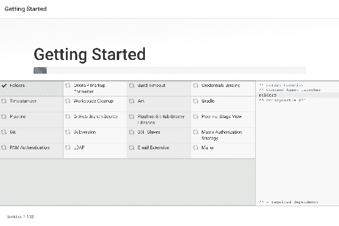
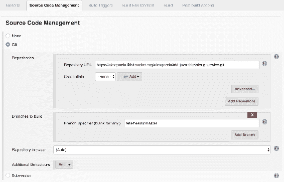
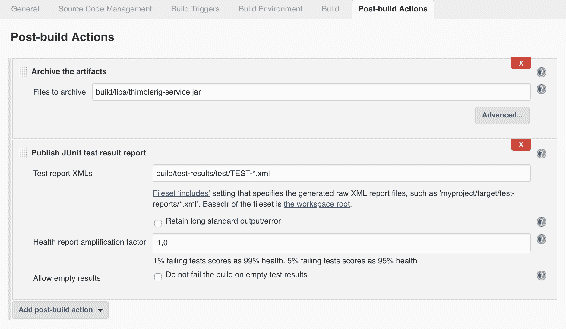
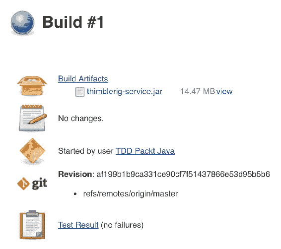

# 第十二章：通过实施持续交付来利用 TDD

“没有什么比结果更有说服力。如果你想建立与人们联系的可信度，那么在传达信息之前先交付结果。走出去做你建议别人做的事情。从经验中交流。”

- 约翰·C·麦克斯韦

在整本书中，概念和良好的实践已经通过孤立的例子进行了介绍。本章的目标是将这些概念中的一些付诸实践，通过将它们应用于更现实的场景。

为了实现这一目标，我们引入了一个名为“牛逼赌博公司”的虚构公司。这家公司在软件开发生命周期中遇到了一些问题，这些问题可以通过应用我们在本书中学到的一些方法来轻松解决。免责声明，与真实公司的任何相似之处纯属巧合。此外，为了简洁起见，代码库并不是很庞大，一些问题已经夸大，以更好地代表需要解决的问题。

涉及的主题不一定按顺序包括：

+   持续集成

+   持续交付

+   测试驱动开发的好处

+   识别快速成功

# 案例研究-牛逼赌博公司

你是爱丽丝，一名软件开发人员，刚刚加入了“牛逼赌博公司”的软件开发团队。你的队友们正在尽可能短的时间内让你跟上进度。这是你的第一天，你的队友约翰被指定为你的导师，在公司的最初几个小时里将指导你。

在愉快的一杯咖啡之后，他迅速将你的谈话话题转向了组成你日常工作的所有任务和程序。你的团队正在开发和维护一个非常简单的`thimblerig-service`。一听到“thimblerig”这个词，你羞愧地承认这是你第一次听到这个词。约翰笑着说，两年前加入公司时他也不知道这个词。

Thimblerig 游戏，也被称为“三个壳和一个豌豆”，是一种古老的赌博游戏。规则非常简单，有三个壳，豌豆被其中一个盖住。这三个壳以非常高的速度洗牌，完成后，玩家必须猜出哪个壳藏着豌豆。

解释完毕后，他友好地提议帮助你从存储库下载代码项目，并简要向你解释了整体概念。

一旦他解释完毕，他要求你自己阅读代码。他还告诉你，如果你有任何问题或疑虑，他就是你要去找的人。你对他的时间表示感谢，开始浏览项目。

# 探索代码库

当你开始浏览项目时，你意识到这个应用并不是很复杂。事实上，项目包含大约十几个 Java 类，当你开始打开并查看文件时，你会注意到没有一个文件超过一百行。这很不错，代码库很小，所以你将能够在很短的时间内开发新功能。

鉴于这是一个 Gradle 项目，你迅速打开`build.gradle`文件，以了解项目中使用的框架和库：

```java
apply plugin: 'java'
apply plugin: 'org.springframework.boot'

sourceCompatibility = 1.8
targetCompatibility = 1.8

bootRepackage.executable = true

repositories {
  mavenLocal()
  mavenCentral()
}

dependencies {
  compile 'org.springframework.boot:spring-boot-starter-actuator'
  compile 'org.springframework.boot:spring-boot-starter-web'

  testCompile 'junit:junit:4.12'
  testCompile 'org.hamcrest:hamcrest-all:1.3'
  testCompile 'org.mockito:mockito-core:1.10.19'
}
```

Gradle 构建字段看起来不错。你要工作的项目是基于 Spring 的 Web 服务。它使用`spring-boot-starter-web`，所以很可能你可以在本地轻松运行它。此外，还有一些测试依赖项，这意味着测试文件夹中应该也有一些测试。

几分钟后，你已经在脑海中有了应用的地图。有一个名为`ThimblerigService`的类，它处理游戏的逻辑。它依赖于`RandomNumberGenerator`，并且只有一个公共方法，即`placeBet`。方法和类都有一个可理解的名称，所以很容易弄清楚它们的作用：

```java
@Service
public class ThimblerigService {
  private RandomNumberGenerator randomNumberGenerator;

  @Autowired
  ThimblerigService(RandomNumberGenerator randomNumberGenerator) {
    this.randomNumberGenerator = randomNumberGenerator;
  }

  public BetResult placeBet(int position, BigDecimal betAmount) {
    ...
  }
}
```

除了那个类，只有一个控制器类实现了一个 API：它是`ThimblerigAPI`。它只公开了一个方法，即`placeBet`。其他公司服务调用该`POST`方法以在该服务中玩一场游戏。该服务解决赌注并在响应中包括诸如是否赢得奖品、金额等详细信息：

```java
@RestController
@RequestMapping("/v1/thimblerig")
public class ThimblerigAPI {
  private ThimblerigService thimblerigService;

  @Autowired
  public ThimblerigAPI(ThimblerigService thimblerigService) {
    this.thimblerigService = thimblerigService;
  }

  @ResponseBody
  @PostMapping(value = "/placeBet",
      consumes = MediaType.APPLICATION_JSON_VALUE)
  public BetReport placeBet(@RequestBody NewBet bet) {
    BetResult betResult =
        thimblerigService.placeBet(bet.getPick(), bet.getAmount());
    return new BetReport(betResult);
  }
}
```

这是一个相当简单的设置，一切都很清晰，所以你决定继续并开始查看测试。

当你打开`test`文件夹并开始寻找测试时，当你发现只有一个测试类`ThimblerigServiceTest`时，你感到非常惊讶。一个好的测试胜过一百个坏的，但你仍然认为这个应用程序的单元测试做得很差：

```java
public class ThimblerigServiceTest {
  @Test
  public void placingBetDoesNotAcceptPositionsLessThanOne() {
    ...
  }

  @Test
  public void placingBetDoesNotAcceptPositionsGreaterThan3() {
    ...
  }

  @Test
  public void placingBetOnlyAcceptsAmountsGreaterThanZero() {
    ...
  }

  @Test
  public void onFailedBetThePrizeIsZero() {
    ...
  }

  @Test
  public void whenThePositionIsGuessedCorrectlyThePrizeIsDoubleTheBet() {
    ...
  }
}
```

打开类并检查其中包含的所有测试后，你的印象略微好转。这些测试完全覆盖了核心服务，并且它们似乎是有意义且详尽的。但尽管如此，你还是忍不住转过头去问约翰为什么只有一个测试。他告诉你，他们没有太多时间来创建测试，因为他们很匆忙，所以只有关键部分有测试。一个代码片段是否关键是非常主观的，但你理解这种情况；事实上，你也曾多次处于这种情况。

仅仅一秒后，在你还来不及回到自己的任务之前，约翰又在他的回答中加入了另一个有趣的观点：**质量保证**（**QA**）部门。该部门的目标是在发布候选版本到达生产环境之前对其进行测试。他们的任务是查找可能影响应用程序的错误和缺陷并报告它们。在某些情况下，如果发现的任何错误非常关键，发布将被停止，永远不会部署到生产环境。这个流程通常需要三到五天的时间。你认为在某些情况下这可能是一个瓶颈，所以你要求他进一步详细说明发布流程。

# 发布流程

只要项目是一个简单的**表现状态转移**（**REST**）服务，发布的创建就一点也不复杂。根据当前的流程，开发人员编译代码并将构件发送给负责所有部署的团队。该团队与客户和质量保证部门协调测试和部署到生产环境。

你决定问约翰是否满意这个流程。甚至在得到答案之前，你就知道约翰对此一点也不满意。你可以从他的脸上看出，他正在努力掩饰自己的感受。约翰咽下自己的情绪，开始描述团队的当前情况。

事实证明，开发团队并非一切都是愉快和甜蜜的。所有开发人员在开始编码时都会从代码库的主分支创建自己的分支。这并不是坏事，但有时会出现一些分支在很多周后才合并回主分支。问题在于自那时以来主分支发生了很大变化，代码库分叉很多，这意味着合并非常困难、令人不愉快且容易出错。

除了偶尔出现的合并问题，有时会发生某个开发人员错误地编译了他的本地分支，并将其部署到生产环境，导致一段时间内的混乱、破坏和不确定性。

此外，客户对于实现新功能所需的时间并不满意。他们不时地抱怨，说每一个微小的变化至少需要一周的时间才能应用。

你对这种情况如何发生在一个非常微小的 REST 服务上感到困惑，但约翰当然是在指公司中的其他更大的项目。你知道通过实施持续集成（CI）和持续交付，这种问题可以得到解决或至少得到缓解。事实上，尽可能自动化流程可以让你摆脱那些琐碎的问题，从而专注于其他问题。

经过这样的思考，你现在知道你需要更多关于部署程序的信息，你也知道约翰愿意给你详细信息。

# 部署到生产环境

在讨论发布流程后，约翰开始向你解释服务是如何部署到生产环境的。这是非常手动的工作：IT 部门的基础设施团队的一名成员将构件复制到服务器并执行一些命令来使其运行。

约翰还借此机会补充了一些他们过去遭受的错误故事，比如有一次，基础设施操作员错误地重新部署了旧版本，而不是部署最新版本。一堆旧的错误重新出现并一直停留在生产环境中，直到有人发现发生了什么。

在听这些故事的同时，你不禁开始思考你从以往项目和公司中学到的东西。你知道将代码部署到生产环境可能是一个非常简单直接的任务，一个永无止境的噩梦，或者介于两者之间。这取决于许多因素，有时我们无法改变它。在某些情况下，将应用程序部署到生产环境需要得到有权决定何时以及部署什么的人的承认。在其他情况下，严格的规定将本应简单的程序变成了一个冗长而啰嗦的任务。

此外，自动化部署是减少人为干预可能带来的风险的一种方式。创建可重复的流程可以像编写脚本并安排其执行一样简单。众所周知，任何单个脚本都无法完全取代人类，但毋庸置疑，目标并不是用脚本取代人类。这样做的主要目的是提供一个可以自主执行的工具，人类可以监督它，只有在必要时才进行手动干预。因此，实施持续交付非常合适。

在约翰简短但激烈的介绍之后，你觉得自己已经准备好开始工作了。你脑海中有许多可能的改进，你肯定渴望实施它们。

# 增加测试覆盖率

在衡量代码质量的指标中，有一个特别难以理解的指标，那就是测试覆盖率。测试覆盖率是一个危险的指标，因为非常高的覆盖率并不意味着代码经过了充分的测试。正如其名称所示，它只是考虑了一段代码是否被触发并因此被测试执行。因此，测试的目标基本上是良好的测试和良好的覆盖率的结合。总之，重要的是测试的质量，代码覆盖率是次要的。

然而，有些情况下代码覆盖率确实是一个很好的指标。这些情况是当测试覆盖率非常低时。在这些情况下，这个数字意味着代码库的很大一部分没有被测试，因此测试并没有确保我们没有引入错误。

此外，创建良好的自动化测试可以减少 QA 团队在执行回归测试上所花费的时间。这很可能会减少他们反复测试相同代码的时间，从而提高团队的交付速度。

# 结论

尽管为了教学目的而夸大了这家公司的情况，但仍然有一些公司在努力解决这些问题。事实上，爱丽丝知道令人敬畏的赌博公司的软件开发人员的工作方式并不理想。有许多技术，其中一些在本书中有所涵盖，可以帮助公司停止专注于无意识的错误，并开始专注于其他可以为最终产品增加更多价值的事情。

在接下来的部分中，我们将通过提出一种可能的解决方案来解决爱丽丝故事中描述的一些问题。这不是唯一的解决方案；实际上，所提出的解决方案包括一些工具，每个工具都有许多选项。此外，每家公司都有自己的文化和限制，因此提出的解决方案可能并不完全适用。

# 可能的改进

在本节和接下来的子节中，我们将解决爱丽丝故事中描述的一些问题。由于我们从示例中继承的代码已经实施，因此我们无法在这里应用 TDD。相反，我们将奠定基础并为将来的开发做好准备，在那里应用 TDD 将非常有用。

尽管总是有许多可以改进的地方，但正在解决的痛点是代码合并问题、大量手动测试、手动发布以及开发更改或新功能所花费的时间。

对于前两个问题，我们将增加应用程序的测试覆盖率并实施 CI。将配置 Jenkins 服务器来解决第三个问题，即手动发布。最后，通过实施其余的解决方案来缓解长时间的**上市时间**（**TTM**）。

# 实施持续集成

在大型公司中，有多个团队并行工作，很常见出现大量集成冲突。当代码库在大规模开发时，这种情况更频繁发生。

为了缓解这一问题，强烈建议使用 CI。主要思想是开发分支不应该与主分支相差太大。一种方法是将更改或新功能分成非常小的块，这样它们可以很快完成并合并回来。另一种方法是定期合并；当功能难以分解成小功能时，这更合适。

面对不可分割的功能，如架构更改，功能切换非常有帮助。使用功能切换，未完成的功能可以合并，并且在打开标志之前将无法访问。

# 走向持续交付

故事中开发人员面临的问题之一是手动创建发布。有许多工具可以帮助自动化这些任务，例如 Jenkins、Travis 或 Bamboo，仅举几例。作为提出的解决方案的一部分，我们将配置一个 Jenkins 实例，以自动运行所有这些任务。在每次执行 Jenkins 作业时，将创建`thimblerig-service`的新版本。

此外，由于我们已经转移到 CI，主分支的状态应始终准备好投入生产。而且，如果一些未完成的功能已经合并，由于功能切换，它们将被隐藏。

在这一点上，为了解决发布的问题，我们可以实施持续交付或**持续部署**（**CD**），但为了简单起见，我们将实施持续交付。让我们开始吧。

# Jenkins 安装

Jenkins 是一个非常强大且易于学习的工具。在这一部分，我们将准备环境，其中包括运行 Jenkins Docker 镜像的虚拟机。这个设置是为了演示目的；对于真实场景，最好安装在具有更多资源的专用服务器上，或者从 CloudBees 等公司获得服务。在这种情况下，所有配置都位于`Vagrantfile`中：

```java
Vagrant.configure("2") do |config|

  config.vm.box = "ubuntu/trusty64"
  config.vm.box_check_update = false

  config.vm.network "forwarded_port", guest: 8080, host: 9090

  config.vm.provider "virtualbox" do |vb|
    vb.gui = false
    vb.memory = 2048
  end

  config.vm.provision "docker" do |d|
    d.run "jenkins/jenkins",
      args: "-p 8080:8080 -p 50000:50000 -v jenkins_home:/var/jenkins_home"
  end
end
```

因此，要使其运行起来，我们只需要执行以下命令：

```java
$> vagrant up
```

如果在重新启动或其他原因后，Jenkins 显示为离线或无法访问它，尝试使用 provision 标志运行相同的命令：

**`$> vagrant up --provision`**

完成后，我们可以在我们喜欢的浏览器中打开`http://localhost:9090`来继续设置：


由于我们没有在服务器上安装它，而是在 Docker 镜像中运行它，这个密码有点难以获取。可能最简单的方法是访问 Docker 机器并从文件中获取密码，可以这样做：

```java
$> vagrant ssh
$> docker exec jenkins-jenkins cat /var/jenkins_home/secrets/initialAdminPassword
```

复制密码，粘贴到密码字段中，然后我们进入下一步，配置插件。现在，我们只安装推荐的插件。其他插件可以稍后在管理面板中安装：



然后，当设置完成安装插件后，会显示另一个屏幕。这是配置的最后一步，创建一个管理员用户。建议创建一个密码容易记住的用户：


这一步可以跳过，但是管理员密码将保持与初始密码相同，这样很难记住。现在我们已经准备好使用我们全新的 Jenkins 安装了。

# 自动化构建

一旦我们启动并运行了 Jenkins，就是开始使用它的时候了。我们将在 Jenkins 上创建一个任务，下载`thimblerig-service`主分支，执行测试，构建它，并存档生成的构件。

让我们从创建一个自由风格项目开始：


我们必须告诉 Jenkins 存储库的位置。在这个例子中，我们不需要认证，但在实际情况下，我们很可能需要认证：



`thimblerig-service`项目是一个 Gradle 项目。我们将使用 Jenkins Gradle 插件来编译、测试和构建我们的服务：


最后，我们必须指定测试报告和构建的构件位置：



我们完成了。与我们在本地环境中通常做的事情并没有太大的不同。它从主分支下载代码，并使用 Gradle 构建服务，就像 John 在故事中所说的那样。

# 首次执行

在 Jenkins 中创建了我们的项目，现在是测试的时候了。我们从未配置过触发执行，所以 Jenkins 并没有监视存储库中的更改。在这个例子中，手动启动构建已经足够了，但在实际情况下，我们希望它在主分支中的每次更改时自动触发：



构建已经成功完成；我们可以在摘要中看到测试已经执行，但没有一个失败。我们准备下载这个构件并尝试在本地执行它：

```java
$> chmod u+x thimblerig-service.jar
$> ./thimblerig-service.jar 
```

在某个时候，日志将显示类似`Tomcat started on port(s): 8080 (http)`的消息。这意味着我们的服务已经准备就绪，我们可以开始使用它。为了确保，我们可以随时通过运行来检查服务的健康状况：

```java
$> curl http://localhost:8080/health
{"status":"UP"}
```

这就结束了持续交付的示例。虽然这个示例是完全可用的，但 Jenkins 并不是存储服务版本的最佳位置。对于实际应用场景，有更强大的替代方案，比如 Artifactory，或者简单地将服务 Docker 化并推送新版本到私有 Docker 注册表。

# 接下来是什么？

这里的例子纯粹是学术性的，解决方案的部分有点巧妙。在一个真实的公司中，Jenkins 将安装在专用服务器上，并且将有更多的任务来构建和发布。为了协调所有这些，需要对生成的构件进行适当的管理。正如前面提到的，一些公司采用的解决方案是像 Artifactory 或 Docker Registry 的私有实例来存储服务的 Docker 镜像。无论选择哪种存储方式，程序都将保持不变——编译，测试，构建，存档。这只是一个配置问题。

为了简洁起见，一些需要新代码的部分已被省略，留给读者作为练习完成。以下是一些继续的想法：

+   为 REST 控制器创建一些测试。

+   随机数生成器存在问题——根本不是随机的。分叉`thimblerig-service`项目，创建一个测试来重现问题，修复它，并通过最近创建的 Jenkins 构建项目发布服务的新版本。

+   使用 Docker。

所有代码片段和其他所需的项目文件都可以在以下存储库中在线找到：[`bitbucket.org/alexgarcia/tdd-java-thimblerig-service`](https://bitbucket.org/alexgarcia/tdd-java-thimblerig-service)

# 这只是个开始

也许你期望在读完本书时，你会对测试驱动开发（TDD）了如指掌。如果是这样，我们很抱歉要让你失望。要掌握任何技艺都需要大量的时间和实践，TDD 也不例外。继续将你所学应用到项目中。与同事分享知识。最重要的是，练习，练习，再练习。就像空手道一样，只有通过持续的练习和重复，才能完全掌握 TDD。我们已经使用它很长时间了，但我们仍然经常面临新的挑战，并学到改进我们技艺的新方法。

# 这并不一定是结束

写这本书是一个充满许多冒险的漫长旅程。我们希望你喜欢阅读它，就像我们喜欢写它一样。

我们在博客[`technologyconversations.com`](http://technologyconversations.com)上分享了我们在各种主题上的经验。

# 总结

在 Alice 的虚构故事中，介绍了一些当今公司面临的常见问题。其中之一是缺乏时间。在这种特殊情况下，以及在大多数情况下，人们缺乏时间是因为他们被困在不增加价值的重复任务中，因此会产生这种不断的感觉，即不可能实现更雄心勃勃的目标。开发人员在被问及为什么不练习 TDD 时，最主要的借口之一是没有时间写测试。

本章介绍了一个可能的解决方案，即使用 Jenkins。配置了一个带有 Jenkins 实例的虚拟机，以自动化一些重复的任务，这些任务正在耗费团队的时间。

一旦问题得到解决，TDD 就会变得非常方便。以 TDD 方式开发的每个新功能都将被测试覆盖，然后对该功能的未来更改将针对测试套件运行，如果其中一个测试未满足，则会失败。
